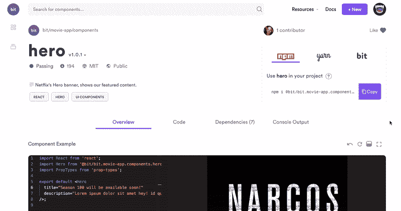

# 带位的专用 NPM 注册表

> 原文：<https://medium.com/hackernoon/private-npm-registry-simplified-with-bit-cc80408f1809>

## 如何用 Bit 和 NPM 快速建立私有 Node.js 包库，共享你的组件？


建立一个 [Node.js](https://hackernoon.com/tagged/nodejs) 包注册表通常是扩展代码共享和让您的团队生活更轻松的第一步。

共享更多的模块意味着复制更少的代码。它还有助于构建更加模块化和可维护的软件。然而，建立和维护一个私有的 [NPM](https://hackernoon.com/tagged/npm) 注册中心的开销是巨大的。

使用 Bit，您可以消除私有注册中心的大部分开销，同时减少打包和发布过程的开销。

在这个简短的教程中，我将向您展示如何使用 Bit 建立一个私有 Node.js 注册中心，并在几分钟内分三步发布几十个组件和模块。

1.  **30 秒建立 Node.js 包注册表**
2.  **发布模块/组件**
3.  **使用 NPM/纱线客户端安装软件包**

让我们开始吧。

*   也可以看看这个短视频教程。

# 1.为组件设置 Node.js 包注册表

让我们为您的团队设置一个私有的包注册表。

我们将使用 [Bit 的 web 平台](https://bitsrc.io)来托管我们共享的模块和本地 NPM/Yarn 客户端来安装它们。

首先，建立一个注册处。

**答**。前往 [**bit.dev**](https://bit.dev) 点击**上的开始。**


**b** 。[报名](https://bit.dev/signup)。它是免费的。

**c** 。创建收藏:


要设置私人收藏，只需选择“私人”。就是这样！

现在，您在 Bit 的 web 平台中有了一个集合，它也作为一个包注册中心。让我们看看如何将包发布到这个注册表。

[](https://blog.bitsrc.io/introducing-bits-npm-package-registry-f4892de57b0c) [## 介绍 Bit 的 NPM 包注册中心

### 与 Bit 共享的公共和私有组件和模块现在可以立即与 NPM 和…

blog.bitsrc.io](https://blog.bitsrc.io/introducing-bits-npm-package-registry-f4892de57b0c) 

# 2.发布组件或模块

现在让我们将模块和组件发布到我们新创建的注册中心。因为我们在 Bit 的平台上建立了注册中心，所以我们也可以在这个工作流程中利用 Bit 来节省宝贵的时间和精力。

[](https://github.com/teambit/bit) [## 团队位/位

### 与您的团队轻松共享项目间的代码。-团队位/位

github.com](https://github.com/teambit/bit) 

[https://docs.bit.dev/](https://docs.bit.dev/)

首先，安装 Bit。然后，转到您想要发布的包所在的项目。请注意，由于我们使用的是 Bit，您可以[直接从任何现有项目](https://blog.bitsrc.io/monorepo-architecture-simplified-with-bit-and-npm-b1354be62870)发布包，而无需重构。

```
#1 Install Bit
npm install bit-bin -g#2 Create a local workspace for your project
$ cd project-directory
$ bit init
```

让我们使用 Bit 从现有的项目中分离出组件和模块，并将它们发布为包，而不是创建一个新的存储库，配置包等等。

让我们使用`bit add` [命令](https://docs.bitsrc.io/docs/isolating-and-tracking-components.html)指向项目中正确的包。

## 例子

让我们在下面的项目目录结构中跟踪组件`button`、`login`和`logo`。

```
$ tree
.
├── App.js
├── App.test.js
├── favicon.ico
├── index.js
└── src
    └── components
        ├── button
        │   ├── Button.js
        │   ├── Button.spec.js
        │   └── index.js
        ├── login
        │   ├── Login.js
        │   ├── Login.spec.js
        │   └── index.js
        └── logo
            ├── Logo.js
            ├── Logo.spec.js
            └── index.js5 directories, 13 files
```

为了将这些文件作为组件进行跟踪，我们可以使用带有 glob 模式的 [bit add](https://docs.bitsrc.io/docs/cli-add.html) ，将 bit 指向我们想要发布的模块所在的路径。

```
$ bit add src/components/*
tracking 3 new components
```

请注意，Bit 将自动运行模块的文件&包依赖项，并为包含在其他项目中运行所需的一切的代码创建和隔离环境。

现在，让我们添加[构建](https://docs.bitsrc.io/docs/building-components.html)和[测试](https://docs.bitsrc.io/docs/testing-components.html)环境，以便 Bit 可以构建和测试您的包(在云上)并呈现每个包的结果。你可以在这里找到[预制环境](https://bitsrc.io/bit/envs)的列表。

下面是 React 组件的推荐示例。

```
$ bit import bit.envs/compilers/babel --compiler$ bit import bit.envs/testers/mocha --tester
```

您也可以使用 [Bit 的扩展系统](https://docs.bitsrc.io/docs/ext-compiling.html)实现自己的环境。如需帮助，请访问 [Bit 的 Gitter 频道](https://gitter.im/bit-src/Bit)或[论坛](https://discourse.bitsrc.io/)。

现在，让我们为将要发布的包标记一个版本(按照前面的例子)。

```
$ bit tag --all 1.0.0
3 components tagged | 3 added, 0 changed, 0 auto-tagged
added components:  components/button@1.0.0, components/login@1.0.0, components/logo@1.0.0
```

接下来，使用`bit login`向 Bit 的平台认证你的机器。

```
$ bit login
Your browser has been opened to visit: http://bit.dev/bit-login?redirect_uri=http://localhost:8085...
```

最后，导出(发布)包。

```
$ bit export user-name.collection-name
exported 3 components to scope user-name.collection-name
```

就是这样！

您的所有软件包现在都可以在您的收藏中使用，随时可以在任何项目中使用 NPM/纱线进行安装。小菜一碟，我们可以使用这个工作流程在很短的时间内快速发布大量的包。

# 3.使用 NPM/纱线客户端安装软件包

现在我们的包已经准备好了，让我们学习如何安装它们。

首先，将 [bit.dev](https://bit.dev) 配置为 NPM 客户机的作用域注册表。

```
npm config set '@bit:registry' https://node.bit.dev
```

就是这样:)

现在可以使用您的本地 NPM/Yarn 客户端安装任何软件包。

前往组件/模块页面([示例](https://bit.dev/bit/movie-app/components/hero))。

[](https://bit.dev/bit/movie-app/components/hero)

看看右上角的窗格。选择“NPM”选项卡并复制命令:

```
npm i @bit/user-name.collection-name.namespace.packagename
```

让我们看一个例子。

这里有一个 React Hero 组件作为一个包共享。让我们使用下面的命令来安装它(user = bit，collection = movie-app，name space = components，package name = hero):

```
npm i @bit/bit.movie-app.components.hero
```

[](https://bit.dev/bit/movie-app/components/hero)

就是这样。您现在可以自由地共享和安装这些软件包，就像您将它们发布到任何其他 NPM 注册表一样。最好的

*   **JFrog Artifactory** :你也可以使用 JFrog 的 Artifactory 作为你的位注册表。[在 JFrog 的博客](https://jfrog.com/blog/artifactory-your-npm-registry-for-bit/)上了解更多，看看它是怎么做的。

# 分布式开发工作流

通过 Bit 的注册表安装软件包的另一个好处是，你可以[使用 Bit 从你正在处理的任何项目中导入并修改](https://docs.bitsrc.io/docs/importing-components.html)软件包的实际源代码版本。

不像其他注册中心，需要一个繁琐的过程来克隆和发布对一个包的修改，Bit 允许不同的团队成员从不同的项目中导入和修改包。

它还使用[智能更新](https://docs.bitsrc.io/docs/updating-sourced-components.html)和[交叉回购合并实用程序](https://docs.bitsrc.io/docs/merge-changes.html) (Git 扩展)来帮助同步它们之间的变更。

比如我们来看这个回购结构。

```
$ tree .
.
├── bit.json
├── package.json
└── src
    ├── hello-world
    │   ├── hello-world.js
    │   └── index.js
    └── utils
        ├── noop.js
        └── left-pad.js
```

我们将使用 Bit 将 left-pad 组件导入到您的本地项目中。

```
$ bit init

$ bit import bit.utils/string/left-pad --path src/left-pad
```

我们现在可以进行所需的更改，`tag`和`export`将它们放回集合(创建新版本)或共享到新集合。

# 结论

在这个简短的教程中，我们学习了如何:

*   **在 30 秒内建立 NPM 注册中心**
*   **发布没有重构或样板的包**
*   **用 NPM/纱线客户端安装它们**
*   **随时随地进行更改和协作**

以管理的方式共享更多的代码，同时减少这个过程中涉及的开销和时间，意味着您的团队可以加速开发并简化代码库的维护。

欢迎[开始](https://bitsrc.io/)，建立你自己的注册表并分享一些代码。你可以在 GitHub 上查看[项目，或者在](https://github.com/teambit/bit) [Gitter](https://gitter.im/bit-src/Bit) 上与团队聊天。谢谢！

[](https://bit.dev) [## 将可重用的代码组件作为团队成员共享

### 轻松地在项目和应用程序之间共享可重用组件，以更快地作为一个团队进行构建。合作开发…

bit.dev](https://bit.dev)