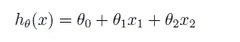
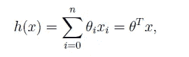
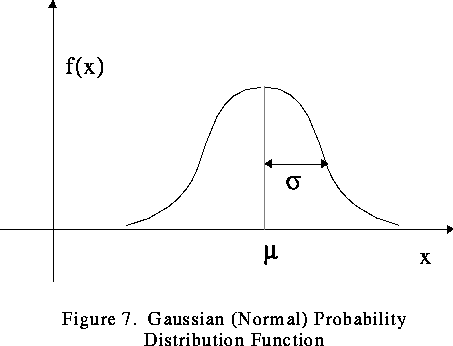
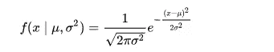
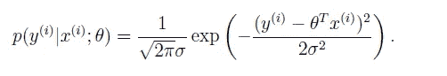
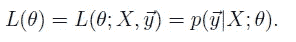
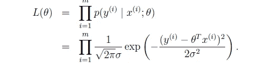
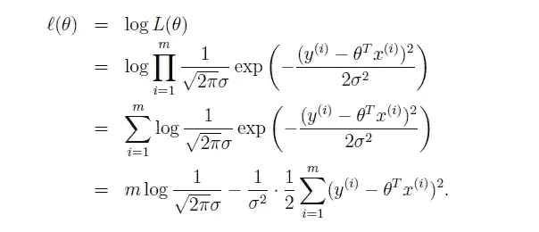
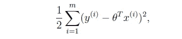

# 当概率定义线性回归时会发生什么

> 原文：<https://medium.com/hackernoon/probabilistic-interpretation-of-linear-regression-835de290dd46>

为什么[概率](https://hackernoon.com/tagged/probability)？为什么我们不能让[线性回归](https://hackernoon.com/tagged/linear-regression)就这样呢！为什么要让它变得困难？所有这些问题都在我的脑海中，当我开始这个话题的时候，但是正如我们所知，当有大量的数据突然出现随机性时，她就把她的姐姐叫做概率。有概率的时候就不能放过高斯。所有这些单词都很重，我会确保放一些魔法，让你轻松一些。让我们一起潜水吧。

*你还记得这些线性回归方程吗？*

> 如果没有，请阅读关于[监督学习](https://towardsdatascience.com/deep-dive-into-supervised-learning-e7952c0692e9)的文章。

在概率论中，非常常见的连续概率分布也被称为**正态分布**或**高斯分布**。这种正态分布有时被非正式地称为**钟形曲线**，如下图所示:

高于正态分布或高斯分布的概率密度由下式给出:

在哪里，

*   ‘穆’是中庸之道
*   西格玛是标准偏差
*   西格玛平方是方差

现在，由于我们有概率分布方程，如果我们写出给定' **X** '和参数**θ**的预测值' **Y** '的概率分布如下:

问题仍然存在，为什么总是高斯分布？为什么不是别的？答案在于“**中心极限定理**”。这给了我们一个想法，当你从几乎任何分布中取出一串随机数并把它们加在一起，你得到的是正态分布。你加的数字越多，它就越呈正态分布。在一个典型的机器[学习](https://hackernoon.com/tagged/learning)问题中，你会有来自许多不同来源的错误(例如，测量错误、数据输入错误、分类错误、[数据](https://hackernoon.com/tagged/data)损坏……)，并且认为所有这些错误的综合影响是近似正常的并不是完全不合理的。

当我们希望明确查看θθ的概率分布函数时，我们将把它称为**似然函数**:

当采用' **m** '训练示例时，似然函数修改如下:

**可能性**和**概率**是一回事。之所以称之为可能性，是因为当我们想在保持 X 和 Y 不变的情况下，把上面的方程看作θ的函数。

***最大似然原理*** 说的是“*选择θ使似然最大化或者选择参数使数据尽可能更有可能*”。除了最大化 L(θ)，我们还可以最大化 L(θ)的任何严格递增函数。特别是，如果我们取而代之最大化我们称之为ℓ(theta):的**对数似然**,推导会简单一点

这给出了与最小化 J(θ)相似的答案:

这种概率解释将进一步用于**逻辑回归**。

如果你发现我的帖子有不一致的地方，欢迎在评论中指出。感谢阅读。

如果你想和我交流。请随时在 LinkedIn 上与我联系。

 [## Sameer Negi -自动驾驶汽车运输公司- Infosys | LinkedIn

### 查看 Sameer Negi 在全球最大的职业社区 LinkedIn 上的个人资料。Sameer 有 3 份工作列在他们的…

www.linkedin.com](https://www.linkedin.com/in/sameer-negi-356881115/)