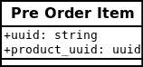
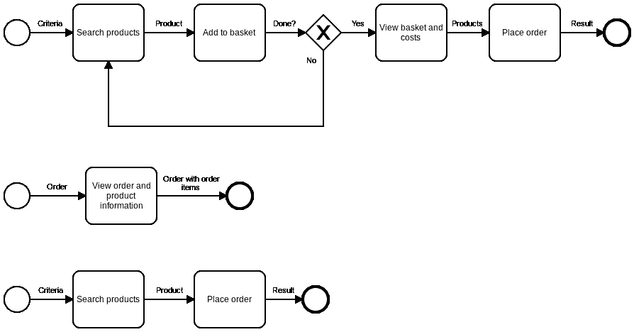

# 流程驱动的 REST API 设计

> 原文：<https://medium.com/hackernoon/process-driven-rest-api-design-75ca88917582>


对于设计 API 来说，REST 是一个过于简单且被大量误解(但却被广泛使用)的概念。随便找一个以 Roy Fielding(REST 的“创始人”)为特色的论坛帖子，你可能会发现他告诉作者和其他参与者他们是如何误解了他想要的 REST。这也许并不奇怪，因为他的原始论文太长了，很多人都读不懂，而且他的想法也并非完全无关紧要。

所以我们通常得到的不是休息，而是几乎，但不完全，完全不像休息的东西。

REST 经常被简化为 CRUD，因为与 REST 相反，CRUD 简单且易于理解。也许是因为它们都是包含 R 的四个字母缩写，谁知道呢。

使用 CRUD，您的操作是创建、读取、更新和删除。这些可以方便地映射到四个主要的 HTTP 动词:POST、GET、PUT 和 DELETE。现在您只需要一些东西来执行这些操作，所以让我们从您的数据库中取出您的数据实体，将它们转换成 URL，称它们为“资源”，然后很快，API！它是 RESTful 的，因为有 HTTP 动词和资源，所以我们可以将 Trello 卡移到 Done，然后去吃午饭。

我不认为这是恰当的 API 设计，而且肯定不是 RESTful。您没有创建 REST API 您刚刚创建了一个只有四个操作和 HTTP 延迟的 ORM。没有具象状态转移(REST)在进行，不是真的。这只是利用 HTTP 访问数据的一种简单方式，简单到甚至有框架可以从数据库实体中自动生成这样的 API。

我把这种方法称为数据驱动的 API 设计。然而，我想做的是描述我使用的 REST API 的设计方法，这是由相当多的文献和良好的经验支持的。我觉得这更像是 REST 的本意，但是由于术语上的混乱，我倾向于称之为过程驱动的 REST API 设计。

然而，在我们讨论这种方法之前，让我们首先考虑一下数据驱动 API 设计的缺点。

## 数据驱动 API 设计的陷阱

考虑一个简单的网上商店。有产品，有客户可以下单这些产品。下订单时，它被创建为包含一个或多个订单项的订单，每个订单项代表一种产品。见下面的数据库方案(我的 UML 生疏了，请多包涵):


Database scheme for a very simple webshop. I know, the UML hurts my eyes too.

通过数据驱动的方法，您将获得以下检索产品信息的资源:

```
GET /products/{uuid}
 Response:
  - uuid (string)
  - name (string)
  - price (float)GET /products
 Response:
  - products (Product entities)
```

通过纯粹的数据驱动方式下订单，您将获得以下资源:

```
POST /order-items
 Request body:
  - product uuid (string)
 Response:
  - order-itemPOST /orders
 Request body:
  - order-item uuid (string)
 Response:
  - order
```

但是这不能与我们的数据库模式一起工作:订单项不能不作为订单的一部分存在于中。所以让我们修改如下:

```
POST /pre-order-items
 Request body:
  - product uuid (string)POST /orders
 Request body:
  - pre-order-item uuid (string)
```

并引入一个新的数据库实体:



现在让我们为这个 API 构建一个客户端应用程序。通过/products 资源，您可以检索产品。您允许客户将产品放入购物篮中(该购物篮保存在客户端应用程序中)。为了通过 API 执行结帐，客户端应用程序现在将对每个产品执行 POST on /pre-order-items，完成后，它将执行 POST on /orders，提供创建预购项时返回的所有预购项 UUID。

是啊，别这样。

对于下单，您现在执行 1 + n 个 HTTP 请求，n 是产品的数量。如果客户订购 10 件产品，下订单大约需要 10 秒钟。此外，如果创建一个订单项目失败了，您会怎么做？你如何处理回滚？如果预购商品从未也永远不会与任何订单相关联，会发生什么情况呢？

也许这种方法对你来说很傻。这是件好事。在实践中，我不止一次地看到这样的设计，在性能和数据一致性方面具有相似的属性。这是对 CRUD 和数据库表特别关注的结果，所以如果您同意这种方法，那么现在是时候进行一次彻底的思维转变了。

无论如何，回到设计 API。

现在有了新的要求。运费应该包括在内，但只适用于€40 以下的订单。不用担心，你可以只检查购物篮，看看总数，如果少于€40，-，你显示运费。如果更多，你不要。对吗？

不要！停下来。请不要这样做。您已经在 API 客户机中编码了业务逻辑。如果你只有一个客户端，这可能行得通，但是如果你只有一个客户端，为什么还要费力地设计一个 API 呢？如果你有 30 个客户端，你希望他们都实现这个逻辑吗？如果它改变了，截止值变成了€50，-？或者更糟的是，如果运输成本将依赖于购物篮的内容怎么办？

让我们研究一下数据驱动的 API 解决方案，并立即建议对上面的预购商品方法进行改进。

不是孤立地创建预购商品，而是通过在服务器上实现一个购物篮实体来将它们分组，客户端可以向其中添加商品(使用 PUT 等等，好了！).然后，购物篮可用于下订单。

```
PUT /basket
 Request body:
  - product uuids (list of strings)
 Response:
  - product uuids (list of strings)GET /basket/{uuid}
 Response:
  - product uuids (list of strings)POST /orders
 Request body:
  - basket uuid (string)
 Response:
  - order
```

Tada，现在您的 API 突然开始负责存储特定于客户端的数据。由于这些数据本质上是短暂的，it 部门也有责任清理这些数据，或者必须为客户端提供清理机制。更糟糕的是，客户端无法实现另一个不包含购物篮的流程，例如，一个简单的“直接再次订购”按钮，而不必使用购物篮实体。

正如我所希望的那样，数据驱动的方法会导致性能问题(因为它最多只会是一个非常低效的 ORM)、客户端的业务逻辑以及 API 中不灵活的流程。此外，以数据驱动的方式解决这些问题只会导致其他问题和更复杂的 API。

让我们试试别的东西。

## 流程驱动的 REST API 设计


Don’t enter the data-driven tunnel. Enjoy the process-driven freedom instead.

过程驱动设计提倡从过程开始，而不是从数据开始。

你可能已经预料到了。

事实上，我们在设计资源时基本上忽略了我们的数据实体。相反，我们首先设计我们希望我们的 API 支持的流程，然后我们将我们的资源基于流程中的*步骤。*

设计流程的方法没多大关系；你可以使用 BPMN、流程图、用例描述或者任何你喜欢的东西。目标是找到您的 API 可能处于的状态。有了这些，我们可以考虑如何最好地表示状态本身以及状态之间的转换。REST:具象状态转移，还记得吗？

让我们再次考虑之前的网上商店，但是现在让我们首先设计并画出我们已经讨论过的流程。下面是一个使用 BPMN 的版本(它被简化了很多，但是它应该为我们的例子服务)。



Simplified process descriptions in BPMN of our simple webshop.

对于流程中的每个步骤，我们考虑 1)该步骤是否需要访问服务器上的数据，以及 2)该步骤是否包含与所有客户端应用程序相关的业务逻辑。如果这些标准中的任何一个为真，我们将为流程步骤设计一个 API 资源。如果没有，流程步骤只是一个由客户端负责的客户端操作。

现在，让我们为上面绘制的流程中的流程步骤执行此操作。

*搜索产品*
我们根据一些给定的标准寻找零个或多个产品。这需要服务器上的数据，因此需要资源。

```
GET /products?{criteria}
 Response:
  - products (Product entities)
```

*添加到购物篮*这是一个客户端操作，因为服务器上不需要任何数据。不需要任何资源。

*查看篮子和成本*现在，这是一个有趣的问题。这一步的目的是，给定一套产品(一个“篮子”)，提供一个你必须支付的概述。这显然是业务逻辑，因此 API 有责任提供资源来促进这一流程步骤。

为此，我们可以引入一个“账单”资源:

```
GET /bill?{product-list}
 Response:
  - product total (float)
  - shipping costs (float)
  - total (float)*Side note: If the product list is complex or long, POST might be better suited here so that a request body can be used.*
```

该资源表示计算并向用户显示正确的总数和成本的业务逻辑。它没有数据库表示；用编程术语来说，它是一个函数。

这是一种根本不会出现在数据驱动方法中的资源，但是当考虑过程时，这种资源会非常自然地出现:当然，您希望看到成本的概述！这是每个网店不可或缺的一部分，所以我们的 API 当然应该支持它。

*下订单*最后，通过提供一个或多个产品，可以下订单。我们可以这样建模:

```
POST /orders
 Request body:
  - product uuids (list of strings)
 Response:
  - order
```

就是这样！这为我们提供了一组三个资源，它们直接对我们想要支持的流程进行建模。

让我们评估结果，并将其与数据驱动方法的结果进行对比。

第一个观察结果是完全没有订单项或它们的等价物，而它们在数据驱动的方法中似乎是如此重要。这是有道理的。在这个过程中，它们与客户或客户端应用程序没有任何关系，那么它们为什么会进入我们的 API 领域呢？当然，这使得 API 变得更加简单。

另一件值得注意的事情是，我们没有引入资源来访问单个产品(/products/{uuid})。虽然这本身看起来并不惊天动地，但重要的是我们做出了*有意识的决定*这样做。设计一个优雅且实用的 REST API 需要思考和深思熟虑。过程驱动的方法通过让你思考每一步来刺激这一点，并帮助你避免不必要的复杂性。

最后一个有趣的观察结果是，增加之前讨论的运输成本要求*不会改变*设计流程；“查看购物篮和成本”步骤仍然存在，它只是用更多的数据进行了扩展。这实际上是这种方法最大的特点之一。我发现，因为你的 API 必须支持的过程很少从根本上改变，用这种方法设计的 API 非常善于适应变化的需求。它们可以很容易地扩展以支持新的情况，同时仍然允许足够的灵活性，并且不会引入不必要的资源或被绑定到您的应用程序内部。

## 包扎

过程驱动的 REST API 设计带来了更灵活、更简单、更清晰的 API，更接近真正的 RESTful API。我已经在多个项目中应用了这种方法，虽然它需要更多的前期工作，但从长远来看，它会带来显著的回报。

当然，这只是 REST API 设计的一部分。在本文中，我基本上忽略了(POST 和 PUT)请求的内容，选择了正确的 HTTP 动词，使用了超媒体和标准化的媒体类型，以及构成一个好的 API 的许多其他内容。以后我会多写那些话题。

然而，我在 PyGrunn 做了一个关于上述主题的演讲。我的幻灯片可以在这里找到。