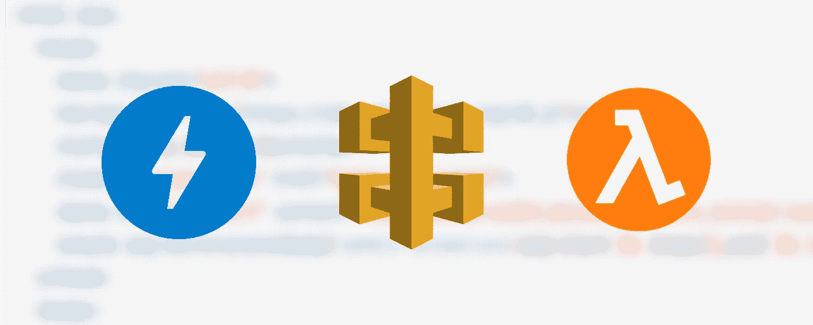
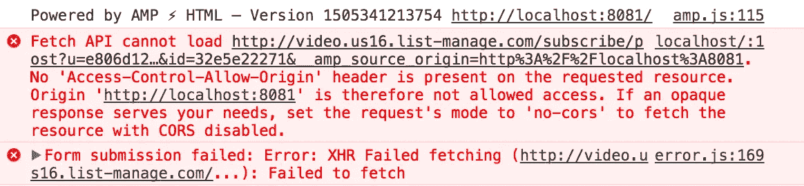
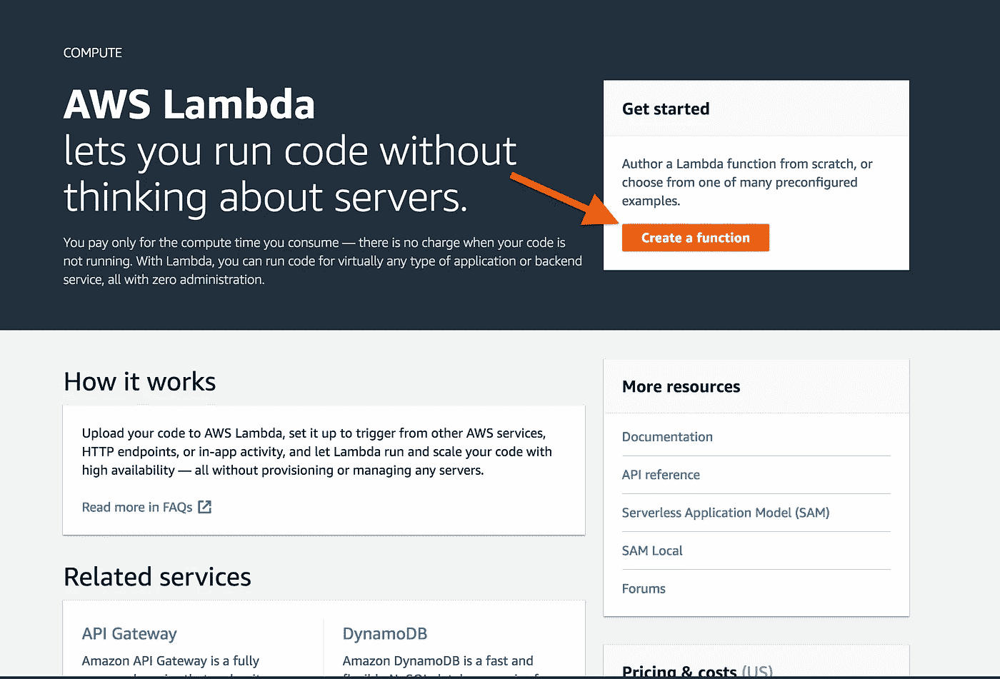
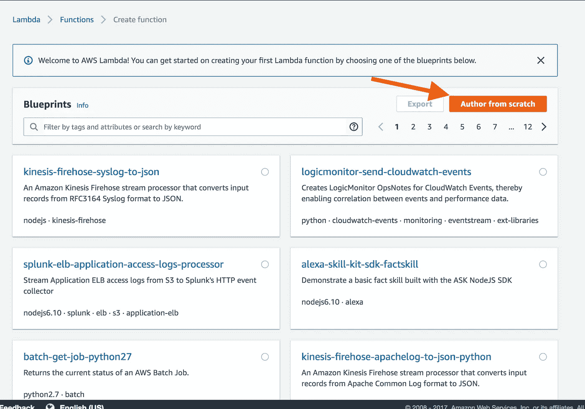
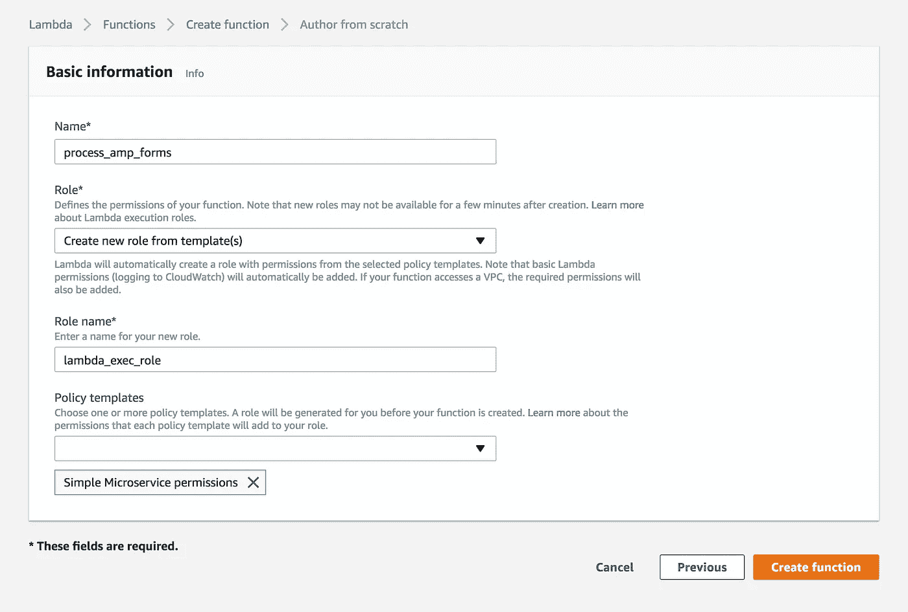
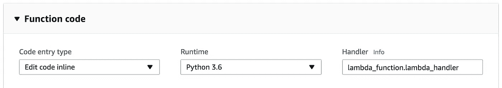
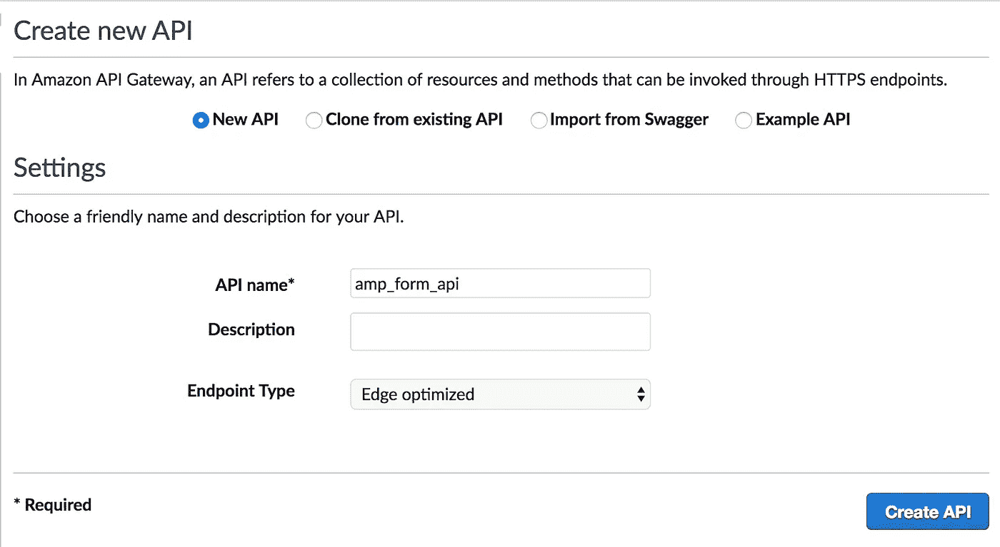
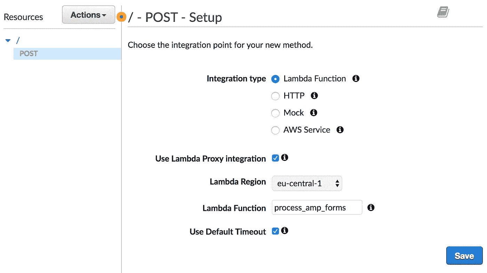
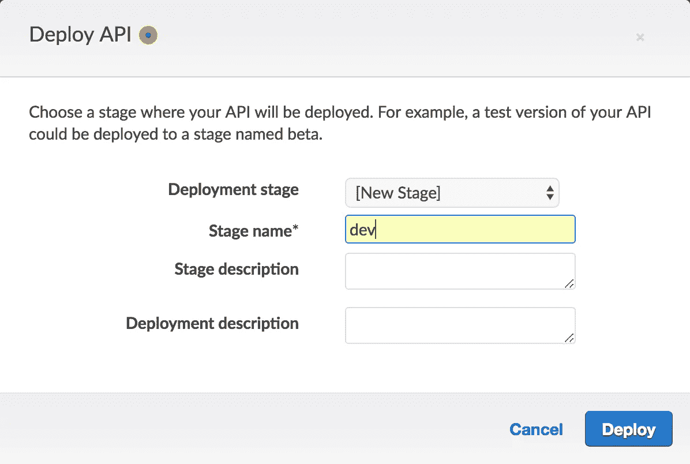
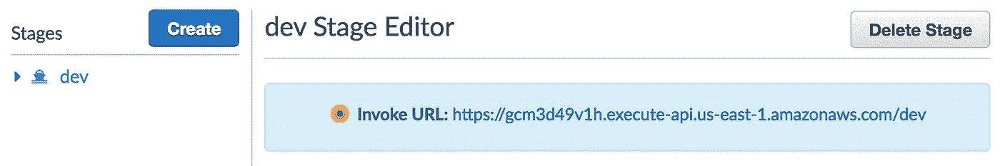

# 用 Amazon API Gateway 和 AWS Lambda 处理 AMP 页面上的表单

> 原文：<https://medium.com/hackernoon/processing-forms-on-amp-pages-with-amazon-api-gateway-and-aws-lambda-18c185a464d4>

了解如何使用 Python 和 Amazon services for serverless 应用程序在 AMP 页面上实现和处理表单。



# AMP 是什么？

AMP 或加速移动页面是谷歌试图缓解移动用户在他们的设备上打开大而重的网站时的挫折感。AMP 的三个主要组件是:

1.  AMP HTML—HTML 5 组件的子集，可提供可靠的性能和更快的网页加载速度。
2.  AMP JS——一个实现最佳实践以更快地呈现页面的库，例如，异步加载外部资源，在加载任何东西之前加载字体，等等。
3.  AMP Cache——一组基于代理的 cdn，用于获取您的 AMP 页面，将它们与所有必要的资源一起缓存，并通过 HTTP/2 提供给用户。这种缓存最臭名昭著的例子当然是 Google AMP 缓存。

然而，所有这些性能改进都是有代价的。没有外部样式表(除了白名单字体提供者)，没有内联样式(无论如何这不是一个好主意)。脚本只允许作为 AMP 组件的一部分或在 iframes 中，并且只有在它们是非阻塞的情况下。

# 为什么这很重要？

目前，AMP 被视为主要用于新闻文章和博客文章的移动解决方案，没有证据表明实施它会影响搜索排名。然而，谷歌已经开始在搜索结果中区分 AMP 页面，并且很有可能在某个时候开始将 AMP 页面放在更高的位置。其他搜索引擎也看到了这项技术的潜力。比如 Bing 从 2016 年 9 月开始支持。

# 简单页面

让我们从一个最小的放大器代码开始:

还没有太多的进展，但是让我们看看这个页面与一般的 HTML 页面有什么不同。要将页面转换为 AMP，您需要用(或者，如果您不喜欢那些花哨的 Unicode 符号)替换标签，并包含标准的样板代码来加载 AMP 脚本，正确设置页面的视窗和基本样式。

你所有的自定义 CSS 代码必须位于 head 中的

比方说，现在我们想添加一个简单的 MailChimp 表单来收集订阅者的电子邮件。你可能会想，很简单，去 Mailchimp，抓取一些嵌入的表单代码，然后把它添加到你的页面上。嗯，不是。AMP 中被阻止的一个东西是带有后动作的常规表单。好消息是您可以使用 POST 表单和 action-xhr 异步发送请求，坏消息是它需要某些 Mailchimp 没有提供的 CORS 头:



这意味着您需要一个定制的后端来处理表单输入并将其发送到 MailChimp。如果你的站点只是一个静态文件的集合，例如，用 Jekyll 创建并托管在 Github Pages 或 Amazon S3 上，那么你就进退两难了:是托管一个为你的页面提供服务并处理表单数据的服务器，还是创建一个只将你的数据传递给 MailChimp 并发送正确响应的后端。在本文中，我们将探索第二种方法。

# 过帐表单

让我们从向页面添加一个表单开始。第一步是在 head 中加载 amp-form 组件。根据放大器规格，这是必需的:

> *使用<表单>时必须加载 amp-form 扩展，否则您的文档将无效！*

现在，我们可以添加表单本身:

与常规表单标签的唯一区别是，如果`method`是 POST，则需要 action-xhr。您还可以添加带有 submit-success 和 submit-error 类的 div，根据响应状态代码(submit-success 为 200，submit-error 为其他所有内容)来显示这些 div。当与 amp-mustache 模板组件结合使用时，这是向用户呈现状态信息的一种非常方便的方式。让我们看看结果代码:

它将异步提交表单；如果响应的状态代码为 200，它将显示 div 和类 submit-success，并用响应正文中的 email 字段替换{{email}}。如果响应有任何其他代码(即发生了错误)，它将显示 submit-error div 并用响应正文中的 errorMessage 字段替换{{errorMessage}}。

# 后端

为了处理请求，我们将结合使用 Amazon API Gateway 和 Python 中的 Lambda 函数。它们允许运行代码，而不需要设置任何服务器或基础设施，并让您在几分钟内获得后端工作。

需要注意的重要一点是，action-xhr 将数据作为多部分/形式数据提交，API Gateway 本身不支持这一点，并且需要在 Lambda 函数中进行一些解析。API 网关的设置相当简单，我们需要它在“代理”模式下工作，也就是把所有的请求数据传递给 Lambda，并从 Lambda 传递所有的响应数据。这是必要的，不仅因为 API Gateway 不支持多部分表单数据，还因为 amp-form 需要依赖于请求中的查询字符串的响应 CORS 标头，稍后将详细介绍这一点。

# λ函数

让我们创建一个处理表单数据的函数。登录你的 AWS 账户，选择 Lambda 服务，点击“创建函数”。



在蓝图中选择“从头开始创作”



在“基本信息”部分，为您的函数选择一个名称，并为 Lambda 配置执行角色。角色描述本身证明了文章的合理性，因此如果您不确定如何配置它，对于我们当前的目的，您可以选择“创建新角色”，填写名称，并将“简单微服务权限”添加到“策略模板”中。



单击“创建函数”，在下一个屏幕上将“运行时”设置为 Python 3.6。暂时保留功能代码。



现在让我们看看默认的功能代码:

当 Lambda 函数在代理模式下与 API Gateway 一起使用时，事件字典包含以下形式的请求信息:

```
{ 
    "resource": "/", 
    "path": "/", 
    "httpMethod": "POST", 
    "headers": { ... }, 
    "queryStringParameters": { ... }, 
    "pathParameters": "", 
    "stageVariables": "", 
    "requestContext": { ... }, 
    "body": "...", 
    "isBase64Encoded": true/false 
}
```

所有字段都是不言自明的，我们只对头、queryStringParameters 和主体感兴趣。为了理解我们到底需要如何解析请求，让我们看看请求是如何发送的:

标题:

```
accept:application/json 
content-length:157 
content-type:multipart/form-data; 
boundary=----WebKitFormBoundaryYoEf5GGRCRaKj2oT origin:http://127.0.0.1:8000
```

查询字符串参数:

```
__amp_source_origin:http://127.0.0.1:8000
```

请求有效负载:

```
------WebKitFormBoundaryYoEf5GGRCRaKj2oT 
Content-Disposition: form-data; name="email" test@example.com 
------WebKitFormBoundaryYoEf5GGRCRaKj2oT--
```

这里没有什么真正有趣的，这是一个标准的多部分/表单数据请求。为了解析它，我们需要使用旧的 cgi 模块。使用它，我们可以解析内容类型头以获得边界，然后解析正文本身:

现在，form_data 包含一个字典，其中包含通过表单提交的所有数据。字典中的每个值都是一个字节字符串数组。在我们的例子中，form_data 应该是这样的:

```
{'email': [b'test@example.com']}
```

很好，现在我们知道如何解析请求并获得必要的值。但是如何将响应发送回去呢？让我们先弄清楚我们需要发送什么。

AMP 对于它期望在你的服务器上发生的事情非常明确。为了满足安全需求，你应该做什么和不应该做什么，这里有一个很长的描述。出于本文的目的，我们将只关注它的一个方面，它在响应中期望的头:

*   访问控制允许来源:。标头必须设置为与请求中的原始标头相同的值。当您执行允许来源的检查时，请记住，请求不仅会来自您的域，还会来自 AMP 缓存域
*   AMP-访问-控制-允许-来源-来源:。标头必须包含查询字符串参数 __amp_source_origin 中传递的值
*   访问控制公开头:AMP 访问控制允许来源来源。该报头的唯一目的是允许设置 AMP-Access-Control-Allow-Source-Origin

加上标准 CORS 接头:

*   访问控制允许凭证:真
*   访问控制允许头:内容类型、X-Amz 日期、授权、X-Api 密钥、X-Amz 安全令牌
*   访问控制允许方法:POST

最后是内容类型头。从示例请求头可以看出，它需要 application/json

# 在 Lambda 中创建响应

首先，我们需要为依赖于请求数据的头获取正确的值:

现在我们可以创建响应。API Gateway 希望 Lambda 函数的输出是包含以下键的字典:

*   statusCode —符合 [RFC7231](https://tools.ietf.org/html/rfc7231#section-6) 的 HTTP 状态代码
*   body —字符串化的 JSON，响应的主体
*   标题—包含响应标题的字典

总结一下，下面是返回响应的代码:

现在让我们把它们放在一起:

# API 网关

最后一步是配置 API 网关服务来代理对 Lambda 函数的请求。转到 AWS 控制台中的 API 网关服务，然后单击“开始”。选择“新 API”并给它一个描述性的名称。



现在点击“动作”，然后“创建方法”。在下拉列表中选择 POST，然后单击复选标记进行确认。将“集成类型”设置为“Lambda 函数”，选中“使用 Lambda 代理集成”，选择您的函数所在的地区，并输入函数名称。



单击“保存”保存设置，然后单击“确定”为该功能创建触发器。现在选择“Actions”→“Deploy API”，选择“New Stage”，给它一个名称(例如，“dev”、“test”或“prod”)，然后按“Deploy”。



您将看到现在需要粘贴到 HTML 代码表单中 action-xhr 参数中的阶段 URL。



# 结论

当前的趋势是为移动用户提供轻便快捷的网络体验，这种趋势可能会持续下去，AMP 也是如此。有人可能会说 AMP 过于严格，过于以谷歌为导向，但是越来越多的出版商采用这项技术来保持他们的 SEO 处于良好状态。随着技术的成熟，更容易获得的组件将会出现。然而，现在，开发人员需要有一种在不损害性能的情况下克服这些限制的方法。创建这样的中间人来“代理”对不提供 AMP 组件和不支持所需 CORS 设置的服务的请求，是保持您的 AMP 页面交互和有用的重要步骤。

虽然 AMP 文档很好，也很简单，但是我们觉得它缺少实现的例子。本文的目的是为希望以最简单的方式在 AWS 基础设施上实现 AMP 页面后端的开发人员提供一个概述和一个起点。

*最初发表于*[*【cruxlab.com】*](https://cruxlab.com/blog/processing-forms-amp)*。*