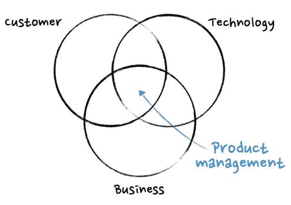
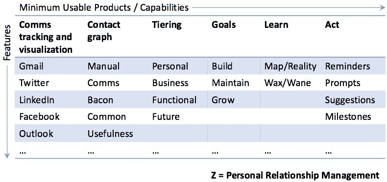

# 面向工程师的产品 101:功能介绍

> 原文：<https://medium.com/hackernoon/product-101-for-engineers-83ef7260cbf1>

## 产品管理为什么存在，它能为您做什么

[Credit: Marin Eriksson](http://martineriksson.com/)

*编程注意事项:本帖是一系列不定长的产品话题中的 n 篇，主要面向* [*初创期*](https://hackernoon.com/tagged/startup) *人群，主要是领导，主要来自非 GTM 背景。末尾有一个列表。*

# 为什么是产品

*   我们需要知道*要造什么*
*   我们需要知道为什么要建*那个*
*   我们需要知道为什么*不*去建造其他东西
*   我们需要知道在建造任何给定的东西和任何其他给定的东西之间的权衡
*   与潜在客户和客户交谈，了解他们的需求以及他们可能陈述的需求是一种技能
*   做定性和定量研究是一种技能
*   将这些需求转化为目标、用例，以及实际上可以被工程团队理解和构建的需求是一项技能
*   将长期产品愿景分解为近期和中期的逐步(或并行)可实现的产品进展，这是一种技巧，在每一步都可能产生价值
*   平衡价值(我们交付的)和摩擦(我们引起的)是一个反复的过程，需要持续的关注
*   保持工程、[营销](https://hackernoon.com/tagged/marketing)、销售、销售工程、客户成功和支持的同步不会自动发生
*   确保所构建的是我们所期望的，需要专注的关注
*   平衡客户需求、客户要求、营销要求、销售要求、潜在客户的意见、支持和维护要求、产品愿景、竞争压力、业务增长需求、成本和利润、创始人的愿望，这是一项需要动脑筋的工作

产品的基本目的是确保在任何给定的时间点，通过(1)优化所有的权衡和(2)在产品所在的位置和我们最终想要的位置之间保持一条路径，来建造最正确的东西。

# 从功能上来说

## 产品愿景

为了决定构建什么，我们需要一些关于这个世界的论点，以及一些我们想要修复的人(我们的角色)的破碎的东西。我们需要一份声明，说明我们将如何在运送给那个人的产品中体现这一点。我们需要阐明我们将如何最终为那个人改变世界。

这组陈述充当了一个标杆，通过它我们可以对团队关于构建什么的无限要求和需求说“不”。包括那些来自团队本身的。

这组语句是*而不是*静态的。在最糟糕的情况下，它[明显或不明显]随机变化。不太糟糕的是，它隐式地改变。更好的是，它会因存在的风险和危机而改变，但要明确。最好的情况是，随着时间的推移，由于了解如何更好地满足我们所服务的用户的需求，it 发生了明显的变化。

在一家初创公司，这最好来自创始人，不管他们是否拥有“产品”头衔。否则你会受到伤害。

## 产品路线图

大多数产品路线图只是计划，其中只有一部分实现了。

*   我们现在在建造什么？
*   我们下一步要建什么？
*   哪些东西是因为什么原因而建造的？

有了背景它会变得更好。

*   每样东西如何服务于产品愿景？
*   每件事如何映射到收入(收入)或成本(支出)—它是否扩展了现有的收入流，是否增加了新的收入流，是否依赖于收入流，是否降低了成本，等等？
*   正在构建的东西处于什么阶段(MVP、alpha、beta、扩展、更新、维护等)？
*   不造这个东西的代价是什么？

有了路线图，情况会变得更好。

我喜欢的视觉效果是一个有两个轴的矩阵，最终的东西(或一组东西)会实现右下角的产品愿景——这样，如果我们填写所有的方框，我们就实现了最终的目标。【见[建造你着手建造的](/@aneel/product-rails-b8e5fc234142)。]像这样。

这种方法的有趣之处在于，在很大程度上，顺序并不重要。只要*所有的东西*最终得到建造。实际订单由市场变化决定，即我们能够在给定的时间框架内制造和销售哪些产品，以支持和发展业务。

当愿景发生变化时，我们必须记住的是，基于我们已经建立的产品和业务，我们已经关闭了哪些大门，哪些大门仍然向我们敞开。换句话说，什么东西可以打捞，什么东西不能打捞。在现实生活中，这些事实极大地改变了我们的中枢(和生存)能力。

最好有一张真正的[沃德利]地图。这本身就是一个话题，西蒙·沃德利[对此做了最好的解释](https://www.youtube.com/watch?v=NnFeIt-uaEc)。在这一点上，我们已经回到了产品策略。

## 产品策略

我把它放在这里而不是上面的产品路线图的原因是，在现实世界中，产品战略通常不会完成，直到追求来自我们愿景的 Raodmap 遇到混乱的走向市场(营销和销售东西)的世界。事情就变得一团糟。

根据我们的愿景，思考战略的一种方式是:

*   我们要怎么填写这个矩阵呢？
*   客户将从哪一桶钱中为我们的产品付款——是从现有桶中购买竞争工具，还是从由特定角色控制的现有桶中购买不像我们的产品这样的东西，还是从他们将要创建的新桶中购买，等等？
*   我们选择与什么竞争——一个充满玩家的现有市场，一个现有市场的顶部/底部/中部，一个我们将创造和领导的新市场，这样的替代方案是什么都不做，没有人认为他们为之付费的开源东西，等等？
*   我们的销售策略—自上而下、自下而上、落地和扩展*内部、外部、现场*企业、中端市场/商业、SMB 等—以何种顺序影响路线图上的内容？
*   我们的定价和业务模式如何影响路线图上的内容以及顺序？
*   我们要寻找哪些东西来告诉我们，我们是否在正确的轨道上？
*   我们*必须*建造的东西是什么？
*   哪些东西必须按照*特定的*顺序建造？

## 产品开发

这是实际的构建过程:方法、过程、团队、沟通、输入和输出等细节。

总有一些过程。即使我们不谈论它或使用那些词。跟踪这些东西以及它们是否工作是一项实际的工作职责。我们需要能够回答这样的问题:

*   我们是否把实际上*可能*并且可以由某个工程团队有限的时间和劳动力资源构建的东西放到了路线图上？
*   我们能否有效地将路线图上的行项目转化为可以建立的目标和需求？
*   万一出现技术障碍，我们有备用计划吗？
*   有没有一个 MVP，我们可以用它来检验一个特定特征所体现的假设？
*   我们在不同的团队中是否有足够的人来维护一个合理的在制品负载，而没有严重的瓶颈？(可能在工程管理方面走得有点远。)
*   进度是否以适当的时间间隔和足够的细节传达给公司的其他部门，以确保相关/下游工作得到适当的校准？

## 产品研究

获得产品假设的真实验证。包括但不限于:

*   将线框或早期版本放在客户或其他相关人员面前征求反馈
*   为功能设计和运行 A/B 测试
*   进行调查或其他主要研究
*   跟踪用户行为
*   对愤怒的顾客进行离职调查
*   进行竞争研究，了解其他产品的运作方式
*   做市场调查，看看是否能从其他领域获得灵感
*   运行客户咨询委员会

## 产品营销

根据我们选择如何组织公司，或者我们手头有谁，产品营销有时会发展成产品，有时会发展成营销。我看到在各种规模的公司中，这两种方式都做得非常成功。任何关于“必须”如何组织的陈述都是不合法的。

*抄袭自* [*工程师营销 101*](https://hackernoon.com/marketing-101-for-engineers-ee9e7fcb1a51)*…*

产品营销本身是一个广泛的学科。粗略地说，我将其归类为漏斗中部活动——尽管根据公司的不同，它会一直到达漏斗的顶部(开展活动和领导 DG 活动),并一直越过底部(充当销售工程和产品),接管许多可能被视为销售工程或产品管理的活动。

包括但不限于:

*   信息:用于描述公司(与品牌完全重叠)和产品、特性、功能、价值等的所有词语。，适用于所有需要的媒体和场所——包括产品本身的提示、工具提示和菜单项名称
*   定位:将公司和产品置于市场环境中，决定如何陈述相对于其他供应商的竞争地位
*   销售支持:为销售人员提供他们与客户打交道时使用的语言和材料，包括通话脚本、数据表、异议处理和行动手册，以及为销售工程师提供产品/功能方面的技术培训
*   [分析师关系](https://hackernoon.com/analyst-relations-for-startups-101-ea9338cb13ed)
*   [公共关系](https://hackernoon.com/pr-101-for-engineers-7cd116cc5347)
*   需求/潜在客户支持:提供或审查所有内容、信息等。，用于登录页面、广告、CTA 等
*   竞争情报:密切关注竞争对手(现有的和新出现的)，他们在说什么，他们在做什么，并让组织的其他成员了解情况
*   市场情报:密切关注行业发展，尤其是公司所处的特定生态系统，这些发展对公司在市场中取得成功的能力有(或可能有)重大影响
*   定价和包装:考虑到竞争和市场形势，找出如何给产品定价，如何将它们包装成不同的层次
*   文档和技术写作(有时只是产品营销职能；更频繁地直接出现在产品中)
*   客户营销(有时是自己的专长)
*   技术营销(有时是自己的专长)
*   产品:收集客户反馈，建立和维护产品路线图，协调发布(有时这些核心产品管理活动最终会脱离产品营销)

## 售前/走向市场

让销售和营销与愿景、路线图、即将到来的事情和时间以及对先前陈述的计划的任何更改保持同步，并管理他们的期望(或行为)——是做产品的核心部分。

我们希望销售和营销在这样做的过程中最大限度地有效和诚实。至少我知道。为了做到这一点，他们必须知道:

*   营销和销售什么，什么时候
*   为什么特定的事物被建造和不被建造
*   正在解决哪些问题
*   问题是为谁解决的
*   这该死的东西长什么样，怎么给人看
*   什么不起作用，以及如何避免显示不起作用的部分
*   价值主张是什么(更多产品营销)
*   如何谈论这件事(更多产品营销)
*   如何定位产品与竞争(更多产品营销)

我们需要协调何时发布、alpha 测试、beta 测试或 RTM-ed(向市场发布)GA(全面发布，即“发布”)。

在科技公司，尤其是初创公司，产品人员通常是实际营销和销售过程的一部分。他们被安排做演示、参与销售拜访、撰写文案、制作幻灯片和视频以及其他宣传材料。

最后，产品本身是营销的载体，也可能是销售本身的载体:

*   呈现的信息是什么？
*   什么是 CTA？
*   有免费试用或演示环境吗？
*   人能否自我转化为客户？
*   客户可以自己升级/降级吗？
*   用户可以用产品做的事情会获得更多用户吗？

## 售后服务

如今，大多数产品本身都有一些客户加入方面的功能。而不是需要公司的人来为客户做所有的安装和设置工作，尽管这肯定也是一件事。

找出实现这一目标的最佳方式以及自助服务的数量与需要某种咨询或服务工作的数量是非常重要的决策。

## 支持

支持通常从产品和工程开始，然后才成为它自己的功能。从长远来看，产品最终会形成一个反馈环，提供以下支持:

*   分类错误
*   将 bug 修复和维护工作纳入开发周期和计划中
*   对通过支持部门收到的功能请求进行分类
*   提供有助于支持完成其工作的功能，如某些功能的调试模式

## 客户反馈

产品必须跟踪、主动获取并为客户提供渠道，以反馈他们手中的产品和路线图(如果可能的话)。

## 增长

*抄袭自* [*工程师营销 101*](https://hackernoon.com/marketing-101-for-engineers-ee9e7fcb1a51)*…*

[增长](https://en.wikipedia.org/wiki/Growth_hacking)是一个有些模糊的术语，它可以归结为增长，或者说是增加漏斗的速度。该术语源于以消费者为导向的产品驱动型公司，在这些公司中，绝大多数潜在用户与公司的互动都是通过产品/网站/应用程序进行的，而创造/发现“病毒式传播”、“飞轮”[“或“网络效应”](https://techcrunch.com/2016/09/10/at-amazon-the-flywheel-effect-drives-innovation/)”的行为是为此目的设计和优化用户体验的功能。

增长经常被认为是它自己的功能，有时是它自己的业务线，有自己的营销、产品、工程和运营人员，他们试验和 A/B 测试用户体验的所有方面，导致转化和扩展，以及推荐营销等事情。

在我这种对着天空挥舞拳头的老头心态中，这不是一门学科。这是一个专门的漏斗团队，通常由产品部门领导，像独立运营单位一样运行。但是每一代人都需要感到特别。你的斗篷也是。

## 伙伴关系和整合

有时候，产品策略、商业模式、销售策略或者只是为了赚钱的核心，是构建与其他产品集成的东西。

像任何其他功能一样，集成的工作量和深度必须根据产品愿景来决定和调整。

## 商业模式

有时构建的内容直接由业务模型决定，有时构建的内容直接决定(或限制)业务模型。这是一个永无止境的鸡和蛋的紧张关系。克服它。

在大型组织中，产品管理包括为我们想要开发的新产品建立商业案例，并在内部进行推介，以获得这样做的资源。

在一些公司，产品经理拥有 P L，实际上是根据他们的产品创造的业务来衡量的(这是我全力支持的)。

## 本系列中的帖子

*   [工程师用产品 101](/@aneel/product-101-for-engineers-83ef7260cbf1)
*   [工程师用产品 102](/@aneel/product-102-for-engineers-e1b8b4e82fa3)
*   [最小可用产品](/@aneel/minimum-usable-product-f80d5d588fc1)
*   [产品、营销和管理期望的艺术](/@aneel/product-marketing-is-managing-expectations-da963d36abea)

## 营销相关系列(和模板)

*   [工程师营销 101:功能介绍](/@aneel/marketing-101-for-engineers-ee9e7fcb1a51)
*   [工程师营销 102:打造漏斗](/@aneel/marketing-102-for-engineers-ddf3b7fa61e6)
*   [工程师营销 201:信息传递&定位](/@aneel/marketing-201-for-engineers-b28147fdb59d)
*   [面向工程师的营销 202:发布](/@aneel/marketing-202-for-engineers-launching-9437aa0e4961)
*   [工程师市场营销 203:销售支持](/@aneel/marketing-203-for-engineers-sales-enablement-e47662ca996a)
*   [工程师市场营销 204:产生需求](/@aneel/marketing-204-for-engineers-generating-demand-27200085320c)
*   [工程师营销 301:战略&策划](/@aneel/marketing-301-for-engineers-strategy-planning-2e4473fcc879)
*   [工程师市场营销 302:招聘营销人员](/@aneel/marketing-302-for-engineers-hiring-marketers-a3a6d4355a03)
*   [面向工程师的营销 303:定价框架](/@aneel/marketing-303-for-engineers-pricing-frame-aa71c8860a2b)
*   工程师的营销 401:GTM 的阶段
*   [针对工程师的营销 402:诊断&故障排除](/@aneel/marketing-402-for-engineers-diagnostics-troubleshooting-d946a337c258)
*   [工程师营销 403:解答创始人常见问题](/@aneel/marketing-403-for-engineers-office-hours-bf4d2d0b5f56)
*   [工程师销售 101:功能介绍](/@aneel/sales-101-for-engineers-6fcd1b49cffa)
*   [针对工程师的 PR 101](/@aneel/pr-101-for-engineers-7cd116cc5347)
*   [面向工程师的分析师关系 101](/@aneel/analyst-relations-for-startups-101-ea9338cb13ed)
*   [基本消息模板【谷歌文档】](https://docs.google.com/document/d/1neA71qCSeV3xH1Dpbtcy67m3v2ETmmB_Qq02ckkKUiQ/edit?usp=sharing)
*   [基本漏斗指标模板【谷歌表单】](https://docs.google.com/spreadsheets/d/11r4tHm_es6Tl4DItNUc_KzNdyvrmbbRmb38CJPLCvRU/edit?usp=sharing)
*   [基本发布时间表模板【谷歌文档】](https://docs.google.com/document/d/13Zscb5sX9ggjpWf05Ka-oj5wulC3Kb9z0LyMEQesnzM/edit?usp=sharing)
*   [基本战斗卡模板【谷歌文档】](https://docs.google.com/document/d/1dOCKhE1Ufmwp7bXeQTBCkST7NPwiCPJ2oyWEdpQut1g/edit?usp=sharing)
*   [详细战斗卡模板【谷歌文档】](https://drive.google.com/open?id=1EC3Lq6Z_IVrZKR4-jHgnc5-e3krZw4bA5Z-HAOJlH10)
*   [基本营销日历模板【谷歌表单】](https://docs.google.com/spreadsheets/d/1nXr0IqwnhQsUi_D83ecPXsIyDdiTkpNZ66piRkayPsA/edit?usp=sharing)
*   [基本营销阶梯模板【谷歌表单】](https://docs.google.com/spreadsheets/d/17EfTQp_21WomJ9cwiM4ian9M2QRcbM17_d3DilGNThY/edit?usp=sharing)

## 参考书目

*   [维基百科上的产品管理](https://en.wikipedia.org/wiki/Product_management)
*   [Christina Wodtke:产品管理的三项工作](https://productcoalition.com/three-jobs-of-product-management-9e006f944bc7)
*   [HBR:成为一名伟大的产品经理需要什么](https://hbr.org/2017/12/what-it-takes-to-become-a-great-product-manager)
*   [尤金·卫:无形的渐近线](http://www.eugenewei.com/blog/2018/5/21/invisible-asymptotes)
*   [Tom Tunguz:关于产品的博客文章](http://tomtunguz.com/categories/product/)
*   丹·希尔:对产品管理的观察
*   [诺亚·维斯:PM 神话的线索](https://twitter.com/noah_weiss/status/999311514556284928?s=21)
*   [格温·沙皮拉:软件工程师到产品经理](https://blog.usejournal.com/software-engineer-to-product-manager-5d1eddaa3678)
*   [AWS Lambda —战略性使用产品的一课](/@aneel/aws-lambda-a-lesson-in-using-product-strategically-185217e042e8)
*   我:[工程师营销 101](https://hackernoon.com/marketing-101-for-engineers-ee9e7fcb1a51)
*   我:[工程师销售 101](https://hackernoon.com/sales-101-for-engineers-6fcd1b49cffa)