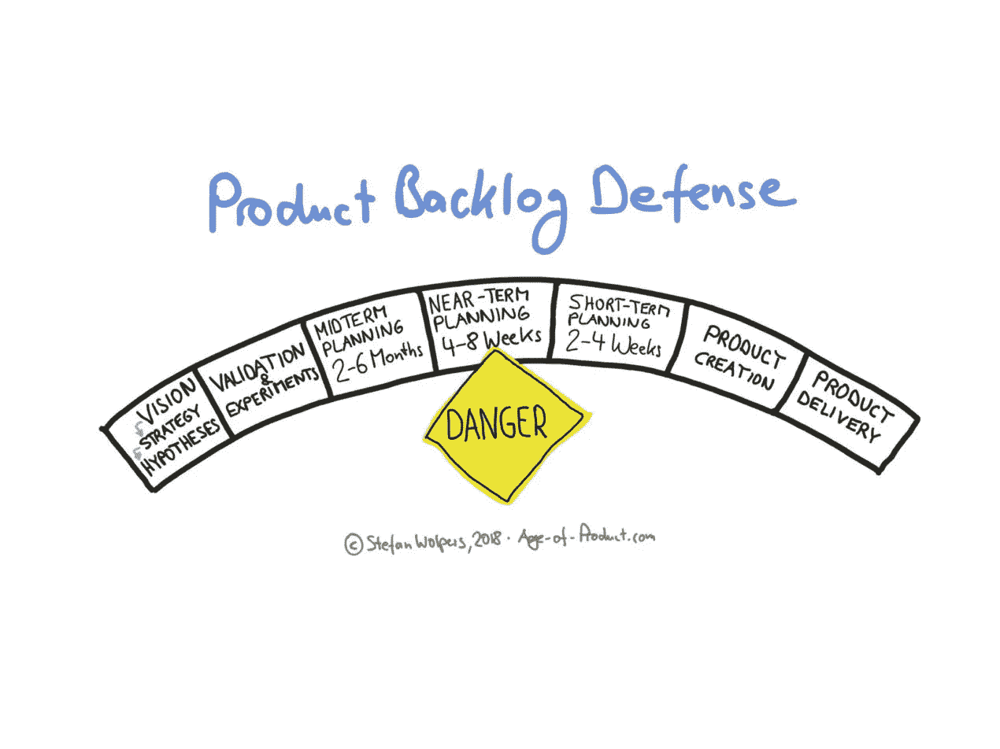
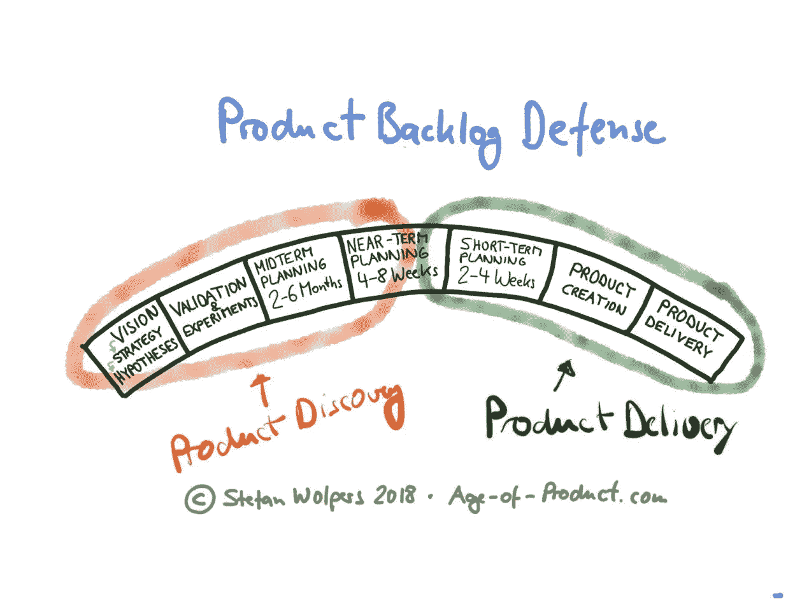
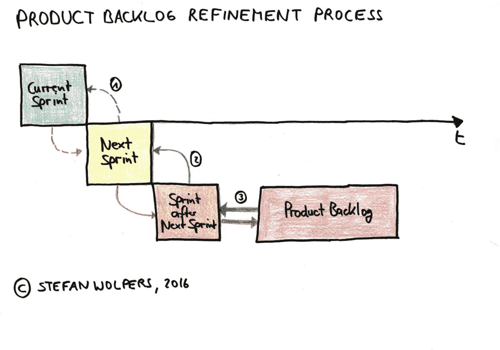
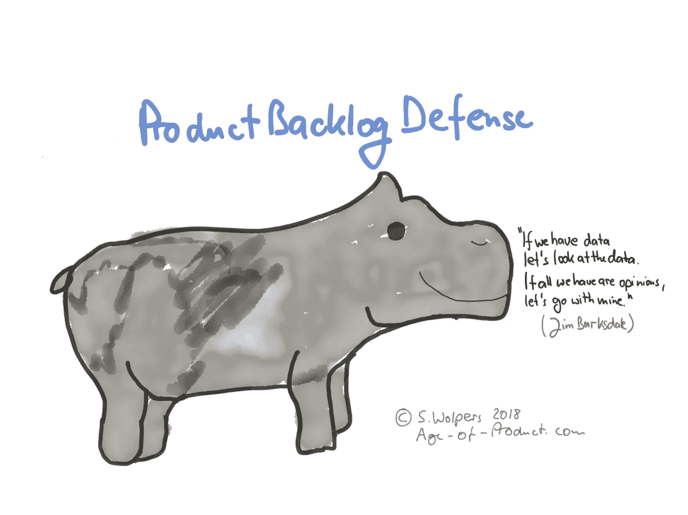

# 产品积压防御

> 原文：<https://medium.com/hackernoon/product-backlog-defense-8ee55c6559da>

# TL；DR:产品积压防御

产品积压防御——毫无疑问:您的产品积压是阻止您的团队成为功能工厂的最后一道防线。找出一个为客户创造价值的流程。此外，要有勇气——和纪律——不惜一切代价捍卫它。

# 产品创建过程中的产品积压

在我保持简单的二维产品世界中，产品待办事项将近期计划定义为产品创建过程的关键:

在我的心理模型中，近期规划范围涵盖了大约 4 到 8 周。这是产品发现阶段向产品交付阶段交付有价值的产品增量的经验证的想法的地方。(我不愿意称之为移交，因为这个词有负面含义。)

此时此刻，不应该再怀疑为什么产品增量对您的客户和您的组织是有价值的——这个“为什么”的问题已经在这个阶段得到了回答。很可能，你仍然会讨论第一次交付的想法的范围，工程师们会考虑这个产品增量如何最适合应用程序。然而，团队成员之间的讨论不应该再围绕从“有价值、可行、可用”的角度出发的基本问题。在产品发现阶段，这已经在左侧完成。

如果你正在练习 scrum，近期计划将包括两到四个 sprints:

从投资角度来看，这种从产品发现到产品交付的转变是一个严肃的时刻。现在，团队变得真实，并分配资源到产品交付，例如，相关用户故事的持续协作细化。或者草图被转化为设计，并且可能在技术栈方面需要一些预备工作。

现在，团队开始对花钱和产生投资回报负责。如果您因为接受了一些绕过我们团队产品创建流程的工作而未能交付此回报，无论出于何种原因，您也将理所当然地对这一失败负责。没有人会有兴趣阅读为什么会发生这种情况的细则。它在你身上。

# 产品积压防御:期望侧翼机动绕过产品创建过程

跨越前面提到的门槛也是为什么产品创建过程的近期规划或产品积压部分对试图绕过过程并偷偷加入需求或特性的涉众如此有吸引力的原因。

参加创意竞赛，并希望一个创意能够通过验证，这是一项相当大的努力，并且承担着被拒绝的巨大风险。因此，以近期规划阶段为目标的捷径风险较小。

通常，您可以将利益相关者试图逃避产品发现阶段的创意竞争归因于组织提供的激励。或者如查理·芒格所说:

> “当你应该考虑激励的力量时，永远不要考虑其他事情。”

# 敏捷过渡——来自战壕的手册

Download the ‘Agile Transition — A Hands-on Guide from the Trenches’ Ebook

最新的，219 页的强版本**[敏捷过渡——来自战壕的实践手册，带清单](https://age-of-product.com/download-agile-transition-hands-guide-trenches/)****就在这里，而且是免费的！******

# ****侧翼机动背后的动机****

****侧翼机动有多种模式，取决于组织的性质、年龄和规模。例如:****

*   ****销售经理认为他或她的奖金处于危险之中，因此迫切希望推出一些功能，看看哪些功能能坚持下来(并产生收入)，这种情况很明显。****
*   ****有些人正在追求一个特定的(宠物)项目，以改善他或她的简历，为下一步职业生涯做准备——可能是另一个组织——这种情况更难发现。****
*   ****通常，您可以观察到风险承担者对其部门成果的重视程度高于****
*   ****然后是决定“内部软件代理工作的驱动力，因为这是我们的预算，我们最了解我们的需求。”在这里，工业时代基于功能筒仓的组织思维与后工业时代的价值创造过程相冲突。****

## ****如果你喜欢这篇文章，帮我一个忙👏👏 👏多达 50 次—您的支持对我来说意味着一切！****

*******如果你更喜欢邮件通知，请*** [***注册我的每周简讯***](https://age-of-product.com/subscribe/?ref=Food4ThoughtMedium) ***，加入 16261 位同行。*******

# ****普通侧翼机动****

****对于任何产品团队来说，至少有七种侧翼策略使产品积压防御成为强制性的:****

1.  ****拉关系或河马主义:这种行为有不同的原因。有些人认为等级地位有特权，规则不适用于他们。其他人认为他们知道得最清楚，这可能是家长式思维的结果。通常，这是对团队能力缺乏信任的表现。不管是什么让一个人如此行事，这都是领导素质差的表现。****

********

1.  ****强行使用 it :工作中的恶霸，现在可能正在公司的等级制度中闯荡。在校园里有效的方法今天可能仍然有效——尽管包装不同。不要期望这种行为会留下痕迹或邮件线索。****
2.  ******让爸爸来解决**:外包“问题”解决方案的魔力——在这里:产品团队要求利益相关者像其他人一样接受流程——到更高的层级。(‘我的老板会和你的老板谈，然后我们再看……’)****
3.  ******贿赂**:我帮你，你帮我。****
4.  ******直接造票**:何必麻烦产品负责人？他或她可能会过度劳累。取而代之的是，你的利益相关者表现出主动性，并亲自为所需的特性创建标签。(不控制门票系统的访问权限是菜鸟的错误，随便说说。)****
5.  ****调度模式:为什么不直接分配任务给工程师，完全绕过产品积压？****
6.  ******将特性请求标记为 bug**:与其他策略相比，通过 bug 报告隐藏特性几乎是一种深思熟虑的方法——有人试图入侵系统。不错的尝试。不过，下次要更加努力。****

******注意事项**:在产品积压防御时不要迂回。保护你的产品创建过程免受利益相关者试图绕过它的纪律需要在你的团队中同样严格地应用。例如，不要使用产品 backlog 作为在稍后阶段可能有用的想法和需求的存储库。对每个人都不加区别地适用同样的规则。****

# ****结论—产品积压防御****

****如果你想作为一个产品团队被认真对待，如果你想让组织接受你的产品团队作为解决关键客户问题并为组织识别机会的团队，那么用牙齿和爪子捍卫你的过程。不遵守这条规则是一条通向特性工厂的不归路。****

# ****📅动手敏捷网络研讨会****

******下载您的邀请**:****

*   ****2018 年 4 月 24 日:[网络研讨会#2:敏捷成熟度和敏捷评估](https://age-of-product.com/webinar-agile-maturity/)****
*   ****2018 年 5 月 8 日:[网络研讨会#3:产品积压反模式](https://age-of-product.com/webinar-product-backlog/)****

******注意:**所有网络研讨会将在 CEST 时间下午 06:00 到 07:00 播出。(即美国东部时间下午 12:00 到 1:00，或太平洋时间上午 9:00 到 10:00。)****

# ****✋不要错过:加入 3000 多人的“动手敏捷”Slack 团队****

****我邀请你加入[“手把手的敏捷”Slack 团队](https://goo.gl/forms/LObbRtSF9vvxN3CL2)，享受来自世界各地的敏捷实践者的快速增长、充满活力的社区带来的好处。****

********

****如果你现在想加入，你现在所要做的就是[通过这个谷歌表格](https://goo.gl/forms/LObbRtSF9vvxN3CL2)提供你的证书，我会帮你注册。顺便说一下，**是免费的。******

# ****你还想这样多读书吗？****

****好吧，那么:****

*   ****📰*加入 16261 位同行和* [*报名我的每周简讯*](https://age-of-product.com/subscribe/?ref=Food4ThoughtMedium)****
*   ****🐦*关注我的* [*推特*](https://twitter.com/stefanw) *订阅我的博客* [*产品时代*](https://age-of-product.com)****
*   ****💬*或者，免费加入* [*Slack 团队【动手敏捷】的 3000 多名同行*](https://goo.gl/forms/XIsABn0fLn9O0hqg2) *。*****

****[产品积压防御](https://age-of-product.com/product-backlog-defense/)首次发布于产品年龄。****