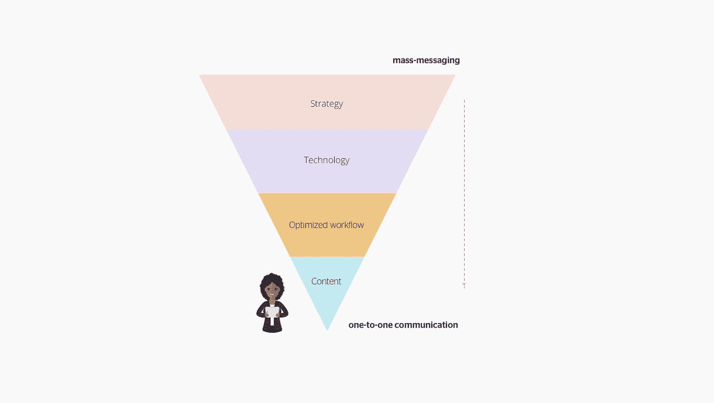
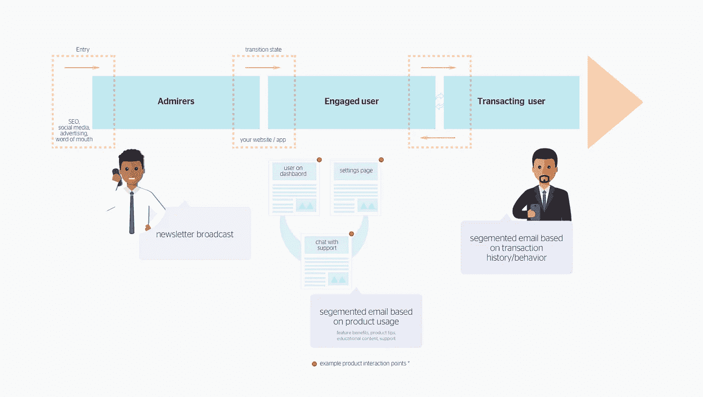
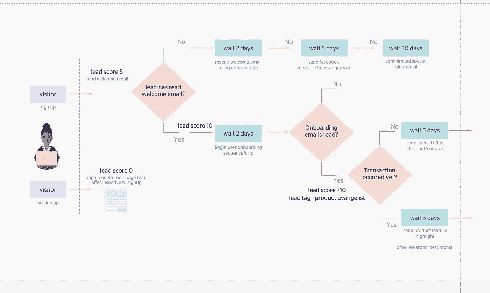

# 产品营销简单性:营销自动化快速入门

> 原文：<https://medium.com/hackernoon/product-marketing-simplicity-a-quick-introduction-to-marketing-automation-7ac8948d92d3>

“Several white arrows pointing upwards on a wooden wall” by [Jungwoo Hong](https://unsplash.com/@oowgnuj?utm_source=medium&utm_medium=referral) on [Unsplash](https://unsplash.com?utm_source=medium&utm_medium=referral)

今天，你可以很容易地在一条推特上看到赞美伟大的用户界面在技术支持产品的生命周期中的作用。在不剥夺设计师在初创公司和颠覆性消费技术产品的发展中所扮演的角色的情况下，产品营销可以通过技术得到进一步优化。

> **找出你的客户是谁，弄清楚他们的需求，设计一款让他们大吃一惊的产品——这些是营销决策，而不仅仅是开发和设计选择——瑞安·哈乐黛**

在本指南中，我将尝试描述如何利用营销自动化概念和[工具](https://hackernoon.com/tagged/tools)来简化消费者和 B2B 产品的营销。本文的最终目标是为营销人员、创始人和商业决策者提供一个框架，以刺激一种新的方式来处理数字产品的营销活动。

根据定义，“营销自动化”是利用技术实现常规营销任务的自动化。通过应用，“营销自动化”是使用技术将人们从未知的商业前景转变为已知/参与的商业客户的过程。两个定义中的关键词都是“技术”。

营销自动化经常被误解为电子邮件营销。它不是。但是，电子邮件是作为营销自动化的渠道嵌入的。传统的电子邮件营销很久以前就已经消亡了，很多人还没有注意到，营销自动化现在已经很普遍，但很容易被误解。如果你曾经收到过来自网飞或亚马逊的电子邮件，那么你已经体验过营销自动化的工作。

如果以数据的洞察力而不是直觉为指导，通过营销漏斗进行的客户愉悦、教育和参与将更加有效和详细，这适用于初创公司和企业。

## 一、行业术语

下面是一些营销自动化术语及其定义，帮助您入门。

*   **匿名线索** =未知网站访问者
*   **潜在客户/潜在客户** =数据库中识别的记录(通常电子邮件地址是标识符)
*   **细分** =符合预定义规则的潜在客户列表
*   **触发/自动化规则** =自动启动任务的事件，例如用户完成了价值一定金额的单笔交易，向该用户发送奖金。
*   **点滴/工作流程** =一系列消息(通常是电子邮件)
*   **交互日志** =每个潜在客户的活动历史
*   **得分** =根据互动日志和自动化规则中的记录，对每个潜在客户进行评级或分类。
*   **销售线索评分** =给销售线索分配一个数值，表明他们在您的营销漏斗中的参与程度
*   **资产** =与工作流或自动化规则相关的文件，例如 pdf 文档。
*   **营销活动** =每个销售线索的预定沟通或计划活动
*   BANT =代表预算、权力、需求和时间表的首字母缩写。
*   CRM =客户关系管理

# 理想的框架——S . t . o . c

Ideal Framework — marketing automation stack — [Samson Aligba](https://medium.com/u/f1f25bf5304e?source=post_page-----7ac8948d92d3--------------------------------)

很容易认为营销自动化工具将完成所有工作。这是对技术工作原理的误解。下面是利用营销自动化的所有优势所需的元素的理想框架。

## 战略

这个图表从一个策略开始，它应该作为你的基础。在这个阶段，你要确定你的营销目标。明确谁是你的理想客户。概述需要衡量的重要指标——ROI 计算和积分分配、平均每月网站访问量、平均每月合格销售线索、客户终身价值等——以及您打算如何获取销售线索/营销列表(有机、促销后、购买或第三方合作)。

## 技术

技术指的是您打算为已经确定的目标部署的工具或工具套件。如今，市场营销技术领域充斥着各种平台，可以在客户旅程的各个阶段解决市场营销问题，选择合适的平台/工具取决于许多因素。您的产品增长的一个关键因素是实时了解客户及其与您的产品的互动，正确的技术堆栈将通过分析、线索评分和管理、触发器和个性化来实现这一点。

## 优化的工作流程

优化的工作流程与您如何将您对理想客户(数据)的了解与您的业务目标保持一致有关，即您在理想用户旅程中发现了哪些痛点，您在哪里发现了教育用户的机会，竞争产品造成了哪些差距，这对于将您的用户旅程划分为可跟踪的细分市场也很重要，例如，下面您将未知用户划分为崇拜者、参与用户和交易用户。对于咨询或服务驱动的业务，这些将被分类为潜在客户、潜在客户和客户。

在这个过程中，重新思考如何与用户沟通和互动，将使您能够最大限度地利用您的技术堆栈和数据，并最大限度地降低营销成本。

sample lifecycle stage for a product — [Samson Aligba](https://medium.com/u/f1f25bf5304e?source=post_page-----7ac8948d92d3--------------------------------)

## 内容

> 内容建立关系。关系建立在信任的基础上。信任推动收入——安德鲁·戴维斯。

如何写作、写些什么以及如何交付是利用内容吸引用户参与的关键要素。内容也可以是 gif、信息图和视频的形式。为正确的客户提供正确的内容对于自动化的成功至关重要，而这是一个经常被忽视的领域。既然你已经为市场准备好了一个漂亮的产品，那就多花几天时间准备文章、照片和视频，让你的理想客户喜欢你的产品、流程或行业。如果这不是您的强项，请寻求外部帮助，不要在没有精心制作的内容的情况下部署我们的营销自动化堆栈。内容是最接近客户的界面。

## 实施简单的自动化想法

*   添加经常向 CRM 询问问题或发送支持电子邮件的用户，并追加销售其他产品
*   将下载报告/赠品的访问者添加到主题电子邮件序列中，例如行业新闻、产品推荐或功能优势
*   首次交易后交叉销售
*   X 天无互动后的优惠/折扣电子邮件
*   访问者浏览完你网站上的三个页面后，显示弹出框/报价框
*   向 facebook 活动的访问者显示网页上与关键字相关的弹出窗口

# 示例工作流程

Sample automation workflow — [Samson Aligba](https://medium.com/u/f1f25bf5304e?source=post_page-----7ac8948d92d3--------------------------------)

## 后续步骤——如何在您的产品营销中实现这一点

1.  电子邮件转化渠道创建
2.  不同漏斗级别的内容开发
3.  电子邮件模板设计
4.  服务器上的营销自动化套件设置
5.  营销自动化与现有 CRM 的集成(针对销售团队)
6.  现有使用数据库分段

# 结论

关键是在个人层面上，在正确的时间用正确的内容自动与正确的用户沟通，利用技术促进增长，将产品设计与营销结合起来。

适用的行业包括银行(包括金融科技)、零售、保险、快速消费品、教育机构和医疗保健。

如果你喜欢这篇文章，可以考虑下载这份研究文件[我的公司](http://adedigital.africa)整理的—[2018 年尼日利亚数字展望](http://nigeriadigitaloutlook.adedigital.africa/) —提供对数字景观以及大量机会的见解和相关理解。

**有问题或认为我错过了一些重要的细节，请留下评论。你的贡献可以解决其他人的挑战。**