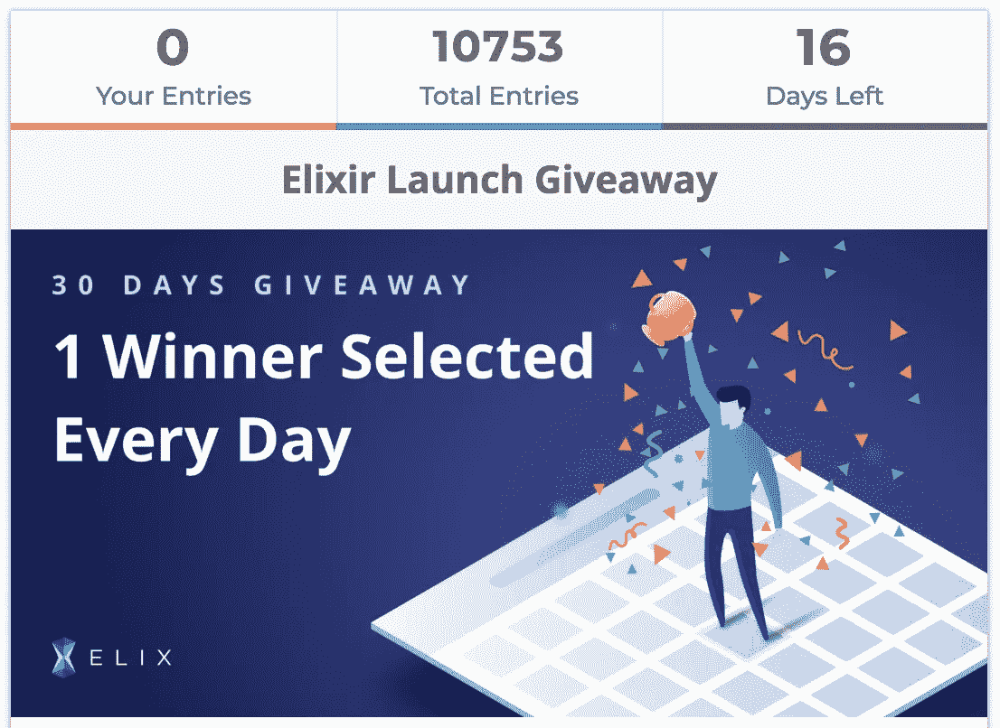
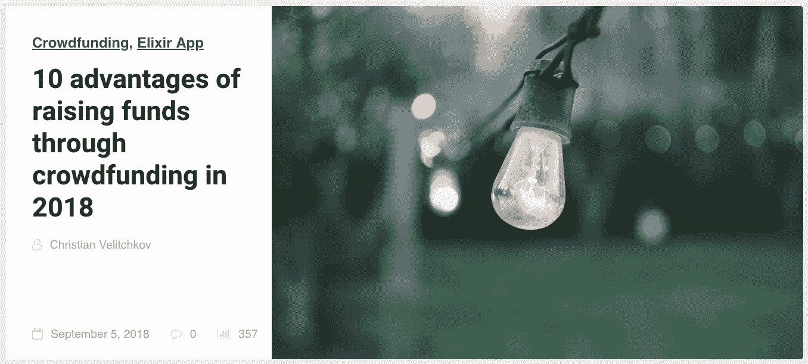

# 产品门户视频演示、营销奖金等

> 原文：<https://medium.com/hackernoon/product-portal-video-demo-marketing-bounties-more-673561f8abd0>

欢迎来到本周的更新！我们一直在努力改进 ELIX。本周，我们很高兴展示我们产品门户的视频演示，并宣布为创作视频和文章提供新的奖励。

**下载 ELIX**

**营销**

Click on the image to join the latest giveaway

我们很高兴地宣布，我们已经获得了超过 10，000 份赠品！如果你还没有参加赠品活动，你可以去 elixirtoken.io/giveaway[参加。随着我们在 Google 和 Appstore 内部有机增长的努力，我们正在不断改进这两个商店的应用描述和元数据。为了获得更多的曝光率和病毒式传播，我们将为用户创建内容:视频&博客提供奖励。
***视频— 1000 Elix***
要求:
1。制作高质量的视频回顾 Elix
2。说说在 App
***Blog—700 Elix***
需求:
1。写一篇 1000 字以上的相关的高质量文章。有链接到](http://elixirtoken.io/giveaway)[https://www.elixirtoken.io/](https://www.elixirtoken.io/)里面的文章
3。任何与 Elix 相关的话题:众筹、加密、区块链等
奖金:50 Elix 如果你在 Steemit、个人博客或网站上客座博文。最高质量的文章将获得 500 英镑的 Elix 奖金，并出现在 [blog.elixirtoken.io](https://blog.elixirtoken.io/) 上

要申领您的奖金，请发送电子邮件至[marketing @ elixirtoken . io](mailto:marketing@elixirtoken.io)并告知以下信息:
1。名称
2。链接到内容
3。Elix 地址
令牌将在 14 天内发送给符合条件的条目。

所有奖金的最大合并奖金金额为 50，000 Elix，因此请尽早提交您的视频和文章。请尽最大努力创建高质量的内容，因为这是 ELIX 社区的最佳写照。团队保留决定哪些内容是“优质”内容并相应分配奖金的权利。

到目前为止，我们对营销努力的结果很满意。从长远来看，优化关键词、创建内容和改进 ELIX 的可搜索性对于帮助创建者和支持者找到 ELIX 非常重要。这些努力已经开始得到回报。例如，如果你在 App Store 上搜索*众筹*，你会注意到 ELIX 目前排名在 Indiegogo 之上。

**应用改进**

点击这里下载 iOS [应用，点击这里](https://itunes.apple.com/us/app/elix/id1365242292?ls=1&mt=8)下载安卓[应用。](https://play.google.com/store/apps/details?id=io.elixirtoken.mobileee&hl=en_US)

在接下来的几周里，我们将使用 Ropsten 网络在我们的应用程序中添加和测试推送通知。这使我们能够在不使用 real Ether 或 ELIX 的情况下测试应用程序的功能。推送通知将使创建者和支持者保持最新状态。

**产品上传演示视频**

本周，我们很高兴能分享一个用于上传新产品的新门户网站的视频演示。看看这个视频，看看未来的上传产品会有多精简:

由于一些有问题的性能领域和服务条款的模糊性，我们决定不再使用谷歌的 Firebase 平台。我们目前正在用 MongoDB(一个 REST API)和 Amazon AWS S3 实现自己的媒体存储后端。我们的目标是让事情尽可能模块化，以最小化伸缩问题以及交换服务所需的重构量。随着区块链和其他去中心化解决方案的不断完善，这将让我们快速利用将来发布的任何有用的服务或平台。我们希望能够充分利用分散的基础设施，同时在短期内不会受到正在解决的扩展问题的限制。

**阅读我们的新博客文章**

Click on the image to check out our new blog article

如果你还没有，看看我们的新博客文章[2018 年通过众筹筹集资金的 10 大优势](https://blog.elixirtoken.io/raising-funds-crowdfunding/)。这篇文章详细概述了利用众筹将想法变为现实的优势。如果你有兴趣阅读 ELIX 与传统众筹公司的区别，请查看这篇关于令牌化竞争优势的文章。

这星期就这些了！请务必在我们的[主页](https://www.elixirtoken.io/)上注册该应用程序，并通过社交媒体在 [Reddit](https://www.reddit.com/r/elixirtoken/) 、 [Twitter](http://twitter.com/elixtoken/) 、 [Discord](https://discord.gg/mu4EJaz) 和 [Telegram](https://t.me/ElixirToken) 上进行连接。我们还有[脸书](https://www.facebook.com/elixirtoken/)和 [Instagram](https://www.instagram.com/elixtoken/) 页面，你可以在我们的[网站](https://www.elixirtoken.io/)底部注册订阅时事通讯。要创建自己的项目，请在此注册成为早期创建者[。敬请关注我们的中型博客](https://www.elixirtoken.io/boost)以获得令人兴奋的更新！