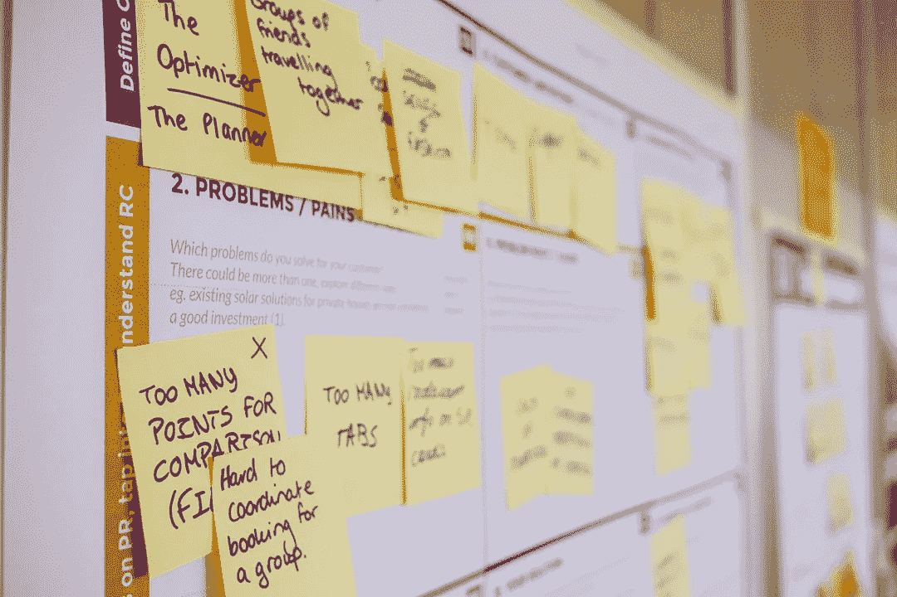

# 财富 500 强企业产品路线图优先顺序框架

> 原文：<https://medium.com/hackernoon/product-roadmap-prioritization-framework-of-fortune-500-companies-6a4c5cf3cc89>

经过几组案例研究，我得出了路线图的优先化框架，它将指导团队在按时完成路线图的同时，减少在最有价值的解决方案上构建不需要的功能的风险。

> *一个* [*产品经理*](https://hackernoon.com/tagged/product-manager) *的主要目标是将开发工作与* [*业务*](https://hackernoon.com/tagged/business) *目标和* ***目标结合起来，一份产品路线图*** *成为这个过程中至关重要的指导性文件。*

理想情况下，首先通过识别问题、确定解决方案的优先级，并确定每个解决方案的成功之处来绘制路线图。

# 1.认识到问题

在你开始绘制产品路线图之前，作为一名产品经理，你应该主动或被动地倾听你的理想客户，找出他们的问题。

在典型的 B2B SaaS 公司中，识别客户问题的最佳渠道是采取输入、

1.  直接来自客户——在论坛、活动或一对一访谈中与他们交谈。
2.  客户成功团队——没有人能比产品的客户成功团队给你更深刻的见解。
3.  支持票证—查看您的支持票证，与您的客户支持团队交流。
4.  测试版用户的反馈
5.  销售团队——了解您的潜在客户最希望解决什么问题。

一旦你确定了问题，根据以下因素对它们进行优先排序，

1.  严重程度 —疼痛有多严重？
2.  **问题的广泛性(E)**——这个问题在你的用户角色中出现的频率和程度如何？

# 2.确定问题的多种解决方案

一旦您确定了问题的优先顺序，请迅速与您的工程团队、设计团队和销售团队保持联系，并就解决这些问题的最佳方式征求意见。理想情况下，在一个组织中，产品经理试图创建解决方案，并向利益相关者推销 prd 以获得认同，但请记住，一个问题的多个解决方案总是比一个解决方案要好。

1.  **竞争优势(D)** —与竞争对手相比，该解决方案有多独特？
2.  **实施的成本** —构建解决方案所需的工程工作。
3.  **风险(R)** —技术风险，团队技能能力风险。
4.  **采纳障碍(A)** —解决方案被用户采纳的难度有多大？

根据优势因素、实施成本、涉及的风险因素和采用障碍对您的解决方案进行评分后，使用以下公式来确定在您的路线图中可能获得更高优先级的解决方案。

> ***(S+E+D)——(C+R+A)。*越高越好。**

# 在确定解决方案的优先级时，始终考虑用户的角色

永远记住你在为谁构建解决方案。在 B2B SaaS 业务中，从来没有一个人是你开发产品的对象。以下是多个角色，

1.  **用户角色**——主要使用你的产品的人。
2.  **购买者角色** —组织中做出购买决策的人。在大多数 B2B 用例中，用户可能不会做出购买决定。
3.  **内部角色** —例如，有时你必须投资解决开发团队的问题，这将帮助他们更快地发布新功能。
4.  **销售团队角色**——有时你需要想出能帮助你的销售团队快速销售你的产品的解决方案。

在确定解决方案的优先级时，一定要确保它能很好地适应上述所有角色。

# 规划解决方案时考虑产品所处的阶段

如果一个产品处于成长阶段，那么重点应该放在带来更多客户的特性/问题上。在规模化业务阶段，产品经理应该专注于保留客户并减少流失的功能/问题**。**

# 3.表演时间

一旦您对解决方案进行了评分和优先级排序，

1.  将它们添加到您的路线图中。
2.  把它们分成主题、史诗、用户故事和任务。
3.  分配故事点，以便您可以有效地跟踪开发速度。
4.  为路线图中的每一项定义 KPI。定义成功并计划保持倾听客户的措施。

***最终，路线图必须像《薄伽梵歌》或你的产品的圣经一样，有助于与最好的产品竞争并保持行业竞争优势。***