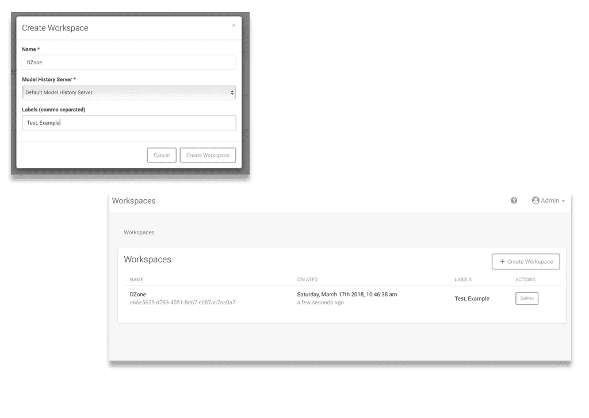
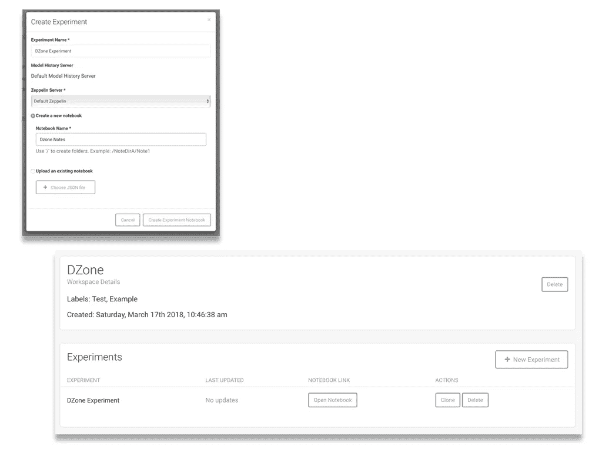
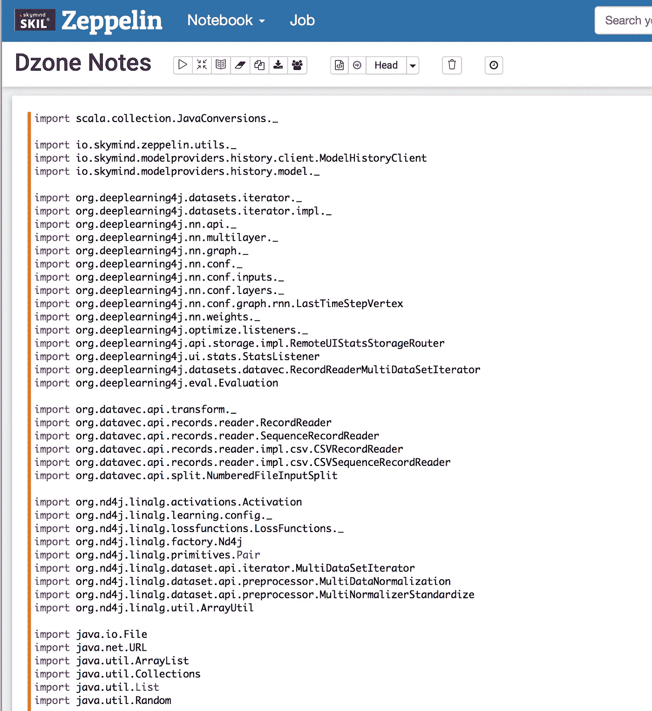

# 使用 Skymind 进行生产规模的深度学习

> 原文：<https://medium.com/hackernoon/production-scale-deep-learning-with-skymind-ea3ab3ee4fb7>

数据科学现在是任何数据密集型公司最需要的技能和资源之一，事实上，大多数公司都是如此。有无数的工具可以帮助你创建、接收、处理、分析和存储大量的数据。随着这些选项的增加，承诺让使用这些工具变得更容易的公司也在增加。

Skymind 结合了开源和定制工具，创建了两个主要工具链，可以与数据科学工具包中的其他常用工具很好地集成。

# 面向 Java 的深度学习

Eclipse Deeplearning4j 是一个为任何基于 JVM 的语言(但也包括 Python APIs)编写的分布式深度学习库，主要面向大规模商业用户。

它由子库组成，每个子库都有许多子功能:

*   **DataVec** 用于数据摄取、标准化和转换为特征向量。
*   **Deeplearning4j** 用于配置神经网络。
*   **DL4J-示例**用于图像、时间序列和文本的分类和聚类。
*   **Keras 模型导入**用于将训练好的模型从 Python 和 Keras 导入到 DeepLearning4J 和 Java。
*   **ND4J** for Java 访问原生库在 CPU 或 GPU 上处理矩阵数据。
*   **ScalNet** 是一个受 Keras 启发的 Deeplearning4j 的 Scala 包装器，运行在带 Spark 的多 GPU 上。
*   **仲裁器**用于帮助搜索超参数空间以找到最佳神经网络配置。
*   **RL4J** 用于为 JVM 实现深度 Q 学习、A3C 等强化学习算法。

# Skymind 智能层(SKIL)

作为一个自托管社区和 SaaS 选项，SKIL 是一个全面的产品，很难涵盖其全部，因为它是一个灵活的平台，具有多种输入、输出和组合。

不出所料，它支持 Deeplearning4j 以及 TensorFlow、Keras、DataVec、ND4J 和 RL4J，涵盖了导入、规范化和强化学习的混合。

community edition 和 enterprise editions 之间的差异出现在平台级别，community edition 允许有限数量的模型和工作区，这使得 community edition 适合于单个开发人员，但不适合团队。社区版还缺少用于控制机器人传感器的[躯体](https://skymind.ai/press/softbank)功能。

# 使用 SKIL

对于任何熟悉数据科学和机器学习的人来说，我上面提到的一些概念已经很熟悉了。但对于那些刚接触这一领域或想知道 Skymind 如何实现它们的人，这里有一个粗略的分类。

Skymind 需要 Red Hat Linux，但出于实验目的，使用以下命令在 Docker 容器中运行良好:

```
docker run --rm -it -p 9008:9008 -p 8080:8080 skymindops/skil-ce bash /start-skil.sh
```

您可以在一个工作空间中包含您用 Skymind 的 GUI 创建的每个项目(还有一个 CLI 工具)。



每个工作区都包含神经网络模型和数据管道实验，加上一个 [Zeppelin](https://zeppelin.apache.org/) 笔记本，帮助你测试设置在特定问题上的最佳工作。

通过点击 ***新建实验*** 按钮创建一个实验。



Zeppelin 本身可以保证一整篇文章，但总的来说，它是一个交互式笔记本，允许您试验代码并看到即时结果。初次运行可能需要一些时间，但结果(包括日志记录和错误信息)会显示在代码下方。



此时，您开始使用 DL4J API 来配置和使用神经网络。正如您所料，可用的选项很多，包括它如何读取、规范化和转换数据，以及过程中使用的优化算法。无论您使用哪种选项，这都会产生一个最终的数据源训练模型，然后保存到 SKIL。

此时，您可能会发现将数据可视化以了解其模式是非常有用的。 [SKIL 提供了一些可供考虑的选项](https://skymind.readme.io/docs/visualization)，包括 [TensorBoard](https://www.tensorflow.org/programmers_guide/summaries_and_tensorboard) 。

定义好模型后，您可以使用 SKIL 通过 REST API 端点来服务它，并将您的模型标记为可部署的或仍处于试验阶段。作为这一步的一部分，您还可以公开 ETL(提取、转换、加载)过程。

部署好模型后，现在就看您如何使用它了——可能是使用一个实时查询数据并对结果做出相应反应的客户端应用程序(SKIL 尤其适合基于 JVM 的客户端)。

# 采访 Skymind 首席执行官克里斯·尼科尔森

我只是简单介绍了 Skymind 平台的一些功能，所以要了解更多细节，我建议您深入阅读[文档](https://skymind.readme.io/docs)。为了更深入地了解这家公司，他们的起源故事和行业趋势，我采访了他们的首席执行官克里斯·尼科尔森。

*原载于*[*dzone.com*](https://dzone.com/articles/production-scale-deep-learning-with-skymind)*。*