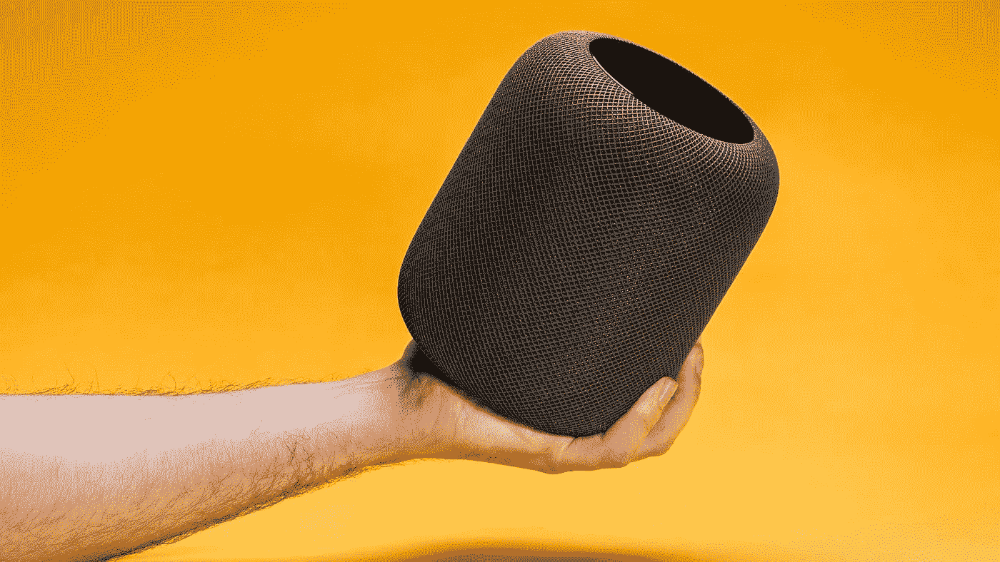
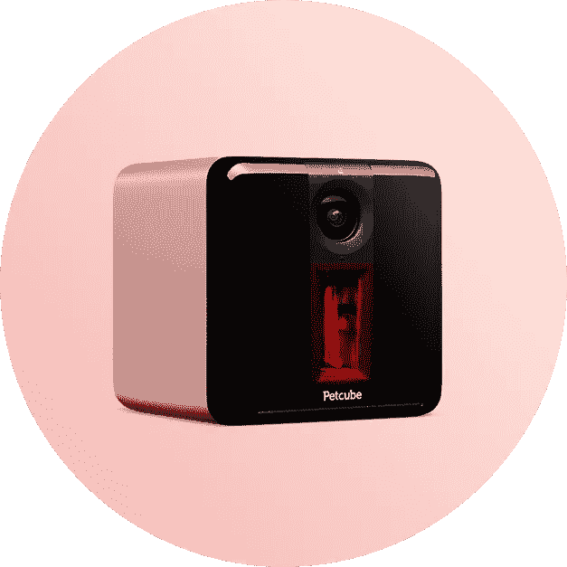
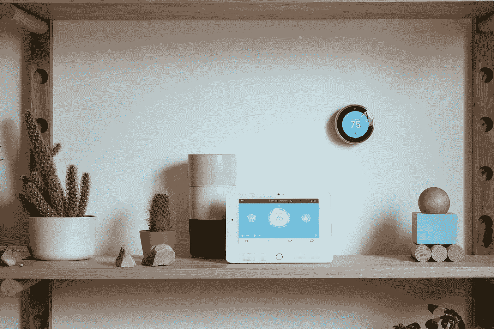
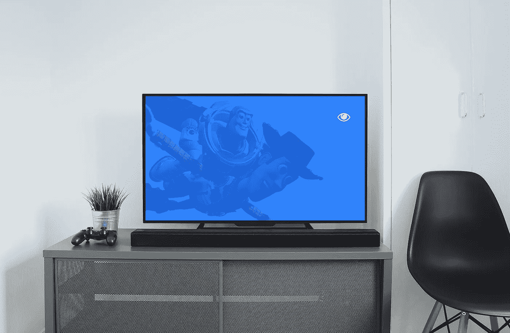

# 我在未来等待的产品

> 原文：<https://medium.com/hackernoon/products-im-waiting-for-in-futurestan-i1-e1487e6114aa>

## Futurestan 是我对未来产品的观点。我研究巨大的问题，并试图找到简单而有效的解决方案。这是关于一个相当大的问题的第一个小故事——“人工智能连接的家庭如何可能成为一个面向医疗保健的系统”。

A photo from “[How to prevent the Apple HomePod from staining your furniture](https://www.cnet.com/how-to/how-to-prevent-the-apple-homepod-from-staining-your-furniture/)” by Andrew Hoyle/CNET

智能家居解决方案已经成为家庭的惯例。这些产品现在已经有效地整合成一种习惯性的秩序。从用户体验的角度来看，它们公平、便宜、丰富(UX)。这就是为什么种子和扩展阶段被闪电战改变了——使用像 T2、亚马逊和 T3 这样的大型分销渠道进行扩展。这已经不是第一例了。每个人都知道[谷歌 x Nest 实验室](https://www.crunchbase.com/acquisition/google-acquires-nest-labs--adb351aa)和[三星 x SmartThings](https://www.crunchbase.com/acquisition/samsung-electronics-acquires-smartthings--2a1a56f7) 交易。

Petcube Play, Interactive Wi-Fi Pet Camera by [Petcube](https://petcube.com/play/)

随着新用例的出现，这一概念正在迅速发展。在 [Nest](https://nest.com/) 、 [August](http://august.com/) 、 [BuddyGuard](https://www.buddyguard.io/) 、 [SmartThings](https://www.smartthings.com/home-security) 继续专注于安全和报警的同时，一些产品如 [Petcube](https://petcube.com/) 、 [CherryHome](https://cherryhome.ai/products) 和 [Lighthouse](https://www.light.house/) 追求智能护理。正如 The Verge 所写的，“如果你有一位年迈的父母或祖父母独自生活，并且你想知道如果摄像头似乎没有移动，你会收到警报，这似乎也非常有用”。护理解决方案发展迅速。很可爱——他们已经在宠物身上验证过了。

这是一个巨大的利基市场。众所周知，不健康的生活方式是至少 60-70%的疾病的主要原因，根据世卫组织的数据。这是现代的一个祸害。在所有癌症病例中，只有 5-10%可以归因于基因缺陷，而其余 90-95%都源于环境和生活方式。在眼睛疾病的范围内观察到类似的情况，如近视。

Weed need a deep shift from a smart control to a smart care in consumer IoT paradigm, [a photo by BusinessWire](https://www.businesswire.com/news/home/20160105005586/en/Vivint-Smart-Home-Announces-Integration-Nest-Learning)

在当今世界的 73 亿人中，63%被认为需要视力矫正。生活方式因素[包括](https://www.ncbi.nlm.nih.gov/pmc/articles/PMC2515569/pdf/11095_2008_Article_9661.pdf)吸烟、饮食(油炸食品、红肉)、酒精、日晒、环境污染、传染病、压力、肥胖和缺乏运动。[到 2020 年](https://www.ncbi.nlm.nih.gov/pmc/articles/PMC2515569/pdf/11095_2008_Article_9661.pdf)，大约 1500 万新的癌症病例将被诊断出来。超过 21 亿人超重，占全球人口的近 30%。

Oh yeah, we need something just like this. Something like a smart camera with a design of HomePod, analysing a people’s lifestyle at home

在美国，癌症、糖尿病和心脏病造成了 1.1 万亿美元的生产力损失。所以想法很简单。我们需要家庭人工智能界面，关心人们是否有多余的不间断的狂欢观看(以防止眼睛和脊柱疾病)。监督不健康习惯并通知危险后果的[保健](https://hackernoon.com/tagged/healthcare)卫士。是时候给我们的孩子一个机会来预防脊柱侧凸、糖尿病等等。