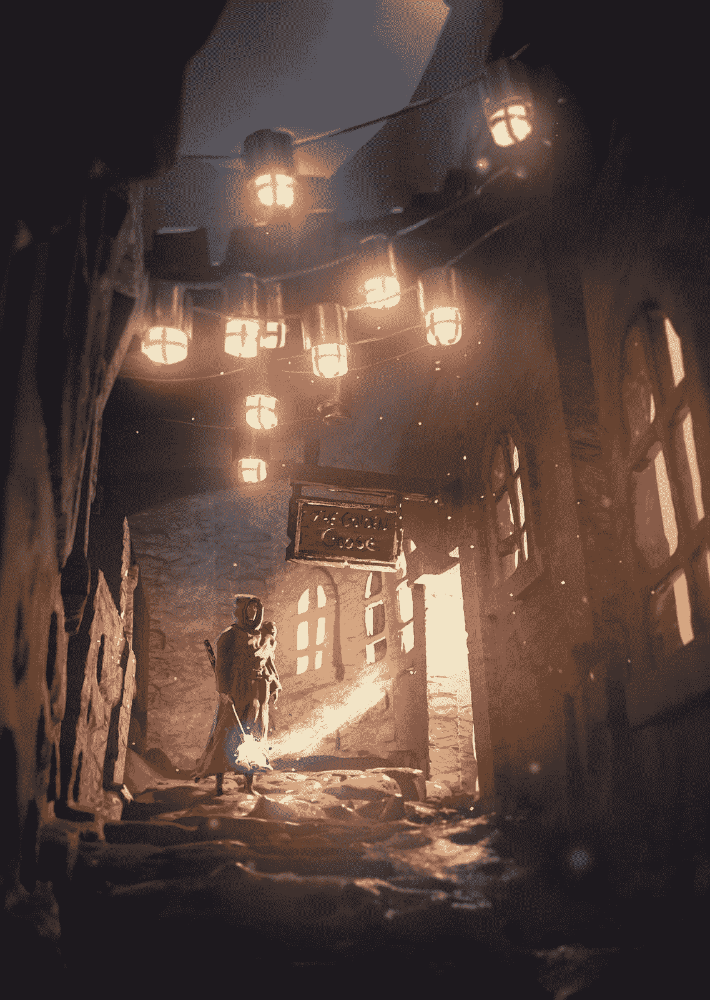

# 专业艺术家如何在虚拟现实中创作

> 原文：<https://medium.com/hackernoon/professional-artists-create-inside-virtual-reality-8e85f731f035>

[Martin Nebelong — Kitbashing](https://www.artstation.com/artwork/XBBZ33)

# 像 Martin Nebelong 这样的艺术家使用 MasterpieceVR 这样的虚拟现实工具为客户制作艺术品。

他说这些工具就像在他的速写本和 iPad Pro 上画草图一样直观。客户通常要求高质量的、身临其境的、可投入生产的资产，而 Martin 提供了这些资产。

置身于三维空间有助于他沉浸在自己的创作流中。他的直觉提高了，所以他能够在不丢失细节的情况下进行大规模的创作。

当我看他的作品时，我对这种规模感感到敬畏，类似于在大电视上观看老西部电影中平原的广角镜头的感觉。这种感觉类似于体验一款视频游戏《巨像之影》,在这款游戏中，你是一个非常渺小的人类，却面对着巨大而威严的巨人。

让我们来看看马丁的艺术，感受一下他的流程和过程。

## 虚拟现实艺术工具非常适合创造沉浸感

让我们来看看马丁的作品之一，[暗巷](https://www.artstation.com/artwork/3DKPB)。这是神奇的，现实的，并有一个惊人的观点和存在感。看着背景和建筑的入口，你可以感受到一种尺度感，同时也可以看到魔术师的细节和情感。

还有[会议](https://www.artstation.com/artwork/G4vva)。你可以在这里看到这个音阶，这首曲子表现得很美，营造了一种不祥的气氛。马丁将其描述为一部黑色电影。这里有很多要解读的。右边的那个人是在设伏还是在策划抢劫？

马丁对这两件作品采用了相似的流程。让我们稍微深入一下这个过程。

## VR 美术工具对于前期制作也很棒

Martin 首先在 MasterpieceVR 等工具中构建原型。有时他会使用参考图像，有时不会。本质上这是他的前期制作阶段。

然后，他通过强大的桌面渲染和后处理工具(如 ZBrush 和 Marmoset)导出他的资产，调整照明等元素，并将东西打磨好，准备交付给客户。

以下是 Martin 提供的完整工具列表:

虚拟现实前期制作工具

*   [MasterpieceVR](https://www.masterpiecevr.com/)
*   [Oculus Medium](https://www.oculus.com/medium/)
*   [羽毛笔](https://www.oculus.com/experiences/rift/1118609381580656/)

后期制作工具

*   [ZBrush](https://pixologic.com/)
*   [狨猴工具包](https://marmoset.co/toolbag/)
*   [物质画家](https://www.allegorithmic.com/products/substance-painter)
*   [按键](https://www.keyshot.com/)
*   [Photoshop](https://www.adobe.com/products/photoshop.html)

如果你是像 Martin 一样的专业艺术家，并且了解行业标准的后期制作工具，那么在 VR 中开始前期制作将增加你的艺术沉浸感并节省你的时间。

马丁希望艺术家在虚拟现实中学习，并发展他们自己的生产流程。他致力于教艺术家如何使用虚拟现实进行前期制作，创建新的教程，并展示 MasterpieceVR 的雕刻和敲击结果。

也许虚拟现实也将使艺术家更容易与他们的客户合作。也许有一个[未来](https://hackernoon.com/tagged/future)人们将在虚拟现实中绘制、编辑、给出和接受对他们工作的反馈。你可能会喜欢他在 Oculus Connect 5 上的演讲。

如果你是一名专业艺术家，考虑将虚拟现实融入你的前期制作。虚拟现实将增加你的艺术沉浸感，节省你的时间，并帮助你发展你的业务。另外，你会玩得很开心。