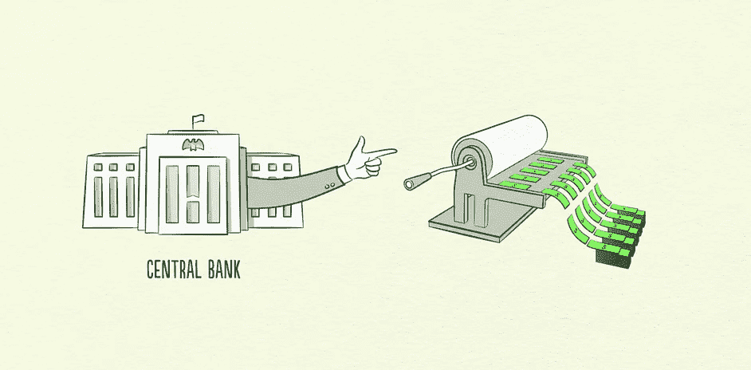
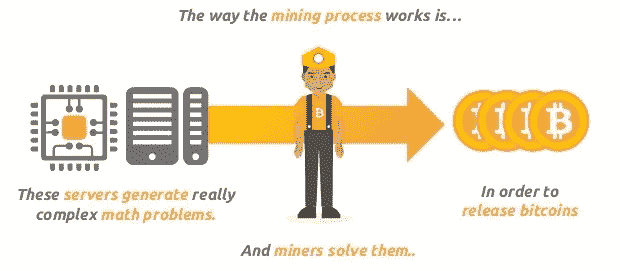

# 程序化货币政策:区块链作为中央银行

> 原文：<https://medium.com/hackernoon/programmatic-monetary-policy-blockchain-as-central-bank-fa787b51ef8a>

The current and the new…

## 今天的货币规则是由相对较小的一群人关起门来制定的。如果金钱的规则是开放的，共享的，并受到更多参与者的影响，会发生什么？

我们今天的货币体系结构取决于少数政治和经济人物的决定。如今，大多数全球货币都是基于“法定货币”，这意味着它们没有另一种商品或有价值商品的支持。它们的价值来自于被政府接受的税收和服务的内在效用，以及我们对它们作为交换媒介和价值储存手段的信任。它们的供给是由各国央行和金融体系创造和控制的，金融体系由一小部分从这些央行借款的政府监管银行组成。这些受监管的银行然后把钱贷给推动经济发展的个人和企业。这就是我们今天生活的环境，但区块链科技提出了一个可能的替代未来，在那里货币政策的决策和控制可以进一步与政治决策和控制分开，并由一个更大的群体做出。

下面我将民族国家支持的货币模式(以美元为代表)与“加密”货币(如比特币)在几个方面进行了比较，试图回答以下问题。

问题:

*   **供给:**货币供给是如何确定的？
*   **投放:**资金是如何注入系统的？
*   谁监管系统中的普通人？
*   交易:金钱是如何交易的？费用由谁承担？
*   **受益人:**福利在系统中的什么地方累积？

# 民族国家支持的货币

我们每天都在使用国家支持的货币。下面的讨论将集中在美元，但偶尔也会深入到信贷系统，因为在货币系统的运作中，信贷系统有时与现金密不可分。

**供给:**货币的供给由美联储决定。美联储通过买卖政府债券来改变供给，从而改变银行从美联储借钱的利率。商业银行然后把钱借给企业和个人。由 12 名经济学家组成的联邦公开市场委员会决定何时以及如何买卖证券，并通过利率实际上改变货币的“供应”。他们的目标是恒定的通货膨胀率，随着时间的推移，货币贬值，从而推动消费。

**投放:**货币通过从中央银行向商业银行贷款，进而从商业银行向个人和企业贷款，进入金融体系。这些贷款都有一定的利率，借款人必须偿还。这导致了“债务型”经济。

**保管人:**虽然美元可以存放在你的床垫里，但大多数拥有可观资金和固定收入的人会选择将其存入银行账户。这提供了额外的好处——银行通常与向投资者提供回报的股票和债券等其他金融产品相连，它们允许我们与人们进行远距离的电子交易。

**交易:**对于那些把钱存入银行账户的人来说，不同银行账户之间的交易可以通过持有银行间账户的票据交换所以电子方式完成。信用卡系统也允许我们远距离即时进行电子交易，但也有其自身的成本。银行、票据交换所和信用卡系统承担保护这些交易的成本，这表现在几个方面:

*   交易结算时间:在另一家银行汇款给另一个人时，交易通常需要 2-3 天才能完成。这是因为票据交换所每隔 2-3 天才结算一次银行间的账户，如果它们以更快的速度结算，成本会高得惊人。
*   账户最低限额:如果你没有在账户中存入一定数量的钱，在你存储这些钱的时候，他们可以借给别人，那么为你保护交易就不值得银行浪费时间。只要有很大一部分客户没有试图马上退出，这个系统就有偿付能力。
*   每笔交易的实际成本:有时交易本身有实际成本，如电汇或汇票。
*   信用卡费用:商家为信用卡交易的速度和可靠性买单，每笔交易收取 3%的费用。

送实际现金，交易成本非常高。你需要使用一张汇票，根据汇款金额，可能要花费 5 美元或更多。或者你可以使用邮政系统，这需要几天的时间，而且会有现金被盗的风险。

**受益者:**在这种环境下，任何拥有资金和放贷能力的实体都将受益。商业银行可以从美联储借钱，然后以更高的利率将钱贷给企业和个人。他们从差价中赚钱。

# 比特币

比特币是全球最知名的[加密货币](https://hackernoon.com/tagged/cryptocurrency)，使用运行比特币协议的计算机网络运行，所有计算机共享一个地址数据库(类似于账户)和每个地址的比特币数量。该协议规定了一种“工作证明”算法，计算机使用这种算法来达成对有效交易的一致意见。

**供应量:**比特币的供应量上限为 2100 万比特币，可预测的发行时间表从 2009 年开始，一直持续到 2140 年。这是由比特币协议的算法设定的，不会改变，除非大量运行网络的计算机(超过 50%的计算能力)决定篡改它，并在记录每个地址(地址类似于银行账户)持有量的区块链中创建一个“分叉”。

**安置:**资金通过一个叫做“挖掘”的过程注入系统。挖掘由比特币网络上的计算机完成，这些计算机负责验证交易，并确保任何地址的金额都不会被篡改。当单个计算机成功验证一组交易并向网络证明该验证时，它会收到一笔奖励比特币到指定地址，从而增加比特币的供应量。这种奖励随着时间的推移不断缩水，直到 2140 年停止，届时将有 2100 万个比特币在流通。

**保管人:**地址的个人所有者负责安全地存储这些地址的私钥，这允许他们使用与这些地址相关的比特币。这些所有者可以将他们的私钥保存在纸上、脑子里或硬件设备上。这类似于在你的床垫下存放美元，但更方便，因为钱被有效地缩减为一串字符的大小，并且它可以在个人可以访问互联网的任何地方被访问。个人也可以选择将他们的比特币转移到交易所或第三方托管机构，由后者为他们持有私钥。

**交易:**交易在 1–2*小时*内完全结算，具体取决于给定时间内广播的交易数量。比特币和其他加密货币协议正在努力通过新的更快的共识机制来加快这一速度。采矿计算机通过它们用来执行计算“工作”的能力来承担保护这些交易的成本，但是通过由发送交易的地址支付的程序奖励和交易费用来补偿。

**受益者:**对交易进行验证的矿用计算机的所有者是该系统的受益者，他们用运行计算机的电力成本换取比特币。这些采矿者类似于银行和票据交换所，因为他们验证双方之间的交易，除了两个关键的区别:1)采矿计算机都相互竞争来验证交易，迫使每台计算机工作得更快，费用更低，2)采矿计算机只验证交易，它们不像商业银行那样取得贷款或发放贷款。

# 以太坊

以太坊是一种比比特币晚几年出现的协议，为公共区块链的理念带来了新的创新。以太坊即将推出的改进之一叫做“利害关系证明”共识算法。这种算法取代了采矿计算机花费电力来验证交易的需要。“利益相关者”不使用计算能力，而是用以太(以太坊的“货币”)的赌注来验证交易。理论上，这将使交易更快，并降低比特币等协议的高功率要求，这些协议利用“工作证明”共识算法。下文将考虑在以太坊中实现股权证明的未来，以提供比特币货币系统的对比视图。

虽然以太坊除了作为一种货币之外还有其他效用，但下面将只讨论协议作为一种货币系统的特征。

**供应量:**以太坊的供应量与比特币不同，没有上限。每年乙醚的供应量都会上涨 2%。理论上，这确保了乙醚在系统中持续流动，因为单个单位的价值会随着时间的推移而慢慢被侵蚀。

**投放:**资金通过“赌注者”注入系统。这些以太持有者的行为就像矿工一样，但他们不是使用计算机能力进行复杂的数学运算来验证交易，而是“下注”一定数量的硬币，如果他们被发现验证欺诈交易，这些硬币将被没收。如果他们诚实，这些赌注者中的一个会获得交易费和推动 2%通胀的少量以太奖励，就像成功验证一笔交易的比特币矿工一样。因此，资金通过拥有大量乙醚的个人进入系统，这些个人将他们的部分财富押在大宗交易上。

保管人:就像比特币一样，个人所有者负责保管他们的私钥，或者将它们存放在他们信任的第三方。他们仍然拥有互联网的所有便利和可访问性，并且从技术上讲，无论他们去哪里，他们的以太都与他们在一起——不需要回到家从他们的床垫中取出以太。

**交易:**交易由“利益相关者”核实，他们只承担风险成本，如果他们进行欺诈行为，可能会失去他们的股份。这个系统中的交易可以是近乎即时的。

**受益者:**这个货币体系的受益者是那些持有大量乙醚的人。这些玩家将能够下大赌注来验证大宗交易，只要他们诚实，就能通过这样做获得持续收入，就像矿商利用比特币一样。在这个系统中，富人通过验证交易变得更富。

# 货币的新范式

今天的货币体系是由经过挑选的少数经济学家和政治家操纵的，有些是选举产生的，许多是任命的。这些政策是在没有社区参与的情况下关起门来制定和改变的，而这个系统所创造的利益归那些提供贷款并保护整个系统的政府和银行所有。

然而，货币体系是一种技术，它们不需要以这种方式构建。

未来的货币体系可能独立于今天存在的任何民族国家，并由该体系的参与者直接统治。规则可以是透明的和可预测的；由相互竞争的计算机或验证机的商品化市场而不是银行的寡头垄断所保证的交易；货币的价值由每个使用者决定，受政府法定控制的影响较小。今天有许多治理、技术和政治变革的问题正在研究，以进一步采用这一系统，但我们今天在比特币等加密货币方面的技术正在为更加平等、公正和迷人的明天奠定基础。

***喜欢这首曲子吗？请给几个掌声！想了解更多关于区块链如何重塑金融和货币体系的信息，请跟我来。***

图像归功于:

*   [经济机器如何运转](http://www.economicprinciples.org/economic-principles/index.html)
*   [Minerjet.com](http://minerjet.com/)