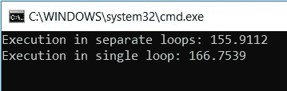

# 编程:如何通过了解 CPU 缓存级别来提高应用程序性能

> 原文：<https://medium.com/hackernoon/programming-how-to-improve-application-performance-by-understanding-the-cpu-cache-levels-df0e87b70c90>

> CPU 缓存是计算机中央处理器(CPU)使用的硬件缓存，用于降低从主内存访问数据的平均成本。高速缓存是一种更小、更快的内存，更靠近处理器内核，它存储来自经常使用的主内存位置的数据副本。大多数 CPU 都有不同的独立缓存，包括指令和数据缓存，其中数据缓存通常由多个缓存级别组成。

# CPU 缓存级别:

## 一级缓存

L1 缓存驻留在每个内核中。这是最快的可访问内存。L1 高速缓存分为以下两种类型:

**指令缓存** —存储可执行指令，使取指令操作更快。

**数据缓存** —存储要处理的数据，加速数据提取操作。

## L2 高速缓存

L2 缓存比 L1 缓存大且慢。它位于内核或主板中。最新的英特尔酷睿处理器将 L2 高速缓存与 L1 高速缓存集成到了内核中。

## L3 缓存

它是最大的缓存，位于核心之外。访问三级高速缓存比 L2 高速缓存慢，因为它更大，处理器必须搜索三级高速缓存中的所有可用数据。

## 英特尔酷睿 i7–4770s 处理器

Intel® Core™ i7–4770S processor internal die photograph

在英特尔酷睿 i7–4770s 处理器中，L1 高速缓存和 L2 高速缓存集成到内核中，三级高速缓存驻留在处理器中。

## 命中率和失误率

> 从缓存中成功获取数据称为命中率。
> 
> 从缓存中不成功的提取被称为未命中率。

如果处理器在 L1 缓存中找不到它要找的东西，那么这就是 L1 缓存的未命中率。然后处理器前进到 L2 高速缓存并寻找数据。如果数据可用，则处理器将使用它，或者处理器将前进到 L3 进行数据查找。

同样，如果数据在

# CPU 缓存对编程的影响

考虑下面的 C#代码

上述代码以两种方式处理某个字符串。它必须完成以下操作:

1.  对于给定的循环次数，将给定的字符串追加到字符串生成器中。
2.  方法“*GetStringByCombinedExecution*”在同一个循环中将字符串追加到两个字符串生成器中，并打印以毫秒为单位的时间。
3.  方法"*getstringbyperateexecution*"在不同的循环中将字符串追加到两个字符串生成器中，并打印以毫秒为单位的时间。

让我们将*循环计数*的值设置为 10，下面是结果。它显示了组合执行比单独执行更快。

让我们将*循环计数*的值设置为 100，结果如下。这些数字给出了不同的结果，现在分开执行更快了。

让我们将*循环计数*的值设置为 1000，结果如下。单独执行更快。

让我们将*循环计数*的值设置为 10000，下面是结果。单独执行快了 10 毫秒。

> 发生什么事了？为什么只是通过拆分执行，数字就不一样了？
> 
> **因为 CPU 缓存。**

在组合执行的情况下，两个字符串生成器对象在 L1 缓存中可能并不总是可用。因此，它增加了未命中率，命中率将下降，这导致处理器需要更多的 CPU 周期来完成操作。

虽然执行是单独发生的，但命中率会很高，因为该过程只发生在字符串生成器的单个实例上，它将在 L1 缓存中可用。因此处理器能够在更少的 CPU 周期内完成操作。

# 结论:

这些循环是不可避免的，必须在日常的[编程中实现。最近我在工作中做了一个性能优化。由此我了解到我的](https://hackernoon.com/tagged/programming)[应用程序](https://hackernoon.com/tagged/application)的效率与我做的 PoC 相比非常慢。我的应用程序中唯一的变化是，我在同一个循环中用不同的对象做了更多的操作。因此，经过长时间的研究和分析，我开始将操作分割成单独的循环，这实际上极大地提高了我们应用程序的性能。在我们将所有操作分解成单独的循环后，我们从 10 秒下降到 200 毫秒，这促使我写了这篇文章。