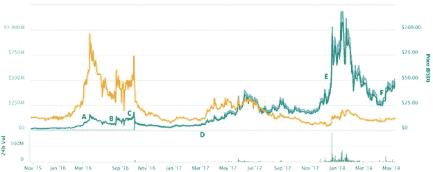
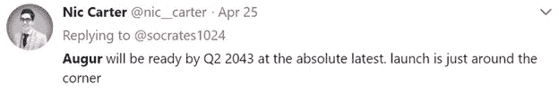

# 进步与过程——对“附加”效用令牌估值及其未来的思考

> 原文：<https://medium.com/hackernoon/progress-vs-process-thoughts-on-appended-utility-token-valuations-and-their-future-1e4d0b2eadcd>

这是一系列文章中的第一篇，详细介绍了“附加”代币、公用代币估值、智能设计和证券转换的未来。

> “朝着高处的奋斗本身就足以填满一个人的心。人们必须想象西西弗斯是幸福的。”~阿尔伯特·加缪

寻找意义是徒劳的，正如寻找加密资产的适当价值也是徒劳的。数十亿美元的市值建立在投机的基础上，但随着项目达到顶峰，推动定价的投机会消退吗？将加缪关于荒谬的思想引入争论:在这种情况下，荒谬的概念并不要求超越(*或成品*)，因为这本质上会导致资产的自杀。项目中存在完成的危险，因为其资产的交易价值由于其在[应用](https://hackernoon.com/tagged/application)中的角色而减少。它不是货币，是用来消费的。

退一步说，我指的是通过 ICO 筹集资金的项目，以便在它们的应用程序中实现分散的特性集。ICO 带有一个应用程序专有的令牌，该令牌将在所述应用程序中使用(*希望？*)。作为项目筹资的回报而被授予的资产本身实际上可能在提供任何形式的效用之前就已经在交易了。这种情况在这个领域已经出现了无数次，因为一些甚至不含公用设施的资产的估值已经超过了 1 亿美元、2 亿美元等等。

对于那些不知道的人来说，存在主义思想家的英雄西西弗斯注定要重复他的动作，永远把一块大石头滚上山，只在接近山顶时让它滚下来一次。这是由于他作为科林斯残暴统治者的本性，他对塔纳托斯(*或哈迪斯，取决于版本*)的诡计，以及在冥界对珀尔塞福涅的诡计。上帝认为他们的惩罚是聪明的，因为西西弗斯注定永远处于这种徒劳的状态。然而，就是在这种徒劳中，意义被引出，或者说，*值被导出*。如果西西弗斯真的能够完成他的任务，除了永恒本身，他还能剩下什么呢？

对于大多数附加资产来说，项目完成是一件危险的事情，因为项目的进展是它们爆炸式增长的原因。

Scaled Image of a Project Pushing Their Rock (Pixabay)

## 进步——当前的价值驱动因素

> “朝着里程碑的奋斗本身足以填满一个人的心灵。人们必须想象包持有者快乐。”

我要说的是，我们目前认为的大多数附加效用令牌的价值在本质上往往是西西弗式的，其中*进展*决定价格——而不是*过程*。简单地说，*过程*是产品的先导，而*过程*是产品的行动。

我们无时无刻不在看到进步，无论是合作关系的宣布、alpha 里程碑、功能发布，甚至是社区活动。甚至[一个公告的公告](https://i.imgur.com/D8MNqTT.png)也足以作为一个进展的指标，因为这只是一个为了到达山顶而激怒社区的另一个里程碑的举动。

**这里的关键字是追加的**——进入*流程*环节，没有效用令牌的业务还能存在吗？或者令牌是产品模型的组成部分。它能被美元或乙醚替代吗——或者它是否需要为平台的成功而存在。

进步是推动社区不仅仅是对资产的直接投机，而是对交付日期的投机，以便预测或捕捉资产价格的上涨。这与实际交付无关，而是对交付的预期——即使延迟。一个有前途的项目的进展。

然而，流程是与“照常营业”相关的恐惧这是一个企业已经达到其运营阶段的阶段——在这个阶段，不管象征意义如何，它都可以自我维持，并且更加关注自己的收入，从而导致发展、潜在的收购或收购。

虽然对一家企业的股东来说，买断或收购可能被认为是美妙的，但对于一家拥有公用事业权的企业来说，这可能被证明是极其危险的。例如，公用事业权标并不授予持有者任何股权或治理权，因此在收购的情况下也没有财务利益。公用事业权标持有人在任何业务流程中都没有权利(尽管他们通常认为自己是拥有权利的“投资者”)，如果收购机构终止权标的功能，可能会发生黑天鹅事件。如果企业已经开发出一种可以独立于令牌化系统而存在的技术，为什么还要继续使用令牌呢？代币给收购公司带来了一点负面影响，它需要学习新的沟通策略，也增加了社区管理人员。

收购企业的公司可能不想处理社区不断的即时满足要求，甚至可能清算公司持有的非常普通的国债，以便在围绕收购的投机中快速获利。这不仅会扼杀估值和社区持有人，而且是终止令牌的一种快速而肮脏的方式。

这不是关于最后阶段，因为那会扼杀估值，而是关于通往最后里程碑的似乎永无止境的旅程。

## 证券——走进荒野

但是令牌化的安全性呢？这是一个新的圣杯，从[那些](/@apompliano/the-official-guide-to-tokenized-securities-44e8342bb24f)那些[看到](https://twitter.com/brucefenton/status/987340686327345152?ref_src=twsrc%5Etfw&ref_url=https%3A%2F%2Fmedium.com%2Fmedia%2F8ef38754a9a09f9729997ceafd47a309%3FpostId%3D8526634a9230)那些[看重](https://blog.icoalert.com/why-security-token-offerings-could-be-the-next-big-crypto-megatrend-3072d544a796)那些[他们](https://hackernoon.com/security-tokens-are-doa-8ba1bb9f9368)那里得到了无尽的支持？一种可能支付股息、代表公司股权、代表资产或提供公司治理权的代币。这可能是附加实用程序令牌的最终结果。

但是在*进程*的情况下，可以对这些附加的令牌做些什么呢？

附加的实用令牌不需要逐渐消失，而是不断发展。一旦一个特定的附加公用事业权标的价值由于系统的成熟而贬值，一个影响深远的企业回馈的*例子可以是通过转换过程授予公用事业权标持有人股权。*

但是等等，这不是一个安全的例子吗？

*为什么是的，是的。*

作为一个“感谢启动网络”的例子，一个附加令牌的绝唱可以以股权授予持有者的形式出现。例如，假设我们有一个 Example Corp 和他们的 ExampleCoin (EXC)。EXC 有 1，000，000，000 股供应，当公司达到一个特定的里程碑或收购点时，注定会逐渐消失。作为“对网络自举的感谢”，这样的公司可能会拿出一小部分股权来代表这 1，000，000，000 个代币，并允许持有者通过 KYC 和燃烧过程来转换代币。这些新的示例 EquityCoins (EEC)将代表权益的百分比，因为 EXC 的功能逐渐消失或停止(支点确实发生)。

虽然影响深远且充满法律分歧，但另一种选择可能是通过另一个平台实际赋予您的令牌功能。例如，Example Corp 的创始人可能会出售他们的业务，但会创建一个新的企业或平台，并将 EXC 作为其本地令牌。EXC 可能不会消失，但在 Example Corp 的收购者希望终止令牌的原始功能的情况下，它需要某种形式的支持来维持。

老实说，我不认为我们已经解决了这个问题，因为这个领域仍然处于萌芽状态。随着越来越多带有附加符号的项目完成，我觉得似乎会有更多的思想进入这个主题。

## soon——超越流行语

Soon 已经用来描述该领域的大量项目。错过某些截止日期(尽管令人恼火)或推迟发行可能被视为一个积极因素，因为有更多的缓冲来继续炒作，在更多的交易所上市，并获得更多的关注。

考虑到整个空间的钟表性质是扭曲的,《占卜》是这种形式的永无止境的秘密时间旅行的一个很好的例子。这并不是说他们没有创造不可思议的东西，也不是说 REP 是一个“附加的”令牌，但这只是对令牌估值的一种思考。由于这种过程上的进步的概念，对 Augur 的本地令牌 REP 的评估纯粹是爆炸性的。随着时间的推移，代表的价值是交易所上市和总体市场趋势的结果，而不是功能。截至目前，REP 仍然没有任何功能，因为 Augur 最近刚刚完成了他们的合同审计，正在慢慢进入部署阶段。

就其估价历史而言，以下峰值样本与以下事件相关:

REP’s Price History — (CoinMarketCap)

**答:【2016 年 3 月——第一个测试版的 Augur 在以太坊测试网上发布。**

**B.** 夏季加密货币牛市，大部分资产普遍上涨。

**c .**2016 年 10 月—代表在 Poloniex、Bittrex、Shapeshift 和北海巨妖上市—代币分发给所有者。

**d .**2017 年夏季 altcoin 挤兑，大部分资产普涨。

**e .**2017 年冬季牛市，大部分资产普涨。

**f .**2018 年 5 月—奥格在币安上市。

让我们回顾一下它的历史，在 2015 年夏天，Augur 进行了象征性的销售，并有效地筹集了大约 550 万美元来建立一个[分散预测市场](https://finance.yahoo.com/news/augur-ahead-one-oldest-icos-050054809.html)。REP 的 value post platform-success 尚未确定，因为它们将于 7 月发布。

Nic Carter on Augur’s Release Schedule

**是智能设计，不是附加设计—**

事实上，像 REP 这样优秀的实用程序设计避免了“过程”问题，因为它们是由参与社区而不是企业管理的，并以参与社区为中心。举几个例子，ZRX 的协议治理、的注册管理机构投票、对戴的裁决，甚至的保留设计。这些类型的资产很可能会持续下去，因为它们不会受到附加令牌所附着的相同力的影响。更智能的代币带来更健康的市场生态系统。

考虑到“[区块链](https://hackernoon.com/tagged/blockchain)革命”正开始影响机构，关于收购、追加估值和智能代币设计的讨论也开始升温。然而，为了达到临界质量，我们需要首先看到一家附带令牌的公司被收购，并观察以下情况:

1.  原始令牌是什么
2.  如果“国库”存在的话，它去了哪里
3.  导致宣布收购的价格行为
4.  创始人收购后的伦理问题

那些声称“时间还早”的人没有意识到我们已经走了多远。我们一直在为公用事业代币创造估价系统，但是我们创造了反映未来商业事件的模型了吗？从我们目前在加密货币时间轴上所处的位置来看，市场情绪仍有更大的力量。

***

*特别感谢* [*马特*](https://www.linkedin.com/in/matthew-garza-pharmd-5bb02a61/) *，* [*雅各布*](https://twitter.com/chaingenius) *，* [*凯文*](https://chainintelligence.io/) *，* [*特拉维斯*](https://twitter.com/travis_kling) *为本贴提供反馈。*

本文中的任何内容都不应被视为法律或投资建议。