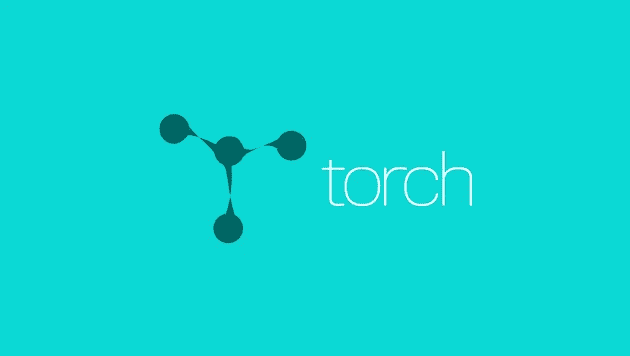

# 渐进式工具——人工智能的 10 大框架和库

> 原文：<https://medium.com/hackernoon/progressive-tools-10-great-frameworks-and-libraries-for-ai-b90931039807>

[人工智能](https://dashbouquet.com/blog/web-development/machine-learning-and-ai-trends-for-2018-what-to-expect)存在已久。然而，由于这一领域的巨大进步，它近年来已经成为一个流行词。

人工智能曾经被认为是完全书呆子和天才的领域，但由于各种库和框架的发展，它已经成为一个更友好的 it 领域，有很多人进入它。

在这篇文章中，我们将关注用于人工智能的高质量的库，它们的优点、缺点以及它们的一些特性。

让我们深入其中，探索这些人工智能库的世界。

# 张量流

**“使用数据流图进行可扩展机器学习的计算”**

## 语言:C++

## 84 725 ★

当进入人工智能领域时，你会听到的第一个框架是 Google 的 TensorFlow。

TensorFlow 是一款使用数据流图进行数值计算的开源软件。这个可爱的框架以其架构而闻名，它允许在任何 CPU 或 GPU 上进行计算，无论是在桌面上，服务器上，甚至是移动设备上。这个框架在 Python 编程语言中是可用的。

TensorFlow 基本上做的是对数据层进行排序，我们可以称之为节点，并根据它获得的任何信息做出决策。[看看这个](https://www.tensorflow.org/)！

## 优点:

*   使用像 Python 这样简单易学的语言。
*   使用计算图形抽象。
*   用于可视化的张量板的可用性。

## 缺点:

*   它很慢，因为 Python 不是最快的语言。
*   缺乏许多预先训练的模型。
*   不是完全开源的。

# 微软 CNTK

**《开源深度学习工具包》**

## 语言:C++

## 13 516 ★

我们把这叫做微软对谷歌 TensorFlow 的回复吗？

微软的计算网络工具包是一个库，它增强了计算网络分离的模块化和维护，提供了学习算法和模型描述。

在运营需要大量服务器的情况下，CNTK 可以同时利用许多服务器。

据说它在功能上接近谷歌的 TensorFlow，然而，它比 TensorFlow 快一点。[在这里了解更多](https://github.com/Microsoft/CNTK)。

## 优点:

*   它非常灵活。
*   允许分布式培训。
*   支持 C++、C#、Java 和 Python。

## 缺点:

*   它用一种新的语言实现，网络描述语言(NDL)。
*   缺乏形象化。

# Theano

**“数值计算库”**

## 语言:Python

## 7 550 ★

作为 TensorFlow 的强大竞争对手，Theano 是一个强大的 Python 库，它允许高效地进行涉及多维数组的数值运算。

该库透明地使用 GPU 而不是 CPU 来执行数据密集型计算，从而提高了操作效率。

出于这个原因，Theano 已经被用于支持大规模计算密集型操作大约十年了。

然而，在 2017 年 9 月 28 日，宣布在 2017 年 11 月 15 日发布的 1.0 版本之后，将停止对 Theano 的主要开发。

这并不意味着它在任何方面都不是一个强大的库。你可以随时随地用它进行深度学习研究。[在此了解更多信息](https://github.com/Theano/Theano)。

## 优点:

*   针对 CPU 和 GPU 进行了适当的优化。
*   对数字任务有效。

## 缺点:

*   与其他库相比，原始的 Theano 水平有点低。
*   需要与其他库一起使用，以获得高层次的抽象。
*   AWS 上有点 bug。

# 咖啡

**《深度学习快速开放框架》**

## 语言:C++

## 22 111 ★

Caffe 是一个强大的深度学习框架。

像这个列表中的其他框架一样，它对于深度学习研究来说非常快速高效。

有了 Caffe，你可以很容易地建立一个卷积神经网络(CNN ),然后用于图像分类。Caffe 在 GPU 上工作得很好，这有助于它在操作过程中的速度很快。查看[主页](http://caffe.berkeleyvision.org/)。

咖啡主要种类:

## 优点:

*   Python 和 MATLAB 的绑定都是可用的。
*   出色的表现。
*   无需编写代码即可训练模型。

## 缺点:

*   对循环网络不利。
*   对新架构不太好。

# 克拉斯

**《人类的深度学习》**

## 语言:Python

## 23 711 ★

Keras 是用 python 编写的开源神经网络库。

与 TensorFlow、CNTK、Theano 等不同，Keras 不是一个端到端的机器学习框架。

相反，它作为一个接口，提供了一个高层次的抽象，使得神经网络的配置变得容易，而不管它是基于什么样的框架。

谷歌的 TensorFlow 目前支持 Keras 作为后端，微软的 CNTK 也将很快支持。[点击此处了解更多信息。](https://keras.io/)

## 优点:

*   它是用户友好的
*   它很容易扩展
*   在 CPU 和 GPU 上无缝运行。
*   与 Theano 和 TensorFlow 无缝协作。

## 缺点:

*   不能作为一个独立的框架有效地使用。

# 火炬

**《开源机器学习库》**

## 语言:C

## 7 584 ★

Torch 是一个用于科学和数值运算的开源机器学习库。

这是一个基于(不，不是 Python)Lua 编程语言的库。

通过提供大量的算法，它使深度学习研究变得更容易，并提高了效率和速度。它有一个强大的 N 维数组，有助于切片和索引等操作，它提供线性代数例程和神经网络模型。[来看看](http://torch.ch/)。

## 优点:

*   非常灵活。
*   高速高效。
*   许多预先训练的模型可用。

## 缺点:

*   不太清楚的文档
*   缺乏即插即用的代码。
*   它基于一种不太流行的语言 Lua。

# 雅阁。网

**“机器学习、计算机视觉、统计学和通用科学计算。NET"**

## 语言:C#

## 2 424 ★

这里有一个给 C#程序员的。

雅阁。NET 框架是一个. NET 机器学习框架，使音频和图像处理变得容易。

该框架可以有效地处理数值优化、人工神经网络，甚至具有可视化的特点。除此之外，Accord.NET 在计算机视觉和信号处理方面非常强大，也便于算法的实现。查看[主页面](http://accord-framework.net/)。

## 优点:

*   它有一个庞大而活跃的开发团队。
*   非常好的框架文档。
*   质量可视化。

## 缺点:

*   不是一个非常流行的框架。
*   与张量流相比很慢。

# 火花 MLlib

**“可扩展机器学习库”**

## 语言:Scala

## 15 708 ★

Apache 的 Spark MLlib 是一个扩展性非常好的机器学习库。

它在 Java、Scala、Python 甚至 R 等语言中非常有用。它非常高效，因为它可以与 Python 和 R 库中的 Numpy 等库进行互操作。

MLlib 可以轻松插入 Hadoop 工作流。它提供机器学习算法，如分类，回归，聚类等。

这个强大的库在处理大规模数据时速度非常快。在网站了解更多[。](https://spark.apache.org/mllib/)

## 优点:

*   对于大规模数据非常快。
*   适用于多种语言。

## 缺点:

*   陡峭的学习曲线。
*   即插即用仅适用于 Hadoop。

# Sci-Kit 学习

**《Python 中的机器学习》**

## 语言:Python

## 24 369 ★

Sci-kit learn 是一个非常强大的用于机器学习的 python 库，主要用于构建模型。

它是使用其他库(如 Numpy、SciPy 和 Matplotlib)构建的，对于统计建模技术(如分类、回归、聚类等)非常有效。

Sci-Kit learn 具有监督学习算法、非监督学习算法和交叉验证等功能。[检查一下](http://scikit-learn.org/)。

## 优点:

*   许多 shell 算法的可用性
*   高效的数据挖掘

## 缺点:

*   不太适合做模型。
*   用 GPU 效率不是很高。

# MLPack

**《可扩展 C++机器学习库》**

## 语言:C++

## 1 856 ★

MLPack 是一个用 C++实现的可扩展的机器学习库。对于 C++来说，你可以想象它在内存管理方面会很棒。

MLPack 正在以很高的速度工作，因为高质量的机器学习算法与该库一起出现。这个库是新手友好的，因为它提供了一个简单的 API 供使用。[看看这个](http://mlpack.org/)。

## 优点:

*   非常可扩展。
*   可用的 Python 和 C++绑定。

## 缺点:

*   不是最好的文件。

# 包装它

本文中讨论的库非常高效，并且随着时间的推移被证明是高质量的。五大公司脸书，谷歌，雅虎，苹果，微软在他们的深度学习和机器学习项目中使用了其中的一些库。

那你为什么不应该呢？

你能想出其他你经常使用但不在这个列表中的图书馆吗？请在评论区与我们分享。

安东·沙列尼科夫写的