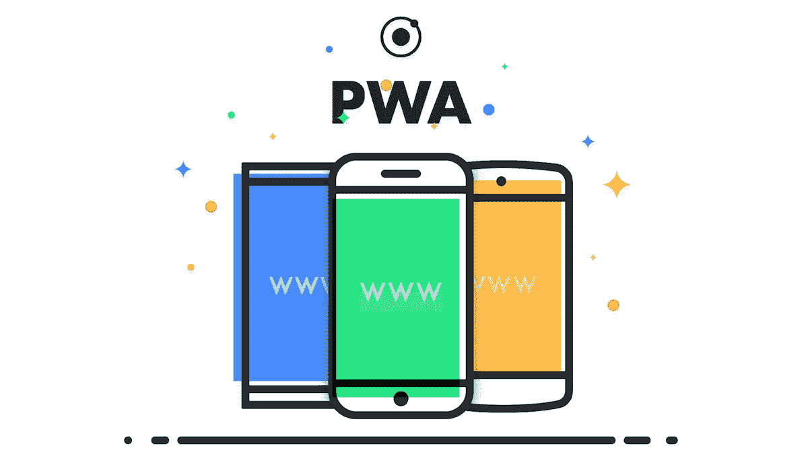
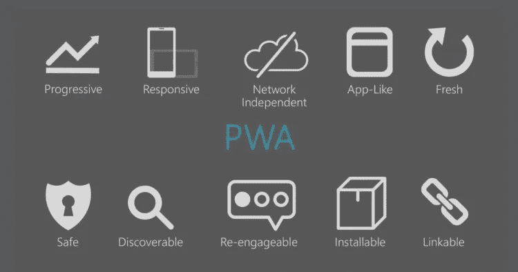

# 渐进式 Web 应用程序(PWA) —完整的快速入门指南

> 原文：<https://medium.com/hackernoon/progressive-web-application-pwa-complete-quickstart-guide-28a9d094a021>

这些年来，网络发生了很大的变化。在 21 世纪初，网页类似于报纸文章和百科全书条目，但在整个十年中，它们演变成更复杂的博客、视频和电子商务网站。

随着智能手机的出现，越来越多的用户开始在移动设备上浏览网页。移动应用在数字媒体使用方面迅速超过了网站。公司将注意力从网站转移到应用程序，因为应用程序允许他们提供更多功能，更好地与用户互动。

另一方面，根据美国移动应用报告 2017，一半的智能手机用户在一个月内没有安装任何新的应用。

网络上的下一件大事，渐进式网络应用，旨在将移动应用程序的功能与现代互联网的基础结合起来，这些功能包括 T2 的可访问性、T4 的可发现性和易用性。

在本文中，我们将为您提供熟悉 PWAs 所需的所有信息，并指出有助于扩展您知识的资源，让您今天就开始开发 PWAs。

# 什么是渐进式 Web 应用程序？

[Image source](https://developers.google.com/web/progressive-web-apps/)

谷歌将[渐进式网络应用(PWA)](https://developers.google.com/web/progressive-web-apps/) 定义为具有网络覆盖范围的用户体验，并且:

*   **可靠** —无论网络条件如何(即离线或慢速连接)都应加载，并立即显示用户界面。
*   **快速** —用户应该立即收到对其操作的响应(例如，拨动开关、键入输入)，呈现的动画应该流畅，
*   **引人入胜**—pwa 提供与原生应用同等的体验。用户可以将它们安装在他们的设备上，他们能够显示自定义图标并使用设备功能(例如推送通知、摄像头、蓝牙)。

PWAs，而不是一套技术，是一种用户体验，专注于类似本机的行为，同时保持 web 平台的可访问性。

pwa 不局限于特定的[框架](https://brainhub.eu/blog/javascript-frameworks-for-desktop-apps/)，可以使用任何框架构建，也可以根本不使用框架——当考虑它们时，尝试从思维方式、方法、设计方法而不是特定技术的角度来考虑，因为最终框架和[API](https://brainhub.eu/blog/smart-api-testing/)来来去去，而它们背后的思想却在扩展。

此外，PWAs 是 web 开发中的一个自然发展过程。我们已经看到了这样的趋势:

*   丰富的互联网应用程序试图模仿桌面应用程序的 UX，
*   **单页面应用**，其仅使用网络技术(相对于浏览器插件，例如 Adobe Flash、Java、Silverlight)扩展了先前的概念
*   **响应式网页设计**，它包含了浏览网页的各种设备，并设定其目标是在保持单一产品的同时为所有设备提供最佳体验。
*   使用诸如 Electron、Cordova、Ionic、React Native 等框架开发基于 JavaScript 的本地应用，这些框架试图将基于 web 的用户界面与本地平台功能融合在一起。

pwa 欣然接受网络平台不断提升的期望，并努力尽可能实现这些期望。

大多数人认为，将 web 应用程序定义为 PWA 的最基本要求是能够离线运行(这意味着至少应用程序可以在离线时打开)和能够添加到主屏幕。必须理解的是，简单地添加这些功能并不能使 web 应用成为 PWA，因为它可能仍然缺乏原生应用的感觉。

# 渐进式网络应用——核心原则

[Image source](https://en.blog.businessdecision.com/digital-en/2018/02/progressive-web-apps-upsetting-mobile-use/)

# 第一可靠性

# 离线支持

当从主屏幕启动 PWAs 时，无论网络状态如何，PWAs 都会启动。这可以通过使用[服务工作者](https://developers.google.com/web/fundamentals/primers/service-workers/)来实现，服务工作者是用 JavaScript 编写的客户端代理([技术文档](https://developer.mozilla.org/en-US/docs/Web/API/Service_Worker_API))。通常，对于 pwa，会出现以下情况:

1.  用户第一次打开应用程序。
2.  客户端 JavaScript 代码注册服务工作者。
3.  服务工作者获取显示 web 应用程序所需的资源并缓存它们。
4.  下次打开应用程序时，服务工作人员会拦截浏览器发出的下载显示页面所需资源的网络请求(包括对 HTML 文件的初始服务器调用),并在必要时使用缓存的版本进行响应。

当用户离线时，pwa 不必显示任何有意义的内容，只需向用户显示一条消息，说明网络已关闭就足够了。根据应用程序的不同，离线支持可能意味着更多，例如:

*   **新闻应用**可以在应用打开时缓存最重要的文章或与用户相关的文章，并允许用户在连接离线时阅读这些文章。
*   **消息应用**可以存储新收到的消息，并允许用户离线浏览。
*   协作电子表格应用程序可以存储最近的文档，并允许用户查看它们，并在连接恢复时进行同步更改。

正如您所看到的，离线支持并不局限于使用服务人员，而是在设计时就开始了，当时设计人员和产品负责人认为应用程序是离线的。

# 慢速网络条件

pwa 应该在慢速网络条件下工作。无论带宽和延迟如何，应用程序内部的导航都应该是流畅的，因为移动应用程序也是如此。同样，服务人员可以在这种情况下提供帮助，例如通过缓存延迟加载的路由。此外，当需要网络资源来显示资源时，可以使用框架屏幕来显示进度指示。

# 排名第二的性能

性能是任何网络应用的一个非常重要的指标。谷歌报告称:

# 铁路模型

谷歌的性能工程师开发了一个通用的性能测量模型，叫做[轨道](https://developers.google.com/web/fundamentals/performance/rail)。RAIL 是一个以用户为中心的模型，是通过研究人类与计算机程序的交互而创建的。RAIL 模型设定的目标可以应用于任何面向用户的软件程序，例如网站、移动和桌面应用程序以及视频游戏。

RAIL 是描述关键性能指标的首字母缩写词:

*   **响应** —在 100 毫秒内响应用户输入，
*   **动画** —动画应该以 60fps 运行，
*   **空闲** —最大化空闲时间，
*   **Load** —向 1s 以下的用户显示一些内容，5s 以下变为交互。

请参见[轨道模型](https://developers.google.com/web/fundamentals/performance/rail)页面，了解更多描述以及如何实现这些目标的一些提示。熟悉[关键渲染路径](https://www.youtube.com/watch?v=PkOBnYxqj3k)。

# PRPL 模式

应用 [PRPL 模式](https://developers.google.com/web/fundamentals/performance/prpl-pattern/)可以极大地帮助实现前面提到的目标。

PRPL 代表:

*   **推送**初始 URL 路由的关键资源。
*   **渲染**初始路线。
*   **预缓存**剩余路线。
*   **延迟加载**并按需创建剩余路线。

应用 PRPL 模式的典型例子是[聚合物商店](https://github.com/Polymer/shop)和[预测客户](https://developers.google.com/web/fundamentals/performance/prpl-pattern/)。

# 绩效测量工具

手动测量:

自动检查:

*   [Lighthouse](https://developers.google.com/web/tools/lighthouse/) 可以自动化性能测试的过程，甚至可以在 CI 服务器上运行，
*   [性能预算](/@addyosmani/start-performance-budgeting-dabde04cf6a3)，例如 Webpack 有内置工具来支持这一点

# #3 参与度

PWAs 应该感觉像原生应用程序，并具有原生应用程序的功能。

在所有主要的移动平台上，PWAs 可以安装在用户的主屏幕上，并且在不显示任何浏览器控件的情况下打开。在桌面平台上，pwa 可以被添加到任务栏和停靠栏，快捷方式可以被添加到桌面，但是到目前为止它们仍然在浏览器中打开。

Web 平台发展迅速，并为以下功能提供了 API:

*   定位服务
*   相机，
*   推送通知，
*   原生平台支付(如 Apple Pay、G Pay)，
*   振动，
*   蓝牙，
*   USB。

您可以访问[web 今天能做什么？](https://whatwebcando.today/)查看现代浏览器的显著特性列表。

# PWA 实施案例研究

PWAs 可以大大提高用户参与度和转化率。更快的加载速度和简洁的界面产生了更长、更吸引人的交互，影响了重要的指标:

## **每个会话的页数，会话长度**:

*   [Twitter](https://developers.google.com/web/showcase/2017/twitter)Twitter 每次会话的页面增加了 65%，发送的推文数量增加了 75%，
*   [全球速卖通](https://developers.google.com/web/showcase/2016/aliexpress)访问量增加了 100%，每次会话花费的时间增加了 74%，

## **转换率:**

*   全球速卖通将新用户的转化率提高了 104%，
*   Trivago 的酒店优惠点击率提高了 97%，
*   OLX 将广告点击率提高了 146%。通过使用推送通知，他们发现用户再次参与度提高了 250%,
*   [Treebo](https://tech.treebo.com/we-didnt-see-a-speed-limit-so-we-made-it-faster-treebo-and-pwas-the-journey-so-far-f7378410abc7) 转化率提升 4 倍，
*   [阿里巴巴](https://developers.google.com/web/showcase/2016/alibaba)转化率提升 76%。

## **跳出率:**

*   OLX 将他们的跳出率降低了 80%。
*   Housing.com 将他们的跳出率降低了 40%。

# PWA 市场分析

[Image source](https://www.youtube.com/watch?v=3e8uQsoh10Q)

# 苹果 vs 谷歌排名第一

苹果缺乏 PWA 支持。ServiceWorkers 很晚才推出，目前不支持清单，也不提示用户将应用程序添加到主屏幕。苹果的设备不支持 iOS 上的大多数原生 API。移动 Safari 不支持推送通知，而桌面 Safari 从 2013 年开始支持推送通知(尽管使用专有标准而不是 WHATWG 的)。

另一方面，**谷歌积极推广 pwa**并重点关注它们。要理解这两家科技巨头的做法，我们必须看看它们的收入来源。

谷歌非常注重为所有设备提供服务，而苹果则专注于他们的生态系统。苹果商店在批准应用程序到商店之前有一个非常严格的人工审查过程，并对上传到商店的每个许可证收取 100 美元，而谷歌在审查过程方面要宽松得多，它是自动进行的，许可证只需 25 美元。

此外，谷歌试图垄断市场，通过阻止 Windows mobile 操作系统提供其服务来积极对抗 Windows mobile 操作系统(Windows Store 上不提供原生应用程序，谷歌地图等网站使用了浏览器不支持的功能，或者像 Hangouts 这样完全被排除在外)。

它最近向印度第二大操作系统 KaiOS 投资了 2200 万美元，并积极为该操作系统开发基于网络技术的应用程序。

谷歌正在向苹果施压，要求其允许 pwa 进入他们的生态系统，从而削弱苹果在 app store 收入中的霸主地位(谷歌 Play 商店每台设备的收入比 App Store 少 10 倍)。

# 第二大新兴市场

PWAs 可以对下一个十亿用户产生巨大的影响(在巴西、中国、印度、印度尼西亚和尼日利亚等地，最新一代的互联网用户通过智能手机上网)。

pwa 有能力在这些地区超越原生应用市场，因为它们需要使用和安装的数据传输量减少 10 倍(这在世界上的一些地区可能是一个严重的问题，例如肯尼亚，用户在网吧安装移动应用程序，1 GB 数据计划的费用为 5 美元，平均费用在 300-400 美元之间)，它们是围绕连接问题设计的。

# 平台功能比较

虽然网络平台发展如此之快，但它仍然缺少对一些设备上的移动应用程序的基本功能的支持。

*   **推送通知**在 Android 上完全支持，这意味着应用&浏览器可以关闭，设备仍会收到通知。在桌面设备上，浏览器只有在打开时才会收到通知(网站可以关闭，但浏览器必须在运行)，在 iOS 设备上，根本不支持浏览器的推送通知，
*   **后台位置服务**对浏览器不可用，这意味着你将无法创建一个基于位置自动执行一些任务的应用程序(例如家庭控制系统)，
*   **蓝牙，USB，NFC** 只支持 Chrome 浏览器，
*   **设备认证**目前正在开发中，目前还无法在网络上基于指纹、TouchID、FaceID 对用户进行认证和/或授权。

虽然一些关键功能可能会丢失，但这并不意味着 PWAs 应该遵循的原则不能应用于本机应用程序(尤其是那些使用 React Native 等 web 技术构建的应用程序)。由于 PWAs 专注于提供出色的用户体验，任何应用程序都可以遵循他们设定的目标来实现并吸引用户。

# 奖金资源

## 关注的人:

*   [阿迪·奥斯马尼](https://twitter.com/addyosmani)
*   [保罗·刘易斯](https://twitter.com/aerotwist)
*   伊利亚·格里戈利克
*   萨姆·萨科内
*   [杰森·米勒](https://twitter.com/_developit)
*   [卢克·爱德华兹](https://twitter.com/lukeed05)

## **一般资源:**

*   [渐进式网络应用——谷歌开发者](https://developers.google.com/web/progressive-web-apps/)
*   [服务人员:简介——谷歌开发人员](https://developers.google.com/web/fundamentals/primers/service-workers/)
*   [为什么性能很重要——谷歌开发者](https://developers.google.com/web/fundamentals/performance/why-performance-matters/)

## **商业资源:**

*   [为什么要等待？一个渐进式的网络应用程序现在就能推动移动收入——想想谷歌](https://www.thinkwithgoogle.com/marketing-resources/progressive-web-app-mobile-revenue/)

## **技术资源:**

*   [使用 React.js 的渐进式网络应用— Addy Osmani](/@addyosmani/progressive-web-apps-with-react-js-part-i-introduction-50679aef2b12) —推荐整个系列
*   [服务工作者 API — MDN](https://developer.mozilla.org/en-US/docs/Web/API/Service_Worker_API)
*   [开始分析运行时性能——Google 开发人员](https://developers.google.com/web/tools/chrome-devtools/evaluate-performance/)
*   [用轨道模型测量性能](https://developers.google.com/web/fundamentals/performance/rail)
*   [PRPL 模式](https://developers.google.com/web/fundamentals/performance/prpl-pattern/)
*   [灯塔](https://developers.google.com/web/tools/lighthouse/)
*   [开始绩效预算](/@addyosmani/start-performance-budgeting-dabde04cf6a3)

## **开源 PWA 示例:**

*   预测客户需求
*   [聚合物车间](https://github.com/Polymer/shop)
*   [PWA 通用生成器](https://pwa.cafe/)
*   [PWA 岩石(PWA 的集合)](https://pwa.rocks/)

## **视频资源:**

*   [采用 JavaScript 框架的生产渐进式网络应用](https://www.youtube.com/watch?v=aCMbSyngXB4)
*   [渐进式网络应用:无处不在的卓越体验](https://www.youtube.com/watch?v=m-sCdS0sQO8)
*   [PWAs:搭建通向移动、桌面和本地的桥梁(Google I/O’18)](https://www.youtube.com/watch?v=NITk4kXMQDw)
*   [用先进的网络应用创造“感觉良好”的 UX](https://www.youtube.com/watch?v=mmq-KVeO-uU)
*   [关键渲染路径——网络性能速成班(Fluent 2013)](https://www.youtube.com/watch?v=PkOBnYxqj3k)

## **商业案例分析:**

*   [推特](https://developers.google.com/web/showcase/2017/twitter)
*   [Trivago](https://www.thinkwithgoogle.com/intl/en-gb/consumer-insights/trivago-embrace-progressive-web-apps-as-the-future-of-mobile/)
*   [OLX](https://www.thinkwithgoogle.com/intl/en-gb/consumer-insights/trivago-embrace-progressive-web-apps-as-the-future-of-mobile/)
*   [金融时报&星巴克](https://www.youtube.com/watch?v=NITk4kXMQDw)
*   [Housing.com](https://developers.google.com/web/showcase/2016/housing)
*   [Treebo](https://tech.treebo.com/we-didnt-see-a-speed-limit-so-we-made-it-faster-treebo-and-pwas-the-journey-so-far-f7378410abc7)
*   [全球速卖通](https://developers.google.com/web/showcase/2016/aliexpress)
*   [阿里巴巴](https://developers.google.com/web/showcase/2016/alibaba)

## **技术案例研究:**

*   [火绒](/@addyosmani/a-tinder-progressive-web-app-performance-case-study-78919d98ece0)
*   [Pinterest](/dev-channel/a-pinterest-progressive-web-app-performance-case-study-3bd6ed2e6154)
*   [Treebo](/dev-channel/treebo-a-react-and-preact-progressive-web-app-performance-case-study-5e4f450d5299)
*   [推特](/@paularmstrong/twitter-lite-and-high-performance-react-progressive-web-apps-at-scale-d28a00e780a3)
*   [优步](https://eng.uber.com/m-uber/)

这是发表在 Brainhub 的博客[这里](https://brainhub.eu/blog/progressive-web-application-pwa-guide/)。

查看我们的其他软件开发案例，如“[如何向客户端交付 React 原生应用](https://medium.freecodecamp.org/how-to-deliver-a-react-native-app-to-the-client-e58421e7272e)”!

**寻求帮助来构建您的 PWA 或 JavaScript 应用程序？** [**降我们一线**](https://brainhub.eu/contact) **。**