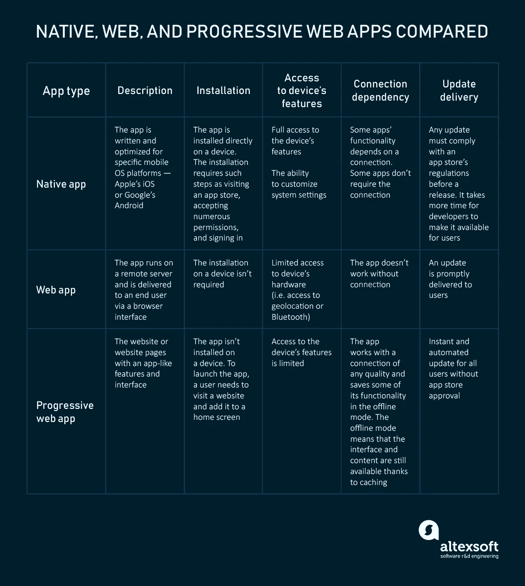
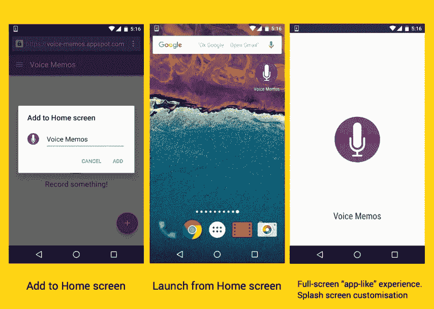
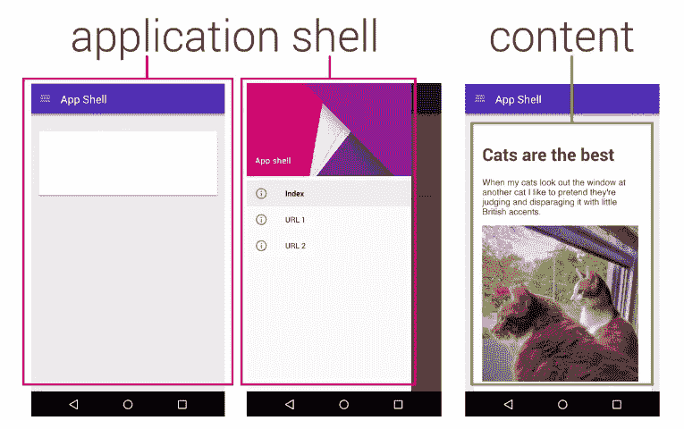
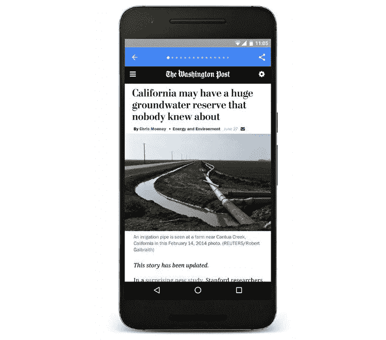

# 渐进式网络应用:核心特性、架构、利弊

> 原文：<https://medium.com/hackernoon/progressive-web-apps-core-features-architecture-pros-and-cons-4168848fd225>

移动网络是一种新的网络，因为大多数用户使用智能手机进行大部分日常工作，全天候保持联系。comScore 发布的 2017 年美国移动应用报告展示了移动应用的主导地位。用户 87%的时间花在移动应用上，相比之下，他们花在移动网络上的时间只有 13%。最重要的是，一半的数字媒体使用时间都花在了智能手机应用上。

虽然大多数人并不质疑是否构建移动应用程序，但开发方法的选择仍然摆在桌面上。几年前，企业可以在[本地、混合和跨平台移动开发](https://www.altexsoft.com/blog/mobile/key-approaches-to-mobile-development-explained/?utm_source=MediumCom&utm_medium=referral)之间进行选择。今天，一个额外的选择出现了——渐进式网络应用。

# 什么是渐进式网络应用程序(PWA)

渐进式 web 应用程序(PWA)是一套移动 web 应用程序开发技术，它需要构建感觉和外观都像本地应用程序的应用程序。使用 web 堆栈(JS、HTML 和 CSS)，渐进式 web 应用程序结合了与本机应用程序相关的丰富功能和流畅的用户体验。简而言之，PWA 是一款具有本地应用风格的网络应用:安装后，用户点击设备主屏幕上的图标，就可以直接进入网站。

这种方法是由谷歌在 2015 年推出的，自那以来，由于相对简单的开发和有效的用户参与，它已经成为工程师们的热门话题。

# PWA 的主要功能以及它们与本地应用和 web 应用的比较

PWAs 有许多关键特性，使其不同于传统的 web 和本地应用:

**全面的响应能力和浏览器兼容性。**这些应用是根据渐进增强原则构建的。渐进式改进是一种 web 设计策略，它为每个人提供基本的功能和内容，而不管他们使用的浏览器或连接质量如何，同时为新浏览器支持的用户提供更复杂的页面版本。

因此，PWAs 适用于所有浏览器，并兼容任何设备，无论屏幕大小和其他规格如何。平板电脑和移动用户会有同样的体验。如果需要，您甚至可以将应用程序调整到桌面。

**连通性独立。渐进式网络应用程序可以在离线和低质量的网络上工作。**

**类似 App 的界面。这些应用模仿本地应用的导航和交互。**

**推送通知。**如果作为一个好的信息传递策略的一部分，推送通知可以保持客户的兴趣，激励他们打开并更多地使用应用程序。

**自我更新。**能够自动更新，应用程序保持最新。

**安全。**这些应用通过 HTTPS 提供服务，因此未经授权的用户无法访问它们的内容。

**易于发现和安装。虽然搜索引擎将 pwa 归类为应用程序，但它们并不通过应用程序商店分发。这些应用程序可以通过 URL 共享，因此很容易找到。安装很简单，只需访问一个网站，并将其添加到设备主屏幕。**

考虑到 PWAs 的重要特性，让我们考虑一下其他特性，将这些应用程序与本地和标准 web 应用程序进行比较。

渐进式网络应用程序从本地和网络应用程序中吸取了功能。无论移动操作系统和设备类型如何，它们都可以快速运行，并提供丰富的功能，就像是为特定设备开发的一样。由于易于安装、可发现性、自动更新、慢速网络甚至离线工作模式，PWAs 可以增强用户体验。

# PWAs 的技术组件

这些应用的功能是如何实现的？四个技术组件支持渐进式 web 应用程序功能。

## Web 应用程序清单

Web 应用程序清单——一个 [JSON 文件](https://www.copterlabs.com/json-what-it-is-how-it-works-how-to-use-it/)——是为 progressive 提供其本机应用程序界面外观的第一个组件。通过清单，开发人员可以控制应用程序向用户显示的方式(即全屏模式，没有可见的 URL 栏)以及如何启动它。该文件允许开发人员为 web 应用程序的元数据找到一个集中的位置。清单通常包含起始 URL、应用程序的全称和简称、图标链接以及图标的大小、类型和位置。开发者也可以为地址栏定义一个[闪屏](https://developers.google.com/web/updates/2015/10/splashscreen)和一个主题颜色。

*Google shows the features the Web App Manifest supports*

要应用这些设置，开发人员只需在所有网站页面标题中添加一个指向清单的链接。

## 服务行业人员

服务人员是支持渐进式 web 应用程序的主要功能之一的另一个技术元素，这些功能包括离线工作模式、后台同步和本地应用程序特有的推送通知。服务工作者是独立于网页/应用运行的 JavaScript 文件。它响应用户与应用程序的交互，包括从其服务的页面发出的网络请求。因为服务工作器只运行来处理特定的事件，所以它的生存期很短。

**离线工作模式。**服务人员允许缓存一个*应用程序外壳*(接口)，所以它在重复访问时立即加载。每次连接恢复时，必要的动态内容(即消息或支付历史、购物车、头像)都会刷新。这些机制允许体面的应用程序性能和改进的用户体验。例如，messenger 用户看不到关于界面的在线和离线模式之间的区别:它仍然工作；消息历史可用。但是，消息传递需要连接。

**推送通知。**推送通知是一种有效的工具，可通过用户喜欢的网站的内容和提示更新来再次吸引用户。渐进式 web 应用程序可以发送推送通知，即使浏览器关闭，并且应用程序不活跃。

**后台同步。**服务人员也负责这项功能。它会延迟操作，直到恢复稳定的连接。例如，在连接失败之前发送的消息将被标记为已发送，然后将在服务恢复后立即发送。因此，服务器可以向应用程序发送定期更新，允许它在连接恢复时进行自我更新。

## 应用程序外壳架构

构建和维护 PWAs 需要将静态内容与动态内容分开。

*The illustration by Google explains that the app shell is generally static, while the content can change*

因此，使用我们上面提到的应用程序外壳架构(这是 UI 的基础)是开发它们的唯一方法。

应用程序外壳包含使应用程序在没有连接的情况下运行所需的核心设计元素。

应用程序外壳方法特别适用于由一个页面和导航相对稳定、内容不断变化的应用程序组成的大量使用 JavaScript 的应用程序。

## 传输层安全性(TLS)

pwa 利用传输层安全(TLS)协议。TLS 是两个应用程序之间安全可靠的数据交换标准。数据的完整性要求通过 HTTPS 服务网站，并在服务器上安装 SSL 证书。

# 公共福利援助的优点

渐进式网络应用程序功能是相互关联的，并解释了它们发展的原因。

## 发展储蓄

追随渐进式 web 应用趋势的专家使用 web 堆栈进行开发。这种方法花费的精力和时间更少，因此更具成本效益。

原因是开发人员不需要为多个平台构建应用程序，因为单个渐进式应用程序可以在 Android 和 iOS 上运行良好，并适合各种设备。

## 减少安装摩擦

可发现性是 PWAs 的核心特性之一，这增加了它们相对于原生应用的竞争力。考虑到下载一个应用程序[的每一个额外步骤都会减少](https://www.comscore.com/Insights/Presentations-and-Whitepapers/2017/The-2017-US-Mobile-App-Report)20%的潜在用户数量，这个优势尤其有意义。

由于 pwa 没有安装在设备上，也没有通过 Play 或苹果商店共享，他们的客户离推出它们更近了几步。他们不必访问应用商店，点击“安装”按钮，并接受各种权限。他们需要做的只是访问网站，将应用程序添加到主屏幕，返回主屏幕，然后打开网站。

## 轻松更新

除了跳过应用商店、冲浪和安装之外，PWA 用户还可以在每次开发者发布新版本时免于更新(或接受更新提议)。用户始终可以获得最新的解决方案。该功能允许公司避免被称为软件碎片的问题，当他们必须维护旧版本的应用程序或冒着失去用户的风险直到他们开始更新时。

## 用户参与度更高

来自 comScore 的研究人员还[发现](https://www.comscore.com/Insights/Presentations-and-Whitepapers/2017/The-2017-US-Mobile-App-Report)80%的移动用户有意将应用程序移到主屏幕上。因此，添加到主屏幕的能力使 PWAs 与 web 应用程序相比更具竞争力。当然，人们决定试用这款应用肯定还有其他原因。使用频率(61%)、访问简单性(54%)和访问速度(49%)是影响他们决策的首要因素。因此，艾滋病毒感染者获得更好分配的机会更大。推送通知也增加了用户对应用的兴趣。

像全球速卖通这样的大公司已经从发布渐进式应用程序中受益。这家电子商务巨头的[转换率增加了 104%](https://developers.google.com/web/showcase/2016/aliexpress)，在所有浏览器中，每次会话花费的时间平均增加了 74%。除此之外，用户开始在每个会话中访问两倍多的页面。

# 艾滋病毒/艾滋病的弊端

pwa 不仅仅是关于优点:它们的缺点与优点直接相关。

## 与原生应用相比，功能有限，电池使用量增加

尽管它们很先进，但它们仍然是网络应用。如果无法访问设备硬件，PWAs 就无法支持指纹扫描、邻近传感器、NFC、蓝牙、地理围栏、应用间通信和高级相机控制等本机应用典型功能。虽然通过 URL 分享应用程序很方便，但它需要连接，这比原生应用程序更快地消耗设备电池。

## 由于没有出现在应用程序商店，搜索流量损失

我们提到，应用商店的存在消除了用户在运行应用程序之前采取的几个步骤，从而减少了安装摩擦。移动网络流量可以重定向到应用商店向用户展示应用，而不在应用商店会导致潜在的流量损失。

# 成功开发的 pwa 示例

## 华盛顿邮报

*《华盛顿邮报》*正在寻找高效的方式向其受众提供内容，其中近 55%的受众通过移动设备访问内容。

考虑到如果内容加载时间超过三秒，用户很可能会离开网站，出版商旨在确保它立即出现在读者眼前。它还想让文章可供离线阅读。

*That’s how The Washington Post’s AMP content appears to offline readers*

在 2016 年谷歌 I/O 开发者大会上，媒体[介绍了](https://developer.washingtonpost.com/pb/blog/post/2016/07/15/amp-up-with-progressive-web-apps/)一种 PWA 体验，通过使用 AMP、[加速移动页面](https://www.ampproject.org/)成为可能。AMP 是发布内容的新标准，为移动用户提供即时页面加载和内容交付。

与传统的移动网络相比，使用渐进式网络应用程序，*Post*[将页面加载时间缩短了 88 %( 400 毫秒)。另一个成就是在 7 天内回访的移动搜索用户增加了 23%。](https://developers.google.com/web/showcase/2016/wapo)

PWA 还处于测试阶段，这意味着开发者仍在努力通过 web 应用为《邮报》的网站提供所需的所有功能。

## 购物化

加拿大电子商务平台 Shopify 发布了 [Litefy 应用](https://apps.shopify.com/litefy-pwa)，允许商家将其在线主题升级为渐进式网络应用。零售商可以获得渐进式 web 应用程序体验的所有好处:通过简单的商店访问、离线模式和类似应用程序的界面，提高客户参与度和忠诚度。另一个优势是免于应用商店费用。

## 推特

这个广受欢迎的社交媒体平台每月有 3.28 亿用户积极分享、创建和消费信息，它开发了 [Twitter Lite PWA](https://developers.google.com/web/showcase/2017/twitter) 来提高参与度和减少数据消耗。该应用程序已于 2017 年 5 月开始工作。考虑到超过 80%的用户通过移动设备访问该平台，这一步非常及时。

Twitter Lite 使用不到 3%的设备存储空间，消耗高达 70%的数据，并允许用户尽快分享推文。

# 何时构建渐进式 web 应用程序

渐进式 web 应用程序的开发可以帮助您解决各种挑战。让我们来描述几种情况下，去进步是有意义的。

首先也是最重要的，构建 PWAs 是关于用户参与的。不想额外点击下载应用程序的用户可能是你社区的重要组成部分。来自最近 comScore 报告的统计数据证明这一假设是有根据的。超过 50%的美国智能手机用户一个月甚至不下载一个应用程序。有了 PWA，即使你已经有了原生应用，你也可以与这个庞大的用户群互动。它还可以节省大量的本地应用程序更新和维护预算。

由于人们大多依赖无线网络和移动连接，他们可能更喜欢使用较少数据、离线时至少保持部分功能的网站和应用程序。我们拥有一切。

构建渐进式 web 应用程序更快、更便宜，因此您可以使用这种应用程序类型来支持单个或年度活动，如音乐节。

然而，重要的是要记住功能性是 PWAs 的弱点。因此，如果原生应用特定的功能(例如，访问摄像头或地理位置)不是必不可少的，那么坚持使用 PWA。难怪像*金融时报*或*华盛顿邮报*这样的主要媒体已经意识到使用 PWAs 发表文章的好处。

综上所述，在做出选择时，您应该考虑性能和功能、开发时间框架和成本以及用户体验。

喜欢这个故事吗？鼓掌让我们知道，这样更多的人可以找到它！👏
最初发表于 AltexSoft 的博客:*[*渐进式 Web 应用:核心特性、架构、优缺点*](https://www.altexsoft.com/blog/engineering/progressive-web-apps/?utm_source=MediumCom&utm_medium=referral)*