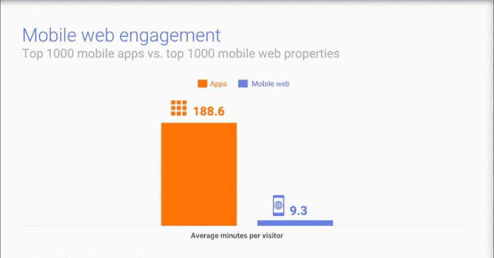
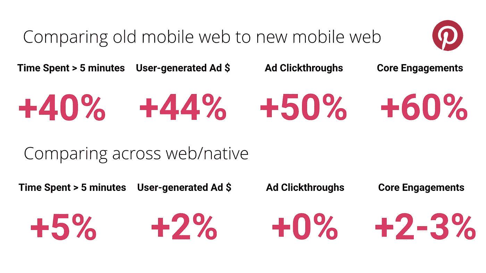

# 渐进式 Web 应用——移动 Web 应用开发的未来

> 原文：<https://medium.com/hackernoon/progressive-web-apps-the-future-of-mobile-web-app-development-f29257b0dea2>

渐进式网络应用程序已经在移动网络领域崭露头角，并正在以过去的方式发展网络应用程序。为更好地为用户服务和消除缺陷的持续努力已经产生了这些轻量级但功能丰富的网络应用。

# 什么是渐进式 Web App？

渐进式网络应用也被称为 PWAs，是一种外观和感觉都像本地移动应用的网络应用。它可以在任何浏览器上工作，无论是 chrome、opera 还是三星互联网浏览器，用户没有义务从应用商店下载。只需点击链接，用户的手机上就安装了 PWA。

就像原生移动应用程序一样，PWA 显示在主页上，在应用程序抽屉中，发送推送通知并集成到系统设置中。

# 渐进式网络应用的理念

谷歌比较了前 1000 个移动应用和前 1000 个移动应用属性(web ),以研究覆盖范围和用户参与度。比较的结果显示了用户行为的巨大差异。

根据这项研究，移动网络的覆盖范围远远高于本地应用的覆盖范围。每月有 1140 万独立访客，相比之下只有 400 万访客。

而用户参与服务的统计数据显示，与移动网络相比，用户倾向于在原生移动应用上花费更多时间。在应用程序上的平均时间是 188.6 分钟，而在网络上是 9.3 分钟。

所以，这个想法很清楚。他们希望在移动网络上为用户提供一种类似于参与式体验的本地应用。通过这种方式，渐进式网络应用程序被开发出来，在网络上提供惊人的用户体验。

# 公共福利援助计划的好处

# 应答的

渐进式网络应用程序响应速度非常快。它们会根据设备自动调整布局。因此，无论是移动设备、平板电脑、笔记本电脑还是台式机，PWAs 都适用于任何设备。

# 安全的

与传统的网络应用相比，PWAs 更加安全，因为它们总是通过 HTTPS 提供服务。这确保了应用程序可以防篡改，不能被破坏。

# 尽管网络存在缺陷，但仍然可靠

即使网络质量很差，人们也可以依靠先进的网络应用程序，因为它甚至可以离线工作。这可以通过服务工作者(一种网络工作者)来实现。尼日利亚领先的电子商务网站 Konga 通过其渐进式 Web 应用程序成功减少了 92%的用户数据使用量。

# 外观和感觉就像一个本地应用程序

用户不会注意到 PWA 和本机应用程序之间的任何差异。它看起来和感觉上都像一个原生应用程序，甚至提供了类似的功能，如推送通知、与系统集成、主屏幕和应用程序抽屉上的显示图标等。

# 装置

让用户从商店安装你的应用程序可能会很麻烦。但有了 PWA，用户只需轻轻一点就可以安装应用程序。这种无摩擦的安装让用户享受服务，而不是安装庞大的本地应用程序。

# 轻松更新

PWA 最惊人的一个特点就是容易更新。由于没有一个应用商店作为中介，你的用户可以在你更新后立即享受到更新后的应用。

# 轻量级选手

尽管 pwa 拥有令人惊叹的功能，但它们非常轻便。将 Pinterest 的 PWA 与它的 Android 和 iOS 应用程序进行比较，它只有 150KB，分别为 9.6MB 和 56MB。轻巧迷人，不是吗？

(图片来源- [阿迪·奥斯马尼](/dev-channel/a-pinterest-progressive-web-app-performance-case-study-3bd6ed2e6154))

# 挑战

# 浏览器支持

虽然 pwa 在大多数流行的浏览器上都能完美运行，比如 Chrome、Opera 和 Samsung Internet，但在 Safari 等浏览器上仍然不受支持。

# 设备支持

PWAs 可以在大多数 android 设备上完美运行，但 iOS 设备仍然不支持它。然而，考虑到 PWAs 的潜力和受欢迎程度，据推测，苹果正在努力使其在 iOS 上也可用。

# 硬件功能

PWAs 仍然不支持一系列硬件功能。但随着时间的推移，许多硬件功能已经像原生应用程序一样可用。

# 突破性的变化

PWA 的想法听起来很吸引人，但是它给企业增加价值了吗？

嗯，答案是肯定的。事实证明，pwa 在提升绩效、覆盖面和用户参与度方面是成功的。这里有一些[谷歌](https://developers.google.com/web/showcase/)的实例和案例研究。

# Twitter Lite

Twitter 已经采用 PWA 技术来提高移动参与度，减少用户的数据使用量。这家社交媒体巨头在全球拥有 3.28 亿月活跃用户，其中 80%是移动用户。

他们希望提供更快的服务，更低的数据消耗，为用户提供强大、可靠和更具吸引力的体验，因此开发了 Twitter Lite Progressive Web 应用程序。

该 PWA 在很大程度上满足了他们的期望，并观察到以下结果。

# 结果

*   发送的推文增加了 75%
*   每次会话页面增加 65%
*   跳出率下降 20%
*   通过优化图像，数据消耗减少了 70%。

# 书迷秀

> 自从推出我们的 PWA 以来，我们已经看到了移动转化率的指数级增长。PWA 帮助我们在手机上联系了更多的人——手机用户构成了我们整体受众的大多数。
> 
> ***–Sahil tewa ri，助理总经理，移动&网络***

BookMYShow 是印度最大的在线票务公司，月访问量超过 5000 万。他们注意到，在为移动网络开发渐进式网络应用程序后，购票数量增加了 80%以上。

# 结果

*   BookMyShow 观察到他们的转化率增加了 80%以上。
*   PWA 的加载时间不到 2.94 秒，可在 30 秒内完成结账。
*   PWA 的大小比 Android 应用程序小 54 倍，比 iOS 应用程序小 180 倍。

# 拼趣

这家图片分享社交网站意识到，他们缓慢的网络体验只能将 1%的用户转化为注册、登录或本地应用安装。为了提高这个速率，他们决定为他们的移动网络开发 PWA。建立 PWA Pinterest 花了 3 个月的时间，其成果为他们的业务带来了几项改进。

# 结果

*   平均花费的时间增加了 40%
*   用户生成的广告收入增长了 44%
*   广告点击率增加了 50%
*   核心用户参与度提高了 60%

(图片来源- [阿迪·奥斯马尼](/dev-channel/a-pinterest-progressive-web-app-performance-case-study-3bd6ed2e6154))

# 福布斯（美国出版及媒体集团）

美国商业杂志《福布斯》在媒体界是一个不朽的名字。他们开发了 PWA 来提高用户参与度。它允许他们根据用户的喜好来提供新闻和信息，并通过推送通知来通知他们。PWA 使他们的移动网络体验更快、更个性化、更愉快。

# 结果

*   观察到每个用户的会话增加了 43%
*   广告的可视度提高了 20%
*   深度滚动提升了 3 倍
*   用户参与度提高到了 100%

# OLX

OLX 是印度最大的在线分类广告平台之一。它作为一个市场，连接二手商品和服务的买方和卖方。为了向用户提供快速便捷的服务，OLX 决定为他们的移动网络开发渐进式网络应用程序。结果，他们看到了一些显著的改进。

# 结果

*   页面交互时间缩短 23%
*   跳出率降低 80%
*   广告点击率提高 146%
*   250%以上的再次参与

# 阿里巴巴

Alibaba.com 是全球最大的在线 B2B 交易门户网站。它服务于 200 多个国家和地区。他们需要一个快速简单的解决方案来为他们的用户进行交易。强迫用户下载本地应用对他们来说不是一个选项，因为移动网络用户更喜欢留在浏览器中。因此，他们开发了 PWA 来为网络用户提供类似 app 的体验。

# 结果

*   跨浏览器的转化率提高 76%
*   添加到主屏幕的交互速率提高了 4 倍
*   iOS 每月活跃用户增加 14%；安卓系统占 30%

# 结论

渐进式网络应用有着巨大的潜力，并且正在改变移动网络的面貌。时间将决定 PWAs 是否会接管一个本地移动应用，但它肯定已经在移动网络中创造了自己的空间。甚至趋势表明，社区正在热情地接受这一计划。

听从杰夫·贝索斯的话，“*在商业中，危险的是不要进化”*为了最大的利益，在适当的时候接受变化可能是一个明智的决定。

希望你能从中受益。如果您期待增强您的移动网络体验，我们可以为您的企业开发一款可靠、快捷、轻量级的渐进式网络应用。Techuz 使用最新的 JavaScript 技术，如 AngularJS、React.js 和 Vue.js，提供优质的 [web 应用程序开发服务](https://www.techuz.com/web-development/)。请随时联系我们！