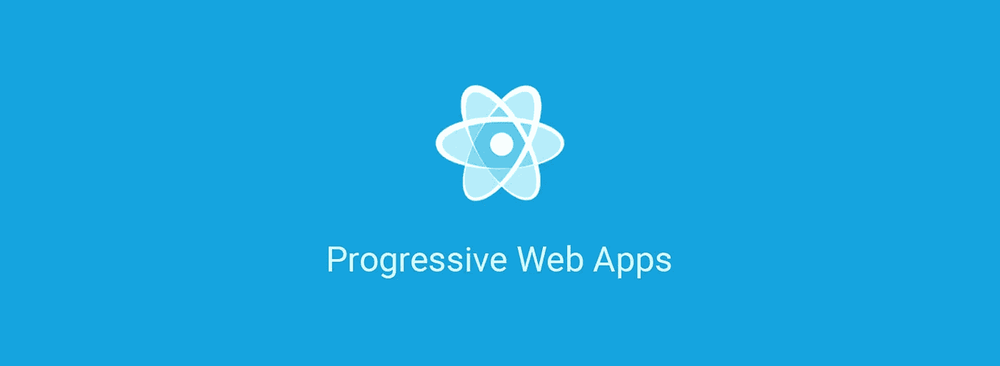
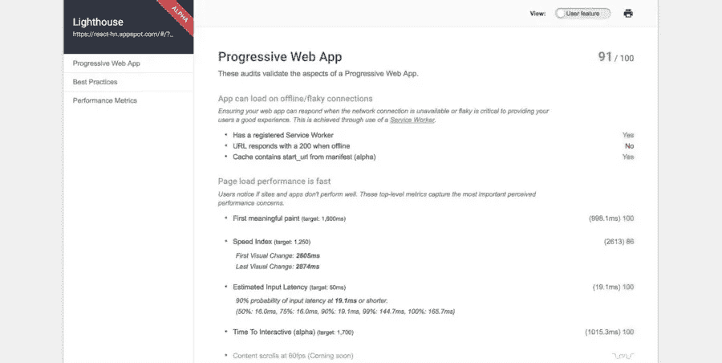

# 渐进式 Web 应用——Web 应用开发的下一步

> 原文：<https://medium.com/hackernoon/progressive-web-apps-the-next-step-in-web-app-development-372235bf9a99>

## 尼拉杰·辛格在 2018 年浦那 react foo 大会上演讲的一篇姊妹篇

如果我告诉你，现在一个 web 开发者可以很容易地构建移动应用程序，会怎么样？你只需要知道一些 [HTML](https://www.w3schools.com/html/html5_intro.asp) 、 [CSS](https://www.w3.org/Style/CSS/Overview.en.html) 和 [JavaScript](https://www.javascript.com/) 就可以了！不需要经历像 [Java](https://java.com/download) (针对 Android 应用)或者 [Objective-C](https://en.wikipedia.org/wiki/Objective-C) 和 [Swift](https://developer.apple.com/swift/) (针对 iOS 应用)这样的学习原生语言的痛苦。

如果你可以发布你的应用程序而不必遵守 Play Store 和 App Store 设置的规则和限制，那就更棒了！如果你是一个移动应用开发者，你可能经历过遵循应用商店规范的麻烦。App store 也有一些非常严格的规则，关于你什么时候可以更新你的应用程序，或者更新可以包含什么(如果它改变了你的应用程序的基本工作，App Store 不会让你发布更新)。

在这篇文章中，我们将了解如何构建渐进式网络应用程序，让你做我上面提到的所有事情，甚至更多！

# [ReactFoo 浦那 2018](https://reactfoo.in/2018-pune/)

这是 Neeraj Singh 在 2018 年 react foo Pune 上发表的关于渐进式网络应用的演讲的姊妹篇。

ReactFoo 是由 [CLI](https://medium.com/u/fef4d0d81ac#install-cli) 两个版本，它们都提供了一个类似如下的报告:

顶级审计灯塔有效地运行着一组为移动世界提炼的现代网络最佳实践:

*   **网络连接安全**
*   **可以提示用户添加到主屏幕**
*   **已安装的网络应用程序将启动自定义闪屏**
*   **应用程序可以在离线/易断连接上加载**
*   **页面加载性能快**
*   **手机友好型设计**
*   **站点逐渐增强**
*   **地址栏匹配品牌颜色**

这是 Lighthouse 的入门指南。

 [## 灯塔|网站开发者工具|谷歌开发者

### 了解如何设置 Lighthouse 来审核您的 web 应用程序。

developers.google.com](https://developers.google.com/web/tools/lighthouse/) 

你也可以通过

## [使用工具箱构建 PWA](https://medium.com/u/2508e4c7a8ec#0)

[codelabs.developers.google.com](https://medium.com/u/2508e4c7a8ec#0)

> PWA 是 web 开发的下一步。所以尝试一下，为未来做好准备！

我是 [Rajat S](https://medium.com/u/ae259dddfc25?source=post_page-----372235bf9a99--------------------------------) ，是 [GeekyAnts](https://geekyants.com/?utm_source=medium&utm_medium=article&utm_campaign=blog) 的技术内容作家。一个有抱负的程序员还有很长的路要走。一个热爱漫威电影的铁杆 DC 漫画迷。😛在[推特](https://twitter.com/rajatk16)上关注我，了解更多关于[极客聚会](https://geekyants.com/?utm_source=medium&utm_medium=article&utm_campaign=blog)上发生的令人惊奇的事情。

感谢 Neeraj Singh，他是 GeekyAnts 的高级软件工程师。尼拉杰在 ReactFoo Pune 谈论进步的网络应用。

感谢您的阅读！请吧👏如果你喜欢的话。