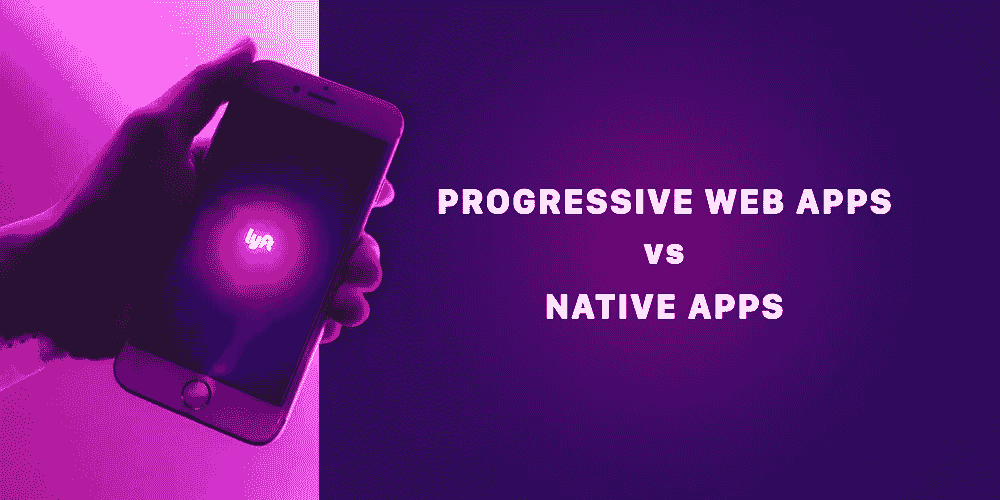
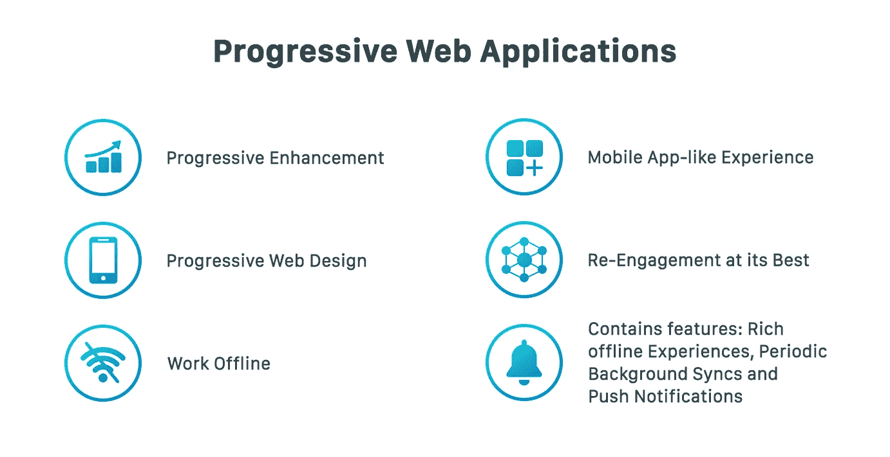
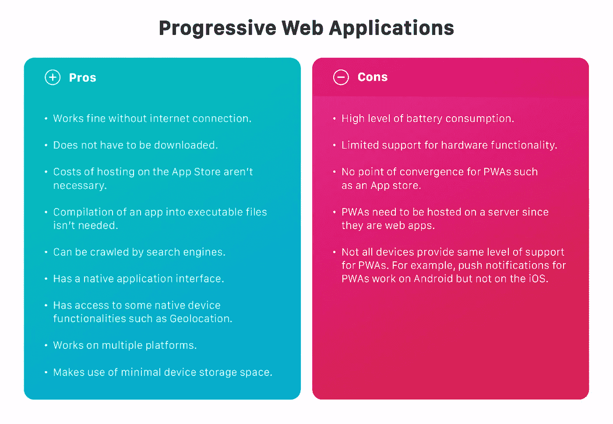
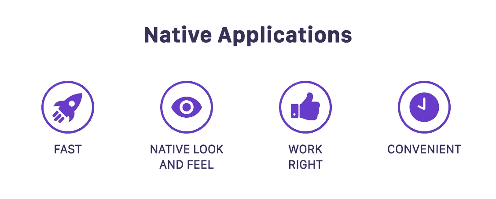
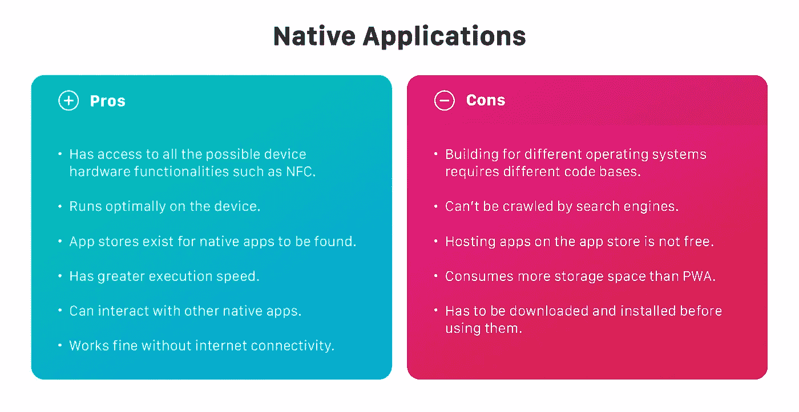
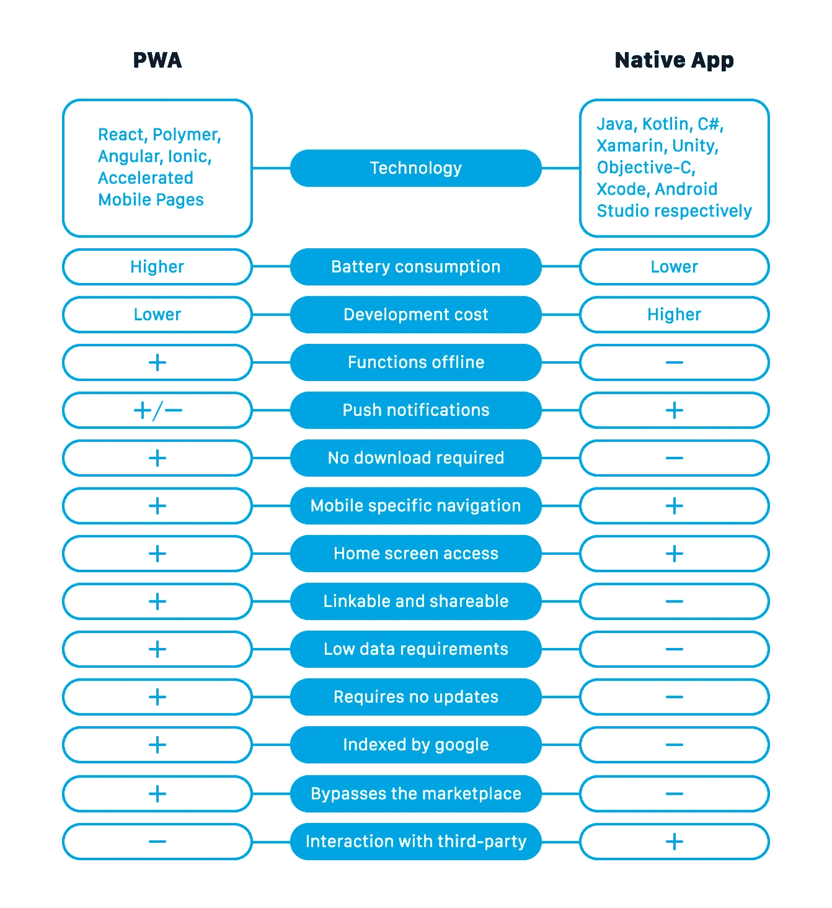

# 渐进式网络应用与原生应用——何时选择

> 原文：<https://medium.com/hackernoon/progressive-web-apps-vs-native-apps-when-and-which-to-choose-b8dd518b3282>

渐进式网络应用程序已经被证明非常有用，我们已经看到它们在许多项目中得到实施。然而，他们并不是要取代本地应用，而是要解决一些问题，如跨平台兼容性。

# 渐进式网络应用

渐进式 web 应用程序是可以充当常规移动应用程序的 Web 应用程序。因此，您可以访问一些只有本地移动应用程序才能访问的设备 API 和功能，并拥有操作系统的本地界面。

PWA 是谷歌开发的一项技术，由该公司外包给他人使用并享受其令人敬畏的好处。

## 它们是如何工作的

pwa 依赖于不同的技术，如清单、Web Workers、本地存储、会话存储，这些技术允许 pwa 高效工作并像本地应用程序一样执行任务。

这些技术确保渐进式网络应用程序可以像安装应用程序一样添加到您的主屏幕上，可以在没有互联网连接的情况下工作，提供推送通知，拦截网络请求，在后台同步数据等。

## 如何建造它们

有不同的技术用于构建渐进式 Web 应用程序，大多基于 JavaScript，它们都有各自不同的优点和缺点，但是，这不是本文的重点。

一个强大的 JavaScript 库，用于构建强大的、动态的、现代的用户界面。

[Polymer:](https://www.polymer-project.org/) 主要用于构建渐进式 Web 应用程序的组件、工具和模板的组合。

[Angular](https://angularjs.org/) :用于构建动态 web 应用的 JavaScript 框架，使用 HTML 作为模板语言。

Ionic :一个 JavaScript 框架，使用一个代码库为多个平台构建强大的应用程序。

加速移动网页(AMP):一个开源项目，通过让网页几乎瞬间加载来提高网页的性能。

## 用例

如果你仍然想知道 pwa 是否值得投资，那么像 Twitter Lite 的 Twitter、Instagram、Google Maps 这样的公司正在成功地使用 pwa。

# 本机应用程序

本地应用程序是开发用于特定平台的软件，不考虑其他平台。这些应用程序可以大量访问设备的功能和资源。

如果您以前使用过移动设备，那么您很有可能会使用本机应用程序。永远碰不到它们的几率几乎为零。

## 它们是如何工作的

本地应用程序是用适合操作系统的语言编写的，可以访问设备的 API 和硬件功能。与渐进式网络应用不同，渐进式网络应用是具有本地感觉和外观的网页，本地应用“生活”在设备上，并且必须安装在设备上。原生应用程序是所有进步的 Web 应用程序的外观，除了原生应用程序不跨平台兼容。

## 如何建造它们

JavaScript 仍然是构建 PWAs 的主要语言，前面提到的不同框架都是基于 JavaScript 的。然而，本地应用程序的情况有所不同，因为用于构建它们的语言因操作系统而异。

Java:Android 操作系统的官方语言，用于构建平台的原生应用。

[Kotlin](https://kotlinlang.org/) :较新的语言，类似于 Java，同样用于构建令人惊叹的原生应用。

[c#](https://docs.microsoft.com/en-us/dotnet/csharp/language-reference/)(Xamarin&Unity):c#可以用来通过 [Xamarin](https://visualstudio.microsoft.com/xamarin/) 框架和 [Unity](https://unity3d.com/) (一个游戏引擎)构建伟大的原生应用。

[Objective-C](https://developer.apple.com/library/archive/documentation/Cocoa/Conceptual/ProgrammingWithObjectiveC/Introduction/Introduction.html) :为 iOS 设备构建软件的主要语言。

Swift :苹果发布的为 iOS 构建软件的语言，据说比 Objective-C 更容易使用。

苹果和谷歌分别为 iOS 和 Android 提供开发环境 XCode 和 Android Studio。

构建本地应用程序的技术总是因平台而异，因此您应该为您选择的操作系统找到最适合的技术。

## 用例

到处都可以找到原生应用。快速浏览一下 Google Play 商店、Appstore，你会发现 Android 和 iOS 的原生应用程序。

WhatsApp、Instagram 和 Snapchat 等软件是通过其出色的原生应用程序获得大量用户基础的无数软件中的几个名字。

# 做出选择

事实上，渐进式网络应用和原生应用各有优缺点。因此，由你来做出对你最有利的选择。

以下是你在做出选择之前应该检查的条件列表。

**选择 PWAs 当:**

*   该应用程序易于分发。
*   应用程序开发预算很低。
*   几乎没有时间来构建应用程序。
*   搜索引擎索引很重要。
*   需要多平台兼容性。

**选择本地应用的时间:**

*   需要一个应用商店。
*   速度和响应能力对应用的成功至关重要。
*   该应用程序将依赖于设备硬件功能。
*   这笔钱将来自应用程序的购买和下载。
*   该应用程序需要与其他第三方应用程序进行交互。

坚持选择最符合应用程序需求的选项，很少会有任何问题。

[*安东·沙利尼科夫*写的](https://www.linkedin.com/in/anton-shaleynikov-45812a1/)