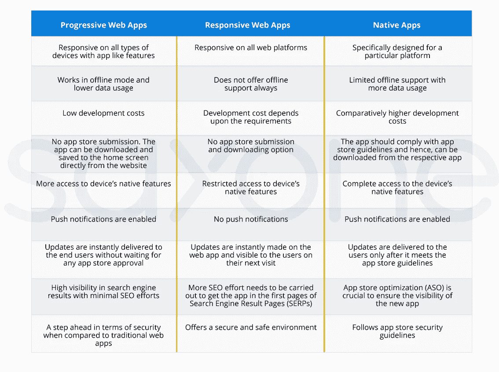

# 渐进式网络应用:为什么你的企业需要它？

> 原文：<https://medium.com/hackernoon/progressive-web-apps-why-your-business-needs-it-14bca80dc5a>

渐进式 Web 应用程序(PWA)被证明是下一个应用程序开发标准。

如果你不熟悉渐进式网络应用的概念，那么你可以看看我们在 [PWAs](https://www.sayonetech.com/blog/5-things-know-about-progressive-web-apps/) 上的博客，了解为什么每个人都被它吸引。

在这篇博客中，让我们关注渐进式网络应用程序的商业优势，以理解为什么它是一个主要的游戏规则改变者。

# 渐进式网络应用改变您的业务格局

## 那么，PWAs 与响应式 web 应用和原生应用有什么不同呢？

**对于企业来说，PWAs 有什么隐藏的优势？**

嗯，比原生应用便宜多了。在您分配的预算内，您可以获得使用现代 web 技术运行的 web 应用程序，以及流畅的本地和响应性 web 应用程序。

一旦渐进式网络应用程序在互联网上发布，它就可以在小工具世界中的“n”种设备上无缝工作。因此，您不必在每个屏幕上明确检查它的响应度。这进一步减少了质量保证团队在软件测试过程中的工作量，并加快了上市速度。

对于用户来说，这是获得完美移动网络体验的最佳选择。在离线模式下工作的能力和连接到互联网时较低的数据使用量使 PWA 成为用户的最爱。

这些是 PWAs 对企业和用户的一些众所周知的优势。现在，让我们做一些认真的研究来了解一个进步的网络应用对你的业务有多重要。

# 顶级玩家在 PWA 游戏中表现出色

今天，该行业的先驱们已经用 PWAs 取得了一些辉煌的成果。这归功于其鲜明的特色和广泛的业务优势。

他们的商业利益到底是什么？让我们潜到深处吧！

## Twitter Lite

广受欢迎的社交媒体平台 Twitter 拥有约 3.35 亿月活跃用户。这些用户中几乎 80%都是手机用户。

2017 年，Twitter 凭借其新的 Twitter Lite 进入了 PWA 游戏。截至目前，它已在 45 个国家上市。PWA 在 Android 中只需要 3MB 的存储空间，在 iOS 中只需要 1MB 的存储空间。这个新版本让用户大吃一惊。曾经有一段时间 Twitter iOS 消耗了大约 100MB。所以，精简版绝对是一个存储节省器。

此外，在 PWA 版本中，互联网的使用减少了 70%。它很容易加载到 2G 和 3G 网络上。一旦打开数据保护模式，您就可以根据自己的喜好限制下载。

**结果如何？**

*   推文数量增加 75%
*   页面会话增加了 65%
*   跳出率下降 20%

## 阿里巴巴

阿里巴巴是世界第五大 B2B 市场，收入 987 万美元。他们每月有 6.17 亿移动用户。

阿里巴巴通过他们的本地应用提供了强大的移动体验。然而，他们后来意识到他们现有的移动应用程序的缺点。他们的用户更喜欢快捷的解决方案，而不是下载占用大量空间的应用程序来浏览或完成交易。

为了给用户提供出色的移动体验，阿里巴巴建立了一个 PWA，为用户提供快速、可靠、吸引人的体验。新的应用程序具有吸引新访客和再次吸引回头客的功能。

**结果如何？**

*   移动网络转化率增长 76%
*   iOS 每月用户增加 14%，Android 每月用户增加 30%
*   互动率提高 4 倍

## 左枕前

作为印度领先的出租车聚合商，Ola 无法利用他们的移动网络用户体验。他们的服务延伸到印度的 100 个城市，拥有大约 60 万名司机合作伙伴。

印度的城市为领先的出租车聚合商带来了大量的机遇和挑战。普通人非常需要一种负担得起的、可靠的出租车服务，比如 Ola。然而，印度的大部分人口要么面临缓慢的互联网连接问题，要么面临设备存储空间问题。而 Ola 原生应用在 Android 和 iOS 中分别是 60MB 和 100MB，需要相当好的互联网连接。

Ola 明白，用户下载和使用其本地应用的可能性要小得多。因此，他们提出了一种适用于任何设备和互联网连接的轻量级 PWA。PWA 安装只需要 200KB 的数据。在安卓上小 300 倍，在 iOS 上小 500 倍。

**结果如何？**

*   移动流量增长 68%
*   转化率提高 30%
*   新用户增加 20%

## 预订我的节目

印度最大的票务公司 Bookmyshow 的月访问量超过 5000 万。而且大部分的访问和交易都发生在手机上。

尽管他们的移动网站流量很大，但由于页面加载时间过长，跳出率很高。移动网站的用户体验也不是最佳的。沉重的数据和存储使用是与其本机应用程序相关的其他问题。

为了缓解这些问题，Book My Show 选择了使用尖端技术来提高性能的 PWA。“我的展示”这本书的渐进式网络应用程序针对速度进行了优化，并已被证明是这方面的一个重大改变。PWA 在 Android 上的大小是 50 倍，在 iOS 上是 180 倍。

**结果？**

*   转化率提高 80%
*   加载时间不到 2.94 秒
*   结账时间减少到 30 秒

# 结论:PWA 是应用程序游戏规则的改变者

渐进式 web 应用是继响应式 Web 应用之后的下一步。而且它的装备太强，无法与本地应用程序竞争。在某种程度上，我们可以说，选择 PWA 作为其在线业务的公司是在选择他们的成功之路。

如果开发成本和与现有系统的集成是您关心的问题，那么就交给我们吧。使用 PWAs 的一个主要优势是其经济高效的开发特性。此外，作为一家拥有 7 年经验的定制软件开发公司，SayOne 已经帮助全球客户开发了 300 多个应用程序。渐进式网络应用是我们最喜欢的应用之一。

那么，是什么阻碍了你？我们开始吧！

*最初发布于*[*https://www . sayone tech . com/blog/progressive-web-apps-why-your-business-needs-it/*](https://www.sayonetech.com/blog/progressive-web-apps-why-your-business-needs-it/)*。*