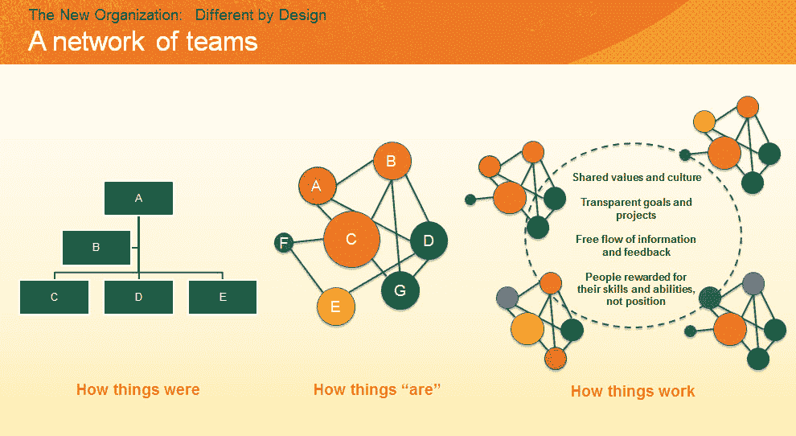

# 基于项目的工作——是招聘的未来吗？

> 原文：<https://medium.com/hackernoon/project-based-jobs-is-it-the-future-of-recruitment-a17d5640de48>

我们的一名团队成员最近度假回来。他承认，他没有去看望家人，而是在公寓里呆了一周，狂看电视节目。他对制作部分感兴趣，好莱坞可以教你很多关于团队合作的趋势。

当一个电视真人秀节目制作完成时，一个团队会聚在一起做一个项目——然后他们会在项目完成后转移到不同的项目上。尽管感觉这是脱节的，但这种方法实际上允许制片人根据他们的技能组合、工作风格和主要兴趣创建完美的团队。共同的目标感使团队能够创造高质量的产品。

# 在幕后

基于项目的职位相对于全职职位的增加已经导致招聘行业发生了翻天覆地的变化。2014 年，[《卫报》](http://www.theguardian.com/commentisfree/2014/sep/17/the-hidden-underclass-how-australian-underemployment-is-concealed)宣布，澳大利亚各地涌入的临时工正以令人眩晕的速度增长，目前约有 35%的工人受到定期和基于项目的合同的影响。

对于受技术干扰或应对变革管理流程的公司来说，项目工人是劳动力的一个子集，具有几个显著的优势:移动性、敏捷性和一系列技能。从财务的角度来看，这些角色要有利得多，通过实施这些角色，您可以创建一种更快的方法来确定人才缺口。

谷歌将其大部分工作组织成项目，这意味着项目团队的效率等于生产力。软件开发人员已经遵循这种“敏捷工作实践”很多年了。开发人员在小团队中工作，可能有遍布世界各地的人，在一系列冲刺中，短期目标朝着最终目标发展。当项目结束时，团队断开连接，成员加入其他项目团队。

*根据德勤 Bersin 的负责人 Josh Bersin 的说法，* [*这种模式*](http://joshbersin.com/2016/03/the-new-organization-different-by-design/) *更接近我们今天的实际工作方式。数字化、全球化和全球范围内日益增长的***(波动性、不确定性、复杂性和模糊性)的结合，推动着人们对更大的创新、更好的绩效和更加以客户为中心的能力的需求，以保持竞争力。公司越来越多地在伯辛所谓的“团队网络”中运营，而不是固定的、等级森严的筒仓和部门，每个团队都很小、灵活且富有成效。**

**

*资料来源:贝尔辛*

# *但这种方案在未来行得通吗？让我们看看为什么它能*

# *更高的灵活性*

*企业领导人知道，竞争优势取决于解决技能短缺和快速实施变革的能力。越来越多的公司在推出一个重大项目或启动一项新计划时，都采用创业思维。雇用具有特定专业知识和专业成就的项目员工，而不是需要培训的全职员工，是弥补人才缺口的最快方式，同时也能快速实现短期目标，而且还会扰乱组织的结构。*

# *招聘*

*在传统的公司里，工作描述是静态的、定义明确的:有人被雇来担任特定的角色，承担特殊的责任。但在这个以团队为基础的世界里，员工不会停留在一个职位上，而是在团队之间流动，这要求人力资源主管重新考虑他们雇佣谁。因此，在招聘时，人力资源需要创建更宽泛的职位名称和描述，以表明人们可能会在不同的团队中工作。*

# *即时创新*

*基于项目的员工通常会带来从一系列具有挑战性的角色中获得的技能和经验。在许多情况下，他们已经在多个行业、国家和项目中工作过——这种品质培养了灵活性、新想法和对最佳实践的理解。项目工作者的价值还来自于他们能够将创新视为工作方法的一部分，而不是一个时髦词。总之，这种将新想法带到桌面上并迅速推广的能力是获得竞争优势的催化剂。《哈佛商业评论》中的一篇非常老的文章显示，尽管一些临时工面临着获得全职工作的问题，但其他人选择这一选项来拓宽他们的技能组合，丰富他们的经验，或设计一个提供更有吸引力的前景和最能满足他们的职业生涯。*

*总之，基于项目的工作的兴起提出了一个有趣的问题，即员工不断变化的价值观和雇主的长期目标之间的关系。个人和职业成长在当今的招聘市场中发挥着至关重要的作用，这些转变是不可避免的。人们不想一辈子呆在一家公司每天做同样的事情，他们想学习，发展新的技能，向世界展示他们的进步。*

*对于那些现代和积极主动的人，我们创造了一个工作平台——根据你的心理类型、专业技能和成就，帮助你找到最合适的公司和职位。员工不再局限于一份工作、一家公司、一个城市甚至一个洲。这里的问题是，你必须通过附上证书或其他证明文件来证明你所写的数据。此外，如果没有什么让你想辞去你不喜欢的当前工作，你仍然可以通过推荐一个朋友或熟人获得空缺职位来获得奖励(即使他们在面试后没有找到工作，也会获得奖励)。要了解更多关于该项目的信息，请访问[本页](https://aworker.io)。*

*在评论中让我知道你对基于项目和传统工作方案的看法！*