# m

> 原文：<https://medium.com/hackernoon/project-blockhead-an-ethereum-smart-contract-service-broker-for-kubernetes-and-cloud-foundry-88390a3ac63f>

# **Project BlockHead:一个面向 Kubernetes 和 Cloud Foundry 的以太坊智能合约服务代理**

*这篇博文由* [*斯韦塔雷帕库拉*](https://medium.com/u/46bb227e00e9?source=post_page-----88390a3ac63f--------------------------------)*[*摩根鲍尔*](https://medium.com/u/aa215fb644c5?source=post_page-----88390a3ac63f--------------------------------)*[*乔纳森伯克汉*](https://medium.com/u/3f0e921f0d1b?source=post_page-----88390a3ac63f--------------------------------) 合著**

**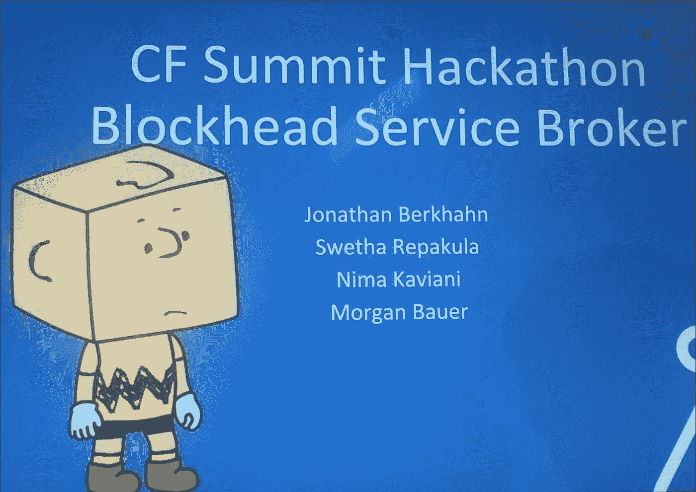**

**随着人们对区块链 T21 技术越来越感兴趣，软件开发商正在考虑将智能合同集成到他们的应用程序中。使用区块链开发和集成的应用程序通常由两部分组成:**

*   **部署到区块链[网络](https://hackernoon.com/tagged/network)的智能合同**
*   **绑定到已部署的协定并使用它的 Web 应用程序。**

**智能合同可以被认为是区块链网络中给定地址可用的代码片段，它能够接收和处理输入数据，检索或更新分类帐状态，并将结果返回给请求方。使用契约的 web 应用程序通常被称为 Web3 应用程序。**

**尽管使用区块链令人兴奋，但是部署智能合约并将其集成到 Web 应用程序中的端到端多步骤过程相当繁琐。应用程序开发人员需要:**

1.  **开发或重用智能合同**
2.  **编译合同代码**
3.  **检索可执行二进制文件和应用程序二进制文件接口(ABI)**
4.  **调出一个区块链节点(例如以太坊)**
5.  **在节点中创建或导入一个帐户(即钱包)**
6.  **使用该帐户将二进制代码部署到区块链网络中**
7.  **验证部署并检索合同地址**
8.  **最后，在 Web 应用程序中使用帐户地址、合同地址和合同 ABI 的组合来绑定到合同并使用它**

**人们一直在努力简化智能合同的开发过程。例如， [Truffle](http://truffleframework.com/) 提供了一个开发框架，可以建立一个本地[以太坊](https://hackernoon.com/tagged/ethereum)网络，并允许开发者试驾他们的智能合约应用程序的开发。**

**[](http://truffleframework.com/) [## 松露套装-你的以太坊瑞士军刀

### 块菌是用 JavaScript 以完全模块化的方式编写的，允许你选择和…

truffleframework.com](http://truffleframework.com/) 

然而，当部署到主以太网(mainnet)或测试网络(testnet)时，开发人员仍然需要手动完成区块链节点的配置过程，以确保成功部署并将其合同与其应用程序集成。

作为开源平台工程师，我们努力为软件工程师简化应用程序开发过程。平台即服务(PaaS)存在的前提是让开发者更容易部署、扩展和管理他们的应用程序；像 Kubernetes 和 Cloud Foundry 这样的平台在简化应用程序生命周期管理方面已经取得了长足的进步。根据同样的前提，我们认为 PaaS 平台能够并且应该简化智能合约应用程序的开发，并使其成为部署到 PaaS 的智能合约应用程序的生命周期的一部分。这就是为什么木头人项目诞生了。

Project BlockHead 利用开放服务代理 API 规范来构建位于 Web 应用程序和区块链网络之间的服务代理层。这样，代理通过自动创建和部署智能合约，然后向 Web 应用程序公开所需的信息集，来控制智能合约的管理。

# 开放式服务代理 API

[开放服务代理 API (OSB API)规范](https://github.com/openservicebrokerapi/servicebroker/blob/v2.13/spec.md)提供了一个公共接口，用于创建服务市场并将其集成到云应用中，这样服务可以独立于应用进行维护和管理，而应用可以通过公开的 API 轻松绑定和使用服务。服务代理负责向市场发布服务产品和服务计划的目录，并根据市场的请求进行供应、绑定、解除绑定和取消供应。

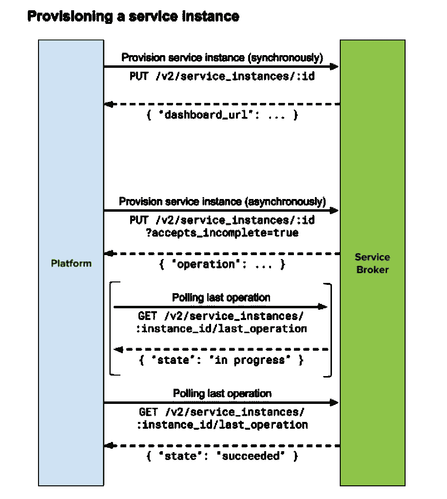

借用 OSB API 的规范，provisioning 将服务上的资源保留为实例。在 BlockHead 代理的上下文中，服务实例表示连接到区块链网络的区块链节点。绑定所代表的内容也可能因服务而异。绑定的创建为服务实例提供了智能协定信息，以便对其进行编译和部署，并对使用该服务的应用程序可用。平台市场可以展示来自一个或多个服务代理的服务，并且单个服务代理可以使用不同的 URL 前缀和凭证来支持一个或多个平台市场。上图显示了与 service broker API 交互以提供服务的示例。"

关于如何与服务代理交互的更多细节可以在下面找到:

[](https://github.com/openservicebrokerapi/servicebroker) [## openservicebrokerapi/service broker

### servicebroker -开放服务代理 API 规范

github.com](https://github.com/openservicebrokerapi/servicebroker) 

# 笨蛋服务经纪人

通过 project BlockHead，我们旨在将每个 OSB API 调用转换为智能合约生命周期中的一系列步骤，从而向应用程序开发人员隐藏与区块链交互的复杂性。

代理的第一个版本建立在云铸造社区项目[容器服务代理](https://github.com/cloudfoundry-community/cf-containers-broker)之上。通过利用容器服务代理，区块链节点可以在隔离的 Docker 容器中运行，并在部署和绑定智能合约时独立运行。

我们利用代理按需部署有状态以太坊节点。然后修改供应和绑定或解除绑定和取消供应中的每个步骤，以在创建/删除智能合约或节点时交付。下图提供了 Blockhead service broker 如何调配以太坊节点并与 Cloud Foundry 应用程序集成的整体架构:

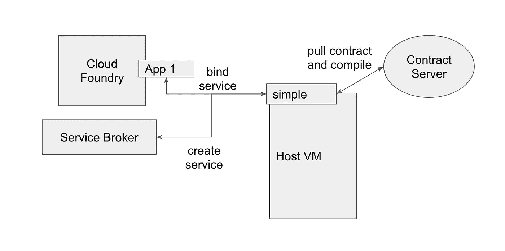

The overall interaction model between the BlockHead service broker and Cloud Foundry applications

## 1.部署代理

笨蛋经纪人的[初始版本作为 BOSH 版本发布。BOSH 版本是一个版本化的集合，包括配置属性、配置模板、启动脚本、源代码、二进制工件以及以可复制的方式构建和部署软件所需的任何东西。](https://github.com/nimakaviani/container-broker)

 [## nimakaviani/以太坊-集装箱经纪人

### 在 GitHub 上创建一个帐户，为以太坊容器代理的开发做出贡献。

github.com](https://github.com/nimakaviani/ethereum-container-broker) 

在这篇博文中，我们将 BlockHead service broker 与 Cloud Foundry 一起部署。这使我们能够从 Cloud Foundry 的功能中受益，推动 Web3 应用程序并将其绑定到合同服务。有关如何部署 Cloud Foundry 的说明，请参考下面的文档。

[](https://github.com/cloudfoundry/cf-deployment) [## cloud foundry/cf-部署

### cf-deployment——Cloud Foundry 的规范开源部署清单

github.com](https://github.com/cloudfoundry/cf-deployment) 

一旦您拥有一个部署了 Cloud Foundry 的 BOSH 部署环境，部署 BlockHead 代理就像运行以下脚本一样简单:

deply.sh from https://github.com/nimakaviani/container-broker

由于 Kubernetes 与 Open Service Broker API 兼容代理集成，如果您有 Kubernetes 部署，您可以将部署的 BlockHead 代理连接到您的 Kubernetes 平台，并使用部署到 Kubernetes 的 Web3 应用程序绑定到部署的智能合同。你可以在这里找到如何与 Kubernetes [进行整合。](https://github.com/nimakaviani/ethereum-container-broker/tree/master/docs/kube)

## 2.服务市场和合同市场

为了让代理出现在 Cloud Foundry marketplace 中，您需要首先使用以下命令注册它:

```
bosh run-errand -d docker-broker broker-registrar
```

代理注册后，您可以查询市场，您将看到以太坊服务出现在市场中:

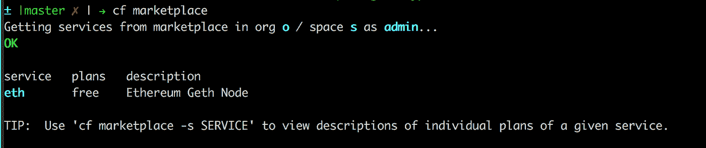

除此之外，我们还开发了一个[简单的合同市场](https://github.com/MHBauer/contract-marketplace) e，它允许我们列出合同，然后在将应用程序绑定到以太坊节点时使用它们的 URL 引用它们。要部署合同市场，您可以将您的智能合同添加到市场，构建 docker 映像，将其推送到 docker 注册表，然后使用类似于以下内容的命令来下载和使用它:

```
cf push contract-marketplace --docker-image nimak/contract-marketplace
```

您可以通过检查`cf apps`来验证应用程序是否启动并运行:

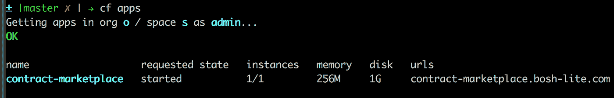

在我们的示例中，市场位于以下地址，导航到该地址，我们可以找到网站:

```
[http://contract-marketplace.bosh-lite.com/posts/solidity/](http://contract-marketplace.bosh-lite.com/posts/solidity/)
```

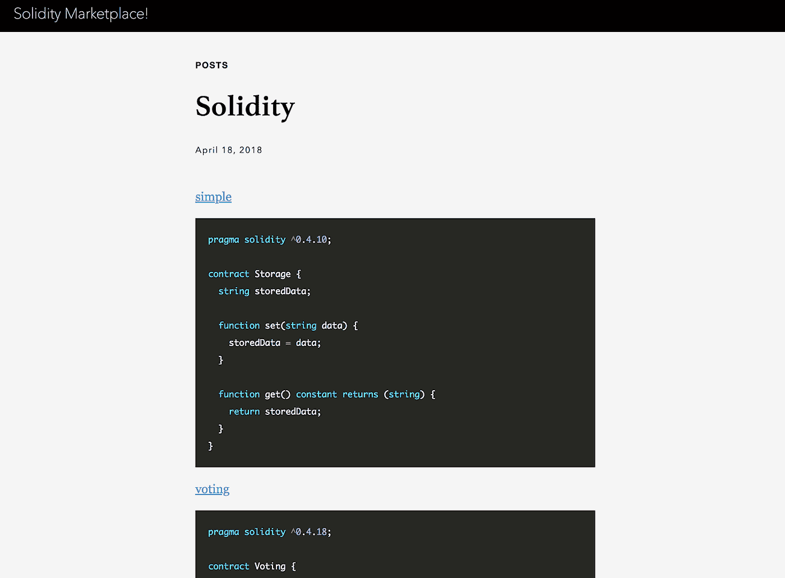

请注意，在每个合同定义的顶部，有一个指向该合同代码的超链接引用。这个契约 URL 是我们用来将服务绑定到应用程序和部署契约的。注意，部署契约市场是可选的，如果您有其他方法为以太坊服务提供智能契约 URL，它也完全可以工作。

## 3.提供服务实例

当发出提供服务实例的请求时，代理启动一个以太坊节点。以太坊节点公开其用于交互的远程过程调用(RPC) api，并通过给定的地址和端口号使端点可用。

为了创建节点，您需要首先部署一个打算使用智能合约的 Web3 应用程序。对于这篇博文，我们将使用我们的[简单节点应用程序](https://github.com/nkaviani/eth-apps/tree/master/sample-node-app),它只向分类帐写入和从中读取一个值。请注意，由于应用程序还没有连接到它的契约，所以我们在推送应用程序时不会启动它，否则部署将会失败。

```
$ git clone [https://github.com/nimakaviani/eth-apps](https://github.com/nkaviani/eth-apps)
$ cd eth-apps/sample-node-app
$ cf push nora --no-start
```

验证应用程序`nora`是否被推送到您的 Cloud Foundry 部署中:

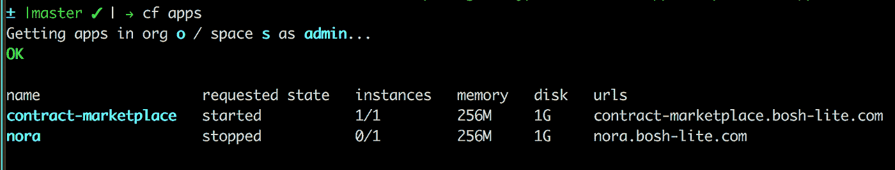

接下来，我们为部署的应用程序创建以太坊服务:

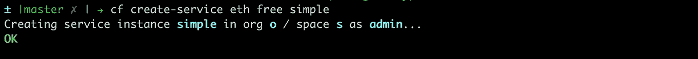

对于创建服务的请求，service broker 创建一个 docker 容器，在其上运行一个 Ethereum 节点。

这可以用 BOSH 通过连接到代理部署中的 docker VM 并查看它正在运行的 docker 容器列表来验证(注意，每个 docker 容器运行一个对应于所创建服务的 Ethereum 节点的实例)。

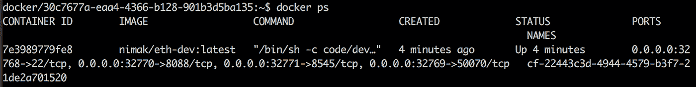

您可以看到以太坊节点的服务器运行在端口`8545`上，该端口从外部映射到主机虚拟机上的端口`32771`。

## 4.创建服务绑定

当绑定到服务时，URL 形式的智能合约的位置被传递给代理。代理下载合同，编译合同，提取 ABI，并使用启动服务时创建的帐户将二进制文件推送到以太坊节点。

我们前面提到过，示例合同市场提供了给定合同的链接，因此我们可以简单地获取合同的 URL 位置，并将其绑定到应用程序。

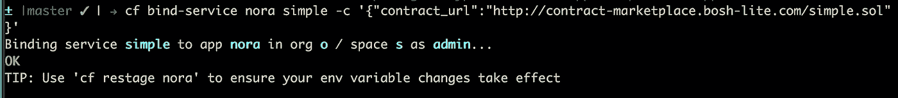

注意，在绑定服务时，我们将`contract_url`以内嵌 JSON 配置的形式传递给`cf bind-service`。

随着服务绑定的成功完成，我们可以发出一个`cf env`命令来查看应用程序的环境变量的更新列表。

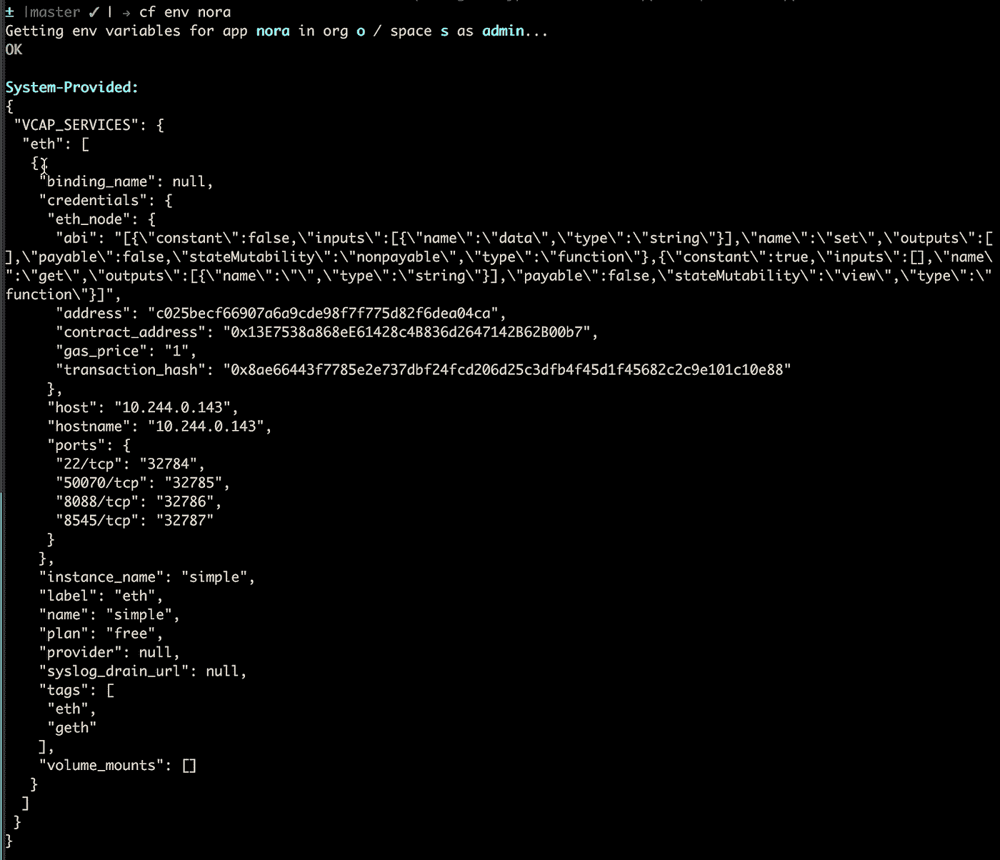

在`VCAP_SERVICES`下，`eth`的配置涉及`eth_node`的`credentials`数据，如*契约* *abi* ，*账户地址*，*契约地址*，*交易散列*用于部署的契约，以及*主机地址*和*端口*的映射，用于应用连接到以太坊节点。

回到前面提到的示例节点应用程序，您会看到应用程序中的代码使用这些环境变量来绑定到智能协定并使用它。

Code snippet to bind Web3 application to the deployed smart contract in Cloud Foundry

瞧啊。有了这些信息，您就可以使用智能合约为 node.js 应用程序定义获取和设置分类帐值的路径:

Set and Get values into the blockchain ledger using deployed contract and Web3 application

## 5.删除服务绑定

在解除服务绑定时，代理假定不再需要绑定阶段使用的契约，因此，在收到解除绑定请求时，代理将服务从应用程序中分离出来，并从`VCAP_SERVICES`中删除注入的契约信息，但保留节点以备其他契约部署。新部署的契约将使用在服务创建阶段创建的相同帐户的相同以太坊节点。

在我们正在运行的示例中，以下命令将解除契约的绑定:

```
cf unbind-service nora simple
```

## 6.取消供应服务实例

当发出取消供应服务的请求时，service broker 继续删除 docker 容器:

```
cf delete-service eth
```

# 挑战和未来改进计划

## 1.同步分类帐

像许多其他区块链网络一样，以太坊中的节点需要完整的分类账才能使后续交易生效。这意味着由 BlockHead service broker 创建的 docker 容器要么需要在创建时包含完整的分类帐，要么需要在创建容器后同步分类帐。后者非常耗时。mainnet 以太坊的分类帐大小约为 600GB，并且还在增长。给定分类帐的大小，被配置的以太坊节点将花费相当多的时间来同步其分类帐并准备就绪，这使得集成不切实际。

另一种解决方案是让 service broker 维护一个温暖的 docker 映像，其中包含一个最新的分类帐副本，以便在创建服务时使用。这要求代理运行一个端节点，该端节点不断地将其分类帐与以太坊网络的分类帐同步，并定期创建和发布以太坊节点 docker 映像。

目前，service broker 在开发人员模式下启动以太坊节点，这意味着从一个新的分类帐开始。这有助于我们快速建立一个开发环境来测试 Web3 应用程序，同时避免长时间等待分类账同步。我们计划实现一些技术，允许以太坊节点快速启动 mainnet 或 testnet，用于生产目的。

## 2.内存占用

同步分类帐包括从网络中的其他对等方读取交易块，验证它们，然后将它们添加到分类帐的本地副本中。由于写入磁盘是 I/O 密集型操作，以太坊节点会在内存中维护分类帐的一个子集，同时在将新数据块写入磁盘之前执行节点的验证和链接。这限制了部署以太坊节点的虚拟机的内存使用，并为代理可以运行和管理的容器数量设定了上限。

## 3.账户管理

如前所述，以太坊节点在能够部署契约之前需要绑定到一个以太坊帐户。这意味着代理要么需要管理以太坊帐户，要么在内部创建并向应用程序开发人员公开这些帐户，要么允许开发人员导入他们自己的帐户供代理使用。

目前，删除智能合约服务和相应的以太坊节点后，帐户将被丢弃。这将被修改为帐户可导出/下载。

# 摘要

在这篇博文中，我们讨论了 BlockHead 项目作为服务代理的实现，该项目将在 Cloud Foundry 和 Kubernetes 等 PaaS 平台中使用。项目 BlockHead 的目标是通过消除部署和管理区块链节点的复杂性，简化智能合约在 Web3 应用程序中的部署和使用。

虽然我们描述了部署和使用代理的端到端过程，但是应用程序开发人员只需要关心上述过程的步骤 3 到 6。这包括创建一个智能合约服务并将其绑定到应用程序。部署 service broker 和契约市场的步骤 1 和 2 可能只需执行一次，通常由平台工程师和运营工程师管理，从而简化了整个流程。

Project BlockHead 是在 2018 年波士顿 Cloud Foundry Summit 期间作为黑客马拉松项目出现的，正如你可能已经注意到的那样，我们在这篇博文中分享的大多数存储库都是我们参与黑客马拉松的团队的个人 github 存储库。幸运的是，该项目已经收到了社区的大量兴趣，希望在不久的将来，它将作为孵化项目找到一个新的家，并得到适当的 CI/CD-ed。因此，请回到这篇博文，进一步了解在哪里可以找到官方的项目资源库。这是一个开源项目，我们当然欢迎任何有助于改进它的贡献。**