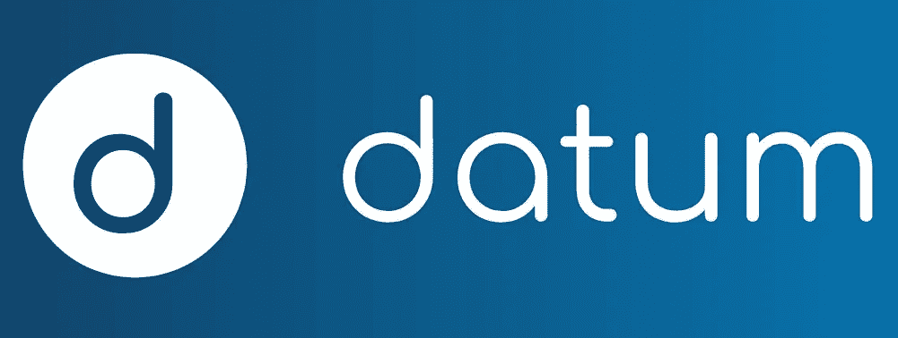
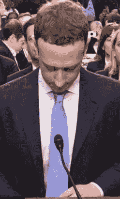

# 项目数据:将你已经给出的数据货币化

> 原文：<https://medium.com/hackernoon/project-datum-monetizing-data-youre-already-giving-away-e48c78b8ecfe>

Reclaim What’s Rightfully Yours

像脸书和谷歌都是关于数据的。你的数据。我的数据。所有用户的数据。这是一个只会越来越大的赚大钱的行业。

具有讽刺意味的是，在注册服务时，我们都通过勾选“服务条款”来收集数据。谁有时间读小字？

软件服务和社交网络的创造者指望我们要么完全忽略他们的条款，盲目地同意，要么 FOMO 插手，我们不管不顾地签字放弃我们的灵魂。

因为，你知道，就连你奶奶和她的大部分赌场都在脸书。我是说，拜托，有什么会出错的？

Oh… right… it DID go terribly wrong…

关键是，这些大公司收集我们的数据，并在未经我们同意的情况下出售这些数据，从中获取巨额利润。

我不知道你怎么想，但我就是不喜欢这样。感觉有点粘。

我怀疑你会在短期内关闭社交媒体或你最喜欢的搜索引擎。我现在还不想给你指出那个方向。

但是，如果你想在区块链上保护同样的数据——然后因为匿名分享它而获得回报——请继续阅读，了解关于 [**Datum**](https://datum.org/) 的信息，这是一个后 ICO 去中心化的存储网络和数据市场。

在我透露更多之前，有些事情你应该知道…

****免责声明*** *:这不是投资或理财建议。无论如何我都不是金融专家。本文中的大部分信息都是推测性的，仅仅是我个人的观点。在参与任何创业项目之前，一定要进行自己的研究。*

永远记住，你用你的资金做什么是你自己的决定。如果这个决定对你一个人来说太难了，向金融专家寻求指导。

*我可能会也可能不会收到创建此内容的少量令牌分配。也就是说，我会尽我所能保持公正和公平。我尽量避开所有的 FOMO 和 FUD，也绝不希望把这些情绪传染给我的秘密首脑伙伴们。*

在开始对项目进行分析之前，让我们先让您了解一下最新情况。用他们自己的话说，这就是数据的意义所在:

Hey, buddy, why don’t you go encrypt yourself?

# 你所有的数据都属于你，而不是他们

尽管你可能会违背自己的意愿把它送给别人，但你的数据仍然是你自己的。毕竟你的数据是，嗯……是你。数据是你的图像和肖像，以及个人识别信息，如护照号码和你的家庭住址。

它的各个部分的总和创造了一个包，这个包唯一地把你标识为除你之外的任何人。这是你的数字生活。

> Datum 提供了一种加密的、无限可扩展的存储解决方案，用于保护您的在线角色和其他重要数据。

你的数据不会在随机的服务器上四处流动——让某些员工窥探隐私——Datum 让你用一个区块链锁定它。

当评估基准项目的用例时，脑海中会立即浮现出图像。有没有觉得有点淫荡，给你的爱人发了一张照片，那绝对是 NSFW？

我打赌你不会想让里面的鲍勃偶然发现这个。我也是。

当然，事情远不止如此。如今，合同并不是唯一变得更聪明的东西。你的家，你的电视，甚至你的衣服都可以产生数据。

由于物联网(IoT)技术的激增，我们周围的几乎每一个设备都变得越来越智能，越来越具有沟通能力。

在不久的将来，有一天我们的烤面包机将能够检测我们放入的面包上的霉菌含量。演讲会 5000 可以向冰箱传递信息，进而建议其工作人员尝试不同的面包储存位置。

# 重新获得控制权

夺回属于你的东西并不容易。免费赠送我们的数据是我们倾向于不去考虑的事情。这意味着做出改变需要一点精神上的努力。啊哦！

也许你需要一点刺激来唤醒你，让你继续前进？好吧，如果你是那种受金钱驱使的人，仔细想想这条小小的信息:你的个人数据每年价值超过 2000 美元——这是 Datum 的估计，不是我的。

不，我没有不小心多加了一个零。

> FB、Google、Twitter、LinkedIn 以及所有类似的公司每年通过出售你的数据赚取 2000 多万美元。

现在，我不是说你会通过使用数据网络每年赚 2000 美元。可能会更少，甚至更多。涉及到许多不同的因素，这使得一个数字很难确定。

但即使是其中的一小部分也很好，尤其是考虑到这些数据确实属于我们，尽管除了我们之外的所有人都为此获得了报酬。

# 由区块链技术支持

Datum 的网络本质上是一个分布式数据库。但由于这不够安全，整个行动由一个区块链账本支持。

智能契约不仅仅是将数据转储到存储库中，它还允许不可变的数据由合法所有者进行结构化和控制。

所有进入网络的数据都是加密的。当加密发生时，数据被标上使用条款。作为数据的所有者(无论是私有数据还是企业数据)，您可以控制谁可以查看或使用数据，数据是否匿名，数据的使用期限等等。

你会问，怎样才算“更多”？好吧，既然*你*提出来了…那我们就来谈谈货币化吧…

# 获得报酬

现在我们开始有趣的部分，奖励你已经在做的事情。我觉得概念是区块链技术最好的属性之一。令牌有能力使事情变得容易得多。

数据生态系统中的数据生成者有几种不同的方式来获得回报。虽然企业解决方案正在开发中，但 Datum 的应用程序(目前处于测试阶段)目前是供个人使用的。

下一篇文章将更深入地探讨该应用的功能，但我们将在这里讨论顶级细节。

App 用户从 1 级开始。通过分享数据来获得 DAT 令牌，您还可以获得类似 MMO 的经验值，让您可以升级到更高的级别来获得更大的奖励。

数据购买者可以进行一次性或基于订阅的购买，您可能会获得一次性奖励，也可能是经常性的奖励。

付费邮件就是应用程序中可用内容的一个例子。

有一个拨动开关，让你打开和关闭电子邮件征求。通过同意接收电子邮件——营销商并不拥有你的电子邮件地址，只有发送邮件的权利——你将获得高达*100*DAT 代币的补偿。

当前的熊市没有任何帮助，但 DATs 的当前汇率约为 0.01 美元。按 100 个代币的全额计算，一封电子邮件就是 1 美元。

当然，这个项目还处于初期阶段，电子邮件也不是每天都有。但是随着它的成长和加密市场的发展——希望很快！—恢复，用户应该会看到更大的回报。

你能想象平均每天 10 封电子邮件吗？我可以，这不难。每月 300 美元的额外收入听起来很诱人。

你的电子邮件地址只是你可以链接到应用程序的许多数据源中的一个，你整合的每个数据源都有自己的回报。

# 最后的想法…

作为生活在科技时代的人类，我们创造了大量的数据。我们的手机——在某些情况下几乎与我们的手融为一体——产生的数据造就了数据婴儿和数据孙辈。

关键是，你每天都在创造数据。大型网络沉浸在你为它们创造的利润中，就像史高治·麦克老鸭沉浸在他的金色令牌池中一样。

现在，我很享受分享匿名数据收取报酬的概念。匿名部分是关键。反正对我来说。

我倾向于注重隐私，不喜欢泄露我的信息。但是如果像电子邮件地址这样的东西没有个人关联，我很乐意分享我的来换取代币。

这是一个超级简单的方法去 HODL，这就是我的全部。

在下一篇文章中，我们将讨论项目的 DAT 令牌在平台中是如何工作的。但是在那之前…

## DYOR

做自己的研究是一个全行业的建议。加密市场波动性和投机性很大，很难评估任何项目的真实价值。

然而，形成自己的观点仍然很重要。

白皮书是一个很好的起点。 [**数据白皮书**](https://datum.org/assets/Datum-WhitePaper.pdf) 清晰且插图精美。比起我遇到过的一些技术猛兽，读起来非常轻松。

以下是一些可供您深入研究的资源:

*   [**基准网站**](https://datum.org/#main)
*   [**App 下载**](https://app.datum.org/)

## 社交化

> [**【脸书】**](https://www.facebook.com/datumnetwork) [**领英**](https://www.linkedin.com/company/datumfoundation/) [**中等**](https://blog.datum.org/)
> 
> **电报(**[**EN**](https://t.me/datumnetwork)**/**[**RU**](https://t.me/datumnetworkRU)**/**[**【ZH**](https://t.me/joinchat/GeSsdkOjceIO76nbVpw8pw)**)**[**推特**](https://twitter.com/datumnetwork)

## 顺便说一下…

如果你喜欢你在这里看到的，并且需要帮助把你的加密信息传递给大众，我很想听听你的项目。

请随时联系我:blockchainauthor 作者在 Gmail