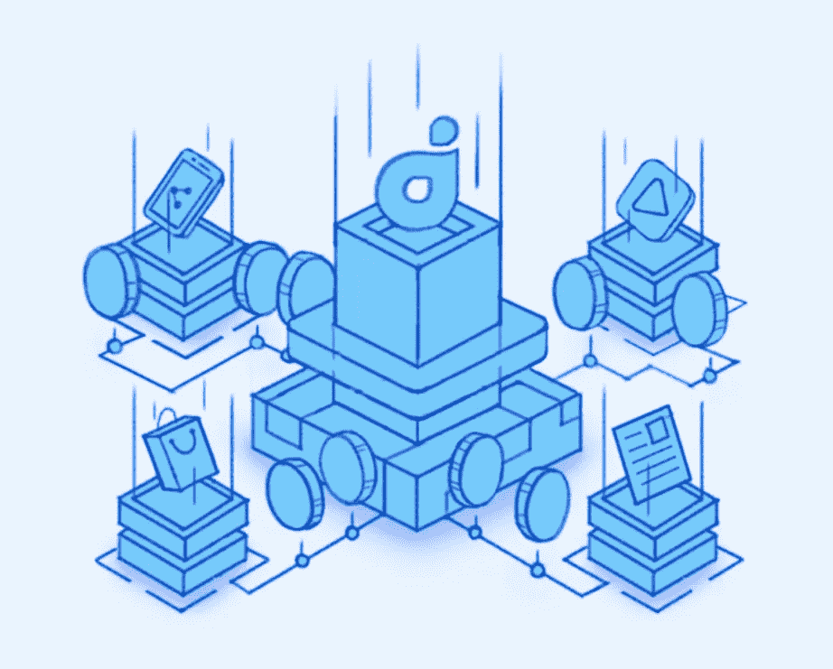
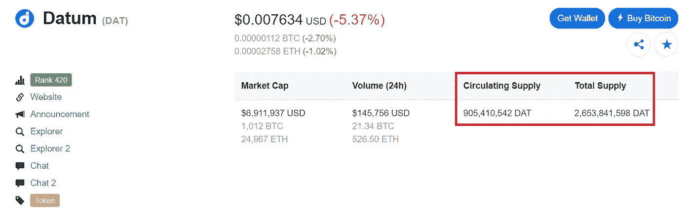

# 项目数据的 DAT 令牌:它是如何流动的？

> 原文：<https://medium.com/hackernoon/project-datums-dat-token-how-s-it-flowin-9746b928c08d>

Tokenize Your Anonymous Data

[**Datum**](https://datum.org/) ，一个后 ICO 时代的分散存储网络和数据市场，正在将个人信息重新放回其合法所有者手中。

在之前一篇关于 Datum 的文章中，我们讨论了项目正在做什么以及他们是如何做的。在返回这个页面之前，你可能想要 [**检查一下**](https://hackernoon.com/project-datum-monetizing-data-youre-already-giving-away-e48c78b8ecfe)…去吧…我就在这里等你。

你回来了。太好了！

现在，正如您刚刚读到的，有一些关于令牌化的讨论，但我们没有深入了解这些令牌如何在网络中流动的细节。

如果标题没有提示您，DAT 令牌是本文的主题。如果你上次错过了，这里有一些信息供你处理…

***免责声明*** *:这不是投资或理财建议。无论如何我都不是金融专家。本文中的大部分信息都是推测性的，仅仅是我个人的观点。在参与任何创业项目之前，一定要进行自己的研究。*

永远记住，你如何使用你的资金是你自己的决定。如果这个决定对你一个人来说太难了，向金融专家寻求指导。

*我可能会也可能不会收到创建此内容的少量令牌分配。也就是说，我会尽我所能保持公正和公平。我尽量避开所有的 FOMO 和 FUD，也绝不希望把这些情绪传染给我的秘密首脑伙伴们。*

# 巨大的库存

让我们复习一些 DAT 令牌的基础知识。我们将从 DAT token 的巨大总数开始。是的，它很大。但这也是通货紧缩。

尽管数据项目的白皮书列出了 30 亿枚代币**的总供应量，但 CoinMarketCap 不敢苟同。**

**CMC 估计总数为 26.5 亿，这很接近。但是 3500 万英镑的差额——比白皮书的数字低 10%——比其他一些加密货币的总量还要多。**

****

**Screenshot taken August 30, 2018\. I fully guarantee a different price by the time you see this**

**无论哪种来源最准确——该白皮书是 10 个月前发布的，CMC 在令牌供应骗局方面享有盛誉——都会有大量 DAT 令牌在网络中流动。**

**然而，即使 DAT 令牌的总供应量是数十亿，它仍然是一个固定的供应量。毕竟，我们谈论的是加密，而不是心血来潮的印刷。我更喜欢前者的概念。**

> **CoinMarketCap 没有告诉您的是，DAT 令牌的总体供应量将会随着时间的推移而减少。交换网络特权的令牌将被删除。**

**现在，当计算一个代币的价值时，巨大的供应量是可以拉低价格的等式的一部分。**

**但是，如果你相信基本面坚实的硬币和代币有一天会回到——并且有希望超过——它们的历史高点，那么看看目前不到一便士的价格。**

**现在来比较一下今年 1 月 DAT token ATH 13+美分的价格。记住，我并不是想给你任何财务建议。我不是说你今天应该去装满一袋代币。**

**我只是分享一些我觉得有趣的小信息…就这样吧。**

## **当前交流**

**在加密市场获得更多的法定网关之前，获得某些硬币可能有点棘手，特别是如果它们被限制在分散的交易所。**

**这个过程可能是这样的:**

1.  **发现令牌**
2.  **研究令牌**
3.  **决定在包里装满代币**
4.  **希望代币可在您已经拥有帐户的交易所使用**

**虽然你看不到它们都在 CMC 上列出，但现在交易 DAT 令牌的交易所列表如下:**

> **[AEX](https://www.aex-global.com/)[air swap](https://airswap.io/trade)**[CEX](https://cex.plus)[CoinW](https://www.CoinW.me)[Coss . io](https://coss.io/)[easy trade](https://easytrade.io/)[ether delta](https://etherdelta.com/#DAT-ETH)[fork delta](https://forkdelta.github.io/#!/trade/DAT-ETH)[**火币**](https://www.huobi.pro/dat_eth/exchange/)**[iDEX](https://idex.market/eth/dat)[Joyso](https://joyso.io/)[**KuCoin**](https://www.kucoin.com/#/trade.pro/DAT-ETH)******

******我发现 KuCoin 的用户界面相当简单。如果你在币安交易，你会感觉如鱼得水。但如果你追求高数据量，OKEx 是赢家。******

# ******赚取 DAT 代币******

******将你的匿名数据货币化是数据项目的核心，也是平台内交换的主要原因。******

******当你允许广告商使用你的加密信息时，你就获得了 DAT 令牌。此外，您还可以选择取消某些数据的匿名化，以获得更多奖励。******

******另外，如果你花时间丰富你的数据，它在数据网络上有更高的价值。丰富的方法包括将您的数据链接到社交媒体档案和 Datum 的外部合作伙伴。******

******另一种让你的数据更有价值的方法是将数据同步到区块链的身份验证服务上。目前的选择有 uPort 和思域。******

******我过去用过思域——连接过程很快，你只用一部智能手机就能完成所有事情。******

## ******存储节点******

******分散式网络由单独的计算机— *常规*节点保护。根据定义，这些节点遍布全球。******

******节点负责保护网络。每个节点都可以验证事务，并包含它帮助运行的整个区块链的实时副本。******

******节点没有中断，因为它们在 24/7 运行时预计不会停机。******

******运行其中一个 Datum，您将获得 DAT 令牌奖励。******

******现在，网络的一些贡献者满足于操作存储节点。但是其他人对他们的计算能力有更高的期望。******

******如果一个标准节点想要达到特级大师的地位，它必须更加努力地工作…******

## ******是的，老师******

******主节点是与任何区块链项目的成功密切相关的特殊设备。在某些情况下，经营一个可能是非常有利可图的努力。******

******以下是 masternodes 执行的一些特殊功能:******

*   ********预算********
*   ********创建资金系统********
*   ********启用即时交易********
*   ********增强交易隐私********
*   ********参与治理&投票********

******然而主节点并不便宜。节点运行者本质上是在托管一个钱包，这个钱包应该是任何时候都可以访问的。******

******为此，你需要专用的存储空间，你自己的服务器或 VPS，以及一个静态 IP 地址。******

******最重要的是，你需要最少数量的代币来确保你钱包的生存能力。最低余额因项目而异。******

******至于 Datum，我在他们的文档中找不到运行一个节点所需的 DAT 令牌的最低数量。******

******所以，今天我通过电报联系了团队。他们告诉我，经营 DAT masternode 的细节——包括最低存款额——仍在讨论中。******

# ******消费 DAT 代币******

******这个数据项目不仅仅是为个人数据而做的。开发商和企业可以付费让 Datum 的网络保护他们的数据。******

******存储数据是付费的，你猜对了，DAT。******

******但是数据存储只是令牌的一个方面…******

## ******广告连接******

******对个人数据的强烈渴望助长了脸书剑桥分析公司的崩溃。******

******自我管理的数据——你的日常互联网活动——对广告商来说是无价的。我相信你对那些没完没了的烦人的侧边栏广告很熟悉，它们会在你上网冲浪的任何地方跟着你。******

******通过使用谷歌和 FB 等，你建立了一个个人档案，广告商通过向你提供高针对性的广告来利用它。******

******但是，Datum 对这个系统的主要升级在于一个简单的概念:许可。******

******你想要我的匿名数据吗，艾德曼先生？当然，拿着。但这要花你一些钱。不过，谢谢你先问我！******

******这就是文明社会的运作方式。我们不只是拿不属于我们的东西，我们要求并分享。******

# ******最后的想法…******

******最初，DAT token 的大量供应令人望而却步。我不喜欢看到硬币涨到几十亿。我犯了拒绝这个项目的错误。******

******但是再深究一下，就会发现一个有计划的通货紧缩体系。******

******供给减少的硬币在密码市场是受欢迎的。调整供给提供了在不依赖需求变化的情况下调整价值的方法。******

******除了它们的通货紧缩性质，DAT 令牌还有真实世界的用例。此外，该项目正在解决一个早就应该由区块链中断的问题。******

******我们正处于一个数据统治的时代。您的个人数据正在成为您最有价值的资产。它理应属于你。******

******Datum 项目的使命是将数据控制权交还给人们，这在今天当然是有意义的，而且随着全球技术采用率的持续增长，这种意义只会越来越大。******

******在本系列的最后一篇文章中，我们将回顾该项目的 Android 应用程序。******

******但是在那之前…******

## ******DYOR******

******如果您还没有，我鼓励您看一看 [**基准白皮书**](https://datum.org/assets/Datum-WhitePaper.pdf) **。该文件易于阅读，配有彩色插图。********

******此外，这里还有更多适合您的资源:******

*   ******[**数据网站**](https://datum.org/#main)******
*   ******[**App 下载**](https://app.datum.org/)******

## ******社交化******

> ******[脸书](https://www.facebook.com/datumnetwork) [中型](https://blog.datum.org/)[Reddit](https://www.reddit.com/r/datumnetwork/)[Steemit](https://steemit.com/trending/datum)******
> 
> *******电报(*[*EN*](https://t.me/datumnetwork)*/*[*RU*](https://t.me/datumnetworkRU)*/***)*[推特](https://twitter.com/datumnetwork)*******

## *******顺便说一下…*******

*******如果你喜欢你在这里看到的，并且需要帮助把你的加密信息传递给大众，我很想听听你的项目。*******

*******请随时联系我:blockchainauthor 作者在 Gmail*******