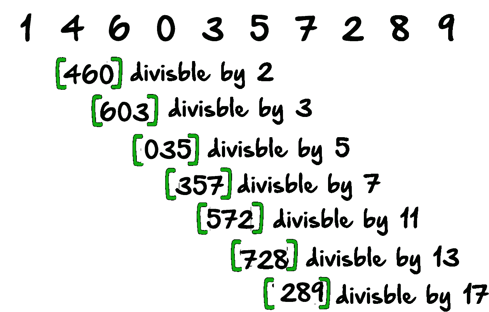
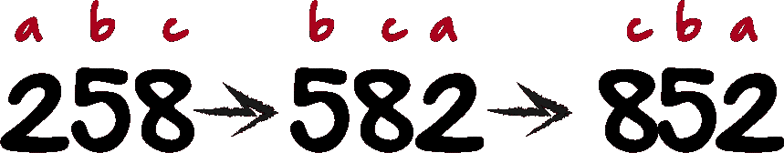
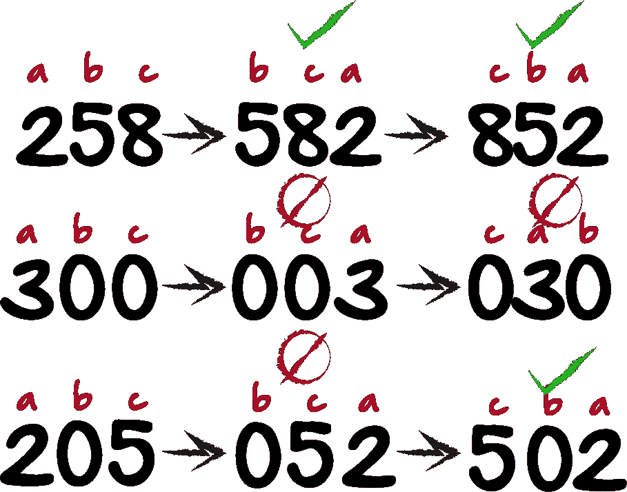
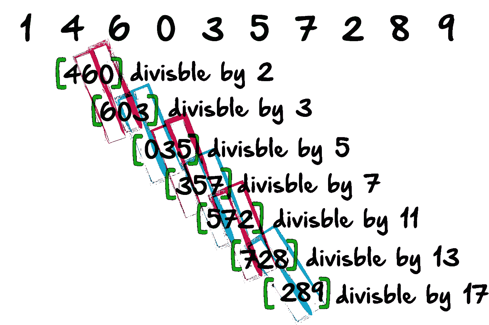
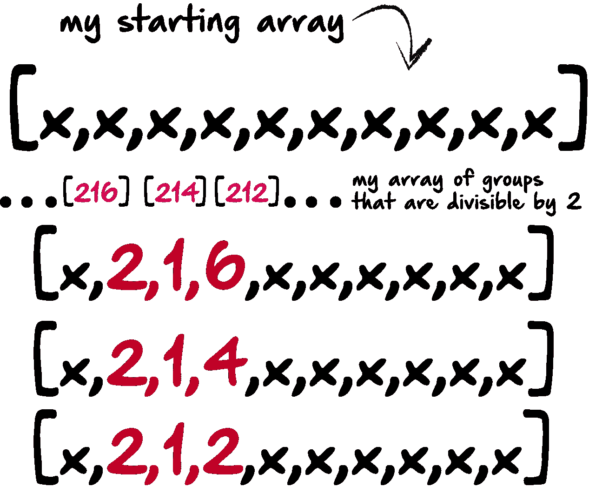
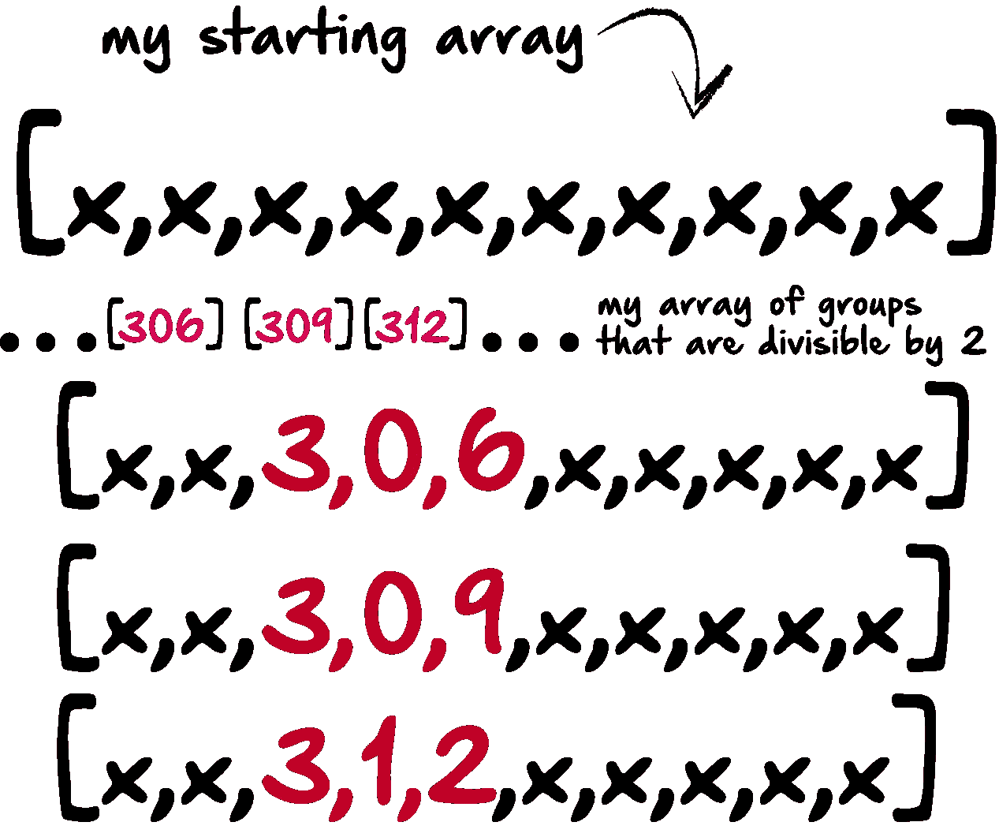
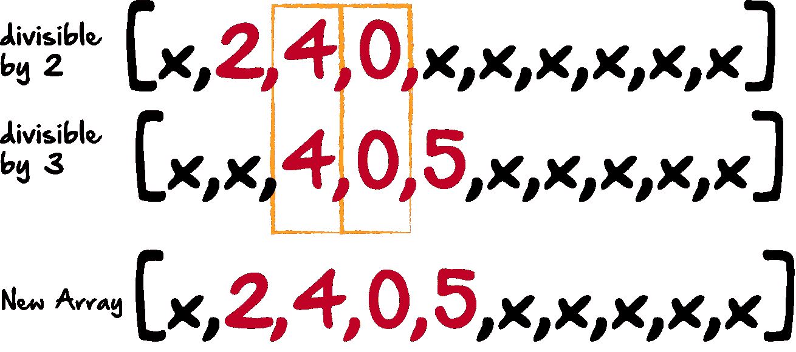
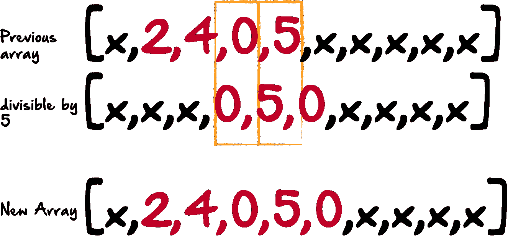

# JavaScript 中的欧拉项目# 43——泛数字中的子字符串除法。

> 原文：<https://medium.com/hackernoon/project-euler-43-in-javascript-1cc41be56aa2>



我从 projecteuler.net 获得了第 43 名。我将在这里讲述我是如何得出这个解决方案的。公平的警告，但是，我不是一个数学家。我勉强算是个像样的程序员，但绝对不是数学家。当我在做这个问题时，很明显，我的数学能力不足绝对是解决这类问题的绊脚石。因此，出于这个原因，我的大多数解决方案绝对是“蛮力”方法。不管怎样，现在问题来了:

数字 1406357289 是一个 0 到 9 的泛数字，因为它是由 0 到 9 的每个数字按一定顺序组成的，但它也有一个相当有趣的子串整除性质。

设 *d* 1 为第一位， *d* 2 为第二位，依此类推。这样，我们注意到以下几点:

*   *d*2*d*3*d*4 = 406 能被 2 整除
*   *d*3*d*4*d*5 = 063 能被 3 整除
*   *d*4*d*5*d*6 = 635 能被 5 整除
*   *d*5*d*6*d*7 = 357 能被 7 整除
*   *d*6*d*7*d*8 = 572 能被 11 整除
*   *d*7*d*8*d*9 = 728 能被 13 整除
*   *d*8*d*9*d*10 = 289 能被 17 整除

求所有 0 到 9 的泛数字的和。

所以我是这样想的。不管是好是坏，我认为这是一个问题，不是一个长的 10 位数，我真正看到的是一系列的 3 位数。在下面的例子中，第一组[460]需要能被 2 整除才能满足标准。那么第二组[603]将需要被 3 整除，以便满足标准，等等。


我的想法是，我可以简单地抓取 100 到 999 之间的所有数字，并测试每个数字，看它是否能被 2、3、5、7 等整除。但是后来我意识到我需要修改我的搜索，因为仅仅得到 100 到 999 之间的数字并不是我所需要的。我还需要以 0 开头的数字。

以下面的例子为例:



如果我得到了 100 到 999 之间的所有数字，比如说，258。没有理由修改这个数字。如果 2 是 a，5 是 b，8 是 c，我也不需要 bca 和 cba 的组合，因为简单地继续涨到 999 也会把那两个都抢到。但是，它不会抓取其中的一些:



如果我现在抓取的数字是 300，我现在的方法不会得到 003 或者 030。或者，如果我在 205，我不会得到 052，但我会得到 502。然后我意识到泛数字号码不重复任何数字。所以在中间的例子中，我不需要 300，003 或 030，因为它重复了两次 0。在下面的例子中，我需要 052，但是 502 已经是我的方法的一部分，所以也不需要修改。在这些例子中，我需要的字母组合只有“abc”和“bca ”,但是如果中间的数字是 0，就只有“bca”。下面是我的那部分代码的样子:

```
let numbersToTest = [];
for(i = 100; i < 999;  i += 1) {
    let str = i.toString();
    let split = str.split("");
    let a = parseInt(split[0]);
    let b = parseInt(split[1]);
    let c = parseInt(split[2]);
    let combo1 = [a,b,c];
    let combo3 = [0,a,c];
    if(a != b &&
       a != c &&
       b != c){
    numbersToTest.push(combo1);
  }
    if(b == 0 &&
      a !== c &&
      c !== 0){
      numbersToTest.push(combo3);
    }
  }
```

我所做的是在数字 100 到 999 之间循环。我把它变成一个字符串，分割它，然后把每个数组元素转换回一个数字。然后我有 combo1 和 combo2。如果 b 为 0，我按 combo3，如果 b 不为 0，我按 combo1。我也不希望 a、b 或 c 彼此相等，以避免重复，所以如果它们中的任何一个彼此相等，它们根本不会被推动。最后，我得到了所有 3 位数字组合，它们只有 100 到 999 之间的唯一数字组合。

现在，我意识到在每个组合中我需要测试两种不同的东西。首先，我需要弄清楚它是否能被一个给定的数整除，比如 2、3、5、7、11、13 或 17。

但是，再看看这张图表:


因为我现在有 3 个一组的，我最终会把它们放在一起，创建一个 10 位数。然而，在这里的第一组[460]中，该组的第二位和第三位等于下一组的第一位和第二位[603]，以此类推。



因此，当我遍历每组 3 个数字时，我需要测试它是否能被某个数字整除，还要看看这些数字是否与前一组中的数字匹配。如果它不能被我要找的数字整除，或者这些数字不匹配，我将丢弃它。

我要做的是，从一个全是“x”的数组开始，然后，当我循环遍历我的数字数组来测试这个组是否能被 2 整除时，我将这三个数字放入我的“x”数组中，并用数组中的一个数字替换 x。在我看来，它应该是这样的:



然后我应该有一个和以前一样的数组，但是只有 x 和能被 2 整除的 3 位数占据了数组中的第 2、第 3 和第 4 个空间。我的代码看起来像这样:

```
let testArr2 = [];
  for (var i = 0; i < numbersToTest.length; i++) {
    let testArr1 = ["x","x","x","x","x","x","x","x","x","x"];
    let numbersJoin = numbersToTest[i].join("");
    let number = parseInt(numbersJoin);
    if (number % 2 == 0) {
      testArr1[1] = numbersToTest[i][0];
      testArr1[2] = numbersToTest[i][1];
      testArr1[3] = numbersToTest[i][2];
      testArr2.push(testArr1);
    }  
  }
```

此时，testArr2 保存的数据看起来像上图中带有数字和 x 的奇怪数组。接下来，我想做同样的事情，但是数字可以被 3 整除，看起来像这样:



还有 JavaScript……

```
let testArr3 = [];
  for (var i = 0; i < numbersToTest.length; i++) {
    let testArr1 = ["x","x","x","x","x","x","x","x","x","x"];
    let numbersJoin = numbersToTest[i].join("");
    let number = parseInt(numbersJoin);
    if (number % 3 == 0) {
      testArr1[2] = numbersToTest[i][0];
      testArr1[3] = numbersToTest[i][1];
      testArr1[4] = numbersToTest[i][2];
      testArr3.push(testArr1);
    }  
  }
```

一旦我完成了所有的组，我将拥有所有这些带有 x 的数组，以及一组 3 个数字。然后，我必须再检查一遍，看看哪些组互相匹配。以下是我对能被 5、7、11、13 和 17 整除的数字的其他循环:

```
let testArr4 = [];
  for (var i = 0; i < numbersToTest.length; i++) {
    let testArr1 = ["x","x","x","x","x","x","x","x","x","x"];
    let numbersJoin = numbersToTest[i].join("");
    let number = parseInt(numbersJoin);
    if (number % 5 == 0) {
      testArr1[3] = numbersToTest[i][0];
      testArr1[4] = numbersToTest[i][1];
      testArr1[5] = numbersToTest[i][2];
      testArr4.push(testArr1);
    }  
  }
  let testArr5 = [];
  for (var i = 0; i < numbersToTest.length; i++) {
    let testArr1 = ["x","x","x","x","x","x","x","x","x","x"];
    let numbersJoin = numbersToTest[i].join("");
    let number = parseInt(numbersJoin);
    if (number % 7 == 0) {
      testArr1[4] = numbersToTest[i][0];
      testArr1[5] = numbersToTest[i][1];
      testArr1[6] = numbersToTest[i][2];
      testArr5.push(testArr1);
    }  
  }
  let testArr6 = [];
  for (var i = 0; i < numbersToTest.length; i++) {
    let testArr1 = ["x","x","x","x","x","x","x","x","x","x"];
    let numbersJoin = numbersToTest[i].join("");
    let number = parseInt(numbersJoin);
    if (number % 11 == 0) {
      testArr1[5] = numbersToTest[i][0];
      testArr1[6] = numbersToTest[i][1];
      testArr1[7] = numbersToTest[i][2];
      testArr6.push(testArr1);
    }  
  }
  let testArr7 = [];
  for (var i = 0; i < numbersToTest.length; i++) {
    let testArr1 = ["x","x","x","x","x","x","x","x","x","x"];
    let numbersJoin = numbersToTest[i].join("");
    let number = parseInt(numbersJoin);
    if (number % 13 == 0) {
      testArr1[6] = numbersToTest[i][0];
      testArr1[7] = numbersToTest[i][1];
      testArr1[8] = numbersToTest[i][2];
      testArr7.push(testArr1);
    }  
  }
  let testArr8 = [];
  for (var i = 0; i < numbersToTest.length; i++) {
    let testArr1 = ["x","x","x","x","x","x","x","x","x","x"];
    let numbersJoin = numbersToTest[i].join("");
    let number = parseInt(numbersJoin);
    if (number % 17 == 0) {
      testArr1[7] = numbersToTest[i][0];
      testArr1[8] = numbersToTest[i][1];
      testArr1[9] = numbersToTest[i][2];
      testArr8.push(testArr1);
    }  
  }
```

现在，我想的是我可以像这样循环遍历每个数组:



我将检查数组 1 的索引 2 和 3，以及数组 2 的索引 2 和 3 是否匹配。如果有匹配，我创建一个新数组，包括数组 1 的第一个数字和数组 2 的最后一个数字。然后，我会做同样的事情，比较新的数组和被 5 整除的数组，就像这样:



每循环一次，我都会在我神奇的数字集合上加一个数字。下面是实际的 JavaScript 代码，使用嵌套的 for 循环进行匹配。

```
let finalArr9 = [];
  for (var i = 0; i < testArr2.length; i++) {
    for (var k = 0; k < testArr3.length; k++) {
      let tempArr = ["x","x","x","x","x","x","x","x","x","x"];
      if(testArr2[i][2] == testArr3[k][2] &&
         testArr2[i][3] == testArr3[k][3]){
           tempArr[1] = testArr2[i][1];
           tempArr[2] = testArr2[i][2];
           tempArr[3] = testArr2[i][3];
           tempArr[4] = testArr3[k][4];
           finalArr9.push(tempArr);
         }
    }
  }
  let finalArr10 = [];
  for (var i = 0; i < finalArr9.length; i++) {
    for (var k = 0; k < testArr4.length; k++) {
      let tempArr = ["x","x","x","x","x","x","x","x","x","x"];
      if(finalArr9[i][3] == testArr4[k][3] &&
         finalArr9[i][4] == testArr4[k][4]){
           tempArr[1] = finalArr9[i][1];
           tempArr[2] = finalArr9[i][2];
           tempArr[3] = finalArr9[i][3];
           tempArr[4] = finalArr9[i][4];
           tempArr[5] = testArr4[k][5];
           finalArr10.push(tempArr);
         }
    }
  }
  let finalArr11 = [];
  for (var i = 0; i < finalArr10.length; i++) {
    for (var k = 0; k < testArr5.length; k++) {
      let tempArr = ["x","x","x","x","x","x","x","x","x","x"];
      if(finalArr10[i][4] == testArr5[k][4] &&
         finalArr10[i][5] == testArr5[k][5]){
           tempArr[1] = finalArr10[i][1];
           tempArr[2] = finalArr10[i][2];
           tempArr[3] = finalArr10[i][3];
           tempArr[4] = finalArr10[i][4];
           tempArr[5] = finalArr10[i][5];
           tempArr[6] = testArr5[k][6];
           finalArr11.push(tempArr);
         }
    }
  }
  let finalArr12 = [];
  for (var i = 0; i < finalArr11.length; i++) {
    for (var k = 0; k < testArr6.length; k++) {
      let tempArr = ["x","x","x","x","x","x","x","x","x","x"];
      if(finalArr11[i][5] == testArr6[k][5] &&
         finalArr11[i][6] == testArr6[k][6]){
           tempArr[1] = finalArr11[i][1];
           tempArr[2] = finalArr11[i][2];
           tempArr[3] = finalArr11[i][3];
           tempArr[4] = finalArr11[i][4];
           tempArr[5] = finalArr11[i][5];
           tempArr[6] = finalArr11[i][6];
           tempArr[7] = testArr6[k][7];
           finalArr12.push(tempArr);
         }
    }
  }
  let finalArr13 = [];
  for (var i = 0; i < finalArr12.length; i++) {
    for (var k = 0; k < testArr7.length; k++) {
      let tempArr = ["x","x","x","x","x","x","x","x","x","x"];
      if(finalArr12[i][6] == testArr7[k][6] &&
         finalArr12[i][7] == testArr7[k][7]){
           tempArr[1] = finalArr12[i][1];
           tempArr[2] = finalArr12[i][2];
           tempArr[3] = finalArr12[i][3];
           tempArr[4] = finalArr12[i][4];
           tempArr[5] = finalArr12[i][5];
           tempArr[6] = finalArr12[i][6];
           tempArr[7] = finalArr12[i][7];
           tempArr[8] = testArr7[k][8];
           finalArr13.push(tempArr);
         }
    }
  }
  let finalArr14 = [];
  for (var i = 0; i < finalArr13.length; i++) {
    for (var k = 0; k < testArr8.length; k++) {
      let tempArr = ["x","x","x","x","x","x","x","x","x","x"];
      if(finalArr13[i][7] == testArr8[k][7] &&
         finalArr13[i][8] == testArr8[k][8]){
           tempArr[1] = finalArr13[i][1];
           tempArr[2] = finalArr13[i][2];
           tempArr[3] = finalArr13[i][3];
           tempArr[4] = finalArr13[i][4];
           tempArr[5] = finalArr13[i][5];
           tempArr[6] = finalArr13[i][6];
           tempArr[7] = finalArr13[i][7];
           tempArr[8] = finalArr13[i][8];
           tempArr[9] = testArr8[k][9];
           finalArr14.push(tempArr);
         }
    }
  }
```

在这一点上，我应该有我的所有数组，完全充满了数字，除了第一个数字，所以我循环通过我的所有新数组，我发现 0-9 中的哪一个数字丢失了，并将该数字添加到数组的索引 1。

```
let finalArr15 = [];
  for (var i = 0; i < finalArr14.length; i++) {
    let tempArr = ["x","x","x","x","x","x","x","x","x","x"];
    tempArr[1] = finalArr14[i][1];
    tempArr[2] = finalArr14[i][2];
    tempArr[3] = finalArr14[i][3];
    tempArr[4] = finalArr14[i][4];
    tempArr[5] = finalArr14[i][5];
    tempArr[6] = finalArr14[i][6];
    tempArr[7] = finalArr14[i][7];
    tempArr[8] = finalArr14[i][8];
    tempArr[9] = finalArr14[i][9];
    if (finalArr14[i].includes(0)==false){
      tempArr[0] = 0;
    }
    else if (finalArr14[i].includes(1)==false){
      tempArr[0] = 1;
    }
    else if (finalArr14[i].includes(2)==false){
      tempArr[0] = 2;
    }
    else if (finalArr14[i].includes(3)==false){
      tempArr[0] = 3;
    }
    else if (finalArr14[i].includes(4)==false){
      tempArr[0] = 4;
    }
    else if (finalArr14[i].includes(5)==false){
      tempArr[0] = 5;
    }
    else if (finalArr14[i].includes(6)==false){
      tempArr[0] = 6;
    }
    else if (finalArr14[i].includes(7)==false){
      tempArr[0] = 7;
    }
    else if (finalArr14[i].includes(8)==false){
      tempArr[0] = 8;
    }
    else if (finalArr14[i].includes(9)==false){
      tempArr[0] = 9;
    }
    if(tempArr[0] !== 0){
    finalArr15.push(tempArr);
  }
  }
```

现在，如果你这样做，我希望你没有，因为我知道这是垃圾，但无论如何。就像我说的，我绝对不是一个伟大的数学家。但是，不管怎样。如果你像我一样做，你会得到一大堆复制品。所以，我把它们都循环了一遍，如果它们包含一个数字两次，我就不用它了。

```
let finalArr16 = [];
  for (var i = 0; i < finalArr15.length; i++) {
    if(
      finalArr15[i].includes(0) == true &&
      finalArr15[i].includes(1) == true &&
      finalArr15[i].includes(2) == true &&
      finalArr15[i].includes(3) == true &&
      finalArr15[i].includes(4) == true &&
      finalArr15[i].includes(5) == true &&
      finalArr15[i].includes(6) == true &&
      finalArr15[i].includes(7) == true &&
      finalArr15[i].includes(8) == true &&
      finalArr15[i].includes(9) == true 
    ){
      finalArr16.push(finalArr15[i]);
    }

  }
```

在所有这些之后，你最终只有六个匹配:

1.  [4, 1, 0, 6, 3, 5, 7, 2, 8, 9]
2.  [4, 1, 3, 0, 9, 5, 2, 8, 6, 7]
3.  [4, 1, 6, 0, 3, 5, 7, 2, 8, 9]
4.  [1, 4, 0, 6, 3, 5, 7, 2, 8, 9]
5.  [1, 4, 3, 0, 9, 5, 2, 8, 6, 7]
6.  [1, 4, 6, 0, 3, 5, 7, 2, 8, 9]

然后，只需将数组转换回数字，并将它们相加。

我知道这不是最好的解决方案，但是，对于一个非数学家来说，我认为我做得还不错。我要去给自己一点鼓励，喝一杯冰镇沙士，吃半品脱冰淇淋。