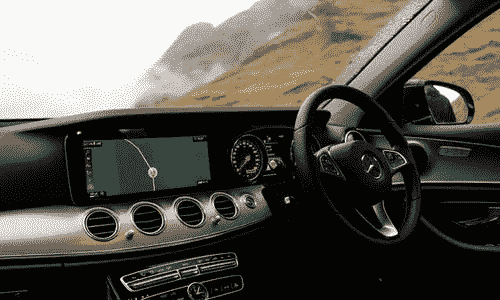
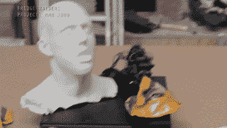
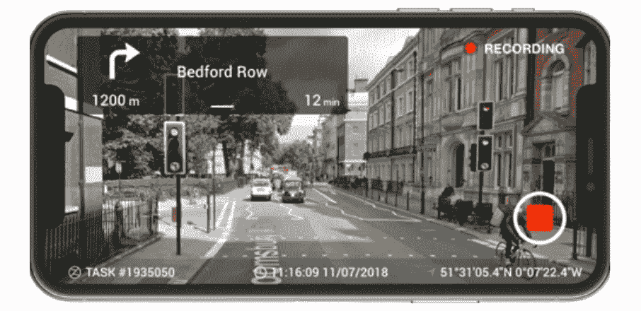

# 地图币项目:把自主踏板放到金属上

> 原文：<https://medium.com/hackernoon/project-mapcoin-putting-the-autonomous-pedal-to-the-metal-3ef3898e2be3>

Crowd-sourcing Navigational Data

自动驾驶汽车来了。它们将给我们的道路和高速公路带来新的安全和效率水平。但是他们一路上遇到了很多障碍。

目前，希望坐在副驾驶座上，承诺坐在后座上。在我们可以把生命托付给这些机器人之前，我们还有很长的路要走。事实上，有几千亿英里。

而 [**MapCoin**](https://mapcoin.io/) 项目希望利用区块链理工大学帮助获得可靠的自动驾驶汽车越过终点线。

现在，在我们上车并系好安全带之前，让我们确保我们都前往同一个目的地…

***免责声明*** *:这不是投资或理财建议。无论如何我都不是金融专家。本文中的大部分信息都是推测性的，仅仅是我个人的观点。在参与任何创业项目之前，一定要进行自己的研究。*

永远记住，你用钱做什么是你自己的决定。如果这个决定对你一个人来说太难了，向金融专家寻求指导。

*我可能会也可能不会收到创建此内容的少量令牌分配。也就是说，我会尽我所能保持公正和公平。我尽量避开所有的 FOMO 和 FUD，也绝不希望把这些情绪传染给我的秘密首脑伙伴们。*

# 慢骑

将家人的安全置于高速机器人的控制之下有点令人不安。尽管他们的创造者对他们的机器人伙伴的能力很有信心，但轮子经常在公开演示时脱落。

Anyone care for a… SNACK!?!

可靠的自动驾驶汽车之路是由数据铺就的。很多很多。

除非所有的自动驾驶汽车都装载了非常详细的信息，否则我们无法指望它们安全地将 Meema 送到她的 Jazzercise 课上。

人工智能是一个不断向前发展的行业，是自动驾驶汽车成功的重要组成部分。

为了让汽车了解它们将要行驶的环境，它们必须首先接受训练。工程师将成千上万的真实世界样本输入他们的假大脑。然后他们将所学带到赛道上。

你不会马上投入比赛；你先跑几圈练习。

> 自动驾驶汽车必须熟悉我们街道上所有的坑洼、行人、停放的汽车、骑自行车的人和分心的司机。

在雨雪天，潮湿和干燥，快和慢，汽车需要已经在这些条件下行驶过。

自动驾驶汽车不仅需要记住如何导航，还需要知道去哪里。他们从 A 点到 B 点的唯一方法就是使用超高清地图。比人们使用的要精确得多。

许多不同的人工智能和地图数据收集公司现在都在工作。但是，他们所有的道路测绘和机器人训练既缓慢又昂贵。虽然谷歌肯定能负担得起，但他们花的时间太长了。

MapCoin 团队厌倦了等待和等待其他人来交付我们的自主未来。

因此，他们决定通过让日常司机开车，并用代币奖励他们来启动这个行业…

Get rewarded for providing map data

# 区块链快车道

地图币平台由一个 app 引导。该团队选择了一个合适的标题——Collectr——因为应用程序用户正在这样做:收集数据和令牌。

现在，你将不能简单地激活应用程序，然后开车离开。这个项目不是为了简单的数据。

应用程序用户将收集高清视频片段。这意味着你开车时必须把手机挂在挡风玻璃上。

当用户将视频片段传输到 MapCoin 时，该平台将与使用这些数据的公司合作，以加速实现自动驾驶汽车。

MapCoin 的 Collectr 应用程序的用户只要对网络做出贡献，就会获得地图代币。无论是随机、悠闲的驾驶还是应用程序请求的公路旅行，现在你都可以在途中获得一些密码。

# **最后的想法……**

人为错误是大多数车祸发生的原因。现在，人们觉得有必要一边开车一边发短信、化妆和吃玉米片，道路比以前更加危险了。

但是，一旦经过适当训练，自动驾驶汽车将极大地减少日常事故的数量。他们将精通防御性驾驶，不像现在一半的驾车者。

学习是启动引擎的关键，而这正是 MapCoin 所帮助推动的。

除了事故减少之外，我们还应该看到道路拥堵现象明显减少。如果人类能够保持礼貌，在他们前面留出足够的空间，交通将会更加顺畅。

但不幸的是，在我的镇上，似乎总是有一场闯红灯的比赛。我一直不明白为什么人们如此匆忙地停下来。

司机在左转时无视黄色和红色箭头也是一个新趋势。因为，你知道，没有人的时间比他们的重要，所以让每个人都等着也没什么。

当我们能够将人类的情感从驾驶体验中抽离出来时，我们在外面都会更安全。

当自动驾驶汽车出现时，我们还可以指望一种全新水平的便利。我们将依靠它们带我们去任何我们想去的地方，它们将成为移动的工作和娱乐空间。

当然，要等到我们建立起足够的信心，在 K.I.T.T .的后座上打个盹儿，让机器护送我们去开会，还需要很多年。但那一天会到来，而且会很荣耀。

像 MapCoin 这样的项目正在帮助我们更快地实现这一目标。

## DYOR

MapCoin 项目有一个强大的团队支持一个可靠的想法。该项目融合了汽车和测绘行业的丰富经验。

而且，他们最近聘请了一位优步的自动驾驶汽车专家作为顾问。

虽然我理解团队想要完成的事情，但是自己做一些调查总是一个好主意。

这里有一些资源可供你参考:

[**MapCoin 网站**](https://mapcoin.io)

[**MapCoin 白皮书**](https://mapcoin.io/documents/mapcoin-en.pdf)

## 社交化

> [脸书](https://www.facebook.com/mapcointoken/)中型 Reddit
> 
> [电报](https://t.me/teammapcoin)推特[推特](https://twitter.com/Mapcointoken)

## 顺便说一下…

如果你喜欢你在这里看到的，并且需要帮助把你的加密信息传递给大众，我很想听听你的项目。

请随时联系我:blockchainauthor 作者在 Gmail

*BountyOx username = block chain author*