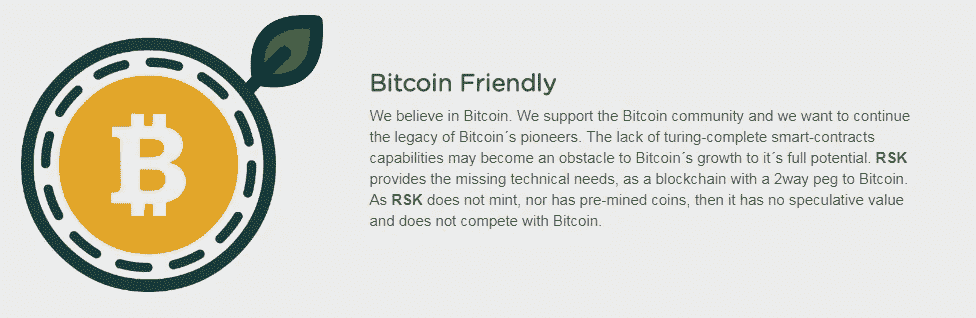

# 项目聚焦:根茎

> 原文：<https://medium.com/hackernoon/project-spotlight-rootstock-6bc1144b835b>

我不是那种通常会玩弄决策的人，这种速战速决的方法也适用于投资。我倾向于对有意义的事情做出快速决定，无论是一个杰出的想法还是市场反应过度，这是我的习惯。

举个例子，我最喜欢的交易之一是，2016 年 1 月，在英国《金融时报》一篇歇斯底里的文章宣布结束后，在底部买入嘉能可；你瞧，在接下来的两三个月里，价格会上涨一倍以上。购买以太坊或假人也属于这一类——我立刻被世界超级计算机所吸引。

我为什么要提这个？根茎适合同样的帐单，因为这些和其他项目的一个小干部。

这是智能合同。**上** [**比特币**](https://hackernoon.com/tagged/bitcoin) **。**

它太有意义了，当我第一次听到它的时候，我甚至在阅读白皮书之前就已经在心里把我的 BTC/ETH 分配给它了。唯一的问题？你不能真的投资它。这个项目安静下来，空间继续向前，数百个闪亮的新项目涌入现场。

当根茎交易最近开始出现时，由于过高的估价，我起初拒绝了。然而，当更令人满意的价格出现时，我最终只持有了一小部分，这完全是基于我以前的知识(这本身只相当于我两年前对白皮书的阅读和一些粗略的浏览)。

有些人会认为这是冲动或不负责任的(也许，但这是我的钱)，或者认为我是加密市场的所有问题，但我倾向于相信我的直觉，如果我后来改变主意，我会很乐意退出。每天阅读和吸收关于各种行业和公司的大量信息，以其他方式规避风险(如资金管理)以及成为一个私下堕落的赌徒也有帮助。

所以把这当成反推诿吧，我关注所有我不喜欢的事情，而不是促使我投资的事情。这是你在购买前应该做的练习，但是晚做总比不做好，\_(ツ)_/

# **什么是整党？**

与我的一些其他项目焦点不同，我将更多地关注主导我思考的问题，而不是技术故障。我相信根茎(以下简称 RSK)将很快发布一个新的白皮书，所以为了避免浪费我的时间，我会在发布时更新。请注意，由于缺少本白皮书，一些细节可能不正确——其中许多内容是从 Telegram 和其他渠道的零散讨论中拼凑出来的。

然而，总结一下:

*   RSK 将为比特币添加智能合约功能
*   它使用 Solidity，与以太坊使用的编程语言相同
*   这是一个比特币侧链，因此使用合并挖掘来保护网络(你可以在这里找到两者的介绍)
*   每个智能比特币(SBTC)将在一进一出的基础上与比特币挂钩(即，如果你想在 RSK 智能合约中使用 BTC，那么你将锁定你的 BTC。一旦合同完成，用户可以将 SBTC 发送到发布地址以解锁原始 BTC)。SBTCs 不能交易
*   除了智能合约功能，该团队还将 RSK 定位为扩展解决方案

虽然我用 RSK 作为速记，但它并不是股票代号。那么人们在买什么呢？RSK 声明他们不会为 RSK 做 ICO，我认为这有点表里不一。虽然从技术上来说他们是正确的，因为他们正在为 RIF (RSK 基础设施框架)筹集资金，但这是一回事。

RIF 将是一个公用令牌，用于支付 DApps、开发接口和 RSK 基础设施协议以及存储、支付和计算等服务。我可能会在白皮书发表后被纠正，但 RIF 对我来说似乎等同于天然气。虽然以太坊智能合约的 gas 只是普通的 ETH，但 NEO 等项目将两者分开(例如 NEO 和 GAS)，我认为这是 RSK 遵循的模式。它不会被用来把 BTC 换成 SBTC。

mainnet 平台现已启用，目前只允许一组选定的用户访问。目前 RSK 的参与者包括美洲开发银行(通过一个专注于比特币的非政府组织)和[比特币基金会](https://www.coindesk.com/first-bitcoin-smart-contracts-sidechain-now-secured-1-10-miners/)。

# **你为什么要在乎？**

智能合约的承诺、可扩展性和安全性是 RSK 的三大核心特性。

智能合约:智能合约功能导致了以太坊的兴起，产生了数百(数千)个新项目。这无疑对以太坊的价格产生了影响。这个想法很简单；开发者可以简单地移植这些 DApps 并在比特币上运行。这将导致对 BTC 的需求增加，而那些在 BTC 采矿的人将发现这一活动更有利可图，因为网络上的交易增加，以及 BTC 和 RSK 的采矿合并。

更有希望的是，比特币已经是加密世界事实上的储备货币，尽管在过去 12 个月里，ETH 首次交易的加密资产数量动摇了这一地位。如果 BTC 要实现追随者作为全球价值储存库的愿景，那么还有什么更好的加密资产可以作为智能合约的基础呢？

**可伸缩性:**尽管比特币在可伸缩性问题上有一段颇为曲折的历史，以太坊也是如此。比特币已经有闪电网络等解决方案在运行，但 RSK 团队称他们的解决方案以不同的方式运行。闪电网络围绕着链外扩展，即在主比特币链外进行大量交易，然后在最后捆绑成一笔交易——这意味着即使矿工只需在他们的区块中处理一笔交易，也可以验证多笔交易。

相比之下，RSK 的目标是通过他们所谓的 [Lumino 交易压缩协议](https://uploads.strikinglycdn.com/files/ec5278f8-218c-407a-af3c-ab71a910246d/LuminoTransactionCompressionProtocolLTCP.pdf)在链上扩展。他们表示，这将使 RSK 达到 2,000 tps，如果作为比特币本身的软分叉升级来实现，将允许主网络扩展到 100 tps。稍后我会单独发表一篇关于 LTCP 和其他[区块链](https://hackernoon.com/tagged/blockchain)的努力，因为他们都有缺点。

安全:从理论上讲，通过合并采矿，根茎公司将能够利用 BTC 最大、保护最好的网络。

# 是什么让这成为一个坏主意？

首先我要说，我不认为 RSK 一定是个坏主意，只是它可能不像第一眼看上去那么好。

**1。** **去中心化、治理和比特币**

让我们从比特币的链接开始，因为这是更明显的担忧之一。

我在开头描述的挂钩，即一个 BTC 换一个 SBTC(在任何给定的时间里要么被锁定，要么被锁定)，并不像听起来那样天衣无缝。sidechains 白皮书描述了这一过程中实际发生的事情，该团队概述了他们选择的解决方案是*“*混合驱动链+比特币方面的联盟，结合矿工和联盟投票。”

他们接着提到了与这一设计选择相关的其他一些事情:

> *RSK 实验室还旨在提供一个平稳升级到完全去中心化解决方案的路径，因此 Rootstock 计划从拥有 secoin 债券的知名比特币团体组成的联盟开始[secoin 指的是 SBTCs，即存储在二级链上的比特币]，并计划在可用时添加 miner's votes(驱动链)。*

完全去中心化是好的…联邦不太好…著名的警钟正在敲响。

No-one has ever said Federation and decentralised in the same breath

成为该联盟成员(或公证人)的标准也有帮助:

> *为实现真正的权力下放，应精心挑选至少具备以下特征的公证人:*
> 
> *公证人的人数不应少(例如至少 10 人)。*
> 
> *公证员人数不宜过多，以便用户验证公证员的真实性和诚实性(如 30 人以下)。*
> 
> *公证人应该分布在不同的法律管辖区和国家，以防止国家攻击、胁迫和审查。*
> 
> *公证员应在地理上分散，以防止基础设施在自然灾害中出现故障。*
> 
> *公证员应改名*[原文如此]
> 
> *公证人不应控制(或依赖)数量较少的实体。比如公证员不能是同一家银行的不同支行。*
> 
> *公证员应能够通过物理和逻辑保护以及所需的安全程序来实现和保持特定的安全级别。*

我不喜欢任何依赖少数政党或利用声誉作为选择他们的手段的解决方案。此外，“至少 10 分”这个基准太低了。RSK 联邦至少有 25 名成员，但这不是“真正的”分散化。你可以在这里阅读更多关于我为什么不喜欢 dpo 的信息，因为这些因素也适用于 RSK。如果你依赖于声誉，更确切地说，信任少数政党会对你有利，那么这无论如何都不是分散的。

根据最初的白皮书，该联盟将由“领先的比特币公司”组成，并将“在保障比特币和 RSK 区块链之间的资金转移方面发挥重要作用”。作为交换，他们将从资金流入和流出之间的结算所产生的费用中获利。”

We can assume the Federation will comprise many of these firms

> *一旦合并挖掘得到几乎全部矿工的接受(例如 95%)，投票中的联盟角色可以被禁用，并且仅保留驱动链。*

我对任何以集中开始并承诺在未来某个不确定的时间变得完全分散的项目持怀疑态度(看看 IOTA 和协调者就知道了)。矿商全面接受并非不可能，但可能会很困难。

鉴于联邦的采矿特遣队可能希望保留结算进出 BTC/SBTC 的费用，这一困难可能会增加。但不仅仅是他们——所有的公司骨干都将从 RSK 的使用中获得费用，这给了他们想要永久保留这一特权地位的动机。他们为什么要放弃这个？谁强迫他们？让我们看看治理模型:

> *RSK 治理模式旨在通过提供一个由 5 个席位组成的治理委员会来代表社区的所有参与者。矿工将能够通过哈希功能投票(1 票)，比特币和 RSK 用户将通过股权证明投票(1 票)，交易所和网络钱包将通过联盟投票(1 票)，RSK 和比特币核心开发者将有一个特殊的门槛投票系统(1 票)，最后一票将提供给一个非营利性的比特币机构，如比特币基金会，它可以代表更广泛的生态系统。*

因此，矿商可以勾结起来，将采矿权力保持在 95%以下(尽管至少 90%的矿商已经承诺在未来合并采矿)，利润驱动的交易所获得投票权(我不太相信交易所会把我的资产留在那里，更不用说信任它们来保护网络)，像比特币基金会这样的机构获得投票权。比特币基金会的董事会成员包括董事长布洛克·皮尔斯(我不打算进入皮尔斯，只是谷歌一下他)和副董事长世尘小雪(比特币交易所 BTCC 的首席执行官/联合创始人)。因此，总投票数的 60%可能被矿商、交易所和比特币基金会控制——这三个部门之间有很高的个人交叉。

与此同时，比特币和 RSK 的所有用户加起来只有一票。这不是良好治理的基础。

最后一点:[其他评论员](https://cryptobriefing.com/rsk-assessment-bitcoin-smart-contracts-coming/)已经注意到了联邦成员和 Segwit2x fork 的前支持者之间的相关性。我有意忽略了围绕比特币分叉的讨论(这极其无聊，而且还有其他人更适合这么做)，但不需要天才就能把比特币集中化的失败尝试与 RSK 的中介机构集中化联盟相提并论。

Some have asked which Bitcoin

**2。** **以太坊等智能合约平台**

对我来说，开发人员将简单地将 DApps 移植到比特币上的想法(尤其是当大多数人只是为了在以太坊上运行而看起来是一项艰巨的任务时)似乎是异想天开的，即使它是一种共享的编码语言。此外，这些开发者在生态系统中有既得利益(大型 ETH 控股公司)，并且大多首先是以太坊(许多人是被以太坊的愿景而不是比特币的愿景吸引到这个空间的)。以太坊当然有它的规模问题，但比特币也有这个问题。RSK 的缩放解决方案是否足够好，足以将自己与以太坊的解决方案区分开来？

与 2015 年该项目推出时不同，RSK 还在与过多的其他智能合约平台竞争，其中许多平台从以太坊的缺陷中吸取了教训。与此同时，RSK 将永远被比特币的设计选择所束缚，比特币是一种首先被设计为支付解决方案的网络，而不是智能合约网络。这方面的一个例子是需要同时购买 BTC(然后转换为 SBTC)和 RIF，而不是单独购买 ETH 或 EOS 或 ADA(尽管，同样，我们必须等待新的白皮书，以了解如何工作的完整细节，并且该团队完全可能已经解决了这个问题)。这不是一个交易破坏者，但它确实增加了挑战。

**3。** **比特币性质的变化**

这一挑战因围绕比特币的叙事发生了变化而变得更加严峻。正如《T4》杂志在时机恰当的文章《T5》中提到的那样，Nic Carter 和 has ufly“随着侧链被证明难以实现，比特币的非货币用途不再受欢迎”。自 RSK 推出以来，BTC 已不再是所有人眼中的万能产品，而是被更广泛地接受为一种价值储存手段或不相关资产。

为什么这很重要？好吧，如果我们以这种方式看待 BTC，那么我们为什么还要比特币智能合约呢？有什么意义？为什么不把 BTC 作为价值储存手段，让另一种加密资产成为智能合约履行的交换单位呢？

# **财务**

这可能已经下一节，因为 RSK 投这个**高**。将产生 10 亿 RIF，其中约 40%将在私人销售中出售。这些最初以每 BTC 14，000 里夫的价格出售，愿意锁定 3 个月的人可以获得 30%的奖金。

RIF 的转售一直很活跃，池中首次出现每 BTC 5-6k 的交易，锁定期为 3 个月。这种情况随后出现，最近的产品迁移到 10–11k，没有锁。在过去的几天里，交易变得更加甜蜜，现在有 11.5-12.5k 的报价。这种兴趣的下降可能归因于当前的市场，投资者越来越意识到他们被风投耍了，部分原因是团队试图大幅融资。很有可能不久我们就会看到回到最初的 14k 价格。

400，000，000 枚代币，每 BTC 14，000 英镑= 28，500 BTC，按当前价格计算，大约增加了 2.3 亿美元。这使得 RSK 的隐含首日市值(假设全部供应从第一天开始流通)约为 5.7 亿美元，这意味着它需要在 22 至 25 美元的区间内首次亮相，原始投资者才能实现盈亏平衡。那些在较低层级投资的人需要它以更高的价格首次亮相，高于 OmiseGo 和 ZCash 等 10k 买家，高于 BinanceCoin、Tezos、VeChain 和 NEM 等 5-6k 池。

顺便提一下，对于 Coinsilium 这样的早期投资者来说，这相当于一个不错的发薪日，他们以 500 万美元的估值投资了 10 万美元。我不知道 Coinsilium 的安排，但假设该公司 2%的股份等于所有 RIF 的 2%的分配，那么这将意味着 450 万加元的利润或两年半内 45 倍的增长(尽管应该注意的是，自投资以来，BTC 的价格上涨了约 20 倍——自 2016 年 1 月以来，许多替代硬币的表现超过 BTC 2 倍)。

奇怪的是，Coinsilium Group Ltd 今天的市值只有 1237 万美元(它是一家上市公司)，并且在 2017 年底上市时，他们持有的数字资产只有 534 万美元。他们在 2017 年年报中列出，“截至 2017 年 12 月 31 日，本集团和本公司拥有 RSK 未上市股份”，并在上面一行中指出，本公司已“将贷款转换为 RSK 和 Factom 的股份”。如果他们持有的 RSK 股份在报告中被隐藏，或者以低得多的估值计入(因为 RSK 今年才开始出售)，那么 Coinsilium 可能被极度低估——这方面还需要做更多的研究。

# **结论**

我是否过度担心我在 RSK 的投资了？不是很大，但我认为把它留在 BTC 可能是更聪明的举动，因为毫无疑问，价格现在只是单向的。我认为，散户投资者不愿亏本出售现有资产，导致市场流动性不足，这正开始对一些项目造成影响。

然而。我认为它会做得很好，我怀疑导致我投资的相同反应会看到其他人效仿，它有足够多的加密版税(Coinsilium，比特大陆，数字货币集团，Antpool，Xapo，Bitpay，BTC.com，Jaxx 等)的支持，如果他们希望它成功，它可能会成功，至少在一段时间内。由于它与比特币和前述合作伙伴的联系，它将会有很大的曝光率，我预计这个拥有大量预算的团队将在私人出售结束后开始认真营销。

尽管我在整个过程中一直故意消极，但 RSK 仍然是一个有趣的项目，我的团队已经在这个领域工作了很长时间，他们试图在别人失败的地方取得成功。我热切期待新白皮书的发布，并开始看到第一批项目上线——比特币智能合约将是一个引人入胜的实验，如果没有其他事情的话。也许新的白皮书甚至会解释他们如何设法消除对联盟的需求。