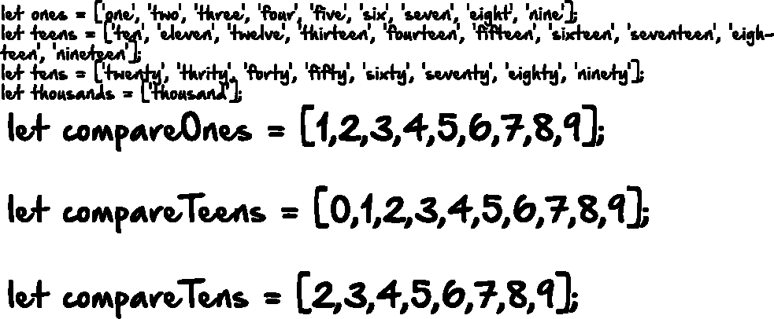

# projecteuler.net # 17

> 原文：<https://medium.com/hackernoon/projecteuler-net-17-dabc52166aba>


我刚刚完成了欧拉 17 号项目。我将在这里介绍我解决这个问题的思路，但是我希望得到反馈，尤其是如果你的解决方案与我的不同的话。我相信还有许多更优雅和简单的解决方案。

问题是这样的:

如果把数字 1 到 5 用文字写出来:一、二、三、四、五，那么总共用了 3 + 3 + 5 + 4 + 4 = 19 个字母。

如果从 1 到 1000(一千)的所有数字都用文字写出来，会用多少个字母？

**注意:**不计算空格或连字符。例如，342(三百四十二)包含 23 个字母，115(一百一十五)包含 20 个字母。写数字时使用“and”符合英国的用法。

我的第一个想法是，我需要遍历数字 1 到 1000，并将每个数字转换成与该数字相对应的书面单词。


很自然，我可以创建一个包含所有单词的数组。但我不想写下每一个数字。相反，我想做这样的事情:


不用定义每个字母，我可以创建一个数字 1 到 9 的数组，然后创建另一个字母“1”到“9”的数组。


例如，如果数字是 547，那么我可以查看给定数字集中的第一个数字是否与 onesArr 中的任何数字相匹配。然后我可以对最后一个数字做同样的事情。一旦它找到匹配，我将简单地获取 onesComp 数组的值，但是是在我在 onesArr 中找到匹配的相同索引处。

虽然，这对于“二十”、“三十”、“四十”等来说是行不通的。它也不适用于 10 到 19 岁的孩子。所以，我可以做几个额外的数组，做同样的事情，取决于给定数字的长度。



类似这样的东西可以让我拥有一个 1-10 的数字数组，以及一个“1”-“10”的匹配单词数组。青少年和十岁的人也是如此。对我来说，关键是让索引值匹配。所以我的 1 数组从 1 开始，而不是 0，因为我们不使用 0，我的青少年数组也包含一个 0，因为它从 10 开始，我将在数字 10 中寻找 0，就像我将在 11 中寻找 1，在 12 中寻找 2，等等。然后十进制数组从 2 和 20 开始。在这一点上，下一个障碍将是确定号码的长度。我的想法是对 1 到 1000 的数组进行循环。对于每一项，我将把数字转换成一个字符串，然后分割这个字符串，这样它会给我一个每个数字的数组。然后，在 and if 语句中，我将使用 parseInt()将其转换回数字，并对照比较数组的值进行检查。该部分可能看起来像这样:


下面是最终的代码:

```
let ones = ['one', 'two', 'three', 'four', 'five', 'six', 'seven', 'eight', 'nine'];
let teens = ['ten', 'eleven', 'twelve', 'thirteen', 'fourteen', 'fifteen', 'sixteen', 'seventeen', 'eighteen', 'nineteen'];
let tens = ['twenty', 'thrity', 'forty', 'fifty', 'sixty', 'seventy', 'eighty', 'ninety'];
let thousands = ['thousand'];
let compareOnes = [1,2,3,4,5,6,7,8,9];
let compareTeens = [0,1,2,3,4,5,6,7,8,9];
let compareTens = [2,3,4,5,6,7,8,9];let numbers = [];
for (var i = 1; i <= 1000; i++) {
    numbers.push(i);
}let currentCount = 0;for (var i = 0; i < numbers.length; i++) {
    let numStr = numbers[i].toString();
    let numStrArr = numStr.split("");
    if(numStrArr.length == 1){
      let digit1 = parseInt(numStrArr[0]);
      let index = compareOnes.indexOf(digit1);
      currentCount = currentCount + ones[index];
    }
    if(numStrArr.length == 2 && numbers[i]>=20){
      let digit1 = parseInt(numStrArr[0]);
      let digit2 = parseInt(numStrArr[1]);
      let index = compareTens.indexOf(digit1);
      let index2 = compareOnes.indexOf(digit2);
      currentCount = currentCount + tens[index] + ones[index2];
    }
    if(numStrArr.length == 2 && numbers[i]<20){
      let digit2 = parseInt(numStrArr[1]);
      let index2 = compareTeens.indexOf(digit2);
      currentCount = currentCount + teens[index2];
    }
    if(numStrArr.length == 3 && numStrArr[1] == "0" && numStrArr[2] == "0"){
      let digit1 = parseInt(numStrArr[0]);
      let digit2 = parseInt(numStrArr[1]);
      let digit3 = parseInt(numStrArr[2]);
      let index3 = compareOnes.indexOf(digit1);
      let index2 = compareTens.indexOf(digit2);
      let index = compareOnes.indexOf(digit3);
      currentCount = currentCount + ones[index3]+"hundred";
    }
    if(numStrArr.length == 3 && numStrArr[1] == "0" && numStrArr[2] !== "0"){
      let digit1 = parseInt(numStrArr[0]);
      let digit2 = parseInt(numStrArr[1]);
      let digit3 = parseInt(numStrArr[2]);
      let index3 = compareOnes.indexOf(digit1);
      let index2 = compareTens.indexOf(digit2);
      let index = compareOnes.indexOf(digit3);
      currentCount = currentCount + ones[index3]+"hundred"+"and"+tens[index2]+ones[index];
    }
    if(numStrArr.length == 3 && numStrArr[1] == "1"){
      let digit1 = parseInt(numStrArr[0]);
      let digit2 = parseInt(numStrArr[1]);
      let digit3 = parseInt(numStrArr[2]);
      let index3 = compareOnes.indexOf(digit1);
      let index2 = compareTeens.indexOf(digit3);
      currentCount = currentCount + ones[index3]+"hundred"+"and"+teens[index2];
    }
  if(numStrArr.length == 3 && numStrArr[1] !== "0" && numStrArr[2] !== "0" && numStrArr[1] !== "1"){
    let digit1 = parseInt(numStrArr[0]);
    let digit2 = parseInt(numStrArr[1]);
    let digit3 = parseInt(numStrArr[2]);
    let index3 = compareOnes.indexOf(digit1);
    let index2 = compareTens.indexOf(digit2);
    let index = compareOnes.indexOf(digit3);
    currentCount = currentCount + ones[index3]+"hundred"+"and"+tens[index2]+ones[index];
  }
  if(numStrArr.length == 3 && numStrArr[1] !== "0" && numStrArr[2] == "0" && numStrArr[1] !== "1"){
    let digit1 = parseInt(numStrArr[0]);
    let digit2 = parseInt(numStrArr[1]);
    let digit3 = parseInt(numStrArr[2]);
    let index3 = compareOnes.indexOf(digit1);
    let index2 = compareTens.indexOf(digit2);
    let index = compareOnes.indexOf(digit3);
    currentCount = currentCount + ones[index3]+"hundred"+"and"+tens[index2];
  }
  if(numStrArr.length == 4){
    currentCount = currentCount + "one"+"thousand";
  }
}

let newCurrent = currentCount.replace(/undefined/g, "");
console.log(newCurrent);
console.log(newCurrent.length)
```

你可能会注意到我在底部的正则表达式。我一直有未定义的出现，它只是被添加在那里。我可以试着找出原因，但是很明显我需要的所有其他单词都还在那里，所以我只写了一点 regex 来去掉最终字符串中任何未定义的单词。

下面是最终字符串的样子…嗯，只有前 75 个数字:

```
onetwothreefourfivesixseveneightnineteneleventwelvethirteenfourteenfifteensixteenseventeeneighteennineteentwentytwentyonetwentytwotwentythreetwentyfourtwentyfivetwentysixtwentyseventwentyeighttwentyninethritythrityonethritytwothritythreethrityfourthrityfivethritysixthrityseventhrityeightthrityninefortyfortyonefortytwofortythreefortyfourfortyfivefortysixfortysevenfortyeightfortyninefiftyfiftyonefiftytwofiftythreefiftyfourfiftyfivefiftysixfiftysevenfiftyeightfiftyninesixtysixtyonesixtytwosixtythreesixtyfoursixtyfivesixtysixsixtysevensixtyeightsixtynineseventyseventyoneseventytwoseventythreeseventyfourseventyfive
```