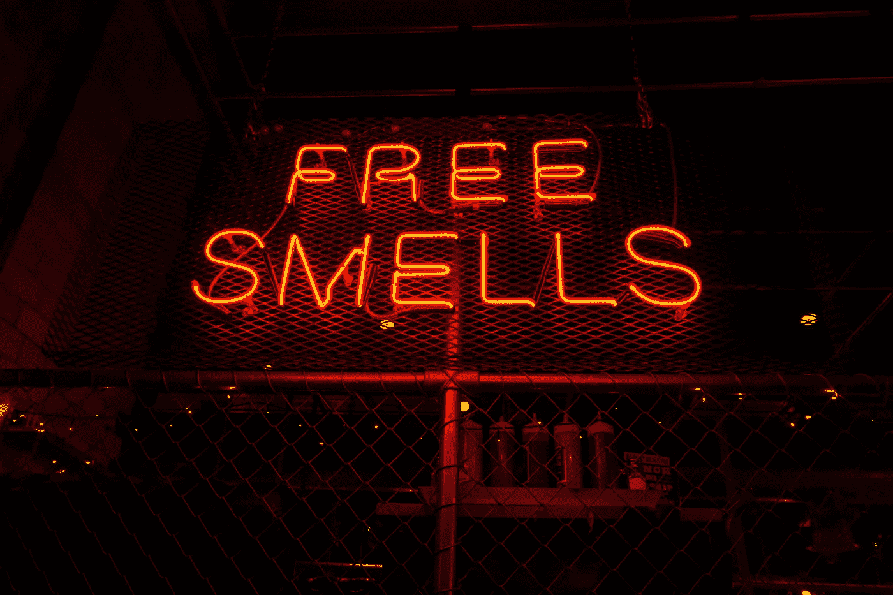
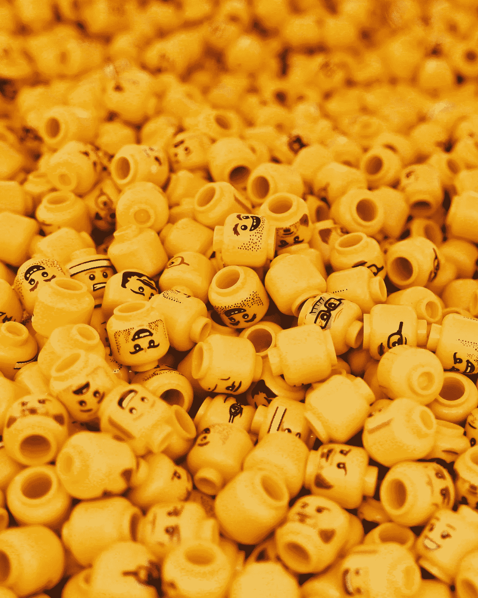
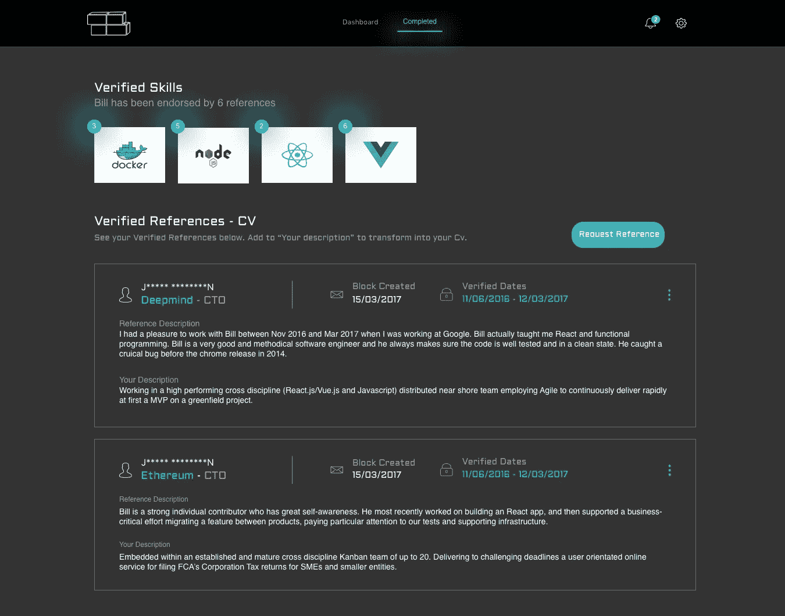
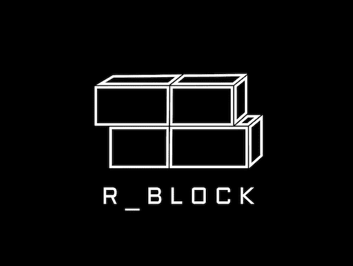

# 人类工作的证明

> 原文：<https://medium.com/hackernoon/proof-of-human-work-5e7e7f7d8914>

## 谁是艺术之刀？

**DAO 定义:***DAO(分散自治组织)是一种分布式组织，通常基于区块链技术。一个 DAO 没有领导者，没有管理层，它是通过智能合同运作的。DAO 可以发行令牌来提供组织的集团治理，支付承包商或令牌持有者的费用。*

工作在变化。互联网革命标志着该公司终结的开始，其瓦解速度呈指数级增长。[尼克·托马诺的《企业之死》一片](https://thecontrol.co/the-slow-death-of-the-firm-1bd6cc81286b)是最好的引子。互联网正在被分散化所破坏，这导致了公司的灭亡，DAO 的收购也加速了。

***互联网时代，网络阶段 1:***

互联网革命意味着初创企业的蓬勃发展，自由职业者市场的爆炸式增长，市场经济的浮出水面，坏脾气的猫诞生了。提供工作保障和社会证明的公司变得不受欢迎。创业就是让你穿着短裤，在家工作，并让你能够做最好的工作——这并不奇怪。互联网使信息自由民主化。这意味着任何人都可以获得任何信息。随着 MySpace 以及后来脸书成为超级大国，我们开始以不同的方式看待网络。网络的丰富意味着我们对企业网络的依赖已经结束。我们不再需要那个工作保障毯了。然而，我们需要那个大公司徽章来开门的想法像难闻的气味一样挥之不去。

Photo by [Steve Harvey](https://unsplash.com/photos/oFWjD41CLxs?utm_source=unsplash&utm_medium=referral&utm_content=creditCopyText) on [Unsplash](https://unsplash.com/search/photos/proof%20of%20identity?utm_source=unsplash&utm_medium=referral&utm_content=creditCopyText)

互联网帮助我们意识到我们不再需要公司了，激励措施已经过时了。人们的激励不再像 30 年前那样与公司保持一致。我们现在触手可及的网络不计其数。工作的世界已经发生了很大的变化，但是这些公司的奖金和股票激励没有改变。我们付出的比得到的多。我们开始质疑和鄙视他们，因为他们在大量饮酒的同时，却用水来激励我们。

现在，随着互联网走上权力下放之路，我们开始进一步质疑是否需要任何中央集权的政党。

等式已经从:
1。人+人+人=工作网络:::
2。人+软件+人=工作网络:::
3。人+软件=工作网络

***分散的互联网时代，网络阶段 2:***

互联网已经给了我们集中的市场，使效率低下的中产阶级从中受益，并给我们带来了全球选择(易贝，AirBnB)。但是，看到这些平台上集权的崛起，让我们再次提出了问题。

> *“我们需要这些中央集权的机构吗？”*

为什么不把软件放在适当的位置，让市场上的每个参与者来运行它。给参与的每个人一个共同的激励让它成功~输入代币。

随着软件接管调解信任，我们对任何中央机构的依赖减少。丹·拉里默在 2013 年首次提到了分散化组织。第一个真正去中心化的组织，比特币和以太坊可以在没有任何中心化机构的情况下运行。它们可能功能不全，但确实发挥了作用。以太基础可以说更实用，更符合 DAO 原则，因为它们没有层级和人力资源功能。他们的工作本质上是开源的，大部分是免费的，由社区完成。例如以太坊的 Java 客户端~ [Web3](https://github.com/conor10) ，一个巨大而重要的作品，是由[康纳·斯文森](https://github.com/conor10)创作的。作为非核心基础会员，他在以太坊道的唯一股份可以~以太。

Photo by [Carson Arias](https://unsplash.com/photos/7Z03R1wOdmI?utm_source=unsplash&utm_medium=referral&utm_content=creditCopyText) on [Unsplash](https://unsplash.com/search/photos/tokens?utm_source=unsplash&utm_medium=referral&utm_content=creditCopyText)

随着组织变得更加分散，进一步民主化，工作将被分解为微观任务。大多数基于网络的角色将完全成为自由职业者。人们将长期断断续续地在多个 DAO(网络)上工作。持有代币来取代雇佣合同和股票(作为兑现承诺的激励)会回到这些网络中。博弈论和代币将被嵌入到日常生活和每个微任务中。每个人的时间和数据都将获得代币奖励。那些有互联网连接的非洲人将和伦敦人一样进入同样的就业市场。工党将是无国界的，没有官僚主义的约束，对最合适的竞标者完全民主化。

***自主去中心化的互联网时代，网络阶段三:***

区块链的核心是一种信任调解技术。这是一种点对点技术，允许我们在不需要集中各方的情况下处理任何事情。现在，我们实现了无需任何外部信任中介(如公司、雇佣律师和银行)就能处理工作的愿景。因此，智能合约对区块链来说将是如此重要的发展。

Photo by [Matthew Henry](https://unsplash.com/photos/VviFtDJakYk?utm_source=unsplash&utm_medium=referral&utm_content=creditCopyText) on [Unsplash](https://unsplash.com/search/photos/corporate?utm_source=unsplash&utm_medium=referral&utm_content=creditCopyText)

我们正走向一个危险的工作场所，没有治理，没有公认的组织或标准可循。我们需要一些跟踪到位的“工作证明”，“信誉证明”和“身份证明”。我们需要这些是可靠的，我们需要这些是机器可读的。我们不能上 LinkedIn，浏览 Github，选择分配工作。我们需要更好的东西…

简历将看起来像 Trustpilot 数字身份证——你在手机上随身携带的评级和推荐信。你将完全拥有你的声誉和工作经验的证明。将你的部分工作历史保存在其他中央服务器上的想法是不可想象的。

工作的未来将是零工经济的进化，自动化。你将与一个分散的就业市场(Ethlance 或 Coinlancer)联系，与你相关的网络交流(并持有代币)。道的机器将读取您的信誉证明、技能评级，并确认您的工作经验证明。DAO 要么接受你的工作，要么接受 DAO 的股东(令牌持有人),如果这是一项重要的工作，可能会要求他们对工人进行投票。

R_Block’s proof of work experience and reputation profile ‘CV’

如果你已经在银行工作了几年，这似乎很难想象。但是，如果你是一名初创企业的自由程序员，你也许能够想象我们正在进入的网络时代。

对于 DAO 的下一阶段，我们需要区块链和令牌之间的隐式互操作性。我们需要各种形式的数字身份来遵守 ERC725/35 等标准，以便机器能够支持信息经济的发展。收集数据并出售的陈旧商业模式将会结束。在智能合约的帮助下，一切都将是点对点的交易。GDPR，Web3.0，它来了…

如果有兴趣了解更多关于 R_Block 的信息。关注我们[中台](/@R_Block)、[推特](https://twitter.com/_R_Block)、[电报](https://t.me/r_block)前往>>[https://rblock.co](http://rblock.co.uk/)<<

