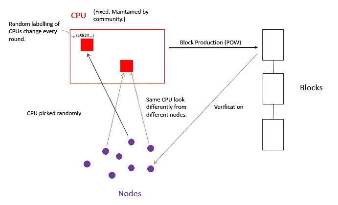

# POSW—共享(或标准化)工作的证明

> 原文：<https://medium.com/hackernoon/proof-of-rental-or-shared-work-d7150965edf6>

在本文中，我们将介绍一种新的工作证明变体，即共享工作证明(POSW)，旨在缓解采矿权力集中问题和采矿中过度能源消耗的问题。

众所周知，比特币挖矿导致了矿权的集中。事实上，最近的报告显示，前 5 名挖掘池拥有大约 85%的总哈希能力(前 3 名已经拥有超过 50%的总哈希能力)[1，2]。

POSW 的想法是拥有一个社区所有的采矿资源——社区和所有参与的节点以这样一种方式维护一个单一的采矿设施，没有人(甚至社区本身)可以操纵采矿过程。就社区的利益而言，我们认为这比让硬件制造商或其他人来控制和管理矿池要好。此外，我们可以让社区和节点所有者投票并决定诸如矿池升级和维护之类的问题(因此硬币在这里也起到治理令牌的作用)。

由于所有节点都将使用一个官方采矿设施，因此可以将求解区块的难度标准化并固定在适当的水平。这使得该协议比当前的情况更具可持续性，在当前的情况下，每个人都在争夺更高的计算能力，从而导致能源消耗和(潜在的)环境问题。

> **TL；经济力量几乎不可避免地将权力推向混乱权力集中。ASIC 电阻算法在硬件创新面前[相当没用](https://blog.sia.tech/the-state-of-cryptocurrency-mining-538004a37f9b)。该协议通过将硬件管理的权力交还给整个网络(而不是由池管理员/制造商控制)来应对这种情况。这也解决了能耗问题，提高了可扩展性。**

> *POSW:节点租赁/共享标准化矿业资源*

**协议:**

**答:**每个计算单元(可以是 CPU/GPU 或 ASICs，但为了简单起见，在本文中称为 CPU)都有一个标签，该标签是为每轮模块生产随机生成的。

**B** 。从不同的节点来看，每个 CPU 都有**不同的**标签，也就是说，每个 CPU 对于不同的节点来说看起来是不同的。

**C** 。每个节点选择(或投票)一个 CPU 来代表它参与块生产。我们说这一轮分块生产中 CPU 归这个节点所有。这种选择是随机的，因为 CPU 标签是随机生成的。

**D** 。每个参与节点都需要固定(和最小)数量的硬币。这枚硬币可以被视为计算能力的**租赁**。

**E.** 试块制作和验证过程与标准 POW 相似。不同之处在于，当大约同时产生多个块时，由更流行的 CPU 产生的块将被接受。

**F** 。产生被接受的块的 CPU 的节点所有者将被奖励一定数量的新开采的硬币，如果获胜的 CPU 有一个以上的所有者，这些硬币将被共享。节点也将因验证交易而获得奖励。

**讨论:**

*   这组 CPU 是固定的，并且从一开始就被所有节点和团体所同意。此后将不会有新的矿池加入。
*   从 CPU 由所有节点集体拥有的意义上来说，挖掘集中化得到了解决。
*   建议:在升级等 CPU 管理问题上，节点可以使用自己的硬币进行投票。
*   该协议通过要求为参与支付固定数量的硬币来处理 Sybil 攻击。
*   由于节点只能随机选择 CPU，因此避免了 51%的哈希权力集中攻击。
*   通过仅选择由 CPU 产生的、被最多数量的(节点)所有者租用的块来解决分叉。如果有多个最受欢迎的 CPU，请随机选择一个。因此，*延迟*将不再是问题，并且块被确认的速度将比当前 POW 快得多。
*   由于只有一组挖掘设备，因此挖掘池之间没有竞争，散列的难度可以保持固定。事实上，它可以设置为足够低的水平，以减少总能耗。因此，能耗问题得到了控制。
*   解决富人越来越富问题的建议:参考下面第二个问题的答案。

**问题:**

**问:** POSW 的采矿权高度集中(甚至比我们现在的更加集中)，这是一个单一的失败点。

**答:**我们更愿意说这个提议提供了一个**矿产资源的标准化**。现在任何想挖矿的人都有了标准的计算能力来源。区块链 T21 仍然是一个没有任何第三方的分散账本。存储在区块链上的任何内容都没有单点故障。

为了减轻任何可能的担忧，我们可以在不同的物理位置/国家拥有一些备用矿池。

如上所述，我们认为，为了整个社区的利益，最好由他们自己来维护这些池，而不是将控制权交给制造商或社区之外的人。

问: POSW 看起来实际上和 POS 很相似，从这个意义上来说，任何人生产积木的机会都与她拥有的硬币成正比，因为她可以打开她喜欢的任意多个节点，并用她的硬币在 CPU 上投票。所以这个提议也让富人更富。

**答:**不见得。首先，它不存在“无风险”的问题，因为分叉从一开始就不是问题(参见讨论中的第 6 点)。

其次，在 POSW 的统治下，区块链就像 POW 一样是不可变的，这种不变性是基于计算资源的消耗。另一方面，很明显，POS 不像 POW 那样是不可变的。

在富人变得更富的问题上，只有在开放新的投票节点完全没有成本(无论是以硬币、努力、时间的形式)的情况下，这才是正确的。我们可以实现这样的规则，对于任何新的节点，在它有资格投票之前，它必须验证一定数量的交易，或者所有的投票必须使用具有一定最小数量硬币年龄的硬币。

我们的观点是，POS 是主观的，在真实的物理世界中没有锚来确定它的真实历史([3] pg。11 顶，也见讨论这个[这里](/@abhisharm/understanding-proof-of-stake-through-its-flaws-part-3-long-range-attacks-672a3d413501)和[这里](https://forum.blockstack.org/t/pos-blockchains-require-subjectivity-to-reach-consensus/762)。因此，我们认为 POSW 比纯粹的 POS 更适合以太坊的未来。

**更新:**很多人问我们这个。在这里，我们要澄清的是，这是一个新的区块链项目，而不是一个分叉现有 PoW coins 如[比特币](https://hackernoon.com/tagged/bitcoin)的提议。

**参考文献:**

[1]比特币和以太坊的去中心化

 [## 比特币和以太坊的去中心化

### 随着时间的推移，我们一直在研究比特币和以太坊网络的状态。在最近的一项研究中，我们考察了…

hackingdistributed.com=](http://hackingdistributed.com/2018/01/15/decentralization-bitcoin-ethereum/) 

【2】矿工是否集中？对采矿池的研究

 [## 矿工集中吗？对采矿池的研究

### 阅读 Alethio 对以太坊网络去中心化的分析。一周的数据来自…

media.consensys.net](https://media.consensys.net/are-miners-centralized-a-look-into-mining-pools-b594425411dc) 

[3] [白雪公主:鲁棒可重构共识及其在可证安全利害关系证明中的应用](https://eprint.iacr.org/2016/919.pdf) (Elaine Shi 等)。