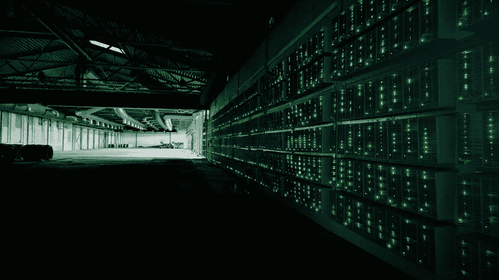
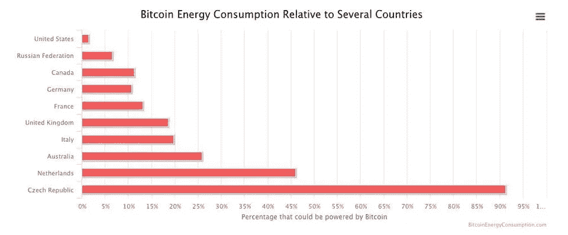
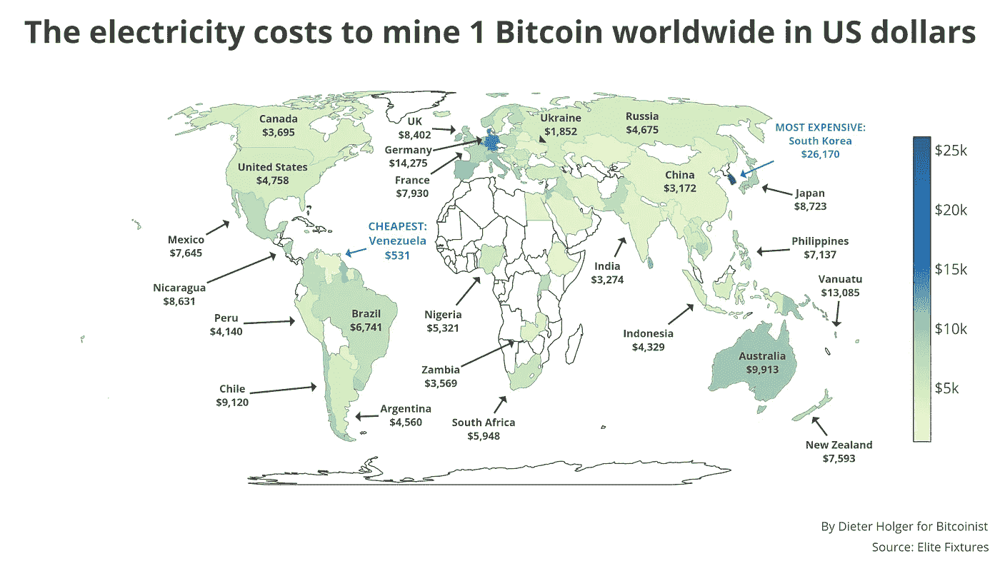
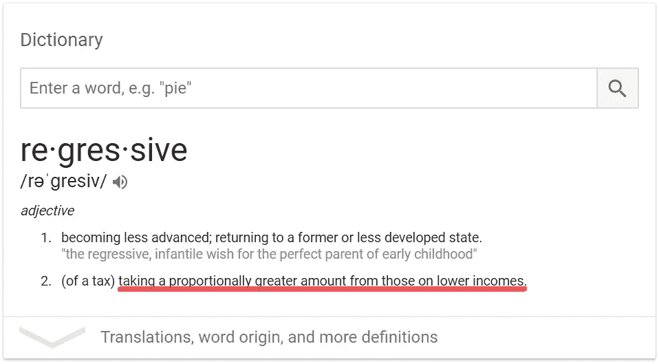
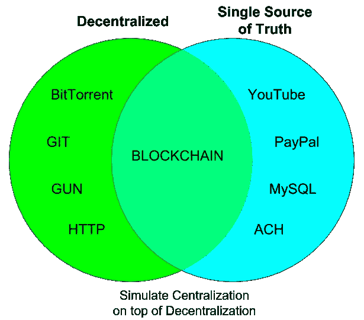
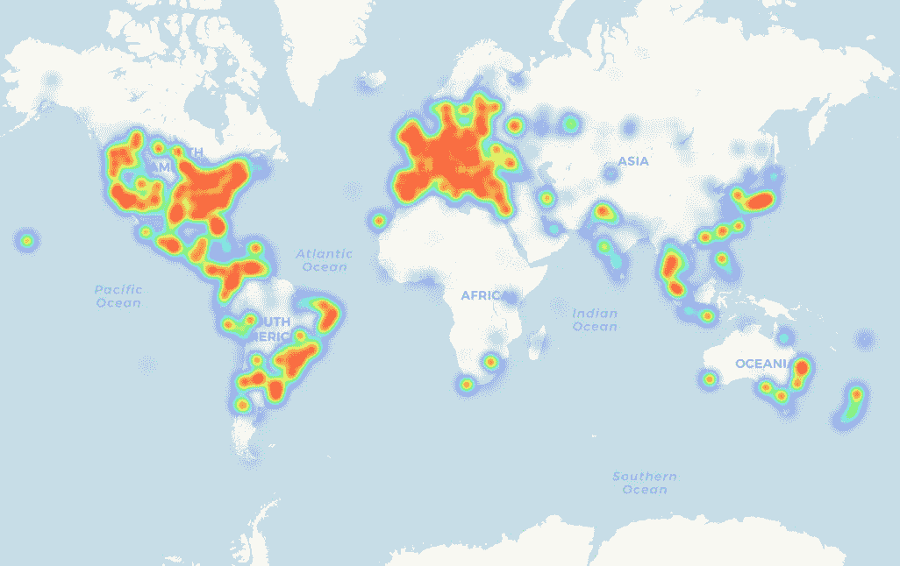
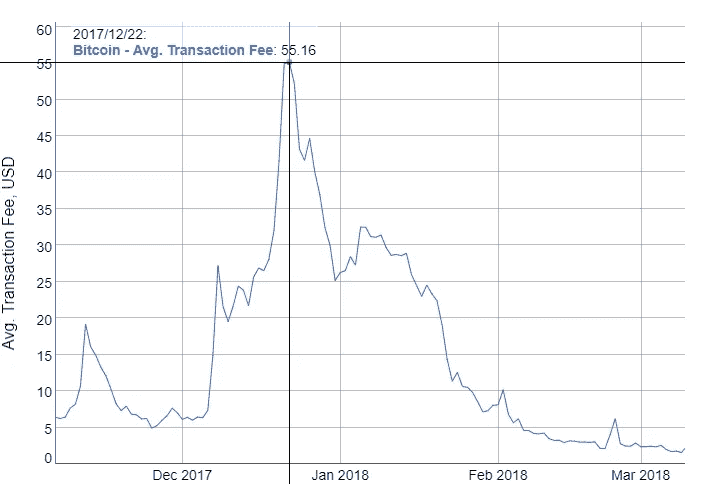

# 工作证明和利益证明是递减的

> 原文：<https://medium.com/hackernoon/proof-of-work-and-proof-of-stake-are-regressive-3db6f4d3761>

## 对伦理行为密码经济学的思考

最近加密货币的士气低落给了我们的社区一个反思的机会。我们中的绝大多数加密爱好者都有一颗将技术和社会行动结合起来的真诚的心，我相信现在是我们反思我们希望数字货币走向何方的时候了，诚实地评估区块链今天的技术状态，并严格规划如何改进数字货币的发展。

我有幸在斯坦福大学旁听了许多讨论区块链技术和计算机科学激励结构的讲座，这让我得出结论，加密激励驱动了对全球共识的渴望，这掩盖了我们最初心中的重要目标。虽然数字货币的轨迹现在有些令人沮丧，但我相信，随着更多的同情和创造性思维，加密货币可以朝着平等主义和解放的方向发展，这深深地激励了我们。

# 反思加密货币的目标

加密货币的设计是为了应对以不公平金融交易和社会不平等形式出现的腐败。明确地说:加密货币关心的是解决交易平等，而不是结果平等(事实上，加密货币与经济社会主义相去甚远)。

[Airtime remittances](https://www.economist.com/finance-and-economics/2013/01/19/airtime-is-money) have become a common unit of exchange in Africa, where governments often fail to maintain stable currencies.

加密货币的承诺是为没有银行账户的阿富汗妇女提供银行服务，她们被剥夺了管理(甚至拥有)自己金融资产的权利。它是为了提供一个稳定的交换单位，这样科特迪瓦、埃及、加纳和乌干达的公民就不必担心政府或银行会让他们一生的储蓄变得一文不值。这使得信用卡公司无法蹂躏 43%的美国债务持有人的生活，他们面临利率的立即上升。这是为了阻止低风险人群(即富人和/或政府)在艰难维持生计的家庭感受到通胀余震之前获得印钞时产生的涓滴财富创造。

我们认为，只要让一种依赖于分散共识协议的算法来管理有限硬币的分类账，这些目标就可以实现。但是我们现在做得怎么样？

# 盘点

自比特币传奇般的推出以来，近 10 年过去了，我们不得不怀疑我们是否朝着这些目标取得了进展。在我看来，为没有银行账户的人提供银行服务的方式已经取得了一些非常重要和良好的进展。截至 2014 年，妇女附属基金会使 2000 名阿富汗女孩能够为她们的博客写作并获得比特币报酬。此外，[第三世界人口对加密货币的采用进展缓慢](https://www.aljazeera.com/news/2018/03/uganda-bitcoin-enthusiasts-180324100659082.html)，当地用户似乎并未被比特币的波动性所吓倒。尽管如此，加密货币在许多长期战线上都失败了。

Bitcoin mining farm.

比特币和以太坊使用区块链来维护一个全球性的公共账本。事情是这样的:一个人在有限的时间内管理一批金融交易。然后，他们玩起了烫手山芋:他们关闭自己的区块，把它扔给下一个区块持有者暂时管理分类账，如此循环往复。他们管理这个烫手山芋的回报是 coinbase 交易——即系统中创造的货币——以及交易费。

难点在于选择谁来管理这个街区并获得回报。比特币依靠工作证明来做到这一点。比特币采矿平台解决了计算难题，而且(如果它们表现诚实的话)它们管理一个区块的概率相当于它们在所有比特币采矿计算能力中的份额。但是，这导致了一些不可预见的副作用。

这导致了一系列旨在专门从事比特币挖掘的硬件开发，这些吸盘需要大量的能量来运行。在某些时候，开采一枚比特币的能源成本实际上超过了比特币本身的价值。从这个角度来看，如今花费在比特币开采上的能源足以驱动一个[小国](https://www.forbes.com/sites/shermanlee/2018/04/19/bitcoins-energy-consumption-can-power-an-entire-country-but-eos-is-trying-to-fix-that/#188636ff1bc8)。

Taken from [Forbes](https://www.forbes.com/sites/shermanlee/2018/04/19/bitcoins-energy-consumption-can-power-an-entire-country-but-eos-is-trying-to-fix-that/#188636ff1bc8).

虽然无法预料，但这种副作用并非无害。虽然许多人担心比特币对气候变化的影响，但我担心的是比特币平等主义目标的意外消失。用务实的话来说，这意味着管理账本的人是那些有能力购买和操作采矿钻机的人——这不是一个微不足道的细节。想想下面这张颇具争议的世界地图，它显示了按地区开采一枚比特币的成本。

[Map posted in March 2018](https://bitcoinist.com/mapped-cheapest-expensive-countries-mine-bitcoin-electricity-cost/).

乍一看令人印象深刻的是，开采比特币最便宜的地方是第三世界的委内瑞拉，而最贵的地方是第一世界的韩国。但是第二次短暂的停顿很快提供了警告的理由:如果我们将委内瑞拉和韩国分别排除在低和高异常值之外，那么似乎存在一种模式，即当考虑到生活成本时，历史上占优势的国家可以以更低的成本开采比特币。例如，挖掘 1 个比特币的成本仅为美国公民平均购买力的 7.86%；但这是墨西哥公民的 49.92%。看起来，如果比特币的广泛采用继续下去，富国将变得更富，穷国将变得更穷(更不用说非洲大部分地区将支付额外的迟采用罚款；更不用说一些国家被拒绝[获得可用于采矿的核能](https://www.amacad.org/content/publications/pubcontent.aspx?d=860)。这意味着，富裕的矿商和富裕的国家将比财力较弱的同行更频繁地获得区块控制权。此外，他们还将从[内存池](https://coingape.com/what-is-bitcoin-node-mempool-live/)中选择哪些(大额)交易费是值得的。这听起来很像银行，尽管营业额要高得多。

以太坊试图通过开发[利害关系证明](https://www.investopedia.com/terms/p/proof-stake-pos.asp)范式来规避对能源的过度需求。比特币的工作证明要求矿工通过基本上放弃他们的计算能力来投入游戏，而以太坊通过根据矿工拥有的硬币网络的总百分比分配块管理来实现能源捷径。虽然这肯定是一种更环保的方法，但对于秘密社会活动家来说，这在伦理上也是值得畏缩的。如果以太坊被广泛采用，这基本上就是说，“你越富有，你就越有可能赢得区块管理，以及与之相关的交易费和 coinbase 奖励。”但老实说，这只是一个更透明的声明，说明比特币的工作证明也是如此。

需要明确的是:工作证明和利益证明在经济上是倒退的。

# 现在怎么办？

现在，我们又回到了本文开头的地方。加密货币士气低落，我也没有让前景变得更加光明。但现在，我希望我们的社区卷起袖子，做一些不那么光彩的工作，把这些碎片重新组合在一起。我们如何才能建立平等对待所有人的加密经济系统？我有几个建议。

把我们从街区中解放出来。

我上面提到的许多问题都围绕着街区的权力争夺。如果我们退后一步，很容易注意到，如果没有封锁，即使是富裕的加密货币采用者也不会在管理账本方面处于相对优势(也可以获得相对更多的系统硬币)。因此，如果没有障碍，递减工作和股权激励就会消失。对于[来说，想象一种没有区块链](https://hackernoon.com/unicorns-are-more-important-than-blockchain-a8ed3e66bffc)的加密货币可能看起来很奇怪，但在一系列联系在一起的交易中(即每枚硬币一个账本)，在保留数字货币的加密优势的同时，消除这一障碍是可行的。这就引出了我的下一个建议。

**分散总账。**

比特币和以太坊被认为是去中心化的。但是仔细研究发现，它们被更准确地描述为串行集中。在任何给定的时刻，只有一个对等体在管理分类账。尽管随着时间的推移，这些区块被传递给许多不同的同行，但如果我们拍一张快照，或者考虑任何一个给定的时刻，它看起来就像是一个银行业独裁者被竞争性拍卖所贿赂，以记录一笔交易。

image from axe.eco

相反，强大的去中心化会导致账本同时存在于许多对等体中。这与存在于许多地方的副本不同——相反，我的意思是没有人对分类帐有完整的了解，因为它分散在网络上的对等点中。只有当我们假设在这种情况下无法提供硬币合法性的密码证明时，这听起来才令人担忧。然而，在给定的交易中，所有重要的是交易中涉及的硬币的合法性——而不是网络上所有硬币的合法性。

通过解除加密和移除封锁*(如上所述)，我们可以在逐枚硬币的基础上实时验证交易。没有必要由一个大人物来描述货币历史上所有交易的背景。

*但这难道不会导致重复支出吗？不，你[也能搞定这个](https://youtu.be/EHZyaupYjYo)。

**从一开始就有有限数量的硬币。**

虽然硬币可能需要一些激励措施来推动采用者远离硬币，但我们至少可以以消除过度通胀为目标。给区块经理发币，本来就意味着有能力挖矿的人(即有权有势的人)在没有能力挖矿的人(即系统中的边缘化人群)感受到系统中的通货膨胀之前，就获得了那个价值的果实。诚然，随着整体奖励的减少，比特币的这个问题最终会消失，但我们仍可以致力于在未来的货币中做得更好。生态系统中的所有硬币应该在系统诞生时就存在。

**尽可能降低入门成本(想想智能手机)。**

Heat map of retailers accepting bitcoin, taken from coinmap.org November 2018.

我们希望人们能够在没有专门设备的情况下完全了解一种货币的所有细节。比特币挖矿不允许这样。不幸的是，操纵货币需要某种程度的复杂技术。虽然[世界上只有 36%](https://www.statista.com/statistics/330695/number-of-smartphone-users-worldwide/) 的人拥有智能手机，但如果我们能让一种货币的所有功能都能在这样的设备上使用，我们至少会更上一层楼。目前，世界上拥有比特币采矿平台的人的比例是未知的，但 2015 年[的最佳估计](https://bravenewcoin.com/insights/number-of-bitcoin-miners-far-higher-than-popular-estimates)认为大约有 10 万人，或世界人口的 0 . 00001%。即使这一数字自那时以来增加了 10 倍，但对于管理一种将暴君拒之门外的货币来说，这个数字还是小得不可原谅。

**去掉交易费用。**

如果我们摆脱了阻碍，降低了进入成本，自然就摆脱了交易费。在这里，我们可以开始了解一种货币，这种货币集中在一个人和一个商人之间的本地交换。我厌倦了去杂货店购物，把我的信用卡插入那个永远不会工作的愚蠢的芯片阅读器，在地球的不同角落互相交谈并批准我的支出时等待很长时间。我怀念过去的美好时光，那时我会蹦蹦跳跳地去附近的市场买我的辣妹棒棒糖，把冰冷的现金交给收银员，然后马上撕开包装，看看我是否得到了我想要的可收藏的贴纸。店员知道我有钱，不用去找那个外国金融大佬报到，也不用为他的大佬身份支付交易费。当食物岌岌可危时，这种挫败感只会更加严重——而不仅仅是一根轻浮的棒棒糖。

Bitcoin transaction fees peaked late last year at an average of $55.16\. This is nearly .1% of the average US citizen’s income. Chart taken from [bitinfocharts.com](https://bitinfocharts.com/comparison/bitcoin-transactionfees.html#1y).

我想要一个像交换现金一样运作的金融系统(或者更好，超越货币交换)。没有链和块，但有深度分散的分类账，当地店员会给我棒棒糖，我会给他们钱(不需要向 mempool 提交交易费，等待进一步的通知)。

# **梦想成真**

区块链不仅仅是唤醒了经济交易中激励的力量。这也给人们敲响了警钟，激励措施可以多么容易地挫败他们自己的目的。让我们拒绝让社会被权力和财富的诱惑蒙蔽了双眼，而牺牲了我们最初的慈善意图。工作证明和利害关系证明将谈话过多地集中在对损失的恐惧上，而对我们试图获得的东西关注不够。加密货币的未来与区块和交易费的竞争无关。它关注的是乌干达公民与其政府之间的合作。它旨在为硅谷的风险投资家和阿富汗年轻的博客女孩提供平等的机会。

我正在用[时代](https://era.eco/#step1)构建去中心化网络的平等主义基础设施。想了解更多我对加密货币的想法吗？查看我的文章:[行为密码经济学:数字货币的秘密(或者说只有加法的未来:释放香蕉人质！)](https://hackernoon.com/behavioral-cryptoeconomics-the-secret-of-digital-currencies-ac6e9b04fcb6)。

*如果你喜欢这篇文章，如果你为它鼓掌，分享它，并在*[***Twitter***](https://twitter.com/ambercazzell)*上与我联系，这将意味着很多！如果你对技术、经济和伦理的交叉感兴趣，看看我新的* [***视频系列***](https://www.youtube.com/watch?v=0VeABkfCHqk&list=PL-UMfJVuezk-YgNUNSgpv-fE6q5Qjokdp) *，在那里我与第一线的企业家交谈。*