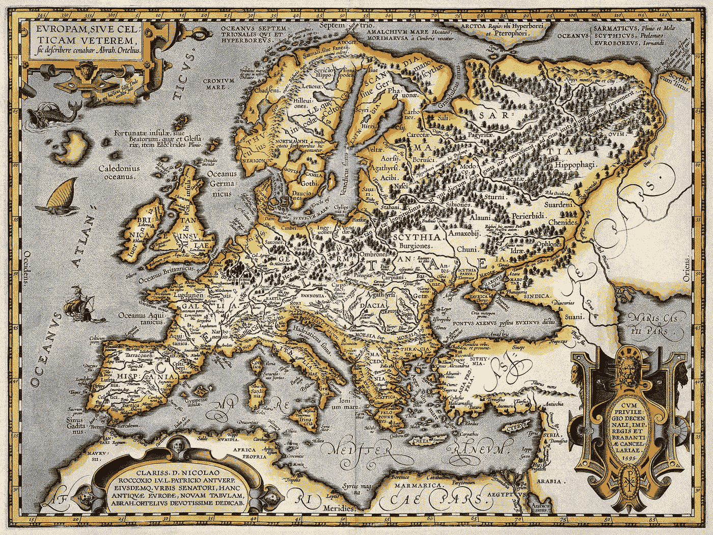

# 工作证明与利益证明:历史的一面镜子

> 原文：<https://medium.com/hackernoon/proof-of-work-vs-proof-of-stake-a-mirror-of-history-f61c0934cd86>

## 其中我们观察到两个看起来很不同的东西实际上是非常相同的。

Map of Europe, circa 1595 (src: [https://www.pinterest.co.uk/pin/505388389411524578/](https://www.pinterest.co.uk/pin/505388389411524578/))

## 一.功率与位置

我最近在格兰德中央理工大学参加了一场精彩的辩论。

该活动由 Crypto NYC 主办，两位著名的工作证明倡导者与国家证明倡导者 Nate Rush 就区块链社区面临的最重要的问题进行了激烈的辩论。

对于那些不熟悉的人来说，“工作证明”和“利益证明”是被称为“共识算法”的类型:一套规则，用于区块链如何决定哪些交易成为“规范的”，哪些不是。区块链共识算法有点像它的宪法:定义它和决定它的行为的基本规则。

其中，**工作证明(PoW)** 是目前事实上的标准，为比特币和以太坊这两种世界上最大的加密货币提供动力。本质上，PoW 要求参与者证明他们已经完成了一定量的计算工作，以便将交易放入佳能。通过施加这一工作要求，比特币和以太坊使得试图将欺诈性交易纳入正典的做法在经济上变得低效。只要“好人”拥有至少一半的计算机，“坏人”就无法实施欺诈，区块链的交易可以被认为是准确的。

工作证明最早出现在 2008 年的比特币原始论文中，作者是化名中本聪。这是第一个解决“双重花费问题”的算法，这是以前加密货币的致命弱点。它因有效、易于理解和实现而受到称赞。它的主要缺点是它需要大量的能量:由于证明工作的“工作”涉及任意的(非生产性的)计算，网络中的参与者本质上是在竞争浪费最多的电力。

**Proof of Stake (PoS)** 是一种更新的实验性共识算法，通常被吹捧为工作证明的潜在替代品，并寻求避免 PoW 的大量能源成本。它通过使确定哪些交易进入佳能的功能不是计算能力的功能，而是拥有和提交令牌的功能来做到这一点。参与者承诺一些代币(如比特币或以太)，以便对交易成为佳能有发言权。他们承诺的代币越多，他们就越有可能做出决定。如果您提交的硬币试图包含欺诈性交易，这些硬币很有可能会丢失。因此，PoS 创造了一种激励机制，鼓励尝试诚实交易而非欺诈交易(假设大多数代币持有者更喜欢诚实交易)。PoS 面临的挑战是，它更容易受到某些类型的攻击，例如来自令牌价格操纵的攻击。以太坊社区对未来转移到利益相关算法的证明很感兴趣，这是一个活跃的研究领域。

## 二。现实政治与国际机构

听着这场辩论(并思考我过去对这些议定书的阅读)，我不禁想起了在国际事务课程中发生的类似辩论。在国际事务中，有一个 19 世纪在德国发展起来的“T2 现实政治”的概念，这是一种政治哲学，认为在没有一个假想的强有力的全球政府的情况下，像军事实力这样的实际现实决定了国家之间的关系。他们认为国家在一种“自然状态”下共存，在这种状态下，意识形态、价值观和规范无关紧要或影响甚微。作为一种哲学，它被认为是有效的，易于理解和实施的。

在缺乏信任外交的情况下，各国被刺激参与军备竞赛，竞相用更先进的武器建立更强大的军队。资源从学校和医院等社会商品中转移，因为军事力量较弱的繁荣国家将不可避免地被占领。稳定时期要么存在于一个国家强大到没有挑战者的时候(霸权)，要么存在于多个国家势均力敌的时候，因此陷入了一种和平但紧张的僵局(多极世界)。战争就像标点符号一样充斥着历史。

Mount Washington Hotel, site of the Bretton Woods Conference (src: Booking.com)

第二次世界大战快结束时，世界上的盟国聚集在新罕布什尔州的布雷顿森林，着手开发一种替代品。他们说，这场所有人反对所有人的战争已经持续太久了。我们将发展一个由各种组织组成的**国际体系**，通过金融和贸易网络将各国联系在一起，并建立辩论、监管和解决争端的机制。我们将化干戈为玉帛，不再学习战争。

这一系统已被证明非常有效。虽然它促进了全球财富向少数人手中的高度集中，但它也成功地防止了大国之间的全面战争，而且一般认为它促进了科学、技术、文化和数十亿人生活质量的提高。

## 三。辩证法统治着我周围的一切

将这两种国际事务体系与提出的两种共识算法进行对比，并思考它们所解决问题的本质相似性，是一件有趣的事情。在这两种情况下，我们都试图在竞争的、可能是敌对的各方之间建立秩序。第一种方法是将结果取决于武力的展示。这种方法的作用在于，力量是其他可取属性的代理:对资源的控制、组织能力、信念，并且它易于理解和实现。这种方法是有局限性的，因为它需要将来之不易的精力投入到没有生产性的工作中。因为生命的基本过程是获取和分配能量，这必然是次优的。

第二种方法是试图创建一个更微妙的精神关系系统，并希望这个框架对于那些寻求影响结果的人不可避免的剥削和俘获的企图是健壮的。与第一种方法不同，这种方法更容易受到破坏，并且很难预测、检测和响应。如果我们作为一个社区——一个加密货币社区或一个世界社区——拥有执行愿景的技能和承诺，那么这个系统将允许参与者以一种公平的方式竞争，其结果取决于理想属性的显示，但也是高效的，因为它消耗尽可能少的能量来为其他任务保存能量。更高的风险，但更高的回报。

看看这两个辩论，本质上是一个辩论，很难不花一点时间回顾过去，并在这些辩论和我们作为动物的发展之间建立第二个联系，在这个过程中，我们开始时是简单的身体，但随着时间的推移发展出复杂的思想。同样，这些思想流派之间的紧张关系与我们的身体和思想之间的紧张关系是一样的:思想带有风险，我们经常怀疑身体是否就是我们所需要的一切。另一方面，身体是有限的，而头脑却有如此大的潜力。我们是否有技能、远见和毅力来实现这一飞跃，而不迷失自己的起点？

*原载于 2018 年 3 月 16 日*[*kronosapiens . github . io*](http://kronosapiens.github.io/blog/2018/03/16/pow-vs-pos.html)*。*