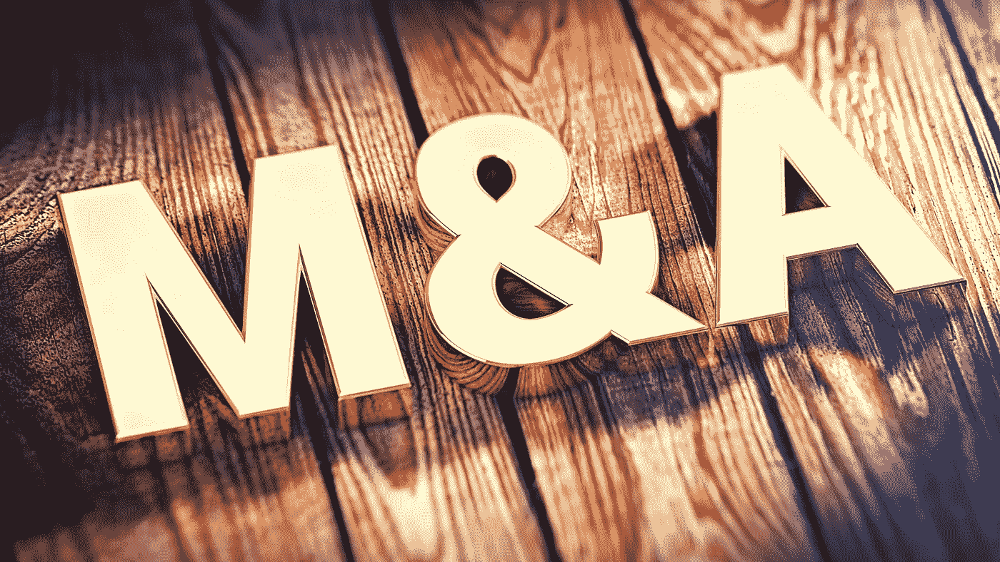

# 提出了一个友好的加密令牌 M&A 框架

> 原文：<https://medium.com/hackernoon/proposing-a-framework-for-friendly-crypto-token-mergers-4601cb4d0638>

M&A: An essential mechanism for optimizing network effects

注意:写完这个初稿后，我看到了安迪·布罗姆伯格 7 月份的帖子，我认为它是对我在这里深入研究的概念的一个很好的补充..他文章的链接是 [*这里是*](/@andy_bromberg/paying-to-be-bought-a-token-network-acquisition-blueprint-a3e47d59b134) *。*

# 介绍

与传统的收购相比，ICO 泡沫和 dApp 网络架构的特质使得合并尤其有效…