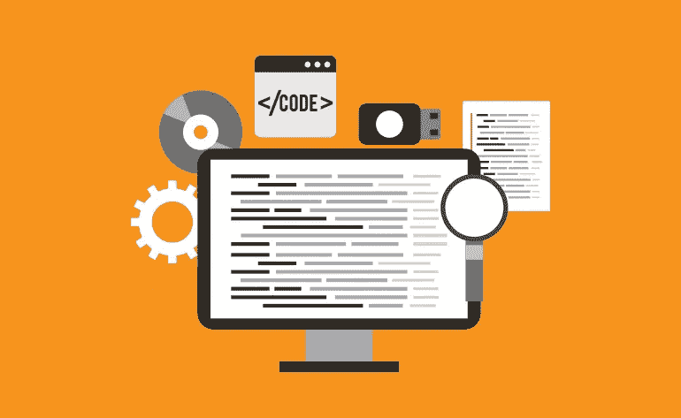
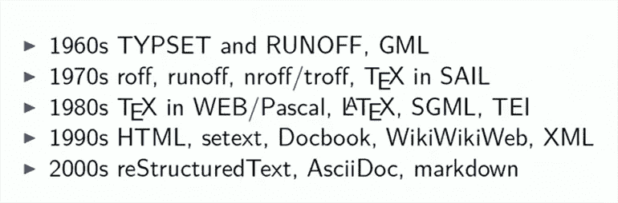
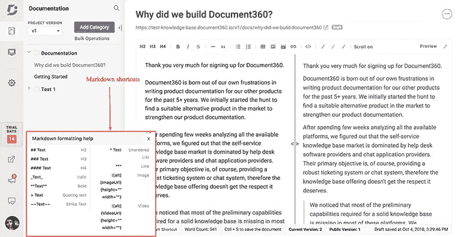

# 技术写作中使用降价的利与弊

> 原文：<https://medium.com/hackernoon/pros-and-cons-of-using-markdown-for-technical-writing-34f277418a8a>

许多技术作者目前或者有兴趣使用 Markdown 来编写他们的技术文档。这有点像马麦酱——有些人喜欢它，有些人有点讨厌它。

减价产生了一些争议，但它在某些情况下仍然被证明是非常有用的。在这篇文章中，我们将讨论什么是 Markdown，以及它是否适合你的文档项目。

# 降价的定义

John Gruber 是 Markdown 的创始人，他[将其](https://daringfireball.net/projects/markdown/)定义为:

“Markdown 是为网络作者提供的文本到 HTML 转换工具。Markdown 允许您使用易读、易写的纯文本格式进行编写，然后将其转换为结构有效的 XHTML(或 HTML)。”

Gruber 的定义表明 Markdown 是为任何在网络上制作内容的人设计的——现在几乎是为任何人设计的。Markdown 是开源免费软件，这意味着任何人都可以使用它。

它获得了 [BSD 风格的开源许可](https://daringfireball.net/projects/markdown/license)。

# 什么是 Markdown 编辑器？

关于 Markdown，你真正需要知道的第一件事是，它是一种在编辑器中格式化文本内容的方式——不需要你知道或使用像 HTML 或 CSS 这样的编码语言。你当然不需要了解一些其他的编程语言，比如 JavaScript 或者 Ruby。

# 句法

就我们的目的而言，Markdown 是“纯文本格式语法”——但它也是一个工具(解析器)，将这种纯文本格式转换成 HTML 以在 web 上显示。

Markdown 语法是您的工具保存的关于文本的信息。例如，呈现语法告诉你如何呈现文本，比如让文本变得**粗体**或加下划线。语义语法告诉你文本实际上是什么，所以它可能是一个列表或者一个引用。

Markdown 相当引人注目，因为它结合了表示语法和语义语法。

# 如何使用 Markdown 进行技术写作？

使用 Markdown 的主要方法是在扩展名为。你用正常的方式写你的文本，但是用 Markdown 语法格式化它——这可以在网上找到。

如果您在纯文本编辑器中工作，您可以将文件保存为 Markdown 格式，或者确保您的编辑器具有 Markdown 解析器。许多编辑器支持 Markdown，比如 Document360，它是我们的知识库平台。如果一个产品支持 Markdown，公司会在他们的功能页或主页的某个地方告诉你。

简单易用的 Markdown 编辑器来格式化文本内容，不需要 HTML 或 CSS。

尝试在 Trello 中使用一点降价来格式化你的一些卡片。它比没有格式化有了很大的改进，而且相对容易实现。

这是一个[优秀的小抄](https://github.com/adam-p/markdown-here/wiki/Markdown-Cheatsheet)开始降价。看看这篇[关于从 Ghost](https://blog.ghost.org/markdown/) 降价的深度指南。

# Markdown 与其他标记语言

Markdown 只是标记语言的一种，它有很多种。“降价”这个名称实际上是在玩“加价”这个词。

Markdown 用于在浏览器中呈现纯文本，但其他标记语言可以直接与计算机通信。XML(可扩展标记语言)既是人类可读的，也是机器可读的。

根据 [Webopedia](https://www.webopedia.com/TERM/M/markup_language.html) ，标记语言被定义为一种工具，用于:

“文本的处理、定义和呈现。该语言指定文本文件中的格式代码，包括布局和样式。用于指定称为标记的格式的代码。

" HTML 是广为人知和广泛使用的标记语言的一个例子."

这意味着用于格式化的标签直接应用在纯文本文件中，而不是在单独的文件中指定，例如 CSS。

HTML 代表超文本标记语言，可能是当今网络上最著名的标记语言。Markdown 已经发展成为一种为 web 用户简化标记的方式。

# 降价编辑器的历史

Markdown 最初是由 John Gruber 在 2004 年创建的，他与 Aaron Schwartz 合作研究语法。

他们开始这个项目的原因是因为历史标记语言对于普通人来说根本不容易使用。

术语“标记语言”起源于传统的出版业，文档由作者或编辑逐字“标记”。这是为了告诉打印机如何在打印最终副本时格式化文档。

想象一下，你必须写一些东西，但也需要系统地与生产线上的其他人交流:

*   这一点用粗体表示
*   这是一个标题
*   这应该是引自另一位作者的话
*   告诉他们这里有一个图像
*   这一整节突出了

以传统方式标记内容，但以现代风格可视化内容的外观和感觉。

# 输入标记语言

由于大多数标记语言最初都是为非常复杂的技术项目设计的，因此需要一种“轻量级”的标记语言。它必须如此简单，以至于任何人都可以使用它——无需多年的培训。

技术作家 Tony Ibbs 在 Write the Docs Prague 2018 上发表了一个非常有趣的[演讲，讲述了标记语言的历史。](https://www.youtube.com/watch?v=P-7hwjocEpM)

从 Tony 的幻灯片中可以看出，Markdown 在标记语言领域还是一个新手。

# 技术写作降价的好处

由于其简单性，Markdown 很快在网络作家中流行起来。

有趣的是，它在 2016 年前后经历了技术作家中[的人气飙升。一些人对减价非常兴奋，而另一些人则不那么兴奋。](https://ffeathers.wordpress.com/2016/09/24/how-to-get-started-with-markdown-and-where-to-try-it-out/)

许多技术作家发现在他们的文档中使用 Markdown 有很多好处。这些优势包括:

*   **Markdown 以相对简单的方式为内容提供语义**
*   **您可以非常快速地编写丰富的格式化内容**(与直接在 HTML 标签中编写相比)
*   在用 HTML 呈现之前，你可以很容易地以纯文本方式阅读 Markdown
*   **它不会因为需要点击按钮而中断**您的工作流程
*   **它是平台无关的**所以你的内容不依赖于你的编辑器的格式

Markdown 也是轻量级的，这意味着您不需要学习太多就可以开始使用它。

许多产品文档都是用 Markdown 编写的，因为它非常通用，通常可以在不同平台之间转移。例如，您可以在 Atom 之类的文本编辑器中编写 Markdown，甚至可以在 GitHub 之类的版本控制平台中编写，因为 GitHub 也支持 Markdown。

Markdown 是一个轻量级的编辑器，你不需要学习如何开始使用它。

Markdown 可以用在静态站点生成器中，如 [Jekyll](https://jekyllrb.com/) 或 [Hugo](https://gohugo.io/) ，它们是专门为文档站点设计的工具。

它还可以在 Document360 的[知识库软件](https://document360.io/)中工作，该软件允许你在编辑器中使用 Markdown，并提供在 Markdown 中编写的快捷方式。

# 什么时候应该使用降价？

那么为什么你应该使用 Markdown 而不是 WYSIWYG 编辑器呢，现在这些编辑器已经是标准的和丰富的了。

所见即所得编辑器通常需要你点击按钮来实现你想要的格式，并且受到软件创建者的设计的限制。您还必须始终在您选择的编辑器中工作，这将焦点从实际内容上移开。

一些人担心 Markdown 没有足够的功能来满足他们的需求，或者如果他们扩展它，那么内容将无法重用。减价可以用额外的功能来扩展。这意味着有人创造了另一个版本(或“口味”)的降价来满足他们的需求。另一方面，如果你扩展它，你的降价风格可能无法移植到另一个平台。

扪心自问，您是否有可能跨多个平台(如 web、内部知识库和印刷品)重用数千页内容？

在这种情况下，降价可能不适合你。

但是如果您想快速创建具有丰富格式的简单文本文档，那么 Markdown 可能适合您。

# 围绕降价的争议

Markdown 编辑器的创建是有原因的，但是有些人强烈反对使用它。原因包括:

*   **Markdown 最初不是为了编写文档而设计的**,所以在使用它的方式上可能会有限制(John Gruber 本人就是一个著名的博客作者，而博客是 Markdown 的最佳用例之一)
*   **它不像其他标记语言那样标准化**，所以你不一定知道它将如何在浏览器中呈现
*   **降价有几十种“味道”**因为人们已经扩展了降价来提供他们需要的功能，这些功能互不兼容
*   Markdown 合并了文本的语义和显示方式，有些人认为这不合适
*   你如何展示你的内容在风格上受到了限制——但这是 Markdown 背后有意的设计选择

Markdown 固有的灵活性和在各种环境中使用的潜力导致一些人警告不要使用 Markdown。许多人推荐它，但它并不适合每个人。

Write Docs 社区的联合创始人 Eric Holscher [强烈反对](http://ericholscher.com/blog/2016/mar/15/dont-use-markdown-for-technical-docs/)在[技术文档](https://document360.io/blog/saas-product-documentation-mistakes-to-avoid/)中使用 Markdown。

他推荐使用[asciidurd](https://asciidoctor.org/)，或者 [Sphinx](http://www.sphinx-doc.org/en/master/) 和 [reStructuredText (rST)](http://docutils.sourceforge.net/docs/user/rst/quickstart.html) 。rST 是另一种类似 Markdown 的标记语言，但它有一个官方标准，这使得它在一些开发人员中很受欢迎。

# 我应该使用 Markdown 编辑器吗？

就像任何事情一样，如果你的项目需要适合它，标下一个好的选择。由于设计的方式，Markdown 的功能有限。这让有的人信以为真，有的人恨之入骨。

考虑创建内容的界面、文档项目的技术复杂性以及需要创建和审阅文档的用户类型。

确保你为你的文档设计了合适的工作流程，并为交付研究了合适的技术写作工具以避免将来的样式问题。Markdown 本身并不是一个编辑器，所以它必须与 CMS(内容管理系统)相结合才能生成实时文档。

如果你想用 CSS 或者更多的 HTML 来扩展你的 Markdown 格式的文档，重要的是要注意这些扩展会阻止你的内容风格在系统之间的可移植性。您在当前编辑器中添加的一些内容可能无法很好地移植，因此无法在不同的编辑器中工作。

可以肯定地说，人们使用 Markdown 的许多问题来自于在不恰当的环境中使用它。如果你确切地知道它能做什么，以及它的限制是什么，使用 Markdown 是安全的。

# 结束语

Markdown 是一个很好的工具，可以很容易地制作可以在各种平台上显示的格式化文本文件。它因其易用性和相对较短的学习曲线而受到技术作家的欢迎。

在承诺以 Markdown 这样的特定格式启动产品文档项目之前，研究一下你的选择。确保您需要使用的其他平台——现在和将来可能使用的——都是 Markdown 兼容的。

*原载于 2018 年 6 月 5 日*[*document 360 . io*](https://document360.io/blog/markdown-for-technical-writing/)*。*