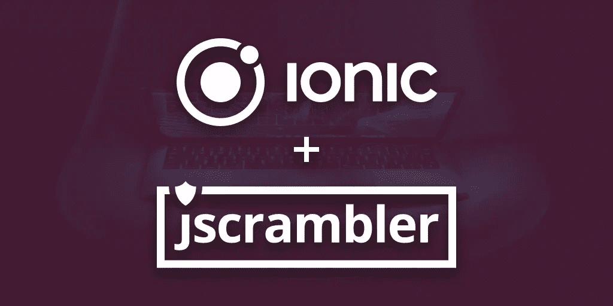

# 使用 Ionic 和 Jscrambler 保护混合移动应用

> 原文：<https://medium.com/hackernoon/protecting-hybrid-mobile-apps-with-ionic-and-jscrambler-c2ddd8dbf843>



**本文是我们** [**之前教程**](/@Jscrambler/protecting-hybrid-mobile-apps-with-ionic-and-jscrambler-c0996593717f) **的重大更新。**

在本文最新更新时， *Ionic* 的版本是 4.0.6， *Cordova* 的版本是 8.0.0。

# 介绍

[*Ionic*](https://ionicframework.com/) 是一个开源框架，旨在构建面向主流移动操作系统的类似原生的移动 web 应用。以相同的代码库为目标的不同系统加速了开发过程，同时减少了上市时间和可维护性工作。

*Ionic* 基于两大框架构建，Apache 的 [*Cordova*](https://cordova.apache.org/) 和 Google 的 [*Angular*](https://angular.io/) 。它背后有一个伟大的生态系统，有全面的[文档](https://ionicframework.com/docs/)和[市场](https://market.ionicframework.com/)，在那里你可以找到许多主题和插件来帮助你入门。

本指南将解释如何使用 [*Jscrambler*](https://jscrambler.com/) 保护您的 *Ionic 4* 应用程序，并将其集成到构建过程中。

# 如何创建离子应用程序

开始使用 *Ionic* 相当容易。首先，确保将*离子*安装在*科尔多瓦*旁边。

```
npm install -g cordova ionic
```

出于本教程的目的，我们将使用官方的 [Ionic 演示应用](https://github.com/ionic-team/ionic-conference-app)作为模板。有关模板的更多信息，请参见[正式文档](https://ionicframework.com/docs/cli/starters.html)。

我们[分叉](https://github.com/JscramblerBlog/ionic-conference-app)应用的 2018 年 8 月 30 日提交，将在本教程中使用。

您可以通过运行以下命令安装 Ionic 演示应用程序:

```
ionic start myConferenceApp [https://github.com/JscramblerBlog/ionic-conference-app](https://github.com/JscramblerBlog/ionic-conference-app)
```

*Ionic* 会下载安装演示 App 的所有依赖项，基于 *Angular 5* ，使用 [*TypeScript*](https://www.typescriptlang.org/) 。

这就是我们拥有一个功能性 *Ionic* 应用所需要的一切。在浏览器中运行应用程序，检查是否一切就绪。默认情况下，它将在端口`8100`的`localhost`上运行。

```
cd \myConferenceApp
ionic serve
```

如果您需要更多入门信息，请参考[官方文档](https://ionicframework.com/getting-started/)。

# 我们的离子应用的结构

我们的*离子*应用的基础项目结构如下:

```
myConferenceApp/
|-- config.xml
|-- platforms/
| |-- android/
| |-- windows/
| |-- ios/
|-- plugins/
|-- resources/
|-- src/
| |-- app/
| |-- assets/
| |-- environments/
| |-- theme/
|-- www/
```

*   `config.xml`包含您的*离子*应用的配置。
*   `www`目录包含应用程序的所有源代码和资产，如 HTML、CSS 和 JavaScript。
*   `src`目录展示了应用程序的所有源代码。然后构建源代码并打包到`www`目录中(Cordova 使用该目录部署到每个平台)。

`src`目录的结构取决于所使用的构建工具。一些样板文件使用 [*webpack*](https://webpack.github.io/) ，这是一个模块捆绑器，它允许在构建应用程序时进行很大程度的定制。然而，官方的 *Ionic* 模板停止了它们的 [*囫囵吞下*](https://gulpjs.com/) 构建过程，取而代之的是一个自定义的[*Ionic-app-scripts*](https://github.com/ionic-team/ionic-app-scripts)。

如果你使用新的构建过程和 *ionic-app-scripts* ，那么你的`src`目录应该遵循这样的结构:

```
|-- src/
| |-- app/
| | |-- pages/
| | | |-- page1/
| | | |-- page2/
| |-- assets/
| |-- environments/
| |-- theme/
```

*   `app`子目录包含应用程序的模块和组件，包括`dev`和`prod`环境的设置。
*   `pages`目录包含应用程序每个页面的文件夹。每个文件夹包含一个`html`、`scss`和`typescript`文件，负责赋予页面表单和行为。
*   `assets`子目录类似于`resources`目录，尽管该文件夹中的文件与设备大小成横向关系。
*   `theme`文件夹包含`scss`文件，允许定制应用程序的主题。

# 在构建过程中集成 Jscrambler

# 安装依赖项

我们与 *Jscrambler* 集成的第一步是安装 [*Jscrambler* API 客户端](https://github.com/jscrambler/jscrambler/tree/master/packages/jscrambler-cli)。

```
npm install jscrambler --save-dev
```

# 连接 Jscrambler

为了将 *Jscrambler* 集成到我们应用程序的构建过程中，我们需要在`package.json`的*脚本*部分创建一个 CLI 钩子。该部分应该如下所示:

```
“scripts”: {
  "ng": "ng",
  "start": "ng serve",
  "build": "ng build",
  "test": "ng test",
  "lint": "ng lint",
  "precommit": "npm run lint",
  "ionic:build:after": "jscrambler"
}
```

特定的`“ionic:build:after”: “jscrambler”`钩子将在构建过程完成后触发`jscrambler`命令。

为了使这个命令可执行，我们需要将一个`.jscramblerrc`文件添加到我们项目的根文件夹中，它将保存 Jscrambler 设置。该文件应该具有以下结构:

```
{
 "keys": {
   "accessKey": "ACCESS_KEY_HERE",
   "secretKey": "SECRET_KEY_HERE"
 },
 "applicationId": "APP_ID_HERE",
 "filesSrc": [
   "./www/main.js"
 ],
 "filesDest": "./",
 "params": [
  {
    "name": "whitespaceRemoval"
  },
  {
    "name": "dotToBracketNotation"
  },
  {
    "name": "stringConcealing"
  },
  {
    "name": "functionReordering"
  },
  {
    "options": {
      "features": [
        "opaqueFunctions"
      ]
    },
    "name": "functionOutlining"
  },
  {
    "name": "propertyKeysObfuscation"
  },
  {
    "name": "regexObfuscation"
  },
  {
    "options": {
      "features": [
        "opaqueSteps"
      ]
    },
    "name": "controlFlowFlattening"
  },
  {
    "name": "booleanToAnything"
  },
  {
    "name": "identifiersRenaming"
  },
  {
     "options": {
       "options": [
         "tolerateBenignPoisoning"
       ],
       "threshold": 0
     },
     "name": "selfDefending"
   }
 ],
 "areSubscribersOrdered": false,
 "bail": true
 }
```

创建文件后，您需要编辑以下属性:

*   `"accessKey": "ACCESS_KEY_HERE”`
*   `"secretKey": "SECRET_KEY_HERE”`
*   `"applicationId": "APP_ID_HERE"`

您可以在 Web UI 上的[我的设置](https://app.jscrambler.com/settings)中找到这两个键(见下图)。


要获得您的`applicationId`，请转到 Web 应用程序，创建一个新应用程序，并检查文本编辑器上方的:


随意改变`params`，利用 *Jscrambler* 提供的任何变换。你可以在这里找到所有可用的转换。

**提示:**有一种快速的方法可以获得所需的密钥、`applicationID`和您希望申请的`params`。只需进入 [Web 应用](https://app.jscrambler.com/dashboard)，创建一个新的应用，选择您想要的转换，并下载 JSON 文件。现在，您可以打开它并将相应的部分复制到`.jscramblerrc`文件中。关于这方面的更多细节，请参考我们关于如何使用 CLI 的[博文](https://blog.jscrambler.com/jscrambler-101-how-to-use-the-cli/)。

您也可以更改`filesSrc`来匹配您需要/想要保护的文件。对于我们的例子——以及所有 Ionic 4 应用程序——我们建议保护`main.js`,因为这个文件通常包含要隐藏的逻辑。你应该让`vendor.js`文件不受保护，因为保护它通常不会给受保护的应用带来任何好处。

通过使用`filesDest: './'`，我们发送保护的文件将被它们的受保护版本替换。

# 构建应用程序

**注意:**如果您正在使用 *Ionic v1* ，请查看*使用 Ionic v1* 附件(在最后找到)，然后返回此处。该附录解决了在保护 *AngularJS* 时遇到的一些问题，这些问题与依赖项的注入方式有关。

我们现在准备好保护我们的代码并构建我们的应用程序:

```
ionic cordova build android --prod --release
```

Android 的版本将多个`apk`文件放在`platforms/android/app/build/outputs/apk`上。

我们的 build 命令将生成多个生产`apk`文件，每个文件针对不同的架构。出于本教程的目的，我们将选择 armv7 `apk`文件。

除非先签名，否则`apk`不会在设备上运行。如果你试图安装一个未签名的`apk`，那么设备将会提示一个解析错误。

为了在 Android 设备上运行它，我们需要生成一个密钥。如果你已经安装了 JDK，首先生成一个密钥

```
keytool -genkey -v -keystore my-release-key.keystore -alias alias_name -keyalg RSA -keysize 2048 -validity 10000
```

然后用它在`apk`上签名:

```
jarsigner -verbose -sigalg SHA1withRSA -digestalg SHA1 -keystore my-release-key.keystore android-release-unsigned.apk alias_name
```

请调整`android-release-unsigned.apk`以匹配您生成的未签名`apk`文件的名称。

最后，使用`zipalign`优化应用文件。你可以在`path/to/Android/sdk/build-tools/VERSION/zipalign`下找到`zipalign`工具。

```
zipalign -v 4 android-release-unsigned.apk myProtectedApp.apk
```

你完了！现在，您已经准备好使用应用程序文件。

您可以使用任何文件提取应用程序来验证您的`apk`文件是否具有受保护的资产。文件应放在`assets/www`下。

如果你需要更多关于如何发布你的应用程序的信息，或者关于如何部署到 iOS(这需要你注册成为一名*苹果开发者*)请遵循 [*Ionic* 发布指南](http://ionicframework.com/docs/guide/publishing.html)。

# 结论

Ionic 是一个有效的框架，用于创建功能强大、响应迅速的多平台应用程序，无需本地平台知识，从而加快开发速度。

通过将构建过程与 *Jscrambler* 结合起来，你可以在移动平台上保护你的代码，只需添加一个在构建你的应用之前执行的钩子，从而节省你在构建或部署过程中的时间。

【blog.jscrambler.com】最初发表于[](https://blog.jscrambler.com/protecting-hybrid-mobile-apps-with-ionic-and-jscrambler/)**。**