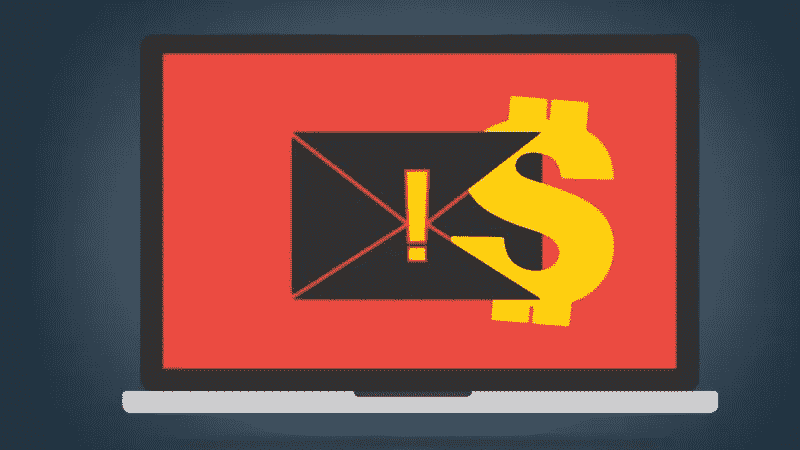

# 防范最流行的互联网诈骗

> 原文：<https://medium.com/hackernoon/protection-from-the-most-popular-internet-scam-f815eb19cd97>

艾米丽去芝加哥出差了，她的男朋友被留在纽约的家里。艾米丽不想让他感到无聊，给了他几张她不穿衣服的照片。她只把这些照片发给她的男朋友，所以当她收到这样一条信息时，她感到非常惊讶:

*“嘿！我有几张你的敏感照片。他们真的能取悦你的父母、兄弟和脸书朋友。请付给我 1000 美元，没有人会知道他们的任何事情。”*

**发生了什么？**

艾米丽的照片被黑客窃取，他们通过社交网络联系她。亲密照片可以从 iCloud、Google Photos、电子邮件通信、即时信使、社交网络中窃取。你的照片也可以通过 Wi-Fi 热点被截取，并借助[病毒](https://macsecurity.net/view/195-remove-mac-auto-fixer-virus)，感染你的电脑。骗子可以在偷笔记本电脑和闪存盘的时候拿到它们。

大多数网络车不选择受害者或捕食特定的人。他们监控未受保护的连接，收集大量的登录信息、密码和文件，然后才考虑如何利用这些数据。

黑客明白勒索富人和名人最有利可图。名人可能会花费数千美元来秘密保存有损隐私的照片(除非是为了公关而事先没有计划的泄露)。)

金·卡戴珊直到 2007 年她自制的成人照片没有在网上发布时才如此受欢迎。现在她是美国电视的大明星。她的母亲克莉丝·詹纳被指控建议女儿录制并发布这段视频。

黑客并不总是要求为私密照片支付赎金。照片可以出现在匿名论坛或主题社交媒体群中。有时候照片被公开只是为了好玩，什么也做不了。

如果黑客有勒索一个人的意图，他会花时间探索受害者的社交档案，寻找朋友和亲戚，找到谁是受害者的伴侣，受害者在哪里工作等。因此，攻击者将决定如果照片公开，受害者会有多痛苦，以及保持沉默需要多少钱。

如果没有名人与被盗的敏感文件有关联，匿名勒索者每天可以向不同的女孩发送数千条垃圾邮件，要求她们付费。如果他们中至少有一个人付钱，骗子就成功了。而且有时候不需要裸照，[骗子只是虚张声势](https://www.bleepingcomputer.com/news/security/beware-of-extortion-scams-stating-they-have-video-of-you-on-adult-sites/)。

**被敲诈怎么办？**

如果你被勒索，不要想把钱转给诈骗犯。这只会给他们更多的理由继续勒索你，也不能保证他们不会公布你的照片。

你应该明白，即使你向敲诈者支付三倍的钱，也无法阻止他将照片发送给你的朋友和同事，或者附加到将在黑暗网络论坛上传播的档案中。与其光着身子没钱，不如光着身子有钱。

网上勒索是非法的，但是你不太可能起诉一个匿名的骗子。最有可能的是，他在[或](https://www.torproject.org/)、VPN 或其他匿名器的背后操作。追踪骗子的 IP 几乎是不可能的。

但如果你是被前男友或熟人敲诈，你很容易用法庭审判吓住他。对带有威胁的消息进行截图，并联系律师和警方。

不要以任何方式表现出勒索者让你害怕、不安或愤怒。这只会逗他开心——小心你的神经。

如果你确定勒索者的意图是认真的，那么就用幽默的眼光看待这种情况，并提前警告你的朋友和亲戚，他们可能很快就会看到你不穿衣服。很可能他们会同情你，几天后，你会成为网络明星。

**我能做些什么来防止这种事情再次发生？**

监控你所有在线账户的安全:电子邮件、社交网络和即时通讯工具。任何成功的黑客攻击都会给你和你爱的人带来麻烦。这可以通过使用复杂的密码、双因素认证和密码管理器来避免。不要点击可疑的链接和附件。

不要从他人的设备登录电子邮件和社交网络。不要依赖他们的诚实和正派。假设任何设备都安装了记录每个键入字母的键盘记录器。请记住，密码通常保存在浏览器缓存中，可以很容易地从中提取出来。

谨慎使用公共 Wi-Fi。如果咖啡馆或酒店的路由器被心怀不轨的人监控，任何通过这个热点传输的信息都会被拦截——包括个人通信和亲密照片。

连接公共网络时最好使用 [best VPN](https://www.vpnranks.com/best-vpn/) 服务。VPN 将在你和互联网之间创建一个安全的“隧道”，即使连接到一个无保护的 Wi-Fi 网络，你也不会担心数据的安全性，它将被加密。

使用自毁式聊天。这些是带有自毁定时器的秘密聊天室， [Telegram](https://telegram.org/faq#q-how-are-secret-chats-different) 和 Snapchat 提供这样的聊天。在这样的秘密聊天室里，你甚至可以看到对方什么时候截图，所以不可能偷偷偷拍你的照片。

加密手机和笔记本电脑内存中的裸照和家庭视频。如果设备本身被盗，犯罪分子会试图从中检索您的数据。不要让骗子(除了偷窃)参与勒索。如果在设备上设置了密码，iPhone 会自行加密数据。在 MacBook 上，可以在设置中启用 [FileVault](https://support.apple.com/en-us/HT204837) 功能。 [BitLocker](https://docs.microsoft.com/en-us/windows/security/information-protection/bitlocker/bitlocker-overview) 加密对 Windows 用户来说效果很好。

确保你的合作伙伴/联系人也注意他们通信的安全。如果你受到保护，而你的伴侣没有，你的照片就有危险了。