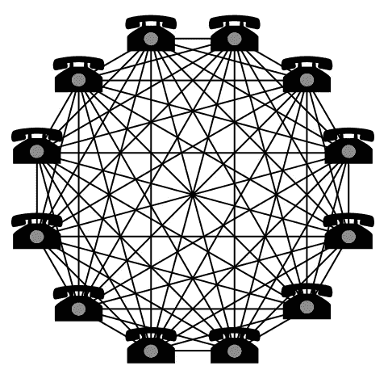

# 协议聚焦:雪崩(第一部分)

> 原文：<https://medium.com/hackernoon/protocol-spotlight-avalanche-3f5dfd366a26>

**注:本文最早发表于 6 月 29 日的**[**flat outcrypto**](https://flatoutcrypto.com/home/avalancheprotocol)**。**

在积极的反应之后(最令人满意的是，阅读了全部三部分的人占了很高的比例！)到 [PARSEC 白皮书分解](https://flatoutcrypto.com/home/maidsafeparsecexplanation)上周我决定继续探索一些较新的协议，包括 Thunderella 和 Avalanche。我将从后者开始。

与 PARSEC 帖子相同的免责声明也适用，即:

*   我将解释雪崩的关键概念，但不会详细介绍雪崩是如何工作的——白皮书正是为此目的而编写的。因此，一些复杂的、例外的和较小的方面，需要很多单词，但影响很小，将被省略
*   我将避免证实或反驳火箭队的说法。还有其他更适合这样做的人。我只是为那些可能没有阅读白皮书的兴趣或技术背景的人解释雪崩白皮书概述了什么
*   它可能没有 PARSEC 文章那么长，但仍然会很长！

# 什么是雪崩？

五月中旬，一个自称火箭队的团队匿名发布了《雪花变雪崩》白皮书。该白皮书包含四种协议，这四种协议互为基础，共同构成了一个协议家族。概述的这些不同协议被命名为:

*   烂泥
*   雪花
*   雪球
*   Avalanche(为简单起见，我将把该系列协议称为 Avalanche，除非我特别提到其他三种协议中的一种)

Rocket 团队(在这篇文章结束时，我会让‘为麻烦做好准备，让麻烦加倍’在我脑海中根深蒂固)将他们的工作描述为“加密货币的新型亚稳态共识协议家族”。

和 PARSEC 一样，让我们分解抽象来阐明团队到底开发了什么。

*本文介绍了一类新的无领导拜占庭容错协议，该协议建立在亚稳态机制之上。*

该论文声称这是一种新的协议，独立于以前的传统共识协议和 Nakamoto 共识协议。该文件将这些描述为:

1.  传统:需要所有节点与所有其他节点通信以达成共识。
2.  中本聪:最常见的是与[比特币](https://hackernoon.com/tagged/bitcoin)联系在一起，中本聪共识协议通过工作证明达成共识，在工作证明中选择一个领导者(矿工)来生产每个区块。

Avalanche 声称与这两个家族不同，它不需要选举任何形式的领导者(因此没有领导者)，而是协议简单地“引导”所有节点达成共识。鉴于我能想到的大多数(在火箭团队看来是所有)形式的共识算法都包含某种形式的领导者(除了像 [DPoS](https://flatoutcrypto.com/home/introtodelegatedproofofstake) 这样明显的领导者，像 [PoW](https://flatoutcrypto.com/home/introtoproofofwork) 和 [PoS](https://flatoutcrypto.com/home/introproofofstake) 这样的人仍然为特定的块选择一个验证者等等)，这是一个有区别的因素，也是一个很容易忽略其重要性的因素。关于这些所谓的分散网络如何集中的争论只会增加其重要性，特别是考虑到像 EOS 这样的项目自启动以来遇到的问题。

这种方法部分是通过雪崩的亚稳态机制实现的。亚稳态本质上指的是系统被设计成带来一个答案(即，所有节点以一种或另一种方式投票)的概念，因此不会保持平衡(因为如果系统保持平衡，则无法达成共识)。

Rocket 团队之所以将 Avalanche 描述为一个新的协议家族，是因为这是一种亚稳态的思想，它是一种通过引导所有节点达成共识的方式，而不需要任何领导者，同时实现相同的安全级别，并且比当前的协议速度更快。它通过建立“子定额”，即来自网络节点的小型随机样本来实现这一点，这允许在它们最终收敛并及时达成总体共识之前运行更高的吞吐量和并行共识。如果这听起来像我描述的[八卦协议](https://flatoutcrypto.com/home/cryptointrovirtualvotingandhashgraph)那么很好，因为这是它的灵感。

*这些协议在拜占庭对手存在的情况下提供了强大的概率安全保证，同时它们的并发特性使它们能够实现高吞吐量和可扩展性。*

高吞吐量=每秒比比特币和以太坊更高的交易数量(你可以在这里阅读更多我对区块链和 DAGs 扩展难度的想法)

可扩展性=可以支持更多人使用网络。部分问题是，当少量节点处于活动状态时，系统可以非常快，因为需要做出的决策较少，需要达成共识的节点也较少，但是当我们尝试向系统添加大量用户和事务(更高的吞吐量)时，系统将崩溃停止。

*与依赖工作证明的区块链不同，它们是静止的、绿色的。*

静止=不活动或休眠。在这种情况下，这意味着，与需要矿工不断积极参与的比特币等 PoW 实现不同，Avalanche 甚至可以在节点不活动时运行(我猜，我还没有谈到本文的其余部分)。而且，像所有其他非 PoW 实现一样，由于不需要采矿，它更加节能。

*令人惊讶的是，与需要 O(n)通信的传统一致性协议不同，对于某些安全参数 k<n*，它们的通信复杂度从 O(kn log n)到 O(kn)不等

基本上，Rocket 团队写道，这一系列协议的通信复杂性远没有传统协议使用的 *O(n )* 那么密集——这很好，因为它使系统更快，更具可扩展性。

The Metcalfe Network effect (which this illustration depicts) is a good thing, but it can also be used to demonstration that all nodes being required to contact all other nodes becomes a limiting factor to scalability

这是因为 *O(n )* 意味着函数的增长率由 *n* 决定，其中 n 是网络上的人数。因此，对于每一个额外添加的人，与网络上的所有人共享信息需要成倍增加的时间，例如 102 = 100，1002 = 10，000，1，0002 = 1，000，000。这是有道理的，因为传统的共识协议需要每个人都与其他人沟通，这很快就变成了一个艰巨的过程。[如有需要，本页](https://theagiledirector.com/article/2013/12/09/the-mathematics-of-agile-communication/)将提供更详细的信息。

作为一个小题外话，我希望作者不要在他们的介绍中使用数学符号，或者至少向那些不熟悉的人解释一下它的含义。这足以让一些人望而却步，这是一种耻辱，因为我们应该努力帮助人们更好地理解这项技术。

*本文描述了该协议族，将其实例化为三个独立的协议，分析了它们的保证，并描述了它们如何用于构建互联网规模的电子支付系统的核心。*

所有这些都是不言自明的——我不想听起来高人一等，但从某种程度上来说，回到描述如何建立一个实际支付系统的白皮书是很好的，因为这些天来每个项目似乎都是为了越来越具体和非货币的重点而建立的，这些重点可能永远不会被使用。10 年过去了，我们仍然需要一种合适的加密货币来实现。

*雪花到雪崩:一种新的加密货币亚稳态共识协议族*

最后，回到论文的标题，我们现在可以理解，火箭队将 Avalanche 定位为一种完全为支付(因此加密货币)设计的新协议，这应该被视为一种全新的协议方法。

# 相关点

**假设**

Rocket 团队指出，他们的论文假设了一个同步网络。我在这里写了同步、部分同步和异步网络的区别，但简单回顾一下:

*   **同步**:节点等待和接收信息有一个已知的定时。以太坊和比特币都是这方面的例子；比特币块间隔 10 分钟，以太坊 c. 15 秒。如果节点在这些边界内没有接收到输入，它们知道有问题。
*   **部分同步:**部分同步的区块链会知道有某个*定时**限制，但不知道具体是什么，消息总是在未知的截止日期内发送和接收。*
*   ***异步**:没有计时假设，允许消息的发送和接收可能被延迟任意长的时间(可能包括无限长)。速度取决于网络的通信速度。而不是一个固定的 X 秒的限制(不管它是否为人所知)，它只是在达成共识时发生。*

*同步网络存在遭受 [DoS](https://flatoutcrypto.com/home/cryptointrodenialofserviceattack) 攻击的风险，因为如果攻击者能够充分降低网络速度，那么同步协议就会变得不安全，无法运行。Emin Gün Sirer 博士(康乃尔大学副教授，IC3 加密货币和智能合约倡议的联合主任)在论文分发前审查了论文，他在接受 [ETHNews](https://www.ethnews.com/emin-guen-sirer-on-why-team-rockets-new-consensus-algorithms-are-legitimate-breakthroughs) 采访时指出，“尽管火箭团队的方法仅满足更基本的 [*同步拜占庭容错，*](https://eprint.iacr.org/2017/307.pdf) 新家族达到了足够好的安全水平，同时还取得了其他进步。”如果你想知道更多关于团队在去中心化、安全性和可伸缩性之间的潜在权衡，谷歌的“可伸缩性三难困境”。*

*需要强调的一点是，该论文假设没有恶意参与者能够干扰正确节点之间的通信。这似乎忽略了潜在的攻击媒介。然而，正如 Gün Sirer 向我澄清的那样:*

**“本文中的对手模型非常强大。对手可以看到我与之交流的每个人，他们告诉我什么，然后相应地调整他的反应。真正的对手不会这么强。**

**对手不能干扰通信的陈述允许协议避免必须为共识协议做出标准的密码假设。没有 PKI。不依赖密码。这个协议从一开始就是量子安全的。”**

*也就是说，需要注意的是，本文并没有提出一个可供即时使用的明确协议，而是提出了一个协议框架，该框架可以被项目采用和使用，就像 PoW 在比特币中的使用方式一样，但也可以在许多不同的项目中使用。*

*因此，该论文提出了一系列测试条件，该团队已经针对这些条件进行了测试。然而，缺乏更严格的测试条件并不一定意味着该协议不能满足这些条件。这仅仅意味着报纸没有报道他们的测试。本着这种思路，研究小组“推测我们的结果适用于部分同步网络，但证据有待于未来的工作”。*

***担保***

*最后，该论文描述了雪崩提供了“高概率的跟随保证”:*

*   *安全性:没有两个正确的节点会接受冲突的事务。*
*   *活性:良性事务最终将被每个正确的节点接受。*

*良性交易被定义为由正确的客户发布并且不与另一交易冲突的交易。该论文随后指出，欺诈性事务不能以同样的方式保证活性，因此可能会使网络停滞(可能是因为它们被忽略/不被处理/任其腐烂)——我们稍后将讨论网络如何区分良性和欺诈性事务。*

*希望我已经解释了 Avalanche 试图做什么，以及它的目标是什么。我现在将继续研究什么是雪泥、雪花和雪球，以及它们是如何形成雪崩的(我不确定这是否只是因为我写得太多，但这个名字真的让我越来越喜欢)。**你可以在这里** **找到 Part 2** [**。**](https://hackernoon.com/protocol-spotlight-avalanche-part-2-80cd4a530b6b)*

***如果你喜欢这篇文章，请关注我**[**@ flatoucrypto**](https://twitter.com/flatoutcrypto)**。你也可以在** [**媒体**](/@flatoutcrypto/) **上找到我的作品，尽管我承认有时会健忘。***

***免责声明:我不拥有任何基于雪崩的网络(根本没有)，也没有投资任何即将推出的网络(如 Perlin)。***