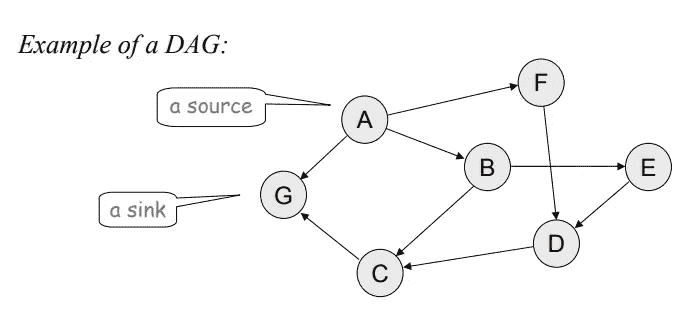
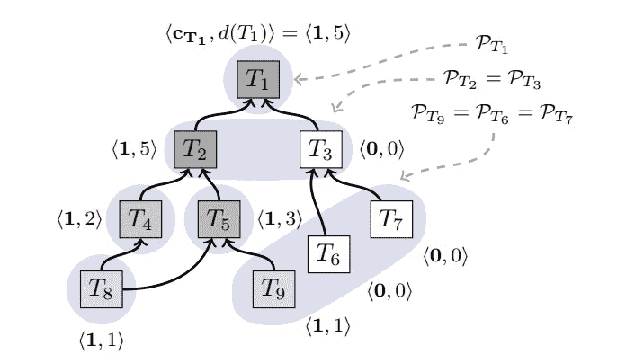

# 协议聚焦:雪崩(第二部分)

> 原文：<https://medium.com/hackernoon/protocol-spotlight-avalanche-part-2-80cd4a530b6b>

**Note: This article was first published on** [**FlatOutCrypto**](https://flatoutcrypto.com/home/avalancheprotocol) **on the 29th June.**

这是[雪崩协议](https://ipfs.io/ipfs/QmUy4jh5mGNZvLkjies1RWM4YuvJh5o2FYopNPVYwrRVGV)介绍的第 2 部分。第 1 部分介绍了什么是雪崩，它试图实现什么，以及假设和保证团队火箭概述。这里可以找到。我现在来看看组成雪崩家族的[协议](https://hackernoon.com/tagged/protocols)，以及它们是如何组成无领导协议雪崩的。

# 雪崩家族

# 烂泥

雪泥是雪崩协议系列中最基本的部分。白皮书中将其解释为一组节点(假设 100 个)如何在两种颜色(例如红色和蓝色)之间达成共识的演示:

1.  一小部分节点样本(比如 9 个)在默认状态下是无色的。这九个未着色的节点根据它们接收到的事务将它们的颜色更新为红色或蓝色。在本例中，假设我们跟踪的其中一个节点变为蓝色
2.  这个蓝色节点现在查询其他节点的一个小样本(为了方便起见，我们再说 9 个)。如果它们是无色的，这九个会更新为蓝色，或者，如果已经着色，响应我们的蓝色节点，指出它们是蓝色或红色
3.  一旦我们的节点接收到足够多的响应，它就会检查节点的预定义阈值是否用于相同的颜色。如果是，它要么保持蓝色，要么如果响应其查询的其他节点中有足够多的节点是红色的，它就会变成红色
4.  然后，该节点返回并使用不同的节点样本执行另一个查询
5.  这种投票在网络中反复发生，直到足够多的节点选择了相同的颜色
6.  给与足够的时间，所有的最终将翻转到相同的颜色，并达成一致

显而易见的问题是，我们如何知道他们选择了正确的颜色，而不仅仅是随机/为“坏”的选择投票，然后在网络上传播。这将在后面探讨，但是请记住，所有的[区块链](https://hackernoon.com/tagged/blockchains)和 DLT 实现都是为了达成共识。

其他注意事项:

*   没有历史的储存——雪泥中没有节点记得除了它现在的颜色以外的任何东西
*   它不是拜占庭容错的(如果你不熟悉 BFT 或 BGP 的意思，我推荐阅读我对拜占庭将军问题的介绍。)
*   他们可以通过不断翻转节点的颜色来保持足够的红色和蓝色节点，这样就永远不会达成共识

# 雪花

雪花是白皮书中非常简短的一部分，它为 Slush 添加了一个基本功能，使其成为 BFT。在 Slush 中，我们注意到没有历史存储，但是雪花为每个节点提供了一个计数器，用于存储网络中连续样本的数量，这些样本给出了全红或全蓝的结果。

为什么？因为在一定数量的连续样本(必须为拜占庭节点/期望的安全保证的给定阈值设置的参数)之后，它将永远接受该颜色。这允许正确的节点提交，并意味着节点将达成共识(论文将此称为“一个不可逆转的点，在此之后，决策是不可避免的”)。如果条纹中断，则计数器归零，并重新开始计数。

# 雪球

雪花上短短的四分之一页后面是雪球上另一个可爱的小部分(当你读了足够多的白皮书时，简短肯定是好的！).雪球在雪花的基础上增加了自信。它这样做是为了使协议更难被攻击，因为它现在能够存储信息并根据这些信息做出决策，而这在以前是做不到的。

雪球将雪花的计数器升级为“信心计数器”。这些置信度计数器意味着在每个查询产生红色或蓝色结果后，节点将其置信度计数器加 1。如果它对当前颜色的置信度低于另一种颜色的置信度值，它就会切换颜色。

节点不是根据每个雪花的颜色的连续结果的数量来决定颜色，而是在多次连续查询(同样，该数量必须被设置为节点/期望的安全保证的给定阈值)产生结果后做出决定，该结果意味着节点对一种颜色的置信度超过了对其他颜色的置信度。

现在我们来看看这个家族的最后一个成员，雪崩。我非常肯定，即使是我的妈妈，到目前为止也会理解雪泥、雪花和雪球，这是我试图在每篇文章中追求的个人黄金标准(旁注:她持有以太坊的时间可能比你在 crypto 中的时间更长)，所以希望 Avalanche 也一样容易理解。

# 雪崩

Avalanche 是我们的最终协议，它概括了 Snowball 并维护了所有已知事务的动态只附加有向无环图(DAG)。DAG 只有一个汇点，即创世顶点。

一如既往，让我们来分解一下:

*   仅追加:事务添加到以前的事务中。本质上，当一个节点创建一个事务时，它被添加到一个或多个其他事务(父事务)中，然后这些事务被包括在该事务中
*   DAG:详细讨论 DAG 超出了本文的范围，但是如果您不确定的话，这里有一个[简介](https://flatoutcrypto.com/home/dagsandscalingissuespt1)概述了 DAG 是什么。基本上，区块链是线性的(一个块添加到下一个块)，而 Dag 是无界的——事务随着彼此的添加而激增。这样做的好处是可以更快地确认交易(不需要等待比特币或以太坊将该期间的所有交易汇集到一个区块中)——它们在由更新的交易处理时得到确认
*   旁注:DAG 是数据结构。雪崩是共识协议。这类似于区块链(数据结构)和工作证明(共识协议)。Avalanche 可以在不同的数据结构上工作，但是 Rocket 团队大概认为 DAG 是最适合它的
*   单个汇点:在 DAG 的上下文中，汇点是所有点都向内的节点。下面的图片来自[这里](http://homepages.math.uic.edu/~leon/cs-mcs401-s08/handouts/graphs-intro.pdf)展示了一个 DAG 以及源和汇与 DAG 的关系。很明显只有一个
*   起源顶点:两条线/边相交的点(在此上下文中，两条线/边在 DAG 结构中的节点之间相交)。Genesis =第一个，所有其他点都直接或间接面向它(见下面的**图 1** ，其中 T1 是 Genesis 顶点和单个汇点)

因此 Avalanche 使用了雪球和置信度计数器的概念，但将其应用于 DAG 上的节点。每个事务都链接到一个父事务，最终都链接回单个接收器，即起源顶点。我们为什么需要这个？因为就像其他 Dag 一样，需要有一个事务作为其余事务的基础(例如，IOTA 有一个 genesis 事务)；这就是只追加事务的本质——它们需要添加一些东西。

DAG 结构还意味着新的良性交易与未决定的母交易联系在一起，这样做“有助于推动交易做出决定”。

火箭队从两方面解释了使用 DAG 结构背后的基本原理:

1.  它使投票更有效，因为对一个事务的投票就是对它所附加的所有事务的投票(直接回到起源顶点)
2.  这也意味着更难撤销过去的决定(尽管注意这里的措辞意味着没有终结，就像没有区块链一样)

这仍然给我们留下了一个问题，即如何在冲突的事务或重复花费之间做出选择。雪崩建立在雪球的基础上，不仅包括信心计数器，还包括“chits”。当预定义阈值的节点投票确认某个事务及其所有父事务是首选项时，事务收集 chit。然后，节点使用 chits 的数量来确定对特定事务以及父事务和后代事务(即新出现的事务)的信任度。如果出现平局，则节点投票给第一个看到的节点。图 1 突出显示了节点的 chit 和置信度值。

A sample set of transactions highlighting their different {chit, confidence} values

火箭队在这里强调，T2 比 T3 (0)有更大的信心(5)，因此在 T2 (T4，5，8 和 9)形成的子交易比 T3 (6 和 7)更有可能收集未来的票据。

这个过程使用了我们已经在雪泥、雪花和雪球中讨论过的属性。节点向其他节点的随机样本发出查询，以获得对事务的投票，并向其他节点通知新的事务。如果一个节点看到一个事务和所有祖先事务在竞争事务中是优先的，那么该事务就变成“强烈优先”的，并收到一个“是”的投票。如果该事务或其祖先不是首选的，则它会收到无表决权。

与前面的例子中的红色和蓝色不同，节点决定事务是正确的还是与另一个事务冲突。因此，雪崩可以被看作是用雪球的实例来解决冲突。

最后一点，一个良性交易可能会发现自己附加到一个流氓母公司，在这种情况下，它可能会努力获得必要的信心和票据进行确认。在这种情况下，良性交易将再次尝试，并可以选择已决定或完全确认的父代。

Avalanche 还使用另一种方法来确保具有确定祖先的良性事务可以接收足够的 chits，方法是允许正确的节点“检查 DAG 以发现缺乏足够后代的良性非 nop 事务，并发出 nop 事务以帮助增加它们的置信度”。nop 事务被定义为具有一个父事务并且可以由任何节点发出的事务。但是，它们不能被滥用来欺骗系统，因为它们不会自动授予票据。

# 结论

希望你现在已经理解了什么是雪崩以及它是如何工作的原理。有许多进一步的信息，我无法在一篇文章中涵盖，我可能会在某个时候做后续工作，因为以上内容实际上只涵盖了白皮书的前 1/3。火箭队论文的其余部分包括:

*   第 3 部分:系统分析和证明所描述的工作
*   第 4 部分:实施(值得一读，因为它提到了他们如何将比特币交易完全移植到 Avalanche)
*   第 5 部分:评估(提供关于绩效的额外指标)
*   第 6 部分:其他共识协议的分类及其在不同网络中的应用

火箭队明确表示，本文的目的不是为了涵盖所有可能发生的情况，而是指一组特定的情况。然而，有几个方面很有意思，看看雪崩实现如何处理，比如它如何抵抗 Sybil 攻击。

鉴于目前的情况，这是一个推出无领导协议的特别有利的时机，因为 EOS 等项目的 mainnet 推出暴露了集权化在多大程度上重新回到了本应分散的网络中，而且比特大陆在比特币网络上的影响力再次接近 51%超过了分散化。因此，提出无领导协议思想的协议应该总是受到欢迎和仔细审查的。我期待着在接下来的几个月里看到那些比我更优秀的人的进一步评论，以及即将推出的实现。

**如果你喜欢这篇文章，请关注我**[**@ flat outcrypto**](https://twitter.com/flatoutcrypto)**。你也可以在** [**媒体**](/@flatoutcrypto/) **上找到我的作品，尽管我承认有时会健忘。**

**免责声明:我不拥有任何基于雪崩的网络(根本没有)，也没有投资任何即将推出的网络(如 Perlin)。**