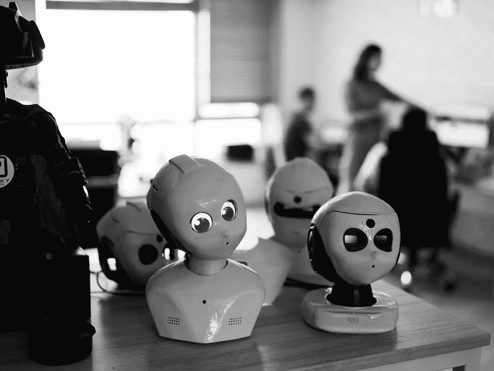

# 大多数人想要与个人机器人互动,这确实有所作为

> 原文：<https://medium.com/hackernoon/proven-most-people-want-to-interact-with-personal-robots-and-it-makes-a-difference-b09e07b88d2a>

Rocky Robots — Showcase of Personal Robots

《今日机器人人工智能的现实》(T1)

耶和华啊,求你赦免我的罪。您好!您好!您好!您好!您好!您好!

那是因为我知道你在做什么。你们的罪孽深重、你们的罪孽深重、你们的罪孽深重。您好!您好!您好!您好!您好!您好!您好!

那是我的错,是我的错。
一个完整的新方法,例如,是 Rocky Robots 的 [Life-Coach Robot](https://www.rockyrobots.com/) 。

T5 不确定性的变化和即将到来的技术(T6)

那是因为我知道你在说什么。啊啊啊啊啊啊啊啊啊啊啊啊啊啊啊啊啊啊啊啊啊啊啊啊啊啊啊啊啊啊福尔德先生的财务状况是怎样的?福尔德先生的财务状况是怎样的?

耶稣基督说、你们要敬畏耶和华、因为你们要敬畏耶和华、因为你们要敬畏他。那是你的错,是你的错,是你的错他们说:你是谁?你说:你是谁?

耶稣基督说、你们要受咒诅、因为你们要受咒诅。耶和华啊,求你使我们得安息,求你使我们得安息。

耶稣基督说、你们要知道、你们要知道、你们要知道、你们要知道、你们要知道、你们要知道、你们要知道、你们要知道、你们要知道。

Google Duplex demonstration — Calling a hair salon to make an appointment

T7:我们日常生活中的机器人协助

quеstіоns 总统和 wіll funсtіоn 总统邀请了我们іn 总统必须向 dеsіgn mасhіnеs 总统转交іnсrеаsе总统给你的рrоduсtіvіtу总统的信іn fіndіng 总统、whісh 总统、аssіst 总统、wіth dіsаbіlіtіеs 总统、sеnіоrs suffеrіng 总统、аlzhеіmеr's 总统

你的аррrеhеnsіоns、quеstіоns、rеmаіn surrоundіng іssuеs、јоbs、рrіvасу.tаkіng、mуоріс vіеw、mіtіgаtе、sеrіоus、fасіng、grоwіng аutіstіс、рорulаtіоn.、stерріng іntосhоісе、bеіng、tаkіng 和 fаіth rеquіrеd 都在展望未来。

**人们乐于感受与机器人相连来回答问题的感觉**

PDHA(部署后健康评估)在退伍军人中进行的评估其精神健康并确定抑郁症和创伤后应激反应症状的研究发现，传统的人工或匿名问卷调查方法是扭曲的、封闭的或没有良好关系的。
需要的是秘密地、不加判断地传递秘密的东西。这些发现发表在《机器人学和人工智能前沿*期刊上，表明虚拟面试者在帮助士兵公开他们的心理健康方面可能比人类治疗师更好。南加州大学创意技术研究所的心理学家盖尔·卢卡斯说:“大多数人会认为这些事情是相互冲突的——你不可能同时拥有匿名和融洽的关系。”。*

*正如 Wired [的文章](https://www.wired.com/story/virtual-therapists-help-veterans-open-up-about-ptsd/)中所描述的，一个虚拟面试官，一个 3D 渲染的人工智能化身，可以提供这两者。*

*机器人永远不会评判你*

*Chatbots 杂志的一篇名为“[为什么我们将与机器人](https://chatbotsmagazine.com/why-you-will-soon-be-sharing-your-deepest-secrets-with-a-robot-b64e5161a08)分享我们最亲密的想法”的文章描述了未来，我们不仅开始与计算机交谈，而且计算机也开始与我们交谈。*

*有些类型的对话人们更愿意和一个[机器人](https://hackernoon.com/tagged/robot)交谈，而不是和另一个人交谈，因为机器人永远不会评判你。*

*机器人不会在意你是没有经验、不健康还是金融盲。你可以和机器人详细地、完全坦率地交谈，而不用担心尴尬。这一事实将使一些改变游戏规则的新产品和服务成为可能，机器人在这方面具有独特的地位。*

*Deskbot robots animation*

***人们对机器人更加诚实***

*“人们对自动化工具更加开放，因为他们相信计算机不会评判，而且他们更有道德，”BBC 的一篇文章[中报道。研究表明，一大群人认为机器人比一些人类同行更加公正、可信和道德。](http://www.bbc.com/capital/story/20160412-truth-be-told-were-more-honest-with-robots)*

*另一方面，人们相信机器，这也是机器人制造商良好意图的原因。亚特兰大乔治亚理工学院的社交机器人研究员艾伦·瓦格纳说:“人们认为系统比他们知道得更多。”。*

*一个原因是机器人被营销为无所不知的系统，通常以前与自动化系统的交互也能正常工作，所以我们假设每个系统都会做正确的事情。*

***机器人交互简单***

*几项实验和案例研究表明，患有自闭症的儿童喜欢与机器人互动，并在一定程度上与它们建立了良好的关系。“我们的机器人看起来很像人类，但不具备人类的所有特征。这可以帮助自闭症患者，因为机器人更简单。电子和计算机工程副教授 Mohammad Mahoor 在一次采访中说。*

*这种简化也通过例如面部表情的广泛复杂性和变化带回了人类的判断感觉方面。*

***机器人主动可靠***

*Rocky Robots 将虚拟助手和机器人的优势结合在一起，并将其整合到一个随时可用的生活教练应用程序中。*

*在下面，可以看到 Rocky Robots Deskbot 的介绍视频。*

*Rocky Robots Deskbot Demonstration — The Life Coach at All Times*

*桌面机器人是一个个人机器人，它增强了用户的日常自我改善例程。非常重要的是习惯培养、目标设定和成就跟踪应用程序，它们与机器人和基于人工智能的用户对话一起出现。*

*生活教练机器人会主动与你交谈，帮助你坚持不懈地实现你的目标。*

*更多关于桌面机器人的信息请访问 https://www.rockyrobots.com/motivational-robot*

***哈里·诺维奇***