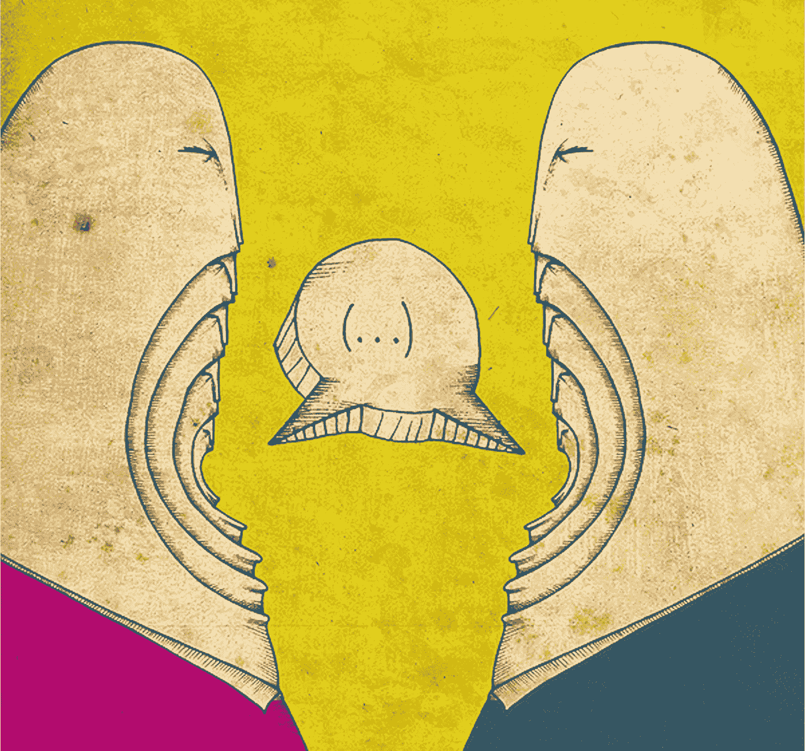

# 伪人类的屁话

> 原文：<https://medium.com/hackernoon/pseudo-human-bullshit-b3e864840706>

## 这与脸书是否处理了我们的信息无关。这是关于人类行为和我们有多愚蠢。

Image from the author

我无意为脸书辩护。无论如何，他们在做他们的工作。用户喜欢它。

通常情况下，受众是不可概括的。没有人人为我和人人为我。在这种情况下，大多数人总是赢。这些公司运用他们的商业模式。他们有一个目标，他们实现功能和策略，并尽最大努力争取成功。

今天脸书是个问题，明天将会是另一个问题。

> “我一整天都在玩电子游戏和吃东西。
> 
> 我记得当时的感觉是，‘哦，天哪，我今天真的很有效率’……在玩了一整天电子游戏之后。"

我们像吹笛者身后的老鼠一样跟着脸书的其他人。每个人都想与同事联系，创建活动和团体。我们乐在其中。

如果有人问我们生活中的往事，我们会愉快地回答。我们给了脸书所有的信息。免费的。为他们服务。

# 我们遵守他们的规则。我们很开心

> “人们太戏剧化了，每个人都在争斗。我还发现，我朋友的平均智商在 4 左右，和他们说话会让我很受伤。”

我们同意永远提供他们想要的所有信息。我们把它暴露给了我们的老同事。对世界也是如此。“伴侣群体”的概念逐渐扩大。现在我们的亲密关系可以被任何人看到。但是我们可以随心所欲地限制它。

任何人都可能是一个全球性的暴露狂，或者干脆关上窗户。这取决于我们。

脸书是对我们社会行为的一种模拟。从某种程度上来说，我们这些伟大的用户开始需要脸书了。开始让其他人知道我们的每一个想法，或者记忆，或者脸书的任何特色。

> “这让我把自己的生活和其他人的生活进行比较，这只会导致悲伤。”

我们快乐地无休止地滚动，没有阅读任何东西，只是简单地看了一些快乐的图片，迷因，仇恨的帖子，愚蠢的帖子，无意义的，笑话，猫视频，事件…人类的帖子。

> “太多的人利用脸书来公开他们的脏衣服，并让所有人都看到他们的家务。我不在乎你的问题，其他人也不在乎，再见，脸书！”

# 我们得到了我们应得的

作为老鼠，有一天我们醒来，看到新闻说脸书在利用我们的私人信息，脸书是邪恶的，是时候关心隐私了。因为《观察家报》发表了对《剑桥分析》的克里斯托弗·威利的采访，25 万人的个人信息在没有让他们知道的情况下被使用。该死，脸书是邪恶的。

但是，人们真的关心哪家企业拥有哪些个人信息吗？ ***扯淡。***

大多数人现在删除脸书，因为他们*也许*害怕了。但是不怕有人用他们的信息。不，他们害怕不知道所有这些的影响。

我们真的知道哪些信息是由政府处理的吗？我们能从他们那里删除我们的帐户吗？我们真的关心这个吗？

大多数人并不真正了解( [*我们一无所知*](/be-unique/we-know-nothing-52ed147ff866) )。

> “太多的人利用脸书来公开他们的脏衣服，并让所有人都看到他们的家务。我不在乎你的问题，其他人也不在乎，再见，脸书！”

现在我们憎恨我们所爱的。再一次，人类行为。还有很多人后悔说了类似*的句子:“不是我，是你。再见”。*这他妈的是什么意思？

伪深奥的屁话。没别的了。

*感谢阅读！如果你喜欢这个故事，让我们讨论一下，然后在你走之前点击拍手按钮* ***并分享*** *来帮助别人找到它！也可以在下面随意留言评论。
下面是我的* [*推特*](https://twitter.com/NoCountry4Old) *简介。*

*的片段都是从这个* [*篇*](https://thoughtcatalog.com/lorenzo-jensen-iii/2016/12/66-people-reveal-why-they-deleted-their-facebook-account/) *的思想目录上得来的。*