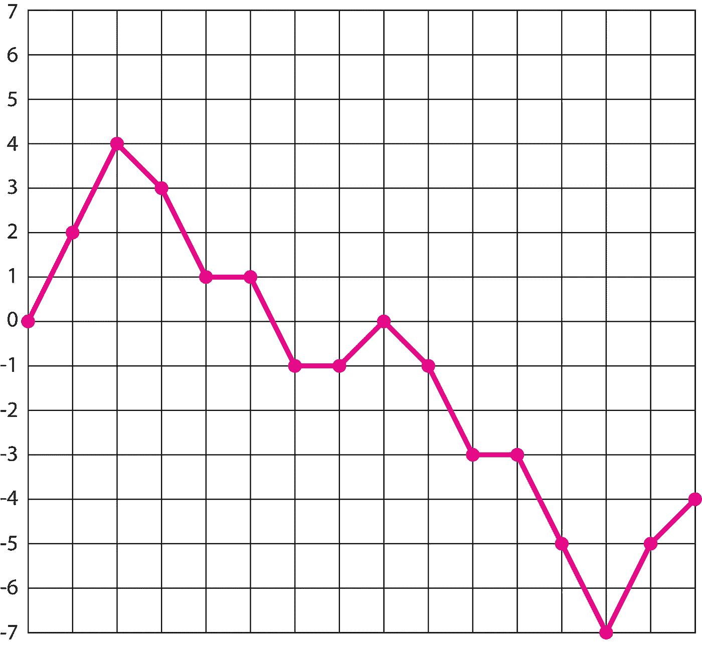

# 伪随机野兽和在哪里找到它们:ES6 和 Python 3 的备忘单

> 原文：<https://medium.com/hackernoon/pseudo-random-beasts-and-where-to-find-them-a-cheat-sheet-for-es6-python-3-e0bcd2e412cf>


我喜欢生成艺术，我经常使用伪随机函数给图像或行为添加一点噪声，但每次我用 JavaScript 实现伪随机数函数时，我都要花一秒钟来记住这是如何工作的。因此，我想写一篇简短的文章，介绍一些在普通 ES6 和 Python 3 中实现的最常见的伪随机数函数(以下简称为“随机”数)。当然，有无限多的概率分布和随机过程需要探索，但我会保持简单，将一些有用的概念，如[马尔可夫链](https://en.wikipedia.org/wiki/Markov_chain)和[相干噪声](https://en.wikipedia.org/wiki/Template:Coherent_noise)留到下一次。

# 0.0 到 1.0 之间的小数

JavaScript 中生成随机数最基本的方法是函数[***math . random()***](https://developer.mozilla.org/en-US/docs/Web/JavaScript/Reference/Global_Objects/Math/random)，该函数在半开区间内返回一个数字 *n* ，使得 **0 ≤ *n* < 1** 。

记住 JavaScript 不区分整数和小数。JavaScript 中的所有数字都是 64 位浮点，可以用小数也可以不用小数。要编写一个返回 0 和 *n* 之间的整数的函数，我们可以使用 JavaScript 函数，这个函数容易混淆地命名为 ***Math.floor()*** ，MDN web 文档告诉我们“[返回小于或等于给定数字](https://developer.mozilla.org/en-US/docs/Web/JavaScript/Reference/Global_Objects/Math/floor)的最大整数。”由于***math . random()***为[半开](https://en.wikipedia.org/wiki/Interval_(mathematics))，该函数还会返回一个在 **0 ≤ *n* < *极限*** *范围内的整数值 *n* 。*

## Python 3

Python 中的等价函数是来自[随机模块](https://docs.python.org/3/library/random.html)(同样返回半开范围)*的函数***. random()****。*(注意常见的 Python 函数 ***random.uniform(a，b)*** 不同之处在于它在开区间 ***返回一个浮点值*n*a*≤*n*≤*b***。)*

# *0.0 和 1.0 之间的小数(不含)*

**非常*不太可能***math . random()***实际上会返回整数 0——实际上在 2⁵⁶只有[一次机会](https://stackoverflow.com/questions/3065554/can-javas-random-function-be-zero)——但是对于返回 0 会产生可怕后果的用例，我们可以明确排除这种可能性。比如我们可以让函数只在 ***n == 0*** *的情况下递归。在这种情况下，该函数将调用自身并生成一个新值。**

```
*function randomExcludingZero(min, max) {
    n = Math.random() * (max - min) + min;
    if (n > 0) {
      return n;
    }
    else {
      return randomExcludingZero(min, max);
    }
  }*
```

# *范围内的实数*

*在前面的函数的基础上，我们可以编写一个更灵活的半开放范围的随机数函数(***a*≤*n<b***)，它可以处理整数或小数。我们可以使用布尔自变量在小数和整数之间切换。*

*(注意，我在这里用一个对象初始化函数。阅读 Bill Sourour 关于 RORO 模式的精彩文章，讨论这样做的好处。)*

```
*function randomRange( { min, max, integers=true } ) {
  if (integers) {
    return (Math.floor(Math.random() * (max - min) + min));
  }
  else {
    return (Math.random() * (max - min) + min);
  }
}*
```

## *Python 3*

*Python 有两个内置函数，可以返回一个范围内的随机数，因此 Python 中的等效函数要简单得多。(请记住，在 Python 中，布尔保留字“True”和“False”使用大写字母开头！)*

```
*import random
def randomIntInc(min, max, integers=True):
    if integers:
        return random.randint(min, max)
    else:
        return random.uniform(min, max)*
```

*这些函数适用于所有实数。只要 ***min ≤ max*** *，我们可以将负数传递给任何一个函数。**

# *选择 1 或-1*

*有时我们想在一个数和它的[加逆](https://en.wikipedia.org/wiki/Additive_inverse)之间随机交替。例如，如果我们有一个物体沿着一个向量运动，我们想随机反转这个物体在这个向量上的运动方向，我们可以将这个向量乘以一个在 1 和-1 之间的随机选择。*

*在 JavaScript 中，我们可以用一个三元运算符轻松实现这一点。基本上我们用 ***Math.random()*** 生成一个 0.0 到 1.0 之间的随机小数。该函数接受一个参数，该参数表示该函数返回-1 的可能性。如果随机小数低于此限制，则函数返回-1，否则函数返回 1。限值 0.5 将返回-1 和 1 的大致均匀分布，而其他值(< 1)将返回-1 和 1 的加权分布。*

```
*function additiveInverse(chanceOfNegative) {
 return (Math.random() < chanceOfNegative ? -1 : 1);
}*
```

## *Python 3*

*在这种情况下，等效的 Python 代码几乎是相同的。*

```
*import random
def additiveInverse(chanceOfNegative):
    return 1 if random.random() < chanceOfNegative else -1*
```

# *无重复的随机阵列*

*有时我们可能需要生成一个填充了唯一随机值的数组。为此，我们需要给函数一个最小和最大范围(从中选择值)并指定要生成的数组的长度。如果我们的范围小于数组的长度，函数将进入无限循环，因为函数将在数组满之前用尽所有可能的值。一个简单的解决方法是抛出一个异常，以防最小值*和最大值*之间的绝对值距离没有超过数组长度 ***。******

```
**if (arrayLength > Math.abs(min - max)) {
    throw "Array length fails to exceed range."
}**
```

**接下来，我们使用 while 循环来填充一个空数组。我们生成一个随机数，检查该数是否已经包含在数组中，只有在该数是唯一的情况下，才将该数推送到数组中。**

**请注意，我们在函数的初始化中，而不是在函数体中将 randomArray 设置为空。**

```
**function randomArrayWithoutReps( { min, max, arrayLength, **randomArray = []**, integers=true } )**
```

**当我们在下一节讨论不重复的数字流时，这将非常有用。以这种方式初始化数组可以让我们在需要的时候传入一个全局范围的数组，而且因为我们用一个对象初始化函数，所以当我们调用函数的时候，如果我们不想传入任何值，我们也不必传入任何值！**

```
**function randomArrayWithoutReps( { min, max, arrayLength, randomArray = [], integers=true } ) { if (arrayLength > Math.abs(min - max)) {
    throw "Array length fails to exceed range."
  } while (randomArray.length < arrayLength) { const randNum = integers 
      ? (Math.floor(Math.random() * (max - min) + min)) 
      : (Math.random() * (max - min) + min); if (!randomArray.includes(randNum)) { 
      randomArray.push(randNum);
    }
  }
  return randomArray;
}**
```

## **Python 3**

**还是那句话，Python 有随机采样的模块函数，我们要做的就是调用***random . sample()***。**

```
**import random
random.sample(range(-10, 10), 12)**
```

# **没有(最近)重复的随机流**

**有时我们希望生成一个随机数流，而不重复前面 *n* 次函数调用中的任何值。由于函数需要某种“记忆”它最近生成的值，我们可能最终会使用某种类型的数组，并且由于我们已经有了一个函数来生成随机唯一值的数组，我们可以在此基础上构建！**

**首先，我们需要声明一个具有全局范围的空数组，它将作为我们函数的最近生成的随机值的“内存”。**

```
**let randomBuffer = [];function randomArrayWithoutReps({ min, max, arrayLength, 
  randomArray = [], integers=true }) {
  [...]
}function randomStream({min, max, lengthWithoutRep, integers=true}) {

  [...n] = randomArrayWithoutReps({ 
    min: min, 
    max: max, 
    arrayLength: lengthWithoutRep, 
    randomArray: randomBuffer, 
    integers: integers });randomBuffer = n;
  return randomBuffer.shift();
}**
```

**我们的新函数 ***randomStream*** 调用我们之前编写的***randomArrayWithoutReps***函数。使用[析构](https://developer.mozilla.org/en-US/docs/Web/JavaScript/Reference/Operators/Destructuring_assignment)我们将随机数组函数的输出复制到全局 ***randomBuffer*** 变量中。 ***。shift()*** 方法删除全局数组中的第一个数字，并将其作为我们的流的输出返回。**

**这里的诀窍是，每次用新更新的全局数组初始化 randomArrayWithoutReps。函数***randomArrayWithoutReps***查看传入的数组，发现它比它的 ***arrayLength、*** 少一个数字，并计算一个新的唯一值，将其推送到数组的末尾。**

```
**while (randomArray.length <= arrayLength) {
  [...]
  if (!randomArray.includes(randNum)) { randomArray.push(randNum); }
  return randomArray;
}**
```

**基本上***randomArrayWithoutReps***函数作为滑动窗口函数，确保新的随机值不会重复先前 ***n*** 次函数调用中生成的值。很酷，对吧？**

## **Python 3**

**在上面讨论 Python 中列表的随机抽样时，我介绍了 Python 的***random . sample()***模块函数。如果我们想要在最后返回的 ***n*** 个值中创建一个没有重复的随机数字流，那么使用***random . sample()***的函数实际上可能不是最佳选择，因为这个全局 ***randomBuffer*** 变量充当了最近生成的值的一种“内存”,所以我们无论如何都必须在每次调用函数时更新这个列表。我们可以像在 JavaScript 中一样，用 while 循环轻松地做到这一点。**

**在函数中使用全局变量通常不是 Python 中的最佳实践，但在这里我认为它澄清了*的目的。(不要忘记，我们明确声明 ***randomBuffer*** 是我们每个函数开始时的全局变量。)就像在我们的 JavaScript 函数中一样，如果我们在缓冲区列表满之前面临用完潜在随机值的危险，我们使用 Python 的 ***assert*** 语句来抛出错误。其余大部分代码与 JavaScript 非常相似。***

```
**import time
import random
from random import randintrandomBuffer = []def randomListWithoutReps(minimum, 
                          maximum, 
                          listLength, 
                          integers=True):
    global randomBuffer
    assert listLength < abs(minimum - maximum), \
    "List length fails to exceed range."
    while len(randomBuffer) <= listLength:
        if integers:
            randNum = randint(minimum, maximum)
        else:
            randNum = random.uniform(minimum, maximum)
        if randNum not in randomBuffer:
            randomBuffer.append(randNum)
    return randomBufferdef randomStream(minimum, 
                 maximum, 
                 lengthWithoutRep):
    global randomBuffer
    randomBuffer = randomListWithoutReps(minimum, 
                                         maximum, 
                                         lengthWithoutRep)
    return randomBuffer.pop(0)**
```

**要查看运行中的函数，请像这样调用它:**

```
**while True:
    print(randomStream(0, 6, 5))
    time.sleep(1)**
```

# **加权随机选择**

**数组加权抽样是一种非均匀抽样方法，其中数组中的每一项都被赋予一个代表该项被选中的几率的权重。加权选择函数在游戏、数字艺术甚至网页设计中非常有用，因为偏斜的概率行为直观地模拟了我们与现实世界中的对象的许多交互。**

**这里的目标是编写一个函数，它采用一个相对概率权重列表，并根据指标的相对权重返回一个在***【0】***和***weights . length***之间的指标值。然后，这个索引值可用于从另一个相同长度的列表中返回一个项目。**

**一般来说，加权选择函数基于数组中所有权重的总和，然后根据权重的值对其进行分区，然后进行迭代。如果一个随机数属于其中一个分区，则返回该分区的索引值。然而，[一个更有效的](https://eli.thegreenplace.net/2010/01/22/weighted-random-generation-in-python)算法通过从随机值变量中减去列表中的每个权重来避免总数的临时列表。当变量用尽时，我们返回那个索引。**

```
**function weightedRandom(weights) {
  let rnd = Math.random() * weights.reduce((x, y) => x + y);
  for (i = 0; i < weights.length; i++) {
    rnd -= weights[i];
    if (rnd < 0) {
      return i
    }
  }
}**
```

**记住，这个函数的典型用例是返回一个索引值，我们用它从一个数组中选择条目。**

```
**const favoriteFoods = ["sushi", "pizza", "falafel"]document.getElementById("output").innerHTML =     favoriteFoods[weightedRandom([1, 1, 2])];**
```

**因为权重列表是相加的，所以函数返回的索引的相对概率是该权重与数组中所有权重总和的比率。例如，上述实例返回“寿司”、“比萨饼”或“沙拉三明治”的概率分别为 25%、25%和 50%。**

## **Python 3**

**Python 3 在其 random 模块中没有加权采样方法(尽管如果您想使用 Numpy，您可以调用***Numpy . random . choice()***，它有一个可选参数用于非均匀采样)。Eli Bendersky 有一篇很棒的博客文章，他比较了几种加权选择函数的效率，所以我不会在这里重新发明轮子，我会把你引向他 2010 年的博客文章:“[Python 中的加权随机生成](https://eli.thegreenplace.net/2010/01/22/weighted-random-generation-in-python)”其实充分披露一下，我上面的 JavaScript 函数是把他的***weighted _ choice _ sub***Python 函数移植到 ES6 中的！**

# **随机游动**

**随机漫步是许多数字艺术中遇到的基本过程，它们也有一些非常酷的高维暗示。随机游走是一种随机过程，通过这种随机过程，允许实体或函数从其起始位置或值“移动”(或返回值)一段距离。然后，该函数采用其新位置的值，并可能根据其“步长”再次移动步长可以是二进制的(例如 1 或 0，即移动或不移动)，或者步长可以是以起始值为中心的范围内的随机值。随机行走也可以被限制在一个范围内，因此当“行走者”到达一个边界时，它会被迫转向相反的方向。**

****

**A one-dimensional random walk with a step size of [ 0 – 2 ] constrained between [ -7 – 7 ].**

**由于遍历器的状态会从一个函数调用延续到另一个函数调用，所以我们需要将遍历器定义为一个可变的全局变量。然后，我们需要设置一个函数，它将接受我们的“行走者”，一个步长，以及可能的最小和最大边界，我们将在其中约束行走。**

```
**let walker = 0;function randomWalk(walker, stepSize, min, max) {
  ...
}**
```

**由于我们的一维行走可以增加或减少价值，我们需要一种方法来表示方向的随机变化。这就是我们可以使用上面的加法反函数的地方。我们会得到+/-值的均匀分布。**

```
**function randomWalk(walker, stepSize, min, max) {
  const direction = (Math.random() < 0.5 ? -1 : 1);
  ...
}**
```

**如果我们希望每次调用函数时步行者的移动速率都相同，我们可以只使用“stepSize”作为常数:**

```
**function randomWalk(walker, stepSize, min, max) {
  const direction = (Math.random() < 0.5 ? -1 : 1);
  stepSize *= direction;
  ...
}**
```

**但是让“步长”定义一个可能值的范围可能更有趣；为此，我们使用一个随机整数范围:**

```
**function randomWalk(walker, stepSize, min, max) {
  const direction = (Math.random() < 0.5 ? -1 : 1);
  const step = Math.floor(Math.random() * stepSize) * direction;
  ...
}**
```

**最后，我们需要一个条件来检查步行者是否将要超越它的上限或下限。请注意，我们没有检查助行器*当前是否在其范围之外。*我们需要检查步行者*是否会*在其范围之外，如果它进行下一步。**

```
**if (((walker+step) <= max) && ((walker+step) >= min)) {
  ...
}else {
  ...
}**
```

**如果当前步长在允许的范围内，我们需要更新 walker 的值，并返回 walker 的新值。如果当前步骤将步行者置于范围之外，我们反转该步骤的方向并返回该值。**

```
**if (((walker+step) <= max) && ((walker+step) >= min)) {
    walker += step;
    return walker;
  }
else {
    step *= -1;
    walker += step;
    return walker;
  }**
```

**所以总的来说，我们的函数看起来像这样。当然，当我们调用函数时，我们需要记住将“walker”的值设置为函数的返回值，否则 walker 不会走很远！**

```
**let walker = 0;function randomWalk( { walker, stepSize, min, max } ) {
  const direction = (Math.random() < 0.5 ? -1 : 1);
  const step = Math.floor(Math.random() * stepSize) * direction;
  if (((walker+step) <= max) && ((walker+step) >= min)) {
    walker += step;
    return walker;
  }
  else {
    step *= -1;
    walker += step;
    return walker;
  }
}...walker = randomWalk( { walker: walker, stepSize: 3, min: -7, max: 7 } )**
```

**通过使随机行走本身的步长或行走方向依赖于随机行走，可以获得有趣的效果。例如，如果我们想要更多的[粘滑运动](https://en.wikipedia.org/wiki/Stick-slip_phenomenon)，我们可以使用这种技术让一个步行者在一个方向上连续移动一些步，然后改变方向并在另一个方向上移动一些步。**

## **Python 3**

**Python 中的等价函数非常相似。使用上面定义的加法反函数来选择步长方向。**

```
**import random
walker = 0;def additiveInverse():
    return 1 if random.random() < 0.5 else -1def randomWalk(walker, stepSize, minimum, maximum):
    direction = additiveInverse()
    step = random.randint(0, stepSize) * direction
    if (((walker+step) <= maximum) and ((walker+step) >= minimum)):
        walker += step
        return walker
    else:
        step *= -1
        walker += step
        return walker...walker = randomWalk(walker, 3, -7, 7)**
```

# **结论**

**小心 Nifflers…**

****