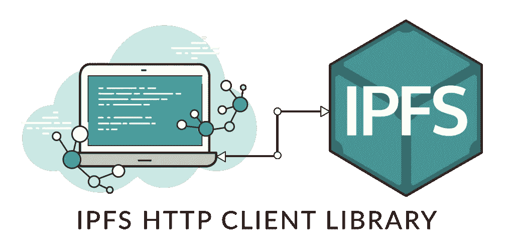

# NGINX 反向代理背后的公共 IPFS 节点&如何与之通信

> 原文：<https://medium.com/hackernoon/public-ipfs-node-behind-nginx-reverse-proxy-5682747f174b>


[https://en.wikipedia.org/wiki/InterPlanetary_File_System](https://en.wikipedia.org/wiki/InterPlanetary_File_System)

用**以太坊**和 **IPFS** 进行实验，在设置[https://cryptoblox.co](https://cryptoblox.co)的过程中，我想打开一个 IPFS 的公共节点，以便任何人从任何地方上传文件到 IPFS——通过 **CryptoBLOX** 。

使用 [js-ipfs](https://github.com/ipfs/js-ipfs) ，我能够向公众开放一个 ipfs 节点，然而，我偶然发现了一个问题:ipfs-api 目前不支持****HTTPS**——尽管使用了[多地址](https://github.com/multiformats/multiaddr)格式。也许将来会有计划，但目前还不支持。**

**显然，你不能在同一个网站上混合使用 HTTP 和 HTTPS(混合内容拦截)。**

**因此，我必须设置 **NGINX** 作为我正在运行的 **jsipfs 守护进程**的**反向代理**。**

# ****安装和设置 JS-IPFS 守护进程****

****

**[https://github.com/ipfs/js-ipfs](https://github.com/ipfs/js-ipfs)**

**首先，我安装了 IPFS:**

```
npm install ipfs --global
```

**我决定从 **CLI** 中使用它，因此我运行了以下命令(来自 js-ipfs-api 文档，已编辑) :**

```
# Show the ipfs config API port to check it is correct
> jsipfs config Addresses.API
/ip4/127.0.0.1/tcp/5001
# Set it if it does not match the above output
> jsipfs config Addresses.API /ip4/**127.0.0.1**/tcp/5001
# Restart the daemon after changing the config

# Run the daemon
> jsipfs daemon
```

**在我的节点。JS 服务器(在本地运行**)我定期设置它:****

```
**var ipfs = ipfsAPI('localhost', '5001', {protocol: 'http'})**
```

****除此之外，我想让它作为合法的**守护进程**运行——重启后重启，崩溃后重启，等等。****

****使用 **systemctl** 我能够实现以下功能:****

```
**vim /lib/systemd/system/jsipfs.service**
```

****并粘贴以下内容:****

```
**[Unit]
Description=JSIPFS Daemon Client
[Service]
ExecStart=/root/.nvm/versions/node/v8.9.1/bin/node /root/.nvm/versions/node/v8.9.1/bin/jsipfs daemon
Restart=always
RestartSec=30
Type=simple
User=root
Group=root
[Install]
WantedBy=multi-user.target**
```

*****注意，服务配置文件需要* ***到可执行文件的完整路径*** *。*****

****现在运行:****

```
**systemctl daemon-reloadsystemctl start jsipfs# To see the last lines written to stdout / stderr by the process
journalctl -u jsipfs -n50**
```

# ****将 nginx 设置为反向代理****

********

****[https://nginx.com](https://nginx.com)****

****在我的例子中，为了得到一个 **SSL** 证书，我使用了 **Let's Encrypt** ，我发现这个证书非常有用，非常方便，几分钟就可以设置好。****

****简单跑步:****

```
**sudo certbot --nginx -d cryptoblox.co**
```

****在 nginx 上设置 SSL，并添加一个从 HTTP 到 HTTPS 的**重定向**，不需要更多操作。****

****继续编辑 nginx **配置**(*/etc/nginx/sites-available/default*)—在原始服务器初始化后添加以下代码片段:****

```
**server {
    listen [::]:5002 ssl ipv6only=on; # managed by Certbot
    listen 5002 ssl; # managed by Certbot
    ssl_certificate /etc/letsencrypt/live/cryptoblox.co/fullchain.pem; # managed by Certbot
    ssl_certificate_key /etc/letsencrypt/live/cryptoblox.co/privkey.pem; # managed by Certbot
    include /etc/letsencrypt/options-ssl-nginx.conf; # managed by Certbot
    ssl_dhparam /etc/letsencrypt/ssl-dhparams.pem; # managed by Certbot
    server_name cryptoblox.co;location / {
        proxy_pass [http://localhost:5001](http://localhost:5001);
        proxy_set_header Host $host;
        proxy_cache_bypass $http_upgrade;
     }
}**
```

****现在只需重启 nginx 就可以了！****

# ****与公共 IPFS 节点通信****

********

****[https://github.com/ipfs/js-ipfs-api](https://github.com/ipfs/js-ipfs-api)****

****在**客户端**，在要求 [js-ipfs-api](https://github.com/ipfs/js-ipfs-api) 后，我简单地用以下方式初始化它:****

```
**var ipfsApi = ipfsAPI('cryptoblox.co', '5002', {protocol : "https"})**
```

****或者，如果您需要他们的 CDN:****

```
**var ipfsApi = window.IpfsApi('cryptoblox.co', '5002', {protocol : "https"})**
```

****然后，一个简单的函数接受一个**斑点**，并将其添加到 **IPFS** :****

```
**async function saveToIPFSToBytes32(blob) {
  var fileReader = await loadFileReader(blob);
  var buff = Buffer.from(fileReader.result);
  var result = await ipfsApi.add(buff, { progress: (prog) => {} });
  return ipfsHashToBytes32(result[0].hash);
}**
```

****请注意，文件保存在您的节点**本地**上，直到其他人**请求**它们，因此在上传它们之后，我们**立即向[https://ipfs . io](https://ipfs.io)全局**网关发送请求，其中包含文件散列。****

****就这样，现在你可以通过 **HTTPS** 与你的**公众** IPFS 节点交流了。****

****希望它能帮助那些致力于让互联网更加分散化的人👼****