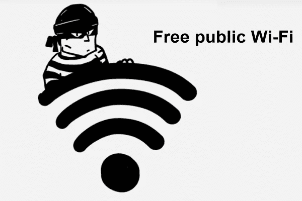
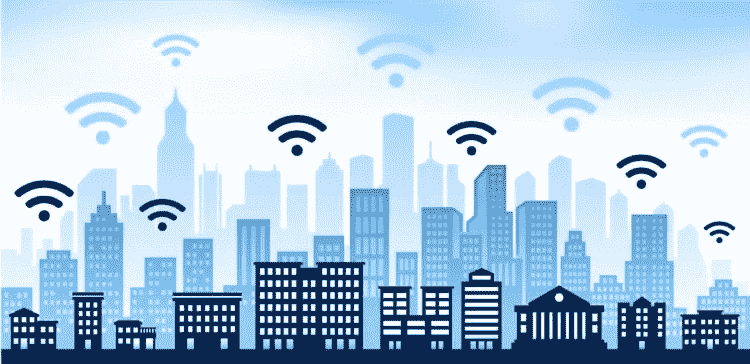

# 公共 WiFi 最终可能会变得安全

> 原文：<https://medium.com/hackernoon/public-wifi-might-finally-become-secure-after-all-9017690dfb0a>

Source: M3 Networks

由于消费者对不间断连接的需求不断增长，公共 WiFi 已变得无处不在。虽然 4G 和 5G 连接的数量正在增加，但没有什么能打败 WiFi 互联网的稳定性和速度。

不幸的是，黑客也知道这一点，大多数公共 WiFi 热点经常被恶意行为者破坏，这些行为者旨在捕获个人身份信息(PII)以供滥用。

这引发了使用公共 WiFi 时的安全和隐私这两个问题，安全专家尚未给出答案。这些专家给出的最常见的建议是完全避免连接公共 WiFi。

> 虽然这当然会解决问题，但它只是以方便为代价回避了讨论。

# 立即关闭您的 WiFi

即使你从来没有连接到公共网络，但你的 WiFi 芯片是打开的，你仍然有可能被黑客攻击。这是因为 WiFi 芯片会间歇性地向附近的所有 WiFi 路由器广播连接请求。受损的网络可以让任何人坐在路由器和计算机系统之间读取、编辑和转发任何信息。

(Source: sdtechi)

因此，目前最好的安全建议是始终保持 WiFi 完全关闭，以防受损的公共网络进入你的计算机系统或移动设备的范围。

> 如果这不是不方便，那么没有什么是不方便的！

对于社交媒体等其他服务，用户愿意放弃不利条件，继续享受便利。

# 为了证明这一点，看看脸书和谷歌就知道了。

他们挖掘和处理我们的个人数据，但大多数消费者都不动声色，因为:

1.  大多数用户没有意识到这些公司在幕后挖掘我们的浏览数据
2.  消费者信任这些公司，因为它们是受监管的大型跨国公司
3.  脸书和谷歌给我们的生活带来了极大的便利，但我们也接受了随之而来的缺点

然而，对于 WiFi 来说，问题有些不同，因为缺点要严重得多，因为恶意行为者对安全和隐私的破坏可能会产生灾难性的后果，如盗窃、欺诈或名誉损害。在这里，用户当然也重视便利，但不是不惜任何代价！

# 我不可能永远关掉 WiFi。我该怎么办？

您应该看看以下保护您的互联网设备的最佳实践:

# 1.HTTPS 部队

HTTPS 协议是一种安全协议，可确保浏览器上协议内所有通信的安全性和隐私性。要强制自动 HTTPS 连接，请在 chrome 浏览器上执行以下步骤。

通过在地址栏中键入 **chrome://net-internals/** 来启用谷歌 Chrome 支持，然后**从下拉菜单中选择**。HSTS 是 HTTPS 严格的传输安全，网站选择总是使用 HTTPS 的一种方式。

# 2.关闭共享

大多数计算机系统默认启用媒体共享，以便在同一网络上连接的人之间更快地传输数据。这对于您可能希望与家庭成员快速共享文件的家庭网络很有帮助。

> 从统计数据来看，我们大多数人在屋外的时间比在屋内的时间要长，这意味着共享可以安全地关闭，而不会对便利性造成太大影响。

# 3.投资一个好的虚拟专用网

虚拟专用网络是远程服务器，允许您在数据到达目的地之前通过不同的地理位置路由数据。自然，在这种情况下，低延迟是可取的。

> 虽然一些 VPN 允许免费访问降低的网速，但你可以支付少量费用来解锁更快的计划。

使用 VPN 的唯一缺点是 VPN 控制器可以看到你的数据轨迹。这意味着无良 VPN 可以在用户不知情的情况下收集用户数据。然而，尽管存在技术缺陷，人们还是为了数据隐私而将自己的血汗钱支付给 VPN。

# 没有更好的解决方案了吗？

如果我们相信硅谷企业家 Suruchi Gupta 的话，事实上是有的。她的团队正在开发一个旨在解决这个问题的加密项目****。他们计划:****

1.  ****激励人们分享他们的 WiFi，从而将未使用的带宽货币化****
2.  ****通过为连接创建单独的加密通道来保护公共热点****
3.  ****创建无缝和自动的网上冲浪体验，无需用户名、密码或同意条款和条件。唯一的要求就是一次性安装一个 app****

****他们的协议利用区块链和专有技术协议来实现简单安全的 WiFi 共享。任何将他们的 WiFi 热点添加到 Wificoin 网络的人都将获得被动收入流。****

## ****例如，如果您通过他们的协议共享您的互联网连接，任何用户都可以安全、私密地连接到互联网，并向您支付少量带宽费用。****

****当主机被鼓励分享时，消费者可以随时访问可靠的互联网。双赢！该公司的前提是基于共享经济，这是由 Airbnb 和优步等公司开创的概念。在区块链领域，另一个挖掘共享经济理念的项目是 Filecoin，它筹集了超过 2.5 亿美元，用于将我们未使用的存储空间令牌化的计划。****

********

****(Source:Newsclick)****

> ****总而言之，我们将迎来激动人心的未来，这要归功于区块链去中心化应用的兴起所带来的日常创新。****