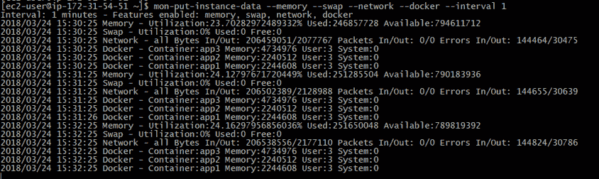
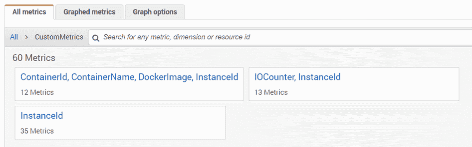
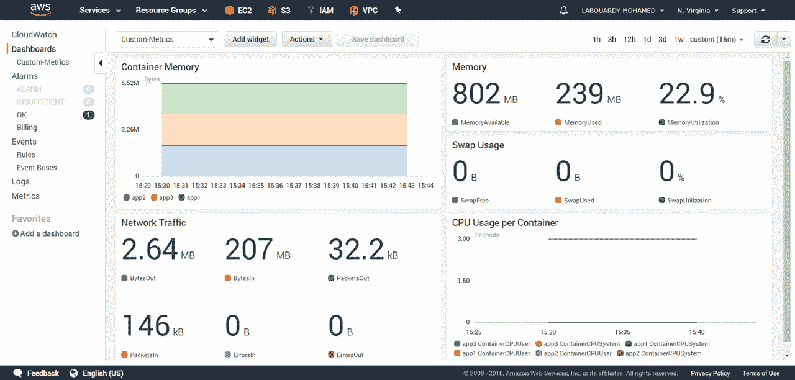

# 将自定义指标发布到 AWS CloudWatch

> 原文：<https://medium.com/hackernoon/publish-custom-metrics-to-aws-cloudwatch-18cb3bbff17c>

**AWS 自动缩放组**只能根据 **CloudWatch** 中的指标进行缩放，大多数默认指标不足以用于*预测缩放*。这就是为什么您需要将您的自定义指标发布到 CloudWatch。

我像往常一样在网上冲浪，我找不到任何谈论如何向 AWS CloudWatch 发布自定义指标的帖子，而且因为我是一个 *Gopher* ，所以我把手弄脏了，我用 Go 编写了自己的脚本。

您可以使用 [AWS Go SDK](https://github.com/aws/aws-sdk-go-v2) 将自己的指标发布到 **CloudWatch** :

例如，要收集关于内存的指标，您可以解析命令' *free -m'* 的输出，或者使用第三方库，如 *gopsutil* :

**memoryMetrics** 对象公开了多个指标:

*   使用的内存
*   可用内存
*   缓冲
*   交换缓存
*   页面表格
*   等等

每个指标都将发布一个 **InstanceID 维度**。要获得实例 id，您可以查询**元数据**:

如果我不是**地鼠**怎么办？嗯，不要害怕，我构建了一个简单的 [CLI](https://github.com/mlabouardy/mon-put-instance-data) ，它不需要安装任何 **Go** 知识或依赖项( [AWS CloudWatch 监控脚本](https://aws.amazon.com/code/amazon-cloudwatch-monitoring-scripts-for-linux/)需要 Perl 依赖项)，而且它是跨平台的。

CLI 收集以下指标:

*   **内存**:利用率，已用，可用。
*   **交换**:利用、已用、空闲。
*   **磁盘**:利用率、已用、可用。
*   **网络**:包入/出，字节入/出，错误入/出。
*   **Docker** :每容器内存& cpu。

**CLI** 已经在使用以下**ami**(64 位版本)的实例上进行了测试:

*   亚马逊 Linux
*   亚马逊 Linux 2
*   Ubuntu 16.04
*   微软视窗服务器

首先，找到适合您的实例的[包](https://github.com/mlabouardy/mon-put-instance-data)并下载它。对于 linux:

安装 CLI 后，您可能需要将可执行文件的路径添加到您的 **PATH** 变量中。然后，发出以下命令:

> mon-put-instance-data-内存-交换-网络 docker 间隔 1

上面的命令将收集*内存*、*交换*、*网络*、&、 *docker 容器*当前系统上的资源利用率。

注意:确保一个 **IAM 角色**与您的实例相关联，验证它授予执行*cloud watch:PutMetricData*的权限。

既然我们已经将自定义指标写入了 **CloudWatch** 。您可以使用 **AWS 管理控制台**查看您发布的指标的统计图表:

您可以根据这些指标创建自己的交互式动态**仪表盘**:

希望有帮助！CLI 仍处于早期阶段，因此欢迎您为 GitHub 上的项目做出贡献。