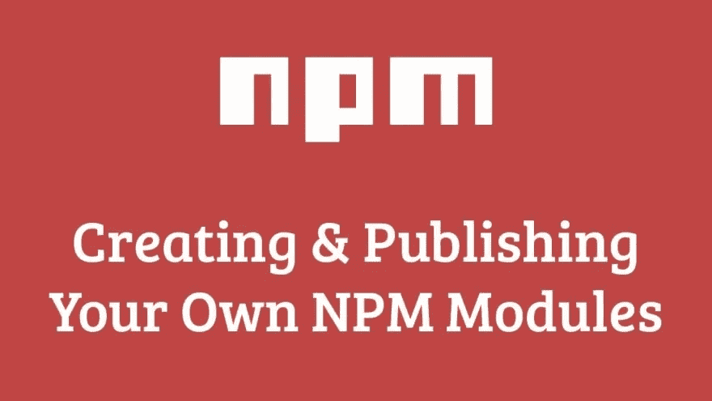

# 发布您自己的 NPM 包🎉

> 原文：<https://medium.com/hackernoon/publish-your-own-npm-package-946b19df577e>



***注:*** [***npm 模块***](https://github.com/flexdinesh/npm-module-boilerplate) ***有一个惊人的样板。这篇文章是基于我在创建它时学到的东西。***

如今，NPM 已经成为 javascript 库事实上的注册中心。尤其是随着 React、Angular 等前端库统治 web，node.js 接管服务器端， *NPM 包现在比以往任何时候都更受欢迎*。我们经常在代码中导入惊人的实用程序，如 [typy](https://github.com/flexdinesh/typy) 、 [sugar](https://github.com/andrewplummer/Sugar) 并毫无争议地使用它们。

但是你有没有想过编写你自己的实用程序/库并把它发布到 NPM，这样你和全世界都可以在任何地方重用它？如果是，那就继续读下去。✨

我们将在这篇文章中讨论以下几个部分。

1.  为什么？
2.  发布步骤
3.  样板文件

# 为什么？

当您跨多个项目工作时，您会经常发现自己在多个项目中重复简单的事情。例如，以您喜欢的方式解析日期并格式化它。大多数开发人员只是从一个项目中复制代码，然后用在另一个项目中，因为它只有几行代码。但是更好的方法是提取代码并把它放在一个公共的地方，这样你就可以从任何项目中访问它。NPM 是一个理想的和不断增长的生态系统，它是免费使用的。因此，从长远来看，将所有可重用代码发布为 npm 包会对您有所帮助。

不管代码有多小，是一行还是一千行，把它作为一个包发布，这样它就可以很容易地在多个代码库中使用。

而且，你会成为一个图书馆的作者。多酷啊！😎

# 发布步骤

出版通常是一个简单的过程。

`code => test => publish => revise code => test => publish new version ...`

# 进入

创建一个新目录，并从终端输入以下命令。

```
npm init
```

为您的包输入有意义的名称和适当的详细信息。这将为您创建`package.json`。所有 NPM 包裹都需要`main`钥匙。这定义了我们库的入口点。默认情况下，这将是`index.js`，但你可以改变它，无论你想你的入口点。

对于基于 Babel 或 bundle 的库，入口点通常在构建目录中。

# 来源

如果你在写一个小库，你可以把你所有的代码放到`index.js`里。但更常见的是，我们会将代码抽象出来，放入单独的文件中。所以理想的方法是将所有的源代码保存在`src`目录中。

这是目前最广泛使用和推荐的源代码设置，尽管它因库而异。

*   **ES6**——[巴别塔](https://babeljs.io)
*   **林挺**——[诚信通](https://eslint.org/)
*   **代码格式化** —美化/ [更漂亮](https://github.com/prettier/prettier)
*   **捆绑** — [网络包](https://webpack.js.org/)

你们中的大多数人已经知道了这些事情，所以我将把它留给你们去解决。

# 试验

您需要进行彻底的测试，以确保您的代码按预期运行。有各种测试设置。你可以使用最适合你需要的。虽然，广泛使用的测试设置是

*   JavaScript 实用程序— [摩卡](https://mochajs.org/)
*   反应库— [笑话](https://facebook.github.io/jest/)与[酶](https://github.com/airbnb/enzyme)
*   角库— [因缘](https://karma-runner.github.io/2.0/index.html)与[茉莉](https://jasmine.github.io/)

…以及更多

如果你也需要**代码覆盖**，*(我是*，[，*伊斯坦布尔*，](https://github.com/gotwarlost/istanbul)是任何 JavaScript 项目的最佳覆盖工具之一。我绝对喜欢它。

# 出版

一旦你的代码被彻底测试，它就可以发布了。

1.  在[npmjs.com](https://www.npmjs.com/)创建账户。
2.  从终端运行以下命令

```
npm login
```

输入您的用户名和密码。这将存储凭据，因此您不必在每次发布时都输入凭据。

1.  现在发布，运行

```
npm publish
```

这将发布您的软件包到 NPM 注册表。一旦发布完成(不到一分钟)，你可以在`[https://www.npmjs.com/~{username}/{package-name}](https://www.npmjs.com/~{username}/{package-name}.)` [链接中查看你的包。](https://www.npmjs.com/~{username}/{package-name}.)

如果你想改变你的包，你必须改变版本号并重新发布。

记住使用 npm 命令`npm version patch`、`npm version minor`和`npm version major`来自动更新版本，而不是手动更新。这些命令基于[语义版本](https://docs.npmjs.com/getting-started/semantic-versioning)。

# 样板文件

我自己有几个 npm 包，并在网上对创建 NPM 包的所有**最佳实践**进行了足够的研究，还专门为此创建了一个**样板文件**。它已经预先设置好一切，您可以在几秒钟内**开始使用**。如果您正在寻找编写 JavaScript util 包，它可能只是您的样板文件。

链接到样板文件— [npm 模块样板文件](https://github.com/flexdinesh/npm-module-boilerplate)

你太棒了！祝你有美好的一天！🎉