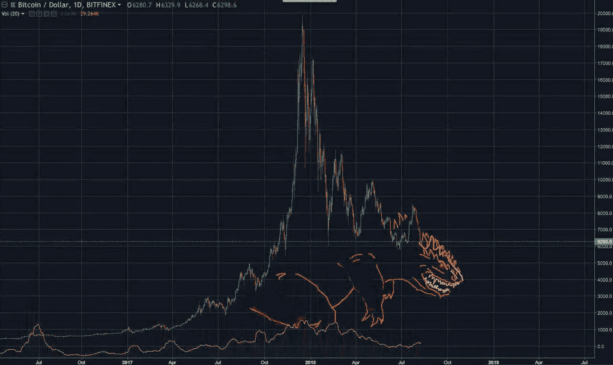
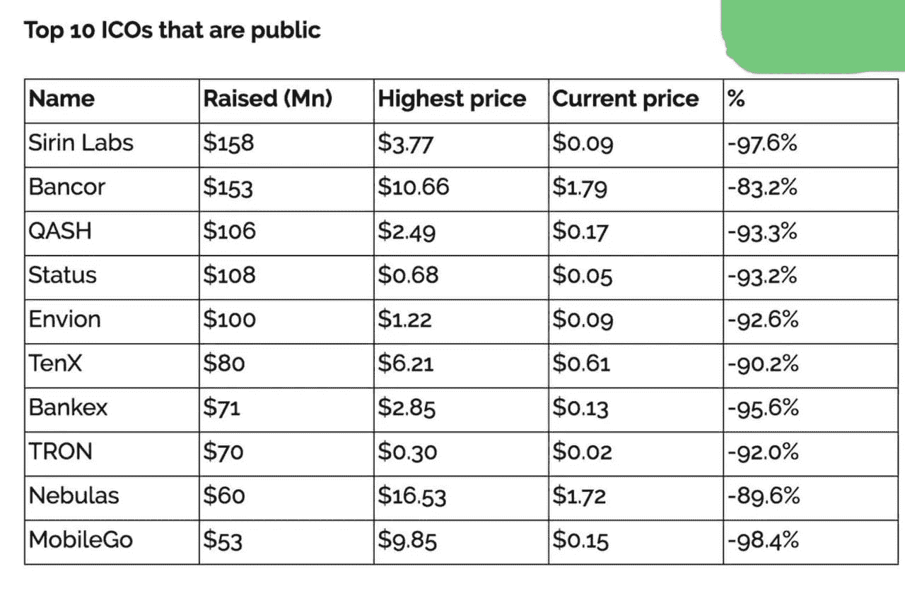

# 泵和倾卸方式

> 原文：<https://medium.com/hackernoon/pump-and-dump-way-a4f26a549fe6>

人们开始问:“谁在杀害 crypto？银行还是政府？”事实上，解释为什么增长如此之快，然后又迅速下降可能非常简单。

当创业公司发现 ICO 时，最简单的投资手段是以太——你不必创造自己的区块链，也不必为发行硬币而大惊小怪——一切都由智能合约完成。在全球对权力下放的未来欢欣鼓舞的背后，只有一份白皮书在手的项目估值高得离谱。所有这些都需要大量的乙醚分配。市场上几家投资/帮助 ICO 的公司达成了默契，他们投资的乙醚不会在 ICO 后立即出售，甚至不会在 ICO 后几个月出售(哦…他们有很多乙醚！).作为回报，他们承诺不在进入交易所后立即出售启动代币。这些基金在投资者队伍中的公开参与保证了任何白皮书的筹资，因为它们获得了很大的折扣。这一切变成了一个循环过程:

1.  市场上自由交易的乙醚供应量减少(相当于特定 ICO 的投资额)
2.  结果，乙醚的价格上涨了
3.  这些基金会现在拥有更多的美元资金(甚至可能比投资前更多)
4.  他们寻找另一个同意这些条款的 ICO

> 这与 2008 年房地产泡沫期间基本相同——为了卖出更多 CDO，你不得不发放更多贷款。

于是，经过几十个主要 ico，市场上的游离乙醚数量大大减少。持续的价格上涨从来没有让我们有理由怀疑不卖 20 美元是愚蠢的.后来，外部投资者也加入了反弹。馅饼上的樱桃是将刚刚从一个 ICO 收集的代币投资到另一个 ICO 的机会(换句话说，将一个垃圾票据投资到另一个 ICO)，在投资当天使用这些代币的美元评估。这就是我们如何看到价值数十亿的白皮书项目。

当 ICO 行业变得过于拥挤时，这一切都结束了。很明显，为了成功，你必须抢在别人前面，相应地，先跳出来。那些后来卖的人会得到更少。此外，一年来，新造 ico 的客户数量和收入明显接近于 0。

After a few days they dropped another 20–30%

我敢肯定，99%的 ico 会因为资金耗尽和产品交付失败而迅速崩溃(这和 crypto 完全没有关系)，而剩下 1%的大部分会把钱转移到另一个篮子里，摆脱代币。