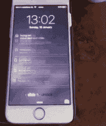
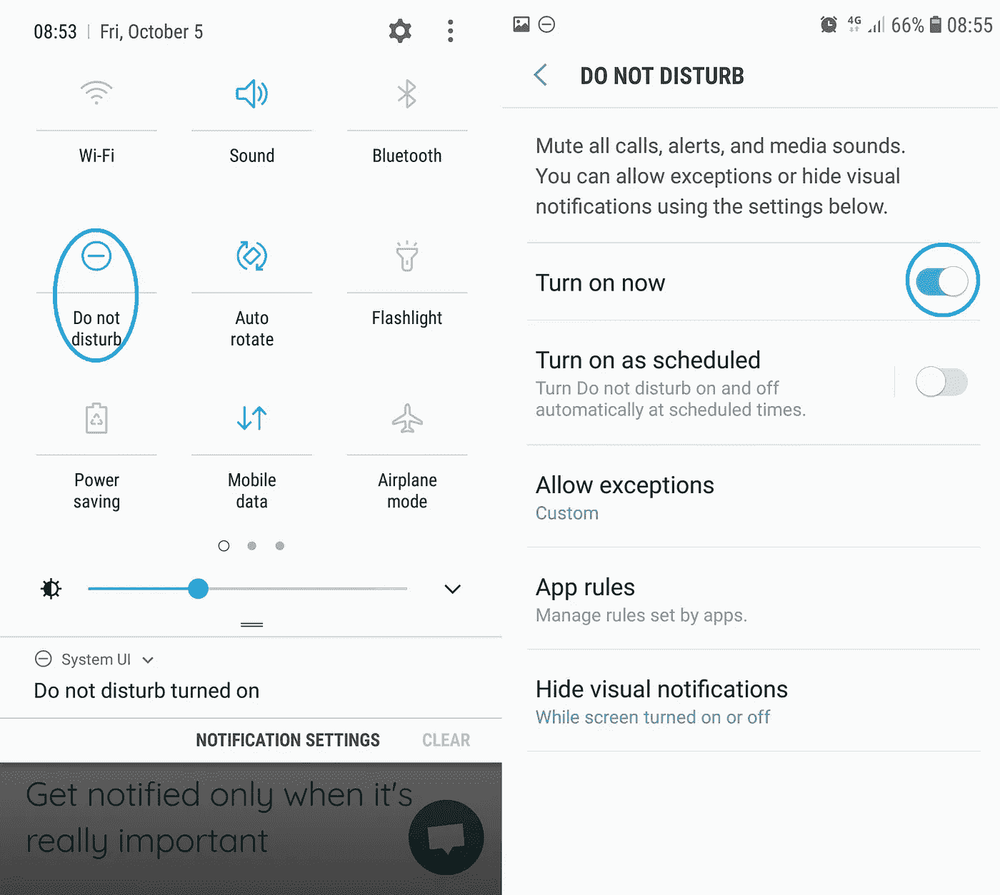
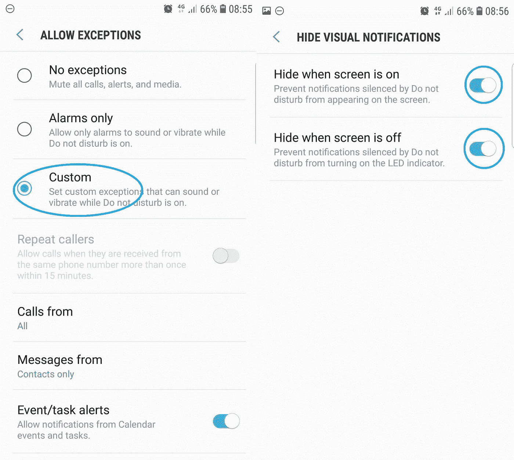
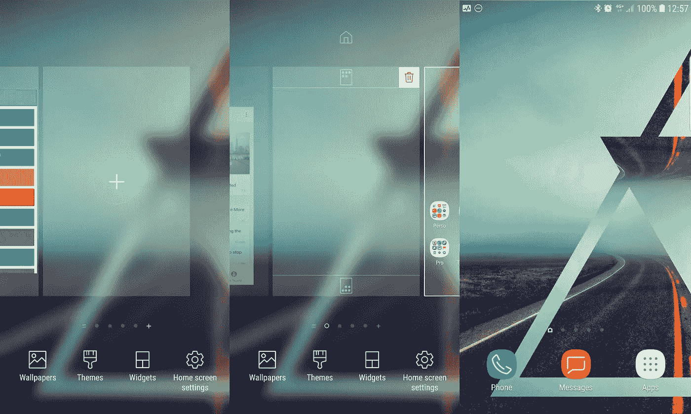

# 推送通知并没有那么糟糕，你只需要再次控制

> 原文：<https://medium.com/hackernoon/push-notifications-are-not-that-bad-you-just-need-to-take-control-again-55e71339bbc1>

就在一年前，我醒来后做的第一件事是拿起手机，立即查看我的通知。尽管特里斯坦·哈里斯说科技劫持了我早上的例行工作，但我仍然在做。

我不想在我的员工面前查看我的社交媒体。我想向连夜发邮件给我的投资者或客户展示，我一大早就在工作。我需要知道一封重要的电子邮件是否会影响我的晨会。

作为一个初创公司的创始人，我总是有一个很好的理由去做这件事。

似乎我不是唯一的一个。根据科技分析公司 report linker[最近的一项调查](https://www.reportlinker.com/insight/smartphone-connection.html),**46%的美国人承认他们甚至在早上起床前都会检查他们的智能手机。**

那是怎么发生的？

# 推送通知成为我们日常生活的一部分

几个月前，移动参与平台 Localytics 对 1000 名用户进行了一项调查,现在推送通知的设计和接受度似乎比几年前更好。营销人员越来越擅长通过手机进行沟通，推送通知已经成为我们日常生活的一部分。

普通人每天触摸他或她的手机[2617 次](https://blog.dscout.com/mobile-touches)，每天花 2 小时 56 分钟在他们的移动设备上，这相当于令人震惊的每月 86 小时。更糟糕的是，我们不会花太多时间通过文本交流，或者，我不知道，打电话……我们使用移动设备的时间超过 90%会花在应用程序上。

大多数应用程序都是专门设计来吸引注意力的，使用的配色方案、措辞和布局让它们非常容易上瘾。在你意识到之前，你打开一个应用程序来检查到目前为止谁喜欢你的照片，然后你突然滚动了几分钟，甚至一个小时。

> *回到任务平均需要 23 分 15 秒。*

根据加州大学欧文分校信息学系教授 Gloria Mark 的说法，中断工作是有代价的:平均需要 23 分 15 秒才能回到工作中。

# 应用营销人员只关注你的参与度

可悲的是，推送通知只是一个更大整体的一部分:[黑暗模式。](https://trydesignlab.com/blog/are-notifications-a-dark-pattern-ux-ui/) **深色图案是指任何旨在“轻推”用户做出他不想做的动作的设计特征。**通知旨在通知您，因此您不必反复检查给定的应用程序。现在，他们中的大多数人除了参与没有其他目标:当脸书通知你每一个喜欢的时候，它会给你甜蜜的多巴胺刺激，最终把你带回它的平台。

似乎使用推送通知[将应用参与度](/@jack.carter/top-13-push-notification-tools-to-boost-mobile-app-engagement-99790bcf9d6e)提高了 88%。事实上，人们发现，发送推送通知可以极大地提高用户保留率，根据应用程序和通知频率，用户保留率在[3 倍到](https://www.invespcro.com/blog/push-notifications/)10 倍之间。任何选择应用程序推送通知的人都有两倍的可能将它保存在他们的设备上。

# 保留还是诱捕？

对于我们使用的应用程序背后的以保留为导向的公司来说，这是一个好消息，但对于像你这样的人来说，当你发现自己整天完全被它们分散注意力时，这就不那么好了。

LinkedIn 是黑暗模式的一个很好的例子。几乎每次你滚动浏览你的通知源，你都会看到这样的内容:“今天是约翰·多伊的生日，告诉他生日快乐！”或者“我们找到了 97 份你可能感兴趣的工作。”

如果你注意到这些通知，你会花半天时间祝你的人际网络中的人工作周年快乐，另一半时间试图找出他们是如何进入你的人际网络的。这些通知的唯一目的是让你打开你的应用程序，并使用它超过你曾经打算的时间。

# 很难找到逃避的方法

我通常在工作时间听音乐来逃离喋喋不休的话题，帮助我专注于真正重要的事情。问题是，通知现在渗透到我们生活的每个领域，私人的和职业的。

根据发表在《企业家》杂志上的一份信息图表，40%的员工表示他们接受在吃饭的时候回复一封紧急邮件。

这使得人们总是开着通知，并在手机响的时候疯狂地检查，无论是紧急的工作还是根本不值得他们注意的事情。正因为如此，除非你关掉那些不重要的通知，否则你永远也不可能离开你的工作。

一旦你处理完你的电子邮件或社交应用程序，通知也会从你安装在我们电脑上或在你的网络浏览器上打开的协作应用程序中发出。Slack 等流行的协作应用要求你时刻保持联系。如果你像我一样，确信自己可能错过了一些重要的东西，那么实时对话就成了一个陷阱。

> 但是时时刻刻生活在对失去某些东西的恐惧中并不是我们的生活方式。——[*特里斯坦哈里斯*](/thrive-global/how-technology-hijacks-peoples-minds-from-a-magician-and-google-s-design-ethicist-56d62ef5edf3) *。*

推送通知对我们的注意力和福祉构成了巨大的威胁，在工作场所很少有克服它的举措。

你的通知不仅浪费了你宝贵的时间，而且还蚕食了你原本可以获得的一点点“我”的时间。简单的事实是，你不需要看到你所有的通知，所以我们为什么不过滤他们呢？

# 过滤你的通知是痛苦但必要的

通知的不幸之处在于，它们不像电子邮件那样通过。如果你打开脸书通知，你会收到来自脸书的几乎所有通知。

对于一个人来说，很难区分需要他们立即关注的重要通知的嗡嗡声和甚至不需要被推送的通知的嗡嗡声。辨别的唯一方法是中断你的注意力，即使是短暂的中断，并寻找你自己来决定这个通知是否需要你立即采取行动。

无论通知是来自 Twitter、Slack、脸书，还是大多数人已经安装在手机上的其他应用程序，它们都不是我们早上应该看到的第一件事，也绝对不值得我们把注意力从一天的重要工作中转移开。

这不像你的邮箱，你可以通过[过滤和清理功能](https://gwapit.com/blog/email/farewell-email-overload-prioritization/)轻松重新获得控制权。

管理推送通知要复杂得多。首先，有 3 个不同的平台需要设置:你的桌面，你的浏览器，和你的手机。其次，过滤需要花费一些努力来设置，就好像我们被鼓励避免这样做。第三，想出一些相关和有用的东西相当困难(“我希望优先看到所有与我的家人或老板相关的通知”)。

但问题是，即使这需要时间，你也必须过滤你的通知，删除无用的通知。这是恢复你工作/生活平衡的唯一方法。

# 恢复你的工作/生活平衡

你一天中被通知打断的频率有多高？一个更好的问题是:你一天中有多长时间会被一个真正值得你关注的通知打断？

过滤掉所有不值得你立即关注的通知，可以说是大部分，让你专注于手头的任务。如果你的电话响了，你会知道这很重要。

此外，当你在工作时，**不重要的通知将不再把你从最值得你关注的项目中拉出来**。

当你全神贯注地做 X、Y 或 Z 时，或者当你已经在与客户进行一个重要的会议时，你不需要你的手机嗡嗡作响，只是因为同事们在空闲时间聊天，或者因为你的老板刚刚安排你参加下周的会议。

当你把全部注意力集中在眼前的事情上时，这些事情你可以以后再做。这将大大提高你的思维清晰度和表现，同时防止压倒。

# 使用 Android 的“请勿打扰”功能进行控制

从过滤手机通知开始。我将在另一篇文章中解释如何处理桌面和浏览器通知。

许多文章会建议你逐个禁用每个应用程序的移动通知。但是当你像我一样有超过 15 个应用程序时，设置起来就太长了。此外，每次我安装一个新的应用程序，我必须重做它，坦率地说，我忘记每次这样做。

我逆向解决了这个问题，删除了所有的通知并设置了异常。Android 允许你用[“请勿打扰”模式](https://support.google.com/android/answer/9069335?hl=en)来做这件事。

*Enabling the “Do Not Disturb” mode on Android*

如果您想快速启用请勿打扰模式，只需从屏幕顶部向下滑动即可打开通知阴影，并选择请勿打扰图标。您的所有通知都将被阻止(包括电话和消息)。

*The “Do Not Disturb” mode allows you to set up exceptions and to hide all visual notifications when the screen is on and off.*

然后，您需要设置例外:长时间点击“请勿打扰”将允许您更改您的设置。现在点击*允许例外>自定义*，它将允许您将某些联系人或来电者列入白名单。作为一名初创公司的创始人，我决定将所有来电、所有来自我的联系人的信息和我的日历通知都列入白名单，但你可以根据你的工作限制或允许更多。

最后一件事:当屏幕打开和关闭时，不要忘记隐藏视觉通知。这将大大减少你的日常检查。

# 卸载并隐藏你的应用

为了完全控制我的移动推送通知，我决定卸载我所有的社交应用和过去 6 个月没用过的应用。我删除了将近 10 个应用程序。

*The blank home screen is great to avoid getting distracted by the apps on your phone*

最后，我做的最后一件事是添加一个空白页，并将其设置为主页，以隐藏除我的消息和呼叫之外的所有应用程序。为此，点击并按住主屏幕上的空白区域。然后，尽可能向右滑动，然后添加一个新的主屏幕。现在，您只需点击位于主屏幕设置顶部的主屏幕图标，将这个新的主屏幕定义为主屏幕。

这样做，我减少了 70%的干扰。我每天都感觉更加专注和高效。

每个人可能都会告诉你，通知对你的工作效率有害，这就是为什么你应该忽略它们。实际上，我不能错过投资者的电话或潜在客户的邮件。作为一名年轻的企业家，我必须应对这种流动，因为我不能错过任何机会。作为回报，我必须找到一切方法来更好地过滤它们。我不是可以无视所有通知的连续创业者。我需要对请求做出回应。

有趣的是，这是一个 LinkedIn 通知，让我在 Gwapit 签下了我们的第一个大客户:这是大海捞针吗？

*原载于 2018 年 10 月 19 日*[*【gwapit.com】*](https://gwapit.com/blog/notification/notification-overload/)*。*