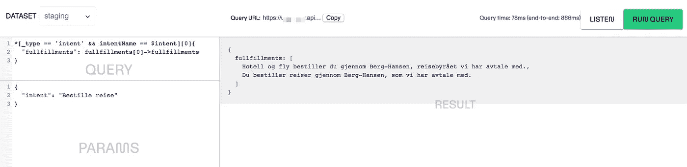

# 把你的聊天机器人放在你的无头 CMS 所在的地方

> 原文：<https://medium.com/hackernoon/put-your-chatbot-where-your-headless-cms-is-15cf174774c6>

## 如何用 Sanity、Webtask 和 Dialogflow 在 Slack 中制作聊天机器人

Make intents for chatbots and conversational UIs a part of your content management system

抬起头来！你需要掌握一些 JavaScript 知识来完成本教程，但是我们如何考虑将聊天机器人集成到 CMS 中仍然很有趣。

一个[无头内容管理系统](https://en.wikipedia.org/wiki/Headless_CMS)的想法是将你的内容从网页的约束中分离出来，以便在许多上下文中重用它。即使当你只想在网页上显示你的内容时，这也是有意义的，因为你可以以一种内容可以在许多页面上重用的方式来组织它，并且当更有趣的东西出现时，更容易切换你的前端代码。然而，当您设法在不同的界面中重用您的内容时，headless 的真正威力就显现出来了。

聊天机器人已经成为科技热潮的一部分有一段时间了，随着工具和人工智能模型变得越来越完善，需求似乎也在增加。谷歌的 [Dialogflow](https://dialogflow.com) 刚刚推出了对我的母语挪威语的支持，这被证明是我做一些实验的好借口。我一直在思考如何用我们在 Netlife 使用的无头 CMS 来实现聊天机器人响应，这是明智的。我想我找到了一种易于实现和维护的模式。

## 总之，您需要:

1.  在[对话流](https://console.dialogflow.com)中设置代理
2.  在 Slack 中制作一个[自定义 app，](https://api.slack.com/apps)[将其连接到 Dialogflow](https://dialogflow.com/docs/integrations/slack)
3.  在 Sanity 中添加一些意图和实现模式
4.  用无服务器服务连接 Sanity 和 Dialogflow，在本例中是 [webtask.io](https://webtask.io/make)

# 在对话流中制造代理和意图

一旦登录到 Dialogflow，选择**创建新代理**并给它一个名称，选择适当的设置(我选择了 V2 API)。在我的案例中，我想做一个[聊天机器人](https://hackernoon.com/tagged/chatbot)，可以将我们公司的内部网与 Slack 连接起来。我以我们的参谋长命名(当然，这个角色永远不可能完全自动化)。

一旦你创建了一个新代理，进入**意向**并选择**创建意向**按钮。你可以把“意图”理解为“用户想要做或者已经回答的某件事情”。我的意图是得到一个关于我们如何在网上生活图书旅行的答案。给意图一个描述性的名称；我们将明智地使用这个名称来映射正确的内容。填写不同的培训短语，这些短语是您的用户会写或说的示例。)以便请求所述信息。在这种情况下，它是“我如何预订旅行”等等的变体。希望在谷歌的机器学习算法能够将用户导向这一意图之前，你不需要输入许多选项。你可以在右边栏测试它的效果。

Set up an intent in Dialogflow, test it in the right hand sidebar. Here I have set up alternatives in Norwegian for the question “how do I book travel”

你可以在 Dialogflow 的**回复**部分写出不同的可能答案，但这有什么意思呢？相反，打开**启用 webhook 调用用于此目的**。这将使 Dialogflow 向您放在**fulfillment**部分中的任何 URL 发出请求。当我们在 webtaks.io 中设置我们的微服务时，我们将回到这一点。

# 二。在 Slack 中制作一个自定义应用程序，并将其连接到 Dialogflow

如果你去 Dialogflow 左边栏的**集成**，你会发现它可以与许多不同的服务集成。设置将与他们中的大多数非常相似，但我们希望松弛。严格遵循松弛盒中**设置**中的说明。我说的“密切”是指你应该花时间阅读说明书并试着理解它们。

Make sure that you give the Slack bot the necessary event subscriptions.

您的 Slack-bot 将需要一些身份验证和事件订阅，以便能够在 Slack 中读取您的查询。你可以让它听所有的对话，但我更喜欢它只回答直接或间接的信息。部分原因是我不希望机器人在谈话中意外触发，部分原因是我不希望在没有非常好的理由的情况下，在我们谈话的每一行都输入 Dialogflow。

# 三。在理智中为意图和实现添加一些模式

如果你对理智还不熟悉，[去尝试一下](https://sanity.io)，十五分钟后回来。Sanity [中的内容模式(即文档类型和输入字段)被写成带有一些简单转换的 JavaScript 对象](https://www.sanity.io/docs/content-studio/the-schema)。我们将通过为**意向**创建一个类型并在我们的 intranet-post-type 中为**完成**添加一个内容字段来进行一个非常简单的设置。

在我们为内部网撰写文章的 post 类型中，我添加了一个名为**fulfillments**的数组字段，它由一个简单的**字符串**字段组成。为了支持不同客户的消息，我们可以使它更复杂；例如，我们可以有一个用于[语音接口](https://developers.google.com/actions/reference/ssml)，一个用于[带附件的松弛响应](https://api.slack.com/docs/messages/builder)，一个用于[脸书信使模板](https://developers.facebook.com/docs/messenger-platform/send-messages/templates)。这一次，我们将保持简单，只用一些简单的文本响应就可以了。

intent schema 由一个易于在 Sanity 中找到的标题、一个我们将用来将其映射到 Dialogflow 中的 **intentName** 和一个包含该 intent 实现的帖子的引用字段组成。让 intents 成为自己的类型是有意义的，因为实现可以存在于不同的类型中。

Don’t let the Norwegian throw you off.

# 四。用 webtask.io 把这一切绑在一起

既然我们已经用一个意图和实现建立了理智，我们准备把它连接到 Dialogflow。这是无服务器功能派上用场的一个例子。我选择了 [webtask.io](https://webtask.io) ，因为我以前用过它，它有一个在线编辑器，但是你可以很容易地用 [AWS Lambda](https://aws.amazon.com/lambda/) 、 [stdlib](https://stdlib.com/) 、 [Google Cloud Functions](https://cloud.google.com/functions/) 或者任何你喜欢的服务器(更少)技术复制它。在任何情况下，函数的核心将非常类似于这个要点。

The Sanity query can be read as the following: “Get all entries with the type intent that has the same string in the intent name field as the incoming intent from Dialogflow. Take the first (and in most cases only) of these entries and put it in an object; under the key “fullfullments”, list out all the referenced documents, follow the references to their entries and return a list of the strings in the fullfillment field.

Example of the query in work using the [Vision plugin for Sanity.](https://www.npmjs.com/package/@sanity/vision)

这是概念代码的证明，可以受益于更多的错误处理等等。Webtask 也不太喜欢 ES6 语法。你应该注意第 13 行，以及我们如何在理智中找到正确的意图。这就是为什么将 Dialogflow 中的 intent 名称与 Sanity 中的 intent 名称(即 intent name)对齐很重要。在这种情况下，我也选择了随机输出完整的字符串，只是为了使一些变化成为可能。

如果你设法把所有这些拼凑在一起，你现在应该有一个 Slack 中的工作聊天机器人，它通过 Dialogflow 中的机器学习来解析自然语言的意图，通过与 API 对话的无服务器函数从你的无头 CMS 中找到完整的文本。现在你只需要在这个组合中的某个地方添加区块链，就可以去掉所有的时髦词汇框。接下来，我们还可以通过 API 等将 Dialogflow 中的意图直接连接到 Sanity。有许多方法可以推进这一点。

*Figure: The Slack chatbot at work. I’m trying variations on “how do I order travel”. We can see some encoding issues, and that we need some more training. But it is amazing technology for mundane uses.*

这当然是设计项目的技术方面。现在真正的工作开始了，研究你的同事实际上可能想问机器人什么，并设计出有用的答案，这些答案包含在你的同事实际上想与之交流的个性中。首先，我会推荐由 [Erika Hall](https://twitter.com/mulegirl) 设计的*对话设计。*

*如果你尝试这样做，或者对我的设置有什么意见，我很乐意在评论区听到你的见解和问题！*